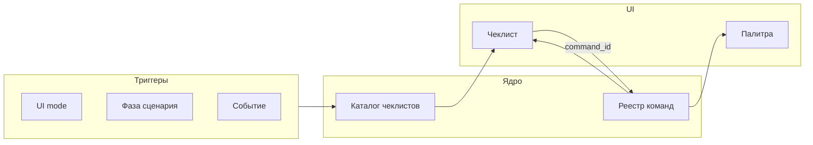

# ADR 0013: Поверхность команд и discoverability (палитра, чеклисты, минимальный toolbar)

**Статус:** Accepted (направление; состав команд и итерации UI — отдельно)  
**Дата:** 2026-04-02  
**Связь:** [0012-floating-workspace-chrome.md](0012-floating-workspace-chrome.md) (см. [раздел «Разделение с 0012»](#scope-split-0012) ниже), [0010-ui-modes-toml-configuration.md](0010-ui-modes-toml-configuration.md) (режимы и видимость), [0008-mcp-contracts-and-testable-infrastructure.md](0008-mcp-contracts-and-testable-infrastructure.md) (команды и MCP), [0002-debug-human-agent-parity.md](0002-debug-human-agent-parity.md) (один слой для человека и агента, если команды общие).

## Разделение с [0012](0012-floating-workspace-chrome.md)

- **[0012](0012-floating-workspace-chrome.md)** — размещение и плавающий хром workspace.
- **0013 (этот ADR)** — поверхность команд: как пользователь вызывает действия и как обеспечивается discoverability без раздувания toolbar.

## Контекст

**0012** решает **пространственную** перегрузку: нижняя зона, телеметрия, плавающий хром, при необходимости отдельные окна и расширение MCP для них. Отдельно стоит вопрос **сколько командных элементов** держать на экране и **как** пользователь (и агент по именам) находит действие.

Сейчас верхняя **toolbar** может быть длинной и **смешанной по смыслу** (см. [0012](0012-floating-workspace-chrome.md) — контекст про toolbar). Раздувание полосы кнопок противоречит цели разгрузки: то же «понамешано», что и у фиксированного хрома, только по горизонтали.

При этом **только палитра команд** без опоры в контексте ухудшает **discoverability** для тех, кто ещё не знает названий команд — классическая проблема «Command Palette» (как Ctrl+Shift+P в VS Code): мощно для поиска по строке, слабее для «что мне жать в *этой* ситуации».

В авиации discoverability часто делают **чеклистами и якорями в поле зрения** (в т.ч. на органах управления): не полный каталог процедур, а **ситуация → короткий список**. Это аналог **ситуационной** подсказки, а не замена справочнику команд.

## Решение

1. **Разделение осей** — см. [раздел «Разделение с 0012»](#scope-split-0012) выше и [ADR 0012](0012-floating-workspace-chrome.md); полные формулировки для обоих ADR — в той [секции](#scope-split-0012).

2. **Опорная точка — палитра команд** (аналог Ctrl+Shift+P): одна явная точка входа (кнопка «Command» и/или хоткей), **поиск по списку команд** с подсказками и привязкой к хоткеям, **fuzzy/подстрока**, **недавние и частые** — чтобы не требовать длинной полосы кнопок для всего.

3. **Discoverability не сводить к одной палитре:** дополнить **ситуационными мини-чеклистами** (контекст режима/сценария: отладка, первый запуск, «перед коммитом») — короткие закреплённые шаги в зоне внимания, по аналогии с чеклистами в авиации (не замена полного списка команд).

4. **Toolbar минимизировать:** оставить только **якорные** действия с высокой частотой (или убрать до одной кнопки открытия палитры — по продуктовой итерации). Остальное — палитра + режимы ([0010](0010-ui-modes-toml-configuration.md)) + при необходимости чеклисты.

5. **Паритет агента:** команды, доступные человеку из палитры и привязанные к тому же слою, что и `IdeCommands`/MCP, остаются **согласованными** с автоматизацией ([0002](0002-debug-human-agent-parity.md), [0008](0008-mcp-contracts-and-testable-infrastructure.md)); имена и id не разъезжаются между «кнопка в UI» и «вызов агента».

## Видение: механика ситуационных чеклистов

Чеклист — не замена палитры, а **узкий слой** «что имеет смысл сделать *сейчас* в этой ситуации», даже если пользователь не знает имён команд. Ниже — целевое видение реализации (итерации и состав чеклистов — отдельно).

### Роли трёх механизмов

| Механизм | Назначение |
|----------|------------|
| **Палитра команд** | Найти **любую** известную команду по имени / подстроке / хоткею. |
| **Ситуационный чеклист** | Показать **короткий упорядоченный сценарий** для текущего контекста; ответ на «что обычно делают дальше», а не на «какие команды есть в продукте». |
| **Toolbar** | Редкие **якорные** действия; не переносить сюда весь сценарий. |

Шаг чеклиста с привязкой к команде вызывает **ту же** операцию, что палитра и (по контракту) автоматизация — через **единый реестр** (`command_id`).

### Логическая модель чеклиста

- **`checklist_id`** — стабильный идентификатор (телеметрия, привязка к режиму, эволюция контента).
- **`situation`** — условие релевантности (см. триггеры ниже).
- **`steps[]`** — упорядоченные шаги: человекочитаемый текст; опционально **`command_id`** из реестра; опционально **deep link** (открыть панель, файл, настройку).
- **Состояние шага в UI** (сессия или с сохранением в настройках — по итерации): например `todo` / `done` / `skipped` / `na`.
- **`anchors`** — где чеклист *может* показываться (компактная карточка у края редактора, полоска, модал «первый раз» и т.д.); один сценарий не обязан быть привязан к одному виджету навсегда.

Чеклист **направляет внимание** и при клике делегирует в слой команд; не обязан «выполнять магию» в обход реестра.

### Когда чеклист релевантен (триггеры)

Правила задаются **декларативно** (например TOML/JSON: `when: { ui_mode, phase, … }`), чтобы не размазать логику по VM.

- **Режим UI** ([0010](0010-ui-modes-toml-configuration.md)) — например в Debug показывать сценарий «типичный цикл отладки».
- **Фаза сценария** — машина состояний высокого уровня (`нет решения` → `сборка` → `отладка` → …); у фазы — свой чеклист или ветка шагов.
- **Событие** — первый запуск, первый брейкпоинт за сессию, падение сборки и т.п.
- **Явный запрос** — «Показать чеклист…» из палитры или контекстного меню.

### Поведение в UI

- По умолчанию — **компактная карточка** (сворачиваемая), не полноэкранный wizard; визуальный ориентир — мокап в [docs/ux/concept-screens/cascade-ide-checklist-ui-concept.png](../ux/concept-screens/cascade-ide-checklist-ui-concept.png).
- Клик по шагу с `command_id` = тот же вызов, что из палитры; отметка шага `done` — вручную и/или эвристически после успешной команды (сложность — по итерации).
- **Не мешать:** «Скрыть» / «не показывать для этого сценария» без потери возможности открыть снова из палитры.
- **Связь с [0011](0011-debug-situational-awareness.md):** полоска осведомлённости — про *состояние*; чеклист — про *типичные следующие шаги* в сценарии. Не смешивать длинный лог и длинный чеклист в одной зоне.

### Поток данных (целевой)

### Вне ближайшего объёма v1

- Длинные «авиационные» preflight-листы на десятки пунктов для каждого действия.
- Встроенная база знаний внутри чеклиста (кроме ссылок на команды и внешнюю документацию).
- Обязательная синхронизация «галочек» чеклиста с агентом: паритет по **командам** ([0002](0002-debug-human-agent-parity.md)); состояние чеклиста для человека может оставаться локальным до отдельного решения.

### Порядок внедрения (рекомендация)

1. **Реестр команд + палитра** — общая база для toolbar, MCP и будущих шагов чеклиста.  
2. **Каталог чеклистов + карточка UI** — шаги с `command_id`, триггеры и скрытие по правилам выше.

## Последствия

- Потребуется **единый реестр команд** (отображаемое имя, id, категория, хоткей, доступность в режиме) — иначе палитра и MCP разойдутся.
- Для чеклистов — **каталог сценариев** (описание шагов, `command_id`, правила `situation`) поверх того же реестра; иначе чеклист станет вторым источником правды.
- Toolbar и палитра — **два представления одного слоя**, а не дублирование логики в разных местах; чеклист — третье представление вызовов через тот же реестр.
- Документация для пользователя (позже): хоткей палитры, где смотреть ситуационные чеклисты.

## Отклонённые альтернативы (как финальное состояние)

- **Только длинный toolbar** без палитры и без ситуационных подсказок — отклонено как противоречащее разгрузке хрома ([0012](0012-floating-workspace-chrome.md)).
- **Только палитра** без якорей и контекстных чеклистов — отклонено как недостаточное для discoverability в незнакомых сценариях.

## Обсуждение (открытые вопросы для следующих итераций)

- Точный **хоткей** и поведение фокуса при открытии палитры (Avalonia, одно окно).
- Состав **ситуационных чеклистов** по режимам UI и как не дублировать [0011](0011-debug-situational-awareness.md) (отладка) и [0012](0012-floating-workspace-chrome.md) (телеметрия).
- Нужен ли **отдельный** UX для «первого запуска» vs «второй день».
