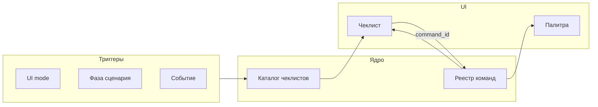

# ADR 0014: Ситуационные чеклисты (модель, триггеры, UI)

**Статус:** Accepted  
**Дата:** 2026-04-02

## Связанные ADR

| ADR | Роль |
|-----|------|
| [0013](0013-command-surface-and-discoverability.md) | палитра и поверхность команд — родительское решение |
| [0010](0010-ui-modes-toml-configuration.md) | режимы |
| [0011](0011-debug-situational-awareness.md) | полоска состояния vs чеклист шагов |
| [0002](0002-debug-human-agent-parity.md) | Единый слой состояния отладки для человека и агента |
| [0008](0008-mcp-contracts-and-testable-infrastructure.md) | Стабильные контракты MCP и тестируемая инфраструктура |
## Резюме

- Ситуационные **чеклисты**: модель, триггеры, UI; дочерний к [0013](0013-command-surface-and-discoverability.md).
- Discoverability через палитру и контекст задачи, не отдельное приложение.

## Разделение с [0013](0013-command-surface-and-discoverability.md)

- **[0013](0013-command-surface-and-discoverability.md)** — поверхность команд: палитра, discoverability в целом, минимальный toolbar.
- **0014 (этот ADR)** — **ситуационные чеклисты**: каталог сценариев, триггеры, привязка шагов к `command_id`, поведение карточки в UI.

---
## Контекст

[0013](0013-command-surface-and-discoverability.md) вводит discoverability не только через поиск по палитре и предлагает **мини-чеклисты** как аналог ситуационных подсказок (в т.ч. авиационный образ). Этот ADR фиксирует **отдельно** механику чеклистов: иначе смешиваются уровень «какие бывают точки входа» (0013) и уровень «как устроен один сценарий из шагов».

## Решение

Чеклист — не замена палитры, а **узкий слой** «что имеет смысл сделать *сейчас* в этой ситуации», даже если пользователь не знает имён команд. Детали — в разделе [«Видение: механика»](#checklist-vision) ниже.

## Видение: механика ситуационных чеклистов

Ниже — целевое видение реализации (итерации и состав чеклистов — по плану).

### Роли трёх механизмов

| Механизм | Назначение |
|----------|------------|
| **Палитра команд** | Найти **любую** известную команду по имени / подстроке / хоткею. |
| **Ситуационный чеклист** | Показать **короткий упорядоченный сценарий** для текущего контекста; ответ на «что обычно делают дальше», а не на «какие команды есть в продукте». |
| **Toolbar** | Редкие **якорные** действия; не переносить сюда весь сценарий. |

Шаг чеклиста с привязкой к команде вызывает **ту же** операцию, что палитра и (по контракту) автоматизация — через **единый реестр** (`command_id`) из [0013](0013-command-surface-and-discoverability.md) / [0008](0008-mcp-contracts-and-testable-infrastructure.md).

### Логическая модель чеклиста

- **`checklist_id`** — стабильный идентификатор (телеметрия, привязка к режиму, эволюция контента).
- **`situation`** — условие релевантности (см. триггеры ниже).
- **`steps[]`** — упорядоченные шаги: человекочитаемый текст; опционально **`command_id`** из реестра; опционально **deep link** (открыть панель, файл, настройку).
- **Состояние шага в UI** (сессия или с сохранением в настройках — по итерации): например `todo` / `done` / `skipped` / `na`.
- **`anchors`** — где чеклист *может* показываться (компактная карточка у края редактора, полоска, модал «первый раз» и т.д.); один сценарий не обязан быть привязан к одному виджету навсегда.

Чеклист **направляет внимание** и при клике делегирует в слой команд; не обязан «выполнять магию» в обход реестра.

### Когда чеклист релевантен (триггеры)

Правила задаются **декларативно в TOML** — в том же духе, что конфигурация UI-режимов ([0010](0010-ui-modes-toml-configuration.md)); отдельный JSON как параллельный «официальный» формат для этого **не нужен** (см. позицию 0010 по одному текстовому стеку конфигов). Условия показа — структура вроде `when` с полями `ui_mode`, `phase`, событие и т.д. (точная схема — при реализации), без логики в VM.

- **Режим UI** ([0010](0010-ui-modes-toml-configuration.md)) — например в Debug показывать сценарий «типичный цикл отладки».
- **Фаза сценария** — машина состояний высокого уровня (`нет решения` → `сборка` → `отладка` → …); у фазы — свой чеклист или ветка шагов.
- **Событие** — первый запуск, первый брейкпоинт за сессию, падение сборки и т.п.
- **Явный запрос** — «Показать чеклист…» из палитры или контекстного меню.

### Поведение в UI

- По умолчанию — **компактная карточка** (сворачиваемая), не полноэкранный wizard; визуальный ориентир — мокап в [docs/ux/concept-screens/cascade-ide-checklist-ui-concept.png](../ux/concept-screens/cascade-ide-checklist-ui-concept.png).
- Клик по шагу с `command_id` = тот же вызов, что из палитры; отметка шага `done` — вручную и/или эвристически после успешной команды (сложность — по итерации).
- **Не мешать:** «Скрыть» / «не показывать для этого сценария» без потери возможности открыть снова из палитры.
- **Связь с [0011](0011-debug-situational-awareness.md):** полоска осведомлённости — про *состояние*; чеклист — про *типичные следующие шаги* в сценарии. Не смешивать длинный лог и длинный чеклист в одной зоне.

### Поток данных (целевой)

### Вне ближайшего объёма v1

- Длинные «авиационные» preflight-листы на десятки пунктов для каждого действия.
- Встроенная база знаний внутри чеклиста (кроме ссылок на команды и внешнюю документацию).
- Обязательная синхронизация «галочек» чеклиста с агентом: паритет по **командам** ([0002](0002-debug-human-agent-parity.md)); состояние чеклиста для человека может оставаться локальным до отдельного решения.

### Порядок внедрения (рекомендация)

1. **Реестр команд + палитра** ([0013](0013-command-surface-and-discoverability.md)) — общая база для toolbar, MCP и шагов чеклиста.  
2. **Каталог чеклистов + карточка UI** — шаги с `command_id`, триггеры и скрытие по правилам выше.

## Последствия

- Нужен **каталог сценариев** (описание шагов, `command_id`, правила `situation`) поверх **единого реестра команд**; иначе чеклист станет вторым источником правды.
- Чеклист в UI — **представление вызовов** через тот же реестр, что палитра и MCP.
- Тесты и сценарии документации (позже): какие чеклисты в каких режимах показываются по умолчанию.

## Отклонённые альтернативы (как финальное состояние)

- **Чеклист как отдельный канал команд** без `command_id` и без реестра — отклонено: расхождение с палитрой и агентом.
- **Только длинные чеклисты** без палитры — отклонено: см. [0013](0013-command-surface-and-discoverability.md).

## Обсуждение (открытые вопросы для следующих итераций)

- Состав **сценариев** по режимам UI и пересечение с [0011](0011-debug-situational-awareness.md) / [0012](0012-floating-workspace-chrome.md) (где физически показывать карточку при плавающем хроме).
- Нужен ли **отдельный** UX для «первого запуска» vs «второй день».
