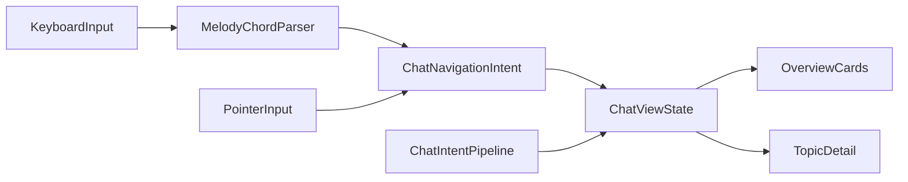

# ADR 0072: Chat topic cards, drill-in/back и intent-based Melody/Chords для навигации по темам

**Статус:** Proposed  
**Дата:** 2026-04-19  
## Связанные ADR

| ADR | Роль |
|-----|------|
| [0031](0031-agent-chat-clarification-batches-and-threading.md) | пакеты уточнений, `ThreadNode`, обзор размаха |
| [0057](0057-chat-surface-pipeline-adoption.md) | chat surface → Skia pipeline |
| [0060](0060-keyboard-chord-stack-fms-tactical-strategic.md) | Melody, CascadeChord, паритет с палитрой — **уточняется в chat-domain**, см. ниже |
| [0013](0013-command-surface-and-discoverability.md) | Поверхность команд и discoverability (палитра, минимальный toolbar) |
| [0030](0030-command-ids-hotkeys-and-ui-registry-layers.md) | Слои идентификаторов команд, хоткеев и UI (без одной таблицы «всё в одном» пока) |
| [0017](0017-multi-window-workspace-and-agent-surfaces.md) | мультиоконность, фокус |
| [0070](0070-command-palette-direct-overlay-surface.md) | Command Palette как прямой overlay surface, маршрутизируемый в активный TopLevel |
| [0044](0044-avalonia-host-skia-agent-chat-surface.md) | Разделение ролей — Avalonia как хост («фюзеляж»), кастомная отрисовка для чата агента (Skia как гипотеза) |
| [0008](0008-mcp-contracts-and-testable-infrastructure.md) | Стабильные контракты MCP и тестируемая инфраструктура |
| [0096](0096-intercom-topic-card-summary-and-product-spine.md) | **сводка на карточке**, spine продуктовой линии — продуктовая семантика поверх overview/detail; CIDE как пример; [§4](0096-intercom-topic-card-summary-and-product-spine.md#adr0096-p4 |

### Вне ADR

| Документ | Роль |
|----------|------|
| [intent-melody-language-v1.md](../intent-melody-language-v1.md) | IML v1: грамматика `c:` и мотивация |
**Отношение к [0060](0060-keyboard-chord-stack-fms-tactical-strategic.md):** этот ADR **не заменяет** общую keyboard-first модель (палитра, `CascadeChord`, Command Melody `c:`). Он **нормативно уточняет**, как те же принципы **применяются к навигации по темам чата** (topic-level intents). См. [§ «Связь с ADR 0060»](#adr0072-relation-0060).

---
## Контекст

[0031](0031-agent-chat-clarification-batches-and-threading.md) уже вводит **треды как устойчивые линии работы** (`ThreadNode` vs `MessageNode`), пакеты уточнений и вектор **«обзор размаха»** сессии вместо одной бесконечной ленты. [0057](0057-chat-surface-pipeline-adoption.md) переводит чат на общий pipeline **Intent → Declutter → Layout → Render** и выделяет доменные узлы (`ThreadNode`, `MessageNode`, …) как first-class на стадии Intent.

Однако этого **недостаточно для продуктового UX-контракта**: данные о ветвлениях могут существовать в модели, а **экран по умолчанию** всё ещё воспринимается как **одна линейная лента**. Не зафиксированы:

- явная **модель экрана** «обзор тем → вход в тему → назад»;
- **адаптивный default** (одна тема vs несколько);
- **обязательный** для v1 слой **клавиатурной навигации по темам** через **те же** `command_id`, что палитра и Melody/Chords ([0060](0060-keyboard-chord-stack-fms-tactical-strategic.md)), без привязки к координатам контролов.

---

## Проблема

1. **Разрыв данных и навигации:** `ThreadNode` и snapshot layout ([0057](0057-chat-surface-pipeline-adoption.md)) описывают граф; без явного **view mode** (overview vs detail) пользователь остаётся в ментальной модели «одна лента», даже когда тем несколько.
2. **Отсутствие канона drill-in/back:** выход из темы не должен возвращать в абстрактную «общую ленту», если продуктовая модель — **карточки тем** как первичный обзор.
3. **Keyboard-first без intent-слоя:** если Melody/Chords будут **напрямую** дергать фокус Skia-элементов или хитбоксы, теряется кроссплатформенность и паритет с MCP ([0008](0008-mcp-contracts-and-testable-infrastructure.md)); дублируется логика с pointer.
4. **Смешение с опасными подтверждениями:** навигация по темам не должна конкурировать по UX с **PFD-подтверждениями** и пакетами уточнений как с «да/нет» — границы остаются по [0017](0017-multi-window-workspace-and-agent-surfaces.md) и [0031](0031-agent-chat-clarification-batches-and-threading.md).

---

## Решение

### 1. Topic cards как первичная форма multi-topic chat overview

- **Карточка темы** представляет **устойчивую линию работы** (`ThreadNode`), а не отдельное сообщение.
- При **одной** теме в сессии допустимо открывать чат сразу в **detail** (timeline этой темы).
- При **нескольких** темах **default** — **overview** из карточек тем (см. [§3](#adr0072-p3)).
- **Main line** (основной тред) остаётся **одной из карточек**, а не скрытым «режимом без карточек».

### 2. Drill-in / Back как каноническая модель навигации

- **Drill-in:** выбор темы раскрывает её как **detail timeline** (сообщения и связанный контент внутри темы).
- **Back:** возврат из detail ведёт в **topic overview**, а не в отдельную «глобальную ленту» без карточек.
- История внутри темы остаётся **хронологической**; ветвления отражаются данными модели ([0031](0031-agent-chat-clarification-batches-and-threading.md)), а не произвольным «перепрыгиванием» по UI-дереву.

### 3. Adaptive default view

| Условие | Default view |
|--------|----------------|
| Одна тема (или эквивалент «фокус только на main thread») | Detail timeline |
| Несколько тем | Overview (карточки) |

Точные правила «когда считать тему одной» — предмет реализации в VM; ADR фиксирует **продуктовый принцип**, а не алгоритм детекции.

### 4. Intent-based Melody и Chords как обязательный v1 keyboard-first слой для chat topics

- Навигация по темам **должна** иметь входы: **прямые команды** (палитра / toolbar), **CascadeChord** ([0060](0060-keyboard-chord-stack-fms-tactical-strategic.md)) и **Command Melody `c:`** ([0060 §11](0060-keyboard-chord-stack-fms-tactical-strategic.md#adr0060-p11)) над **одним** набором `command_id` ([0030](0030-command-ids-hotkeys-and-ui-registry-layers.md)).
- **Melody** и **Chords** для chat-topic navigation **не адресуют** конкретные контролы, координаты или внутренние `HitTarget`; они вызывают **chat navigation intents** (см. [§5](#adr0072-p5)).
- **Минимальный набор v1** (идентификаторы — к внесению в `IdeCommands` / реестр; здесь — логические имена):

| Intent | Назначение |
|--------|------------|
| `focus_chat_surface` | Фокус на поверхность чата (MFD/host), без смены темы |
| `focus_next_topic` | Фокус на следующей теме в overview или логический «следующий тред» в рамках контракта фокуса |
| `focus_previous_topic` | Аналогично назад |
| `enter_focused_topic` | Переход из overview в detail выбранной темы |
| `return_to_topic_overview` | Выход из detail в overview |

Расширение набора (например «свернуть ветку», «переименовать тему») — отдельными командами и ADR при необходимости.

Паритет с [0060](0060-keyboard-chord-stack-fms-tactical-strategic.md): любая команда, доступная только с аккорда или только с `c:`, **обязана** быть discoverable через палитру и MCP с тем же `command_id` ([0060 §9 discoverability](0060-keyboard-chord-stack-fms-tactical-strategic.md#adr0060-p9)).

### 5. Intent-first interaction contract

- **Поток:** `Melody / Chords / palette / MCP` → **intent** (`command_id`) → **состояние VM** (в т.ч. view mode, focused thread) → **layout** ([0057](0057-chat-surface-pipeline-adoption.md)) → **render** (`SkiaChatSurfaceControl`).
- Один и тот же intent **должен** иметь предсказуемый эффект в **overview** и **detail** (например «следующая тема» в detail может трактоваться как «следующая среди видимых тем сессии» — конкретная семантика задаётся VM, но **не** дублируется отдельным shortcut-слоем для каждого режима без причины).
- **Pointer/tap** на карточку или кнопку «назад» **сводится к тем же intent-командам**, что и клавиатура, а не к параллельной навигационной логике.

### 6. Separation of concerns

- **Intent / pipeline** ([0057](0057-chat-surface-pipeline-adoption.md)): знает темы, сообщения, подтверждения и связи; строит `ChatSurfaceState`.
- **Layout:** решает, какие регионы overview vs detail и какие lanes/entries ([`ChatSurfaceLayout`](../../Features/Chat/ChatSurfaceSnapshot.cs), [`ChatThreadOverviewItem`](../../Features/Chat/ChatSurfaceSnapshot.cs)).
- **Render** ([`SkiaChatSurfaceControl`](../../Views/SkiaChatSurfaceControl.cs)): отрисовка и hit-testing **без** вычисления ветвления домена из геометрии в обход snapshot.

---

## Связь с ADR 0060

- [0060](0060-keyboard-chord-stack-fms-tactical-strategic.md) остаётся **каноном** для: двух входов (палитра vs `CascadeChord`), осей S/T/M/E где применимо, overlay, Command Melody `c:`, паритета с реестром.
- **0072** вводит **дополнительный продуктовый контракт** только для **chat-topic navigation** и **не** отменяет общую chord/melody модель.
- Формулировка уровня **«amended in part»**: для **домена чата** нормативно заданы overview/detail, topic cards и **минимальный** набор intent-команд с обязательным Melody/Chords/palette паритетом; остальная часть **0060** не изменена.

---

## Якоря реализации (код)

| Компонент | Роль |
|-----------|------|
| [`ChatPanelViewModel`](../../Features/Chat/ChatPanelViewModel.cs) | Режим просмотра (overview/detail), выбранный/фокусный тред, исполнение intent-команд, обновление snapshot |
| [`ChatSurfaceSnapshot`](../../Features/Chat/ChatSurfaceSnapshot.cs) / [`ChatThreadOverviewItem`](../../Features/Chat/ChatSurfaceSnapshot.cs) | Сущности уровня layout для overview-карточек и дорожек |
| [`ChatSurfaceCompositor`](../../Features/Chat/ChatSurfaceCompositor.cs) | Разделение pipeline: overview vs detail layout поверх `ChatSurfaceState` |
| [`SkiaChatSurfaceControl`](../../Views/SkiaChatSurfaceControl.cs) | Интерактивные карточки тем, hit targets, affordance «назад» — в терминах snapshot, не доменной логики |
| [`MainWindowHotkeyService`](../../Services/MainWindowHotkeyService.cs), [`MainWindowViewModel.CascadeChord`](../../ViewModels/MainWindowViewModel.CascadeChord.cs) | Привязка жестов к `command_id` ([0030](0030-command-ids-hotkeys-and-ui-registry-layers.md)) |
| `IdeCommands` / реестр | Канонические строки `command_id` для intent из [§4](#adr0072-p4) (например [`IdeCommands.PowerDocuments`](../../Services/IdeCommands.PowerDocuments.cs) и соседние частичные классы по мере добавления команд) |

---

## Диаграмма потока (намерение → состояние → layout)

---

## Не-цели (v1)

- Свободный **mind-map** layout тем без отдельного ADR и оценки фокуса.
- **NLP-based** авто-детекция тем как обязательная база UX.
- Замена [0057](0057-chat-surface-pipeline-adoption.md) pipeline или отказ от Skia product path.

---

## Риски

- Перегрузить v1 **полноценным graph layout** вместо карточек и линейного detail.
- Неясный **фокус** между `TextBox` ввода, chat surface и палитрой ([0013](0013-command-surface-and-discoverability.md), [0017](0017-multi-window-workspace-and-agent-surfaces.md)).
- **Скрытая** keyboard UX, если команды не видны в палитре и в help ([0060](0060-keyboard-chord-stack-fms-tactical-strategic.md)).
- Протечка **UI-bound shortcuts** в обход `command_id`.
- Смешение **опасных подтверждений** с навигацией по темам — по-прежнему разводить по [0017](0017-multi-window-workspace-and-agent-surfaces.md) и [0031](0031-agent-chat-clarification-batches-and-threading.md).

---

## Последствия

- Появление **явного состояния навигации** в chat VM и тестов на overview/detail.
- Обновление **реестра команд**, `hotkeys.toml` (шип и пользовательский merge) и **melody alias** для topic intents.
- Лучшая **ориентация в сессии** при цене более строгой модели фокуса и документации для пользователя.

---

## Provenance и формализация

Продуктовые идеи **topic cards**, **drill-in/back**, **intent-first Melody** для чата вырабатывались в **живом диалоге с пользователем** и здесь **формализованы как архитектурный канон** репозитория. Внешние продукты (в т.ч. исследовательские линии вроде Comet/Perplexity) могут упоминаться в других документах как **контекст формулировок**, но **нормативным источником** для CascadeIDE остаётся **этот ADR** и связанные ADR в `docs/adr/`, а не экспорт внешних чатов.

---

## План внедрения (после принятия ADR)

1. Добавить navigation state в `ChatPanelViewModel`.
2. Разделить layout в `ChatSurfaceCompositor` на overview и detail.
3. Перестроить `SkiaChatSurfaceControl` под topic cards + drill-in/back.
4. Ввести intent-level chat navigation commands и зарегистрировать в палитре.
5. Добавить привязки Melody/Chord к тем же `command_id`.
6. Тесты: overview/detail, keyboard contract, паритет palette/MCP.
