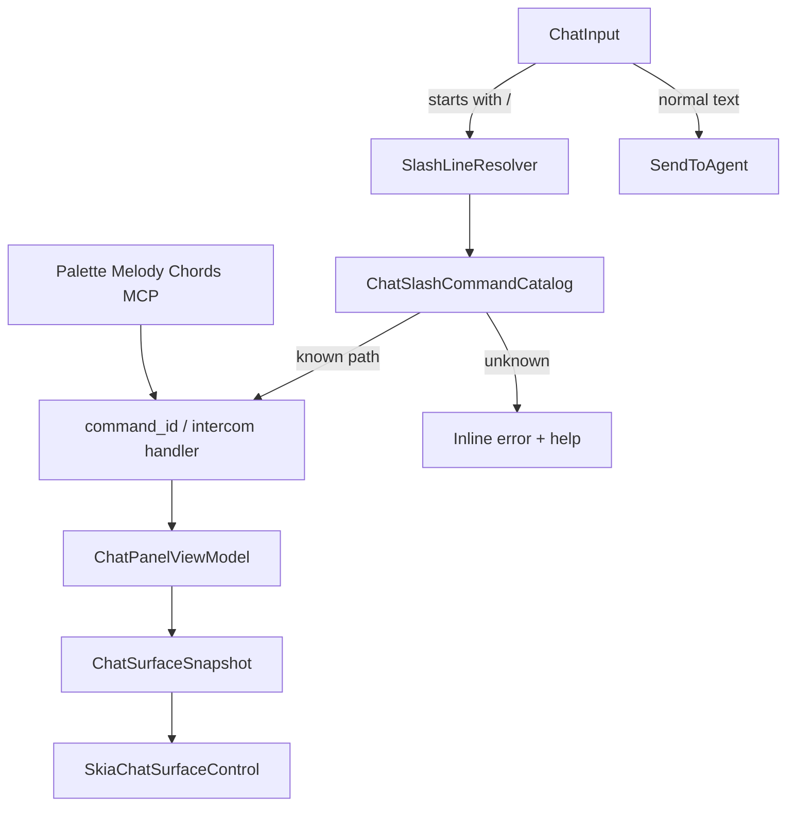

# ADR 0119: Слэш-команды в чате — unified command line (Intercom + IDE)

**Статус:** Accepted · Implemented  
**Дата:** 2026-05-17  
**Обновлено:** 2026-05-17 — расширение до IDE-глаголов (`/build run`, `/test run`, `/debug launch`); autocomplete обязателен. [§ История](#adr0119-history)

## Связанные ADR

| ADR | Роль |
|-----|------|
| [0080](0080-intercom-naming-and-multi-party-channel-model.md) | Чат как **Intercom** — центральный канал, не «окно к боту» |
| [0072](0072-chat-topic-cards-intent-melody-keyboard-contract.md) | Topic cards, overview/detail, **intent-first** навигация (Melody/Chords) |
| [0096](0096-intercom-topic-card-summary-and-product-spine.md) | Содержимое карточек, spine, carry-forward в тред |
| [0013](0013-command-surface-and-discoverability.md) | Палитра и discoverability — слэши **дополняют**, не заменяют |
| [0030](0030-command-ids-hotkeys-and-ui-registry-layers.md) | Канон `command_id`, реестр, паритет MCP |
| [0060](0060-keyboard-chord-stack-fms-tactical-strategic.md) | CascadeChord, Command Melody `c:` — **ортогональный** вход |
| [0008](0008-mcp-contracts-and-testable-infrastructure.md) | Паритет агента: те же эффекты через `ide_execute_command` |
| [0048](0048-cursor-acp-chat-ide-parity-and-mcp-tool-surface.md) | Что уходит агенту vs локальное действие IDE |
| [0057](0057-chat-surface-pipeline-adoption.md) | Snapshot/layout после смены состояния VM |
| [0116](0116-intercom-session-tree-and-agent-message-steering.md) | Дерево сессии, steer — не смешивать со слэш-парсером |
| [0002](0002-debug-human-agent-parity.md) | `/build`, `/test`, `/debug` — те же `command_id`, что агент через MCP |
| [0018](0018-ide-commands-canonical-xml-documentation.md) | Канон имён `IdeCommands` для проекции каталога |
| [0120](0120-primary-work-surface-intercom-or-editor.md) | Intercom в Forward — слэши как основной CLI сессии |
| [0124](0124-slash-parametric-editor-line-commands.md) | Параметрический слэш: `/editor line select|delete` (паритет `c:els` / `c:eld`) |
| [0125](0125-slash-workspace-file-commands-and-dynamic-completion.md) | Workspace/file: `/file open`, `/solution new`, динамические подсказки по файлам solution |
| [0126](0126-intercom-inspect-slash-and-compact-chrome-status.md) | `kind=report`: `/topic`/`/spine` list\|tree; compact chrome status |
| [0136](0136-intercom-feed-gutter-and-slash-namespace.md) | Канон `/intercom …`; top-level `/topic` — non-goal |
| [0150](0150-slash-line-canonical-resolution.md) | `SlashLineResolver`, `arg_tail`; autocomplete · Enter · execute |
| [0153](0153-slash-catalog-only-resolution.md) | **Исполнение пути:** только `intent-catalog` + codegen trie; без parser shape |

### Вне ADR

| Документ | Роль |
|----------|------|
| [MCP-PROTOCOL.md](../MCP-PROTOCOL.md) | `ide_execute_command`, `send_chat`, chat_* MCP |
| [intent-melody-language-v1.md](../intent-melody-language-v1.md) | Грамматика `c:` — **не** грамматика `/` в чате |
| [intercom-ux-reference-slack-mattermost-v1.md](../design/intercom-ux-reference-slack-mattermost-v1.md) | Slack/MM как вдохновение для composer и слэшей; границы vs внешний чат [0080 §5](0080-intercom-naming-and-multi-party-channel-model.md#adr0080-p5) |

## Резюме

- **`ChatInput`** — **альтернативная command line** IDE: можно **не уходить из чата** для Intercom *и* для частых действий (`/build run`, `/test run`, `/debug launch`, `/card …`).
- Слэш → **`command_id`** ([0030](0030-command-ids-hotkeys-and-ui-registry-layers.md)); каталог — **проекция** реестра на **читаемые** slash-пути (`/build run`, `/overview`), не второй исполнитель в VM.
- **Discoverability — через autocomplete** (иерархия namespace → action, подсказки, `/help`), **не** через короткие мнемоники вроде `/br` (сжатые формы — слой **`c:`** Melody и аккорды, [0060](0060-keyboard-chord-stack-fms-tactical-strategic.md)).
- **Autocomplete обязателен** — без него расширенный каталог не принимается.
- Палитра, Melody `c:` и аккорды остаются; слэш — **равноправный вход** для тех, кто уже в поле сообщения ([0013](0013-command-surface-and-discoverability.md)).
- Внедрение **по фазам**: Intercom-глаголы → IDE namespaces → расширение из палитры.

---

## Контекст

Intercom в CIDE ([0080](0080-intercom-naming-and-multi-party-channel-model.md)) всё чаще — **центральная поверхность**: диалог с агентом, картотека тем ([0072](0072-chat-topic-cards-intent-melody-keyboard-contract.md)), product spine ([0096](0096-intercom-topic-card-summary-and-product-spine.md)), уточнения ([0031](0031-agent-chat-clarification-batches-and-threading.md)).

Для power-user уже есть:

- **палитра** и fuzzy-поиск ([0013](0013-command-surface-and-discoverability.md));
- **глобальные хоткеи** и **CascadeChord** ([0060](0060-keyboard-chord-stack-fms-tactical-strategic.md));
- **Command Melody** `c:` в палитре ([0112](0112-command-palette-query-modes-strategy.md));
- **chat navigation intents** с паритетом в MCP (`chat_show_thread_overview`, `chat_open_selected_thread`, … — [0072 §4](0072-chat-topic-cards-intent-melody-keyboard-contract.md)).

Этого **недостаточно**, когда оператор **уже печатает в поле сообщения** и ожидает модель «как в Slack/Discord» или **CLI внутри чата**:

- Intercom: `/card Новая тема`, `/overview`, `/spine focus=…`;
- IDE: `/build run`, `/test run`, `/debug launch` — **без** переключения на палитру, тулбар и без обязательных аккордов.

Продуктовая гипотеза: если Intercom — **центральная поверхность**, чат становится **единой точкой управления сессией**, а не только каналом к агенту.

---

## Проблема

1. **Разрыв discoverability:** команды чата есть в реестре и MCP, но **не видны** в контексте ввода, где живёт основной поток мысли.
2. **Риск дублирования:** ad-hoc парсинг `/card` в `SendChatAsync` обходит intent-слой [0072 §5](0072-chat-topic-cards-intent-melody-keyboard-contract.md) и плодит расхождение с pointer/MCP.
3. **Смешение с агентом:** без правила «слэш = локально» строка `/export` может уехать в LLM как обычный текст.
4. **Конфликт префиксов:** `c:` зарезервирован за палитрой/Melody ([0112](0112-command-palette-query-modes-strategy.md)); **`/`** — отдельное пространство **только в ChatInput**.

---

## Решение

<a id="adr0119-p1"></a>

### 1. ChatInput как **unified command line** (слэш-префикс)

- Строка, начинающаяся с **`/`** (после trim), трактуется как **слэш-команда** (одно- или двухуровневая, см. [§4](#adr0119-p4)).
- Разбор **при отправке** (Enter) и **инкрементально** для autocomplete ([§6](#adr0119-p6)) — autocomplete **не опционален** для принятого объёма каталога.
- **Не** перехватывать `/` в середине обычного сообщения; обычный диалог с агентом — **без** слэша.

<a id="adr0119-p2"></a>

### 2. Intent-first: слэш → `command_id` → VM → snapshot

**Инвариант** (расширение [0072 §5](0072-chat-topic-cards-intent-melody-keyboard-contract.md)):

```text
ChatInput (/path …args)
  → SlashLineResolver (longest-prefix по intent-catalog, ADR 0150/0153)
  → ChatSlashCommandCatalog → descriptor (command_id, handlers, arg_tail)
  → ChatSlashCommandRunner / Intercom local handlers / IdeMcpCommandExecutor
  → ChatPanelViewModel state → ChatSurfaceCompositor → Skia render
```

*(Историческая схема v1: `ChatSlashCommandParser.TryParse` → `head`/`action` — снята, [0153](0153-slash-catalog-only-resolution.md).)*

- Слэш-команда **не** меняет Skia напрямую и **не** читает hit-target геометрию.
- Pointer, Melody, Chords, палитра, MCP и слэш **сходятся** в одном `command_id`, где это возможно.

<a id="adr0119-p3"></a>

### 3. Режимы исполнения

| Режим | Поведение | Пример |
|-------|-----------|--------|
| **Local** | Сообщение **не** уходит агенту; выполняется `command_id`; поле ввода очищается (или остаётся статус одной строкой). | `/overview`, `/export` |
| **Local + echo** | Локально + короткая системная запись в ленте (опционально, v1+). | `/card` с подтверждением «создана тема …» |
| **Reject** | Неизвестный verb — ошибка в UI, **без** отправки агенту. | `/foo` |
| **Pass-through** *(запрещено по умолчанию)* | Отправить текст агенту как есть. | **Не** использовать для нераспознанных `/` |

**Правило v1:** нераспознанная строка с ведущим `/` → **Reject** с подсказкой «неизвестная команда, Tab — список».

<a id="adr0119-p4"></a>

### 4. Грамматика v1

**Два уровня** (как «namespace / action»):

```ebnf
slash_line   = "/" head (WS tail)? WS? ;
head         = flat_verb | namespace ;
flat_verb    = letter { letter | digit | "-" } ;     (* overview, card, help, export *)
namespace    = letter { letter | digit } ;           (* build, test, debug, git, chat *)
tail         = action (WS arg_token)* | arg_tail ;   (* run | launch | …  OR  rest for flat *)
action       = letter { letter | digit | "-" } ;
arg_tail     = { arg_token } ;                       (* /card Имя темы — всё после head *)
arg_token    = quoted_string | bare_token ;
```

**Примеры:**

| Ввод | Разбор |
|------|--------|
| `/overview` | flat: `overview` |
| `/card ADR 0119` | flat: `card`, args: `ADR 0119` |
| `/build run` | namespace: `build`, action: `run` |
| `/test run` | namespace: `test`, action: `run` |
| `/debug launch` | namespace: `debug`, action: `launch` |
| `/editor line select 5 10` | namespace: `editor`, action: `line`, subAction: `select`, args: `5 10` — [0124](0124-slash-parametric-editor-line-commands.md) |

- **Регистр:** case-insensitive.
- **Три уровня** (`/editor line select`) — исключение для параметрического редактора; не общий прецедент для всех namespace ([0124](0124-slash-parametric-editor-line-commands.md)).
- **Именованные аргументы** (`configuration=Release`) — v2; v1 — позиционный хвост где нужен.

<a id="adr0119-p5"></a>

### 5. Каталог: проекция на `command_id`, не второй реестр

<a id="adr0119-p5a"></a>

#### 5a. Источник правды

- **Исполнение** — только через существующий контур `ide_execute_command` / `IdeMcpCommandExecutor` ([0030](0030-command-ids-hotkeys-and-ui-registry-layers.md), [0008](0008-mcp-contracts-and-testable-infrastructure.md)).
- **Каталог слэшей** (`ChatSlashCommandCatalog`) — **отображение** (slash-путь → `command_id` + шаблон args), собираемое из:
  1. **Curated** таблицы в коде (v1);
  2. v2+ — **проекция** подмножества `IdeCommandPaletteCatalog` / метаданных `IdeCommands` (заголовок палитры → не обязан совпадать со слэшем; slash-путь задаётся явно).
- **Не путать** с Melody: в каталоге **нет** отдельных записей «2–3 буквы» (`/br`, `/tr`) как сокращений к `namespace action` — оператор выбирает **`/build` → `run`** из autocomplete или вводит полную форму.
- **Запрещено:** дублировать логику `dotnet build` / тестов / отладки в `ChatPanelViewModel`.

<a id="adr0119-p5b"></a>

#### 5b. Intercom (flat verbs) — фаза A

| Слэш | `command_id` | Примечание |
|------|----------------|------------|
| `/overview` | `chat_show_thread_overview` | |
| `/open` | `chat_open_selected_thread` | |
| `/card <title>` | *новый* или `fork_chat_thread` + title | продуктово |
| `/spine …` | `chat_set_product_spine` | хвост → focus / milestones |
| `/spine-toggle` | `chat_toggle_product_spine_in_agent_context` | |
| `/export` | `chat_export_readable` | |
| `/help` | локальный каталог | `kind=help`, без MCP |
| `/topic list` \| `/topic tree` | локальный отчёт | `kind=report`, [0126](0126-intercom-inspect-slash-and-compact-chrome-status.md) |
| `/topic open` | открыть detail темы | `kind=intercom`, [0126](0126-intercom-inspect-slash-and-compact-chrome-status.md) |
| `/spine list` \| `/spine tree` | локальный отчёт | `kind=report`, [0126](0126-intercom-inspect-slash-and-compact-chrome-status.md) |
| `/topic cards` | картотека тем (overview) | `kind=intercom`, [0126](0126-intercom-inspect-slash-and-compact-chrome-status.md) |
| `/spine open` | то же, что `/topic cards` | `kind=intercom`, [0126](0126-intercom-inspect-slash-and-compact-chrome-status.md) |

<a id="adr0119-p5c"></a>

#### 5c. IDE namespaces — фаза B (не уходя из чата)

| Слэш | `command_id` | Примечание |
|------|----------------|------------|
| `/build run` | `build` или `build_structured` | structured JSON в ленту/панель — политика UI |
| `/build ui` | `build_solution_ui` | тулбарный путь, текст в output |
| `/test run` | `run_tests` | |
| `/test affected` | `run_affected_tests` | опционально `changed_paths` из git |
| `/debug launch` | `debug_launch` | target из launch profile / текущий |
| `/debug continue` | *debug_start_or_continue* (UI id) | если нет в `IdeCommands` — добавить константу |
| `/git status` | `git_status` | фаза C, когда есть в реестре |

Дальнейшие namespace (`nav`, `index`, `palette`) — **по мере discoverability**, не «весь IdeCommands одним махом».

**Паритет:** агент вызывает тот же `build` / `run_tests` / `debug_launch` через MCP; оператор — `/build run` в чате.

<a id="adr0119-p6"></a>

### 6. Discoverability: autocomplete и help (обязательно)

Без autocomplete расширение до `/build`, `/test`, … **не принимается** — оператор **не обязан** помнить namespace и action и **не должен** полагаться на сжатые слэш-мнемоники (в отличие от `c:` в палитре).

**Поведение UI (v1 минимум):**

| Шаг ввода | Popup показывает |
|-----------|------------------|
| `/` | top-level: flat verbs + namespaces (`build`, `test`, `debug`, `card`, …) |
| `/build ` | actions: `run`, `ui`, … + однострочное описание |
| `/build r` | фильтр по префиксу (`run`) |
| неизвестный префикс | «нет совпадений» + ссылка на `/help` |

- **`Tab`** — дополнить токен / выбрать highlighted; **↑↓** — навигация; **Esc** — закрыть popup, не очищая строку.
- Под каждым пунктом — **краткий help** (из `IdeCommands` doc / curated catalog) и опционально **hotkey** из TOML, если есть ([0030](0030-command-ids-hotkeys-and-ui-registry-layers.md)).
- **`/help`** и **`/help build`** — текстовый/интерактивный список в ленте или overlay (local).
- Источник v1: `ChatSlashCommandCatalog` в коде; v2 — TOML `chat-slash-aliases.toml` по аналогии [0109](0109-declarative-parametric-melody-catalog-toml-and-code-binders.md).

<a id="adr0119-p7"></a>

### 7. Связь с агентом и spine ([0096](0096-intercom-topic-card-summary-and-product-spine.md))

- Слэш-команды **по умолчанию local** — **не** расширяют промпт агента.
- `/spine-toggle` и `/spine` меняют метаданные сессии; включение spine в контекст агента — **явное** ([0096 §4](0096-intercom-topic-card-summary-and-product-spine.md#adr0096-p4)), не побочный эффект любой слэш-команды.
- **Carry-forward** в тред по-прежнему **обычным сообщением** или отдельным intent; слэш **не обязан** генерировать текст для агента.

<a id="adr0119-p8"></a>

### 8. Non-goals и границы

**Non-goals:**

- **Полная замена** Command Palette: fuzzy-поиск по *всем* командам без структуры namespace остаётся в палитре.
- Автоматическое **1:1** «каждая строка палитры = слэш» без curated aliases и UX-фильтра (слишком шумно).
- Слэш-команды в **других** полях (терминал, редактор, палитра) — только `ChatInput`.
- Плагины с произвольными verb **без** записи в каталог / `command_id`.
- Pass-through нераспознанного `/…` агенту.
- **Короткие слэш-алиасы** (2–3 символа, «мелодия после `/»): `/br` вместо `/build run`, автогенерация из [0109](0109-declarative-parametric-melody-catalog-toml-and-code-binders.md) без отдельного slash-пути — discoverability только **иерархический autocomplete** и читаемые `namespace` / `action` / flat verbs.

**В scope (осознанно):**

- **Альтернативный вход** в те же IDE-действия, что палитра/аккорды/MCP — в т.ч. `/build run`, `/test run`, `/debug launch`.
- Оператор **может не уходить из чата** для частого цикла «спросил агента → собрал → прогнал тесты → отладил».

---

## Ортогональность входов (сводка)

| Вход | Где | Префикс / форма |
|------|-----|-----------------|
| Палитра | overlay | fuzzy, `c:` Melody |
| Hotkeys / Chord | глобально | TOML → `command_id` |
| Chat Melody aliases | палитра / intents | `ato`, `atb`, … ([0072](0072-chat-topic-cards-intent-melody-keyboard-contract.md)) |
| **Chat slash** | `ChatInput` | `/verb` или `/namespace action` (**этот ADR**) |
| MCP | агент | `ide_execute_command` |

---

## Диаграмма



---

## Якоря реализации (план)

| Компонент | Роль |
|-----------|------|
| `IntentMelody/intent-catalog.toml` | Канон slash `path`, `arg_tail`, handlers ([0153](0153-slash-catalog-only-resolution.md)) |
| `Services/Generated/SlashRouteCatalogPathsGenerated.g.cs` | Codegen trie (build, ProtocolDocGen) |
| `Features/Chat/SlashLineResolver.cs` | Канонический путь + `ArgTail` ([0150](0150-slash-line-canonical-resolution.md)) |
| `Features/Chat/ChatSlashCommandCatalog.cs` | path → descriptor (`command_id`, help, execution kind) |
| `Features/Chat/ChatSlashCommandParser.cs` | `IsSlashLine`, `ShouldAutoExecuteAfterAutocompleteCommit` — **без** `TryParse` |
| `Features/Chat/ChatSlashCommandRunner.cs` | local execution, args из резолва |
| [`IntercomOutboundSendOrchestrator`](../../Features/Chat/Application/IntercomOutboundSendOrchestrator.cs) | сценарий Send: Slash → BuildOutbound (фон + Roslyn cache) → PrepareMessage → CommitFeed → DispatchProvider; trace по фазам |
| [`ChatPanelViewModel`](../../Features/Chat/ChatPanelViewModel.cs) | порты через `IntercomOutboundSendHost`; `SendChatCommand` → оркестратор |
| [`IdeMcpCommandExecutor`](../../ViewModels/IdeMcpCommandExecutor.cs) | исполнение тех же `command_id`, что MCP |
| [`ChatPanelView.axaml`](../../Views/ChatPanelView.axaml) | popup autocomplete (**обязателен** до фазы B) |
| `ChatSlashAutocompleteControl` *(новый)* | иерархический popup, привязка к `ChatInput` |
| [`IdeCommands`](../../Services/IdeCommands.SolutionWorkspace.cs) | новые `command_id` только если нет покрытия (`chat_create_or_rename_topic`) |

**Порядок внедрения:**

| Фаза | Содержание | Критерий готовности |
|------|------------|---------------------|
| **A** | Parser (flat + namespace/action), catalog Intercom, local execution | `/overview`, `/export` не уходят агенту |
| **A′** | **Autocomplete** для flat + namespace list | после `/` и `/build ` есть подсказки |
| **B** | IDE: `/build run`, `/test run`, `/debug launch` → `command_id` | паритет с MCP `build` / `run_tests` / `debug_launch` |
| **C** | Расширение каталога (`/git status`, `/nav`, проекция из палитры) | по discoverability + autocomplete, не big-bang |

Тесты: parser unit-tests; интеграция «слэш local»; снапшоты каталога help.

---

## Отклонённые альтернативы

1. **Парсить слэши в палитре** (`/card` в Command Palette) — смешивает overlay и Intercom; отвергнуто.
2. **Отдельные MCP-only команды без `command_id`** — ломает [0030](0030-command-ids-hotkeys-and-ui-registry-layers.md); отвергнуто.
3. **Отправлять нераспознанный `/` агенту** — шум и утечки; отвергнуто.
4. **Короткие слэши как у Melody** (`/br` = build run) — дублирует `c:` / аккорды, коллизии и второй парсер; discoverability в Intercom — **autocomplete**, не мнемоники; отвергнуто.

---

## История изменений

<a id="adr0119-history"></a>

| Дата | Изменение |
|------|-----------|
| 2026-05-17 | Proposed: слэш-команды в ChatInput, каталог v1, intent-first, non-goals. |
| 2026-05-17 | Расширение: unified command line — IDE namespaces (`/build run`, `/test run`, `/debug launch`); autocomplete обязателен; фазы A–C. |
| 2026-05-17 | Уточнение: discoverability слэша — **autocomplete**; короткие алиасы (`/br`) и «мелодия после `/`» — **non-goal** (сжатие — `c:` Melody). |
| 2026-05-17 | Accepted · Implemented: фазы **A**, **A′**, **B** (`ChatSlashCommand*`, autocomplete, IDE namespaces); фаза **C** — backlog. |
| 2026-05-20 | `/help` — справка Intercom (`Intercom/intercom-help.ru.md`, EmbeddedResource + override на диске); ось **`audience`** (`channel` \| `self`) на сообщении и в `intent-catalog.toml`. |
| 2026-05-17 | См. [0124](0124-slash-parametric-editor-line-commands.md): полный slash-паритет каталога IML (`wire_class`, `/editor line …`, `/portal open`). |
| 2026-05-28 | Исполнение пути: [0153](0153-slash-catalog-only-resolution.md) — catalog-only; диаграмма и якоря реализации обновлены. |
