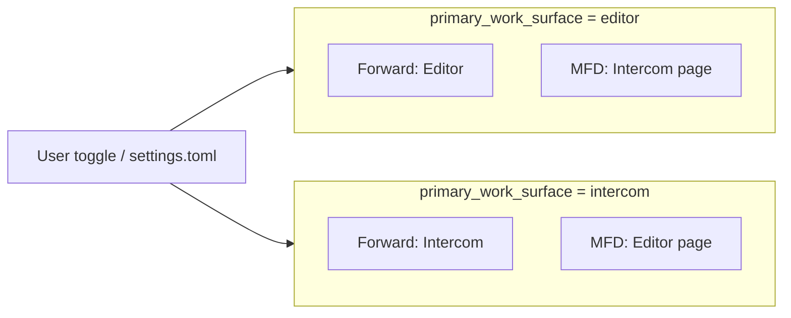

# ADR 0120: Primary work surface — Intercom или Editor (аналог Agent / Editor)

**Статус:** Proposed  
**Дата:** 2026-05-17

## Связанные ADR

| ADR | Роль |
|-----|------|
| [0017](0017-multi-window-workspace-and-agent-surfaces.md) | Топология PFD / Forward / MFD, `presentation`, мультиоконность |
| [0021](0021-pfd-mfd-cockpit-attention-model.md) | Якоря внимания; Forward = лобовое поле зрения |
| [0010](0010-ui-modes-toml-configuration.md) | Режимы UI в TOML; место для пресета «agent-central» |
| [0028](0028-user-settings-toml-localappdata-and-secrets.md) | `%LocalAppData%\CascadeIDE\settings.toml` |
| [0080](0080-intercom-naming-and-multi-party-channel-model.md) | Intercom — канал сессии, не «чат-виджет» |
| [0098](0098-semantic-first-document-as-projection.md) | Редактор — мощный канал, не абсолют всей правды |
| [0044](0044-avalonia-host-skia-agent-chat-surface.md) | Skia host для agent chat surface |
| [0072](0072-chat-topic-cards-intent-melody-keyboard-contract.md) | Topic cards в overview/detail |
| [0119](0119-chat-slash-commands-intercom-surface.md) | Слэш-команды в `ChatInput` — усиливаются при Intercom в центре |
| [0074](0074-settings-ui-mfd-compact-layout-overflow.md) | Плотность MFD при узкой колонке |

### Вне ADR

| Документ | Роль |
|----------|------|
| [ux/README.md](../ui-ux/README.md) | Актуальная линия Flight; legacy Focus/Balanced/Power — архив |

## Резюме

- Вводится настройка **`primary_work_surface`**: **`intercom`** | **`editor`** (аналог **Agent / Editor** в Cursor).
- Определяет, **что занимает якорь Forward** (лобовое поле): полноэкранный **Intercom** (чат + картотека + spine) или **редактор кода**.
- Вторичный контур (MFD) показывает **другую** поверхность (редактор или страницы shell), без потери функций.
- **Не** путать с primary-монитором ОС ([0017 § primary vs Forward](0017-multi-window-workspace-and-agent-surfaces.md#adr0017-p5-primary-vs-forward)).
- Дефолт продукта: **`editor`**; пресет «как Cursor» — **`intercom`**. Связь с [0119](0119-chat-slash-commands-intercom-surface.md).

---

## Контекст

Часть пользователей (в т.ч. при работе **в Cursor** с чатом на **главном экране**) проводит в диалоге с агентом **большую часть сессии**. Для них кокпитная метафора «Forward = редактор, чат на MFD» **инвертирована** относительно реального внимания: центр — **мысль и переписка**, код — **по запросу**.

В CIDE уже есть:

- **три якоря** PFD / Forward / MFD ([0021](0021-pfd-mfd-cockpit-attention-model.md));
- **Intercom** как продуктовая модель ([0080](0080-intercom-naming-and-multi-party-channel-model.md), [0072](0072-chat-topic-cards-intent-melody-keyboard-contract.md), [0096](0096-intercom-topic-card-summary-and-product-spine.md));
- **настраиваемая топология** экранов через `presentation` ([0017](0017-multi-window-workspace-and-agent-surfaces.md));
- **режимы UI** в TOML ([0010](0010-ui-modes-toml-configuration.md)).

Не хватает **явного переключателя «что в центре»** без ручной перекомпоновки мониторов и без смены всей строки `presentation`.

---

## Проблема

1. **Forward зашит как редактор** в ментальной модели и типовой раскладке — agent-central пользователь **периферийно** воспринимает чат.
2. **Путаница с монитором:** «центральный экран» ≠ **primary display** ОС — см. [0017](0017-multi-window-workspace-and-agent-surfaces.md); нужна отдельная ось **primary_work_surface**.
3. **0119 (слэши)** и **topic cards** выигрывают, когда Intercom уже в лобовом якоре; без 0120 архитектура остаётся «чат сбоку».
4. **Риск «убрать редактор»:** продуктовая цель — **сменить default фокус**, не отказ от кода ([0098](0098-semantic-first-document-as-projection.md)).

---

## Решение

<a id="adr0120-p1"></a>

### 1. Ось `primary_work_surface`

Допустимые значения:

| Значение | Лобовой якорь **Forward** | Типичное размещение редактора |
|----------|---------------------------|-------------------------------|
| **`editor`** *(дефолт CIDE)* | Редактор кода (AvaloniaEdit) | MFD: страница **Intercom** / чат в shell |
| **`intercom`** | **Intercom** (полный `ChatPanel` + Skia surface: overview, spine, detail) | MFD: **Editor** как страница или докируемая панель; PFD без изменений по смыслу |

**Инвариант:** обе поверхности **остаются доступны**; меняется **якорь внимания по умолчанию**, как переключение Agent / Editor в Cursor.

<a id="adr0120-p2"></a>

### 2. Ортогональность другим осям

| Ось | Вопрос | Связь с `primary_work_surface` |
|-----|--------|--------------------------------|
| **`presentation`** ([0017](0017-multi-window-workspace-and-agent-surfaces.md)) | Сколько окон и долей P/F/M | Независима: можно `(P+F+M)` на одном дисплее **и** `intercom` в Forward |
| **Primary monitor ОС** | Куда Windows ставит taskbar | **Не** задаёт Forward; см. [0017 §5](0017-multi-window-workspace-and-agent-surfaces.md#adr0017-p5-primary-vs-forward) |
| **UiMode / Flight** ([0010](0010-ui-modes-toml-configuration.md)) | Видимость панелей, capabilities | Может **сужать** хром (Dark Cockpit); не подменяет якорь |
| **Melody / Chords** ([0060](0060-keyboard-chord-stack-fms-tactical-strategic.md)) | Фокус зоны M/P/F | Сохраняются; `focus_forward` фокусирует **лобовой якорь** (чат или редактор) |

<a id="adr0120-p3"></a>

### 3. UX-контракт переключения

- **Явный переключатель** в UI (toggle, пункт меню, опционально хоткей) — подписи **`Intercom`** / **`Editor`** или **`Agent`** / **`Editor`** (копирайт уточнить в UX; канон данных — `intercom` | `editor`).
- Переключение **не сбрасывает** сессию чата и **не закрывает** открытые файлы; меняется только **хост в Forward** и **страница по умолчанию** на MFD.
- Состояние **персистится** в `settings.toml` ([0028](0028-user-settings-toml-localappdata-and-secrets.md)).

<a id="adr0120-p4"></a>

### 4. Конфигурация (целевая схема)

```toml
# settings.toml (фрагмент)
[workspace]
primary_work_surface = "intercom"   # "editor" | "intercom"
```

Опционально в **`UiModes/Flight.toml`** (или отдельный пресет `AgentCentral.toml`):

```toml
primary_work_surface = "intercom"
# capabilities: шире чат, уже полоса IDE Health, …
```

**Дефолт при отсутствии ключа:** `editor` (совместимость с текущим CIDE).

<a id="adr0120-p5"></a>

### 5. Связь с Intercom и [0119](0119-chat-slash-commands-intercom-surface.md)

При **`primary_work_surface = intercom`**:

- Forward показывает **картотеку тем**, spine, detail — [0072](0072-chat-topic-cards-intent-melody-keyboard-contract.md), [0096](0096-intercom-topic-card-summary-and-product-spine.md).
- **`ChatInput`** — естественная **command line** сессии; слэш-команды ([0119](0119-chat-slash-commands-intercom-surface.md)) становятся **основным** путём к `build` / `test` / `card`, а не периферийным.

При **`editor`** — поведение как сейчас; 0119 остаётся полезным, но чат не обязан быть в центре внимания.

<a id="adr0120-p6"></a>

### 6. Редактор при Intercom-central

- Редактор **не удаляется**: перенос на MFD-страницу «Code» / док / split — деталь вёрстки в реализации.
- **Go to definition**, открытие файла из чата, якоря [0080](0080-intercom-naming-and-multi-party-channel-model.md) — по-прежнему переводят фокус на **редактор** (временно или с переключением surface), без отмены deep link.
- Semantic map / PFD **не обязаны** переезжать в Forward.

---

## Non-goals

- Замена трёхзонной модели PFD / Forward / MFD на «только чат».
- Тождество `primary_work_surface` и **primary monitor** ОС.
- Обязательная смена строки `presentation` при каждом переключении Agent/Editor.
- Удаление режима **Editor** или отказ от AvaloniaEdit во Forward **навсегда**.

---

## Якоря реализации (план)

| Компонент | Роль |
|-----------|------|
| `settings.toml` | `workspace.primary_work_surface` |
| `MainWindow` / `MainGrid` | условный host в колонке Forward |
| `MfdShellView` / secondary pages | вторая поверхность при `intercom` |
| `MainWindowViewModel` | свойство + команда переключения; сохранение в settings |
| `IdeCommands` *(опционально)* | `set_primary_work_surface`, `toggle_primary_work_surface` для MCP |
| [0119](0119-chat-slash-commands-intercom-surface.md) | реализация слэшей — после или параллельно с host-swap |

**Порядок:**

1. Настройка + переключатель + swap hosts в `MainWindow` (без смены `presentation`).
2. MFD-страница редактора при `intercom`.
3. Пресет TOML «agent-central» + документация UX.
4. MCP / хоткей по необходимости.

---

## Открытые решения (до Accepted)

| # | Вопрос | Направление |
|---|--------|-------------|
| 1 | Подписи UI: **Intercom** vs **Agent** | Продукт: Intercom ([0080](0080-intercom-naming-and-multi-party-channel-model.md)); для пользователей Cursor — alias «Agent» в toggle |
| 2 | Редактор на MFD: отдельная **страница** vs **док** | Страница v1 (проще паритет с текущим shell) |
| 3 | Авто-переключение на Editor при go-to-definition | Опционально v2; v1 — явный переход |

---

## Диаграмма



---

## Отклонённые альтернативы

1. **Только смена `presentation`** без отдельного ключа — недостаточно для одного монитора и для быстрого Agent/Editor toggle.
2. **Чат всегда в Forward, редактор только во всплывающем окне** — ломает паритет MCP/отладки и привычный MFD shell.
3. **Новый четвёртый якорь «Intercom»** вместо swap Forward — раздувает [0021](0021-pfd-mfd-cockpit-attention-model.md) без необходимости.

---

## История изменений

<a id="adr0120-history"></a>

| Дата | Изменение |
|------|-----------|
| 2026-05-17 | Proposed: `primary_work_surface` (intercom \| editor), swap Forward/MFD, связь с 0119. |
