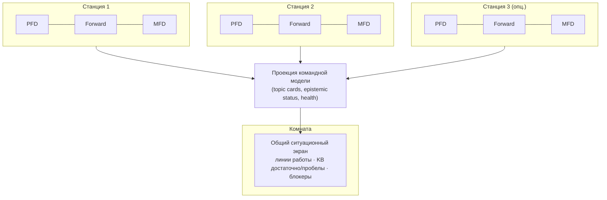

# ADR 0122: Командная среда IOP — рабочие места и общий ситуационный экран

**Статус:** Proposed  
**Дата:** 2026-05-17

## Связанные ADR

| ADR | Роль |
|-----|------|
| [0121](0121-intent-oriented-programming-paradigm.md) | IOP — дисциплина коммуникации; среда, не только приложение |
| [0100](0100-project-constitution.md) | Agent-first, кокпит, общая операционная модель |
| [0017](0017-multi-window-workspace-and-agent-surfaces.md) | Каноническая раскладка: `(P)(F)(M)` на три монитора у рабочего места |
| [0021](0021-pfd-mfd-cockpit-attention-model.md) | PFD / Forward / MFD — якоря внимания; Endsley SA |
| [0080](0080-intercom-naming-and-multi-party-channel-model.md) | Intercom — несколько участников; внешний командный контур |
| [0120](0120-primary-work-surface-intercom-or-editor.md) | Личный Forward: Intercom или редактор |
| [0072](0072-chat-topic-cards-intent-melody-keyboard-contract.md) | Topic cards — линии работы |
| [0096](0096-intercom-topic-card-summary-and-product-spine.md) | Spine продуктовой линии на карточке |
| [0045](0045-agent-chat-persistence-event-log-and-projections.md) | Событийная лента → проекции для UI |
| [0095](0095-workspace-solution-ide-health-stratification.md) | Стратификация «здоровья» workspace/solution |
| [0061](0061-context-aware-adr-map-pfd-knowledge-indicator.md) | PFD как сигнал «какие ограничения/знания здесь» |
| [0014](0014-situational-checklists.md) | Ситуационные чеклисты — сценарии «что дальше» |

### Вне ADR

| Документ | Роль |
|----------|------|
| [iop-manifest-v1.md](../iop-manifest-v1.md) | Публичная формулировка IOP |
| [ui-ux/cascade-ide-ui-layout-v1.md](../ui-ux/cascade-ide-ui-layout-v1.md) | Раскладка PFD / Forward / MFD |

## Резюме

- **Cascade / IOP** в перспективе — не только **приложение на одном столе**, а **среда командной работы**: несколько рабочих мест с канонической кокпитной раскладкой **и** (опционально) **общий ситуационный экран** в поле зрения комнаты.
- У каждого участника — **свой** контур `(P)(F)(M)` ([0017](0017-multi-window-workspace-and-agent-surfaces.md)); у команды — **общая проекция** согласованной картины: **что в работе**, **по каким линиям знаний агентам достаточно контекста**, **где пробелы** (KB, playbook, уточнения).
- Общий экран — **не** зеркало чата и **не** бесконечная лента; это **Team situational display** (рабочее имя: **общий PFD комнаты** / **room board**): агрегат линий работы, статусов интентов и эпистемической сводки.
- Технология синхронизации (локальная сеть, shared projection service, интеграция с внешним Intercom-контуром [0080](0080-intercom-naming-and-multi-party-channel-model.md) §5) — **отдельный** этап; этот ADR фиксирует **продуктовую модель среды**.

---

## Контекст

IOP ([0121](0121-intent-oriented-programming-paradigm.md)) ставит в центр **согласованный информационный поток** между людьми, агентами и артефактами. На одном рабочем месте это уже выражено кокпитом: PFD — краткая ситуация, Forward — лобовая работа (код или Intercom), MFD — вторичный контур ([0021](0021-pfd-mfd-cockpit-attention-model.md), [0120](0120-primary-work-surface-intercom-or-editor.md)).

Продуктовое видение команды шире: **2–3 человека** за отдельными столами (у каждого **три монитора** — канон `(P)(F)(M)`), плюс **большой экран** в общем поле зрения комнаты. На нём — не переписка «как в Slack», а **то, что команде нужно видеть вместе без крика через плечо**:

- какие **линии работы / цели** сейчас активны;
- **достаточно ли** у агентов (и людей) контекста по теме (KB, playbook, scope workspace);
- **где нужно дополнить** знания, уточнить намерение или разблокировать верификацию;
- при необходимости — **блокеры**, фаза (синтез / уточнение / верификация), согласованные **следующие шаги** на уровне команды.

Так IOP перестаёт быть «IDE у одного пилота» и становится **средой**, в которой коммуникация и намерения **наблюдаемы коллективно**, без смешения с сырым потоком сообщений ([0121](0121-intent-oriented-programming-paradigm.md), [0120](0120-primary-work-surface-intercom-or-editor.md) §5.1).

---

## Проблема

1. **Только персональный кокпит** не отвечает на вопрос «что делает *мы* сейчас» — каждый видит свой Forward, общая картина в головах или в стороннем мессенджере.
2. **Зеркалирование чата на стену** усиливает шум ([0120](0120-primary-work-surface-intercom-or-editor.md)): поток сообщений команда и так не вывозит.
3. **«Приложение vs среда»:** без явной модели легко спутать CIDE с «ещё одним окном» вместо **контура**, к которому подключаются рабочие места и общий дисплей.
4. **Эпистемический слой IOP** (KB, agent-notes, пробелы контекста) сегодня в основном **личный** или агентский; для пары программистов + агентов нужна **сводка, пригодная для комнаты**.

---

## Решение (направление)

### 1. Два уровня: рабочее место и комната

| Уровень | Физика | Роль в IOP |
|---------|--------|------------|
| **Рабочее место (station)** | 1 участник, типично **3 монитора**, пресент `(P)(F)(M)` или эквивалент ([0017](0017-multi-window-workspace-and-agent-surfaces.md)) | Личный цикл: намерение → синтез → верификация; Intercom/редактор в Forward ([0120](0120-primary-work-surface-intercom-or-editor.md)) |
| **Комната (room)** | 2–N станций + **общий дисплей** в общем поле зрения | **Коллективная ситуационная осведомлённость**: согласованная картина работы и знаний **без** обязанности читать все личные чаты |

CIDE на станции остаётся **исполнителем и верификатором**; общий экран — **read-mostly проекция** командной модели (с правом «поднять на стену» выбранную линию работы — деталь UX позже).

### 2. Общий ситуационный экран (Team situational display)

**Назначение:** ответы на вопросы уровня команды за **5–15 секунд взгляда**, в духе PFD ([0021](0021-pfd-mfd-cockpit-attention-model.md)), а не чтение ленты.

**Типовое содержимое (канон намерения, не финальный макет):**

| Блок | Смысл | Источники (концептуально) |
|------|--------|-----------------------------|
| **Линии в работе** | Активные topic cards / интенты, фаза, владелец (человек/агент) | [0072](0072-chat-topic-cards-intent-melody-keyboard-contract.md), [0096](0096-intercom-topic-card-summary-and-product-spine.md), проекции [0045](0045-agent-chat-persistence-event-log-and-projections.md) |
| **Эпистемическая сводка** | По линии или workspace: **достаточно** / **нужно дополнить** (playbook, KB, ADR terrain, agent-notes scope) | KB router, [0061](0061-context-aware-adr-map-pfd-knowledge-indicator.md), agent-notes; не «вся KB на стене» |
| **Согласованные пробелы** | Явные «нужно уточнить / добавить в KB / дождаться верификации» | Батчи уточнений [0031](0031-agent-chat-clarification-batches-and-threading.md), pre-flight / checklist [0014](0014-situational-checklists.md) |
| **Здоровье контура** | Сборка, тесты, критичные IDE Health сигналы — **агрегат**, не полный лог | [0095](0095-workspace-solution-ide-health-stratification.md) |

**Инварианты:**

- **Не** дублировать полный Intercom-чат на общий экран.
- **Не** смешать «личную переписку с агентом» и «командную картину» без явного действия «вынести на room board».
- Обновления — **проекции и дельты** (что изменилось по линии), в духе IOP «арбитр дельты», а не поток токенов.

### 3. Связь с Intercom и multi-party

- **Intercom на станции** — место **договориться** о намерении и вести линию работы ([0080](0080-intercom-naming-and-multi-party-channel-model.md), [0120](0120-primary-work-surface-intercom-or-editor.md)).
- **Общий экран** — **наблюдаемый слой** тех же линий и эпистемического статуса для людей в комнате; агенты на станциях продолжают работать в том же контуре MCP/репозитория.
- Участники «в эфире» ([0080](0080-intercom-naming-and-multi-party-channel-model.md) §2) на общем дисплее — **роли и линии**, не обязательно аватары чата.

### 4. Среда vs приложение (формулировка)

| | **Приложение (узко)** | **Среда (IOP)** |
|---|----------------------|-----------------|
| Единица | Один `TopLevel`, один workspace | N **станций** + опционально **room display** + общий репозиторий/KB |
| Внимание | Личный PFD/Forward/MFD | Личный кокпит **+** командный PFD на стене |
| Коммуникация | Локальный Intercom | Согласованный поток, **видимый** команде на агрегате |

Cascade IDE — **рабочая реализация** IOP на станции; **room projection** — расширение той же парадигмы, не отдельный «чат для стены».

### 5. Environment-first и голос в комнате (честно)

Модель **environment-first** ([0121](0121-intent-oriented-programming-paradigm.md)) хорошо стыкуется с комнатой: среда = станции + **общая картина**, а не «ещё один мессенджер». Но в одной физической комнате люди **обычно не переписываются в чат** — они **говорят голосом**. Агентам **сложно** надёжно уловить весь устный поток; если **всё** записывать и расшифровывать, потом долго отделять **решения и договорённости** от **шума** (полфразы, отвлечения, передумывания) — та же ловушка, что и бесконечная лента сообщений, только в аудио.

**Направление IOP (не коммит на v1):**

| Что | Смысл |
|-----|--------|
| **Общий экран** | Показывает **согласованную модель** (линии, пробелы KB, фаза) — то, о чём команда **уже договорилась**, а не сырой лог разговора |
| **Голос в комнате** | Остаётся **человеческой полосой пропускания**; система не обязана быть «микрофоном на всю комнату» |
| **Фиксация после разговора** | Короткий **артефакт договорённости**: обновление topic card / pin на room board / структурированная заметка («минутки намерения»), опционально — **голосовой пакет** в тред по явной команде ([0080](0080-intercom-naming-and-multi-party-channel-model.md) § «голос пакетами», не always-on) |
| **Работа агента** | Опирается на **дельту и артефакты** (git, MCP, карточка, ADR), а не на реконструкцию каждой реплики за столом |

**Инвариант:** environment-first **не** означает «записать и расшифровать всё, что сказали у доски». Означает: **после** устного согласования — **явно** занести в контур то, что стало командной правдой (намерение, пробел знаний, следующий шаг). Переговоры у кофе машины в IOP **не обязаны** попадать в Intercom; попадает **результат**.

---

## Non-goals

- Полноценный **мультиплеер в реальном времени** в одном редакторе (shared cursors, CRDT) — вне этого ADR.
- Замена **корпоративного мессенджера** или полная реализация «командного контура» внутри CIDE ([0080](0080-intercom-naming-and-multi-party-channel-model.md) §5).
- Обязательный **четвёртый монитор** у каждого участника — общий дисплей **комнаты**, не персональный.
- Выбор конкретного протокола синхронизации (WebSocket, Mattermost widget, локальный HTTP) — следующий ADR/чертёж.
- **Постоянная транскрипция** всего разговора в комнате как единственный источник правды для агентов — против IOP (шум, приватность, долгая ручная вычитка).

---

## Последствия

- Дорожная карта UX/MCP может явно различать **`ide_get_ui_layout`** (станция) и будущий **`team_situational_snapshot`** / room consumer API.
- Topic cards и spine ([0096](0096-intercom-topic-card-summary-and-product-spine.md)) проектируются с учётом **краткой сводки для комнаты**, не только overview на станции.
- IOP manifest и онбординг могут описывать **командную комнату** как эталонный сценарий, не только solo developer.
- Интеграция с внешним Intercom-контуром ([0080](0080-intercom-naming-and-multi-party-channel-model.md)) может питать **ту же** проекцию room board, если «правда о переписке» снаружи — при явной политике «две правды».

---

## Диаграмма

---

## Открытые вопросы (до Accepted)

| # | Вопрос | Направление |
|---|--------|-------------|
| 1 | Имя в UI: **Room board**, **Team PFD**, **Общий PFD** | Коротко, без путаницы с личным PFD |
| 2 | Кто **публикует** на стену: автоматически все активные cards vs явное «pin for room» | v1 — явный pin + авто-агрегат «в работе» |
| 3 | Один workspace на комнату vs несколько | Один shared workspace/session id на комнату для v1 гипотезы |
| 4 | Транспорт проекции | Локальный сервис / MCP relay / read-only веб-страница на большом экране |
| 5 | Голос в комнате vs фиксация намерения | v1 — **ручной/полуавтоматический** артефакт после разговора; always-on STT комнаты — не по умолчанию |

---

## История изменений

| Дата | Изменение |
|------|-----------|
| 2026-05-17 | Proposed: командная среда IOP, станции `(P)(F)(M)`, общий ситуационный экран. |
| 2026-05-17 | §5: environment-first; голос в комнате — не полная транскрипция, артефакт договорённости. |
