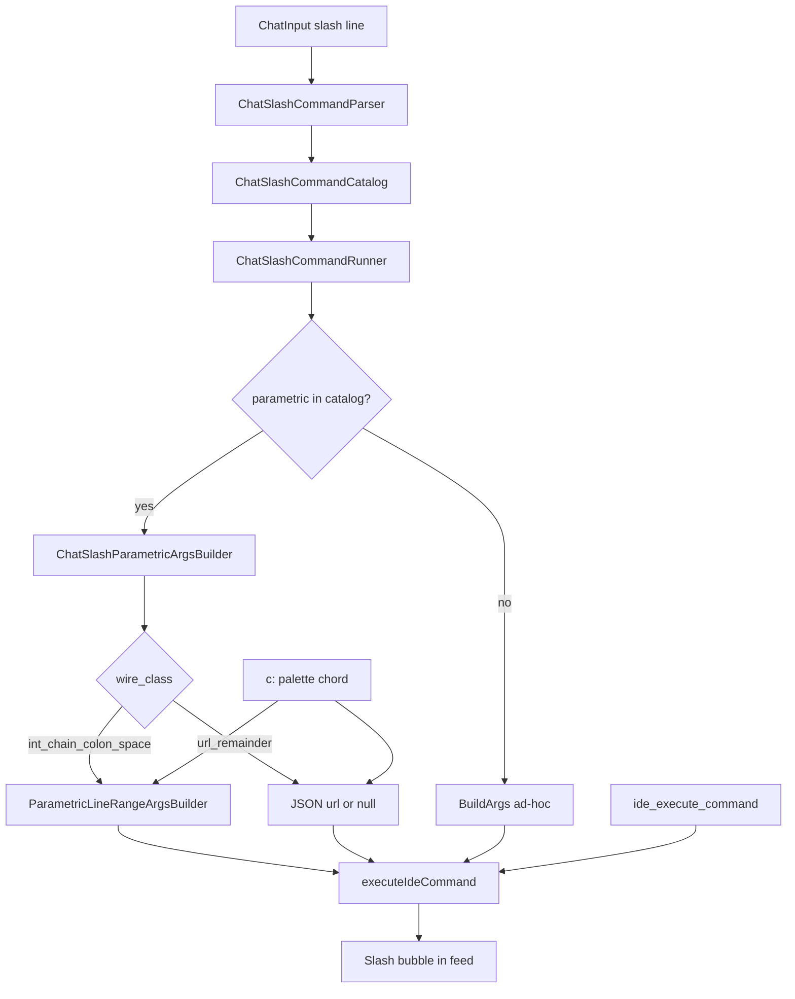

# ADR 0124: Параметрические слэш-команды — полный паритет каталога IML в Intercom

**Статус:** Accepted · Implemented  
**Дата:** 2026-05-17  
**Обновлено:** 2026-05-17 — расширение ADR до полного описания фичи (каталог, парсер, binders, TOML, тесты).

## Связанные ADR

| ADR | Роль |
|-----|------|
| [0119](0119-chat-slash-commands-intercom-surface.md) | Базовый контур slash в `ChatInput` (парсер, каталог, autocomplete, local execution) — **этот ADR — надстройка для IML-параметрики** |
| [0109](0109-declarative-parametric-melody-catalog-toml-and-code-binders.md) | `melody_shape`, `tail_signature`, `wire_class`, binders без поля `binder` в TOML |
| [0081](0081-parametric-intent-melodies-editor-line-ranges.md) | Семантика диапазона строк редактора (1-based, inclusive) |
| [0111](0111-editor-linenumber-linerange-value-objects.md) | `LineNumber` / `LineRange` |
| [0030](0030-command-ids-hotkeys-and-ui-registry-layers.md) | Канон `command_id` |
| [0120](0120-primary-work-surface-intercom-or-editor.md) | Intercom как CLI сессии |
| [0060](0060-keyboard-chord-stack-fms-tactical-strategic.md) | Melody `c:` / CascadeChord |
| [0108](0108-web-ai-portal-host-object-tools-bridge.md) | `show_web_ai_portal_page` |
| [0125](0125-slash-workspace-file-commands-and-dynamic-completion.md) | Workspace/file slash и dynamic completion — **ортогонально** параметрике этого ADR |

### Вне ADR

| Документ | Роль |
|----------|------|
| [intent-melody-language-v1.md](../intent-melody-language-v1.md) | IML v1/v2; slash — отдельная грамматика `/` |
| [`IntentMelody/intent-catalog.toml`](../../IntentMelody/intent-catalog.toml) | command-first: melody + slash на одном `command_id` |
| [MCP-PROTOCOL.md](../MCP-PROTOCOL.md) | `ide_execute_command` — тот же wire JSON |

## Резюме

Фича **«параметрический slash»** закрывает разрыв между **IML v2** (палитра `c:`, аккорды) и **unified command line** Intercom ([0119](0119-chat-slash-commands-intercom-surface.md)):

1. **Любая** команда с `melody_shape = parametric` в `intent-catalog.toml` может иметь slash-форму с **тем же** `command_id` и **теми же** JSON-args, что melody и MCP.
2. Разбор хвоста slash (**ArgsTail**) диспетчеризуется по **`wire_class`** из каталога — не по отдельному `switch (command_id)` в Runner.
3. Slash-пути (**`/editor line select`**, **`/portal open`**) задаются **вручную** в TOML (`help`, `group`) для autocomplete; пути **не** выводятся автоматически из `tail_signature`.
4. Bundled v1 покрывает **все три** параметрических корня каталога; добавление четвёртого — по чеклисту [§8](#adr0124-p8).

**Не входит в фичу:** автогенерация slash-путей, короткие мнемоники `/els`, новые `wire_class` без ветки в `ChatSlashParametricArgsBuilder`.

**Связанный, но другой слой:** slash с **произвольным текстовым хвостом** для команд IML `simple` — см. [§ Контекст](#adr0124-ctx-layers).

---

## Контекст

<a id="adr0124-ctx-layers"></a>

### Три слоя «параметра» в Intercom ([0119](0119-chat-slash-commands-intercom-surface.md))

| Слой | IML в каталоге | Примеры slash | Где удобно | Сборка args |
|------|----------------|---------------|------------|-------------|
| **A. Structured parametric** | `melody_shape = parametric`, `wire_class` | `/editor line select 5 10`, `/portal open url` | Чат; палитра `c:els` / `c:wai` | **`ChatSlashParametricArgsBuilder`** → те же binders, что melody |
| **B. Free-text tail (prose)** | `melody_shape = simple`, тот же `command_id` | `/git commit "feat: test"`, `/search pattern`, `/spine set focus` | **Преимущественно чат** — пробелы, кавычки, длинный текст | `BuildArgs` по `command_id`; хвост = одно поле (`message`, `pattern`, …) |
| **C. Без хвоста** | simple | `/git status`, `/overview` | Чат, autocomplete | только `command_id` |

**Про `/git commit`:** в каталоге это **`git_commit`** + melody **`c:gc`** ([`intent-catalog.toml`](../../IntentMelody/intent-catalog.toml)) — это **IML-команда**, не «чужая» slash. Но форма хвоста — **слой B**, не A: в TOML нет `wire_class` для произвольного текста коммита, потому что **аккорд/Chord** с многословным сообщением неудобен (пробелы, кавычки, таймаут цепочки). В **чате** слой B как раз «огонь»: `/git commit feat: test` или `/git commit "feat: test"` — весь ArgsTail → `message` (кавычки снимаются, [`ChatSlashArgsTail`](../../Features/Chat/ChatSlashArgsTail.cs)).

Путаница «почему не полная параметрика» — смешение **A** и **B**. **Полная параметрика (A)** = все записи `melody_shape = parametric` в TOML. **Git commit** намеренно в **B** до появления, например, `text_remainder` в [0109](0109-declarative-parametric-melody-catalog-toml-and-code-binders.md) и осознанного chord UX.

### Каталог на сегодня (bundled)

| `command_id` | Melody | `wire_class` | `tail_signature` (сокращ.) |
|--------------|--------|--------------|---------------------------|
| `select` | `c:els` | `int_chain_colon_space` | `<start:ln>:<end:ln>` |
| `apply_edit` | `c:eld` | `int_chain_colon_space` | то же (удаление через `new_text=""`) |
| `show_web_ai_portal_page` | `c:wai` | `url_remainder` | `<url:url>` |

Других `parametric` корней в bundled `intent-catalog.toml` **нет** — фича считается **полной** относительно каталога, а не относительно всех возможных будущих wire.

---

## Проблема

1. **Разрыв входов:** оператор в Intercom не может выделить/удалить строки или открыть портал по URL без палитры или `c:`.
2. **Дублирование binders:** без ADR каждая slash-команда тянет свой парсер колонок/URL в `ChatPanelViewModel`.
3. **Парсер [0119 §4](0119-chat-slash-commands-intercom-surface.md#adr0119-p4):** путь `/editor line select` — **три** токена namespace, не два.
4. **Discoverability:** без записи в TOML slash не попадает в autocomplete ([0119 §6](0119-chat-slash-commands-intercom-surface.md#adr0119-p6)).

---

## Решение

<a id="adr0124-p1"></a>

### 1. Инварианты фичи

| # | Инвариант |
|---|-----------|
| I1 | Slash-параметрика **только** для `command_id`, у которого в каталоге есть ровно один parametric melody-корень (`TryGetParametricRootByCommandId`). |
| I2 | JSON-args для slash **идентичны** melody/MCP для того же `command_id` (те же binders). |
| I3 | Ошибки валидации (файл не открыт, диапазон за файлом) — **в пузыре слэш-команды**, не silent no-op. |
| I4 | Нераспознанный `/…` **не** уходит агенту ([0119](0119-chat-slash-commands-intercom-surface.md)). |
| I5 | Короткие slash-алиасы (`/els`) — **запрещены**; читаемые пути + autocomplete. |

<a id="adr0124-p2"></a>

### 2. Контур исполнения

```text
ChatInput (строка с /)
  → ChatSlashCommandParser
       flat | namespace+action | namespace+action+subAction (editor line)
  → ChatSlashCommandCatalog.TryResolve(slash path → SlashRouteEntry)
  → ChatSlashCommandRunner
       if TryGetParametricRootByCommandId(command_id):
         ChatSlashParametricArgsBuilder(argsTail, wire_class, ChatSlashEditorContext)
       else:
         BuildArgs (ad-hoc)
  → executeIdeCommand(command_id, args)  // тот же мост, что MCP
  → пузырь slash в ленте: success / DetailText (ошибка binder)
```

**Контекст редактора** (`ChatSlashEditorContext`): `CurrentFilePath`, `EditorText` — из `ChatPanelViewModel` (`_getCurrentFilePath`, `_getEditorText`). Нужен для `int_chain_colon_space`; для `url_remainder` передаётся, но не обязателен.

<a id="adr0124-p3"></a>

### 3. Диспетчеризация по `wire_class`

Реализация: [`ChatSlashParametricArgsBuilder`](../../Features/Chat/ChatSlashParametricArgsBuilder.cs).

| `wire_class` | `TailWireKind` | Условие | Slash ArgsTail | Binder / JSON |
|--------------|----------------|---------|----------------|---------------|
| `int_chain_colon_space` | `DelimitedSlots` | 2 numeric slots, line (`:ln`) | см. [§4](#adr0124-p4) | `ParametricLineRangeArgsBuilder` → `file_path`, `start_line`, `start_column`, `end_line`, `end_column` (+ `new_text` для delete) |
| `url_remainder` | `SingleRemainder` | URL slot в signature | весь хвост = URL; **пустой допустим** | `null` args или `{ "url": "…" }` |

Неподдержанная комбинация `wire_class` + signature → ошибка: *«Форма wire_class … для slash ещё не поддержана»* (явный сигнал разработчику добавить ветку).

**Связь с melody:** для line-range строится синтетический `ParametricIntentMelody.ParsedLineRange` с `Slug` из каталога (`els`/`eld`), чтобы не дублировать логику колонок.

<a id="adr0124-p4"></a>

### 4. Грамматика ArgsTail: диапазон строк

После резолва пути (`/editor line select` или `delete`) остаётся **только** числовой хвост (без повторения slug):

| Ввод | `start` | `end` |
|------|---------|-------|
| `5` | 5 | 5 |
| `5 10` | 5 | 10 |
| `5:10` | 5 | 10 |
| `5;10` | 5 | 10 |

Правила:

- Номера **1-based**, **inclusive** ([0081](0081-parametric-intent-melodies-editor-line-ranges.md)).
- `end < start` → ошибка.
- Вне файла / нет `file_path` → ошибка из `ParametricLineRangeArgsBuilder`.
- Пустой хвост → ошибка с подсказкой формата.

<a id="adr0124-p5"></a>

### 5. Грамматика ArgsTail: URL (`url_remainder`)

Путь: **`/portal open`** → `show_web_ai_portal_page`.

| Ввод | Args |
|------|------|
| `/portal open` | `null` (страница по умолчанию, как `c:wai`) |
| `/portal open example.com` | `{ "url": "example.com" }` |
| `/portal open https://host/path` | весь хвост после `open ` — одна строка URL |

Пробелы в URL сохраняются в хвосте (редкий случай); нормализация схемы — как у melody ([0108](0108-web-ai-portal-host-object-tools-bridge.md)).

<a id="adr0124-p6"></a>

### 6. Парсер slash: уровни токенов

Расширение [`ChatSlashCommandParser`](../../Features/Chat/ChatSlashCommandParser.cs):

| Форма | `Shape` | Поля parse | Пример |
|-------|---------|------------|--------|
| `/overview` | Flat | `Head=overview` | Intercom |
| `/build run` | NamespaceAction | `Head`, `Action`, `ArgsTail` | IDE |
| `/editor line select 5 10` | NamespaceAction + **SubAction** | `Head=editor`, `Action=line`, `SubAction=select`, `ArgsTail=5 10` | **только editor line** |

Резолв каталога для SubAction:

```text
slashPath = "/" + Head + " " + Action + " " + SubAction
// → "/editor line select"
```

**Ограничение:** `SubAction` для `editor line` — только `select` | `delete` (маппинг на `select` / `apply_edit` через разные slash-пути в TOML, не через один путь с глаголом в хвосте).

<a id="adr0124-p7"></a>

### 7. Каталог TOML (`intent-catalog.toml`)

На каждый parametric `[[command]]`:

```toml
[[command]]
command_id = "select"
melody_slug = "els"
melody_shape = "parametric"
# … melody_* …

[[command.form.slash]]
path = "/editor line select"
help = "Выделить строки …"
group = "Editor"
```

Правила:

- **`path`** — ключ в `IntentSlashCatalog.SlashRoutes` (case-insensitive).
- **`help`** / **`group`** — autocomplete и `/help` ([0119](0119-chat-slash-commands-intercom-surface.md)).
- Статические `[command.form.slash.args]` (`page`, `surface`) — для **не-параметрических** slash (MFD); параметрика несёт args в **ArgsTail**, не в TOML-args.

Обнаружение parametric slash в Runner: **не** флаг в TOML, а `IntentMelodyCatalog.TryGetParametricRootByCommandId(command_id)`.

<a id="adr0124-p8"></a>

### 8. Чеклист: новая parametric-команда

1. **TOML melody:** `melody_shape = parametric`, `tail_signature`, `wire_class`, согласованный с `[[tail_wire_class]]`.
2. **Binder в коде** ([0109](0109-declarative-parametric-melody-catalog-toml-and-code-binders.md)): melody-путь (`ParametricIntentMelody` / dedicated builder).
3. **Ветка в `ChatSlashParametricArgsBuilder`** для этого `wire_class` (если новый — ADR-апдейт).
4. **`[[command.form.slash]]`** с читаемым `path` + `help`.
5. **Парсер:** при нестандартной форме пути — расширение `ChatSlashCommandParser` (как SubAction для editor).
6. **Тесты:** `ChatSlashParametricTests` + при необходимости melody tests.
7. **Autocomplete:** `group` / `slash_group` в TOML; сортировка — по группе и `path` без хардкода в C#.

<a id="adr0124-p9"></a>

### 9. UX и ошибки

- Перед отправкой агенту: пузырь slash-команды в ленте ([0119](0119-chat-slash-commands-intercom-surface.md)); статус success/fail.
- `DetailText` при ошибке binder — текст для оператора (напр. «Диапазон выходит за пределы файла»).
- Успех без содержательного JSON — без лишнего «ok» в ленте (как у других slash).

<a id="adr0124-p10"></a>

### 10. Паритет входов (сводная таблица)

| Действие | Melody | Slash | MCP |
|----------|--------|-------|-----|
| Выделить строки 5–10 | `c:els:5:10` | `/editor line select 5 10` | `select` + JSON |
| Удалить строки 3–7 | `c:eld:3:7` | `/editor line delete 3 7` | `apply_edit` + JSON |
| Web AI Portal | `c:wai:` | `/portal open` | `show_web_ai_portal_page` |
| Portal + URL | `c:wai:host` | `/portal open host` | `{ "url": "host" }` |

---

## Ортогональность входов

| Вход | Параметрика редактора / URL |
|------|-----------------------------|
| Палитра `c:` | ✅ каталог + binders |
| CascadeChord | ✅ тот же каталог |
| **Chat slash** | ✅ **эта фича** |
| MCP `ide_execute_command` | ✅ |
| Hotkeys | ❌ (нет line-range в chord по умолчанию) |

---

## Диаграмма



---

## Якоря реализации (Implemented)

| Компонент | Путь | Роль |
|-----------|------|------|
| Каталог lookup | [`IntentMelodyCatalog.cs`](../../Services/IntentMelodyCatalog.cs) | `TryGetParametricRootByCommandId` |
| Slash args | [`ChatSlashParametricArgsBuilder.cs`](../../Features/Chat/ChatSlashParametricArgsBuilder.cs) | ArgsTail → JSON по `wire_class` |
| Editor context | [`ChatSlashEditorContext.cs`](../../Features/Chat/ChatSlashEditorContext.cs) | file + text для line binder |
| Parser SubAction | [`ChatSlashCommandParser.cs`](../../Features/Chat/ChatSlashCommandParser.cs) | `/editor line select|delete` |
| Catalog resolve | [`ChatSlashCommandCatalog.cs`](../../Features/Chat/ChatSlashCommandCatalog.cs) | path + SubAction; порядок из TOML `group` + path |
| Runner | [`ChatSlashCommandRunner.cs`](../../Features/Chat/ChatSlashCommandRunner.cs) | ветка parametric vs ad-hoc |
| VM wiring | [`ChatPanelViewModel.cs`](../../Features/Chat/ChatPanelViewModel.cs) | `ChatSlashEditorContext` delegate |
| TOML | [`IntentMelody/intent-catalog.toml`](../../IntentMelody/intent-catalog.toml) | slash paths + melody |
| Line binder (shared) | [`ParametricLineRangeArgsBuilder.cs`](../../Services/ParametricLineRangeArgsBuilder.cs) | melody + slash |
| Melody entry | [`ParametricIntentMelody.cs`](../../Services/ParametricIntentMelody.cs) | `TryResolveParametricExecution` |
| Тесты | [`ChatSlashParametricTests.cs`](../../CascadeIDE.Tests/ChatSlashParametricTests.cs) | parser, catalog, binders |

---

## Non-goals

- Slash для **всех** `IdeCommands` с любыми args (только каталог `parametric` + ad-hoc список [0119](0119-chat-slash-commands-intercom-surface.md)).
- Автогенерация `[[command.form.slash]]` из `melody_slug` / `tail_signature`.
- Короткие пути `/els`, `/wai` (коллизии, дубль `c:`).
- Универсальный четырёхуровневый парсер `/a b c d` без curated правил.
- Параметрический slash **без** записи в TOML (нет «скрытых» команд).

---

## Отклонённые альтернативы

1. **Per-command binder в Runner** (`switch command_id`) — расходится с [0109](0109-declarative-parametric-melody-catalog-toml-and-code-binders.md); отвергнуто.
2. **`/parametric els 5 10`** — плохой UX в Intercom, дублирует палитру; отвергнуто.
3. **`/editor select 5`** (два уровня) — слабая группировка «line operations»; отвергнуто в пользу `/editor line select`.
4. **`intent_catalog_schema_version = 2`** для раскладки TOML — путаница с **IML v2**; schema файла остаётся **1**.

---

## Критерии приёмки (Definition of Done)

- [x] Все `melody_shape = parametric` в bundled TOML имеют хотя бы один `[[command.form.slash]]`.
- [x] Slash вызывает тот же `command_id` и те же args, что melody (тесты на `select`, `apply_edit`, `show_web_ai_portal_page`).
- [x] Ошибки binder отображаются в пузыре slash.
- [x] Autocomplete видит новые пути (`/portal`, `/editor line …`).
- [x] ADR + ссылка из [0119](0119-chat-slash-commands-intercom-surface.md) и [intent-melody-language-v1.md](../intent-melody-language-v1.md).

---

## История изменений

| Дата | Изменение |
|------|-----------|
| 2026-05-17 | Proposed: slash-паритет для editor line (`/editor line select|delete`). |
| 2026-05-17 | Implemented: `SubAction`, line binder, TOML, тесты. |
| 2026-05-17 | **Фича «полная параметрика каталога»:** `ChatSlashParametricArgsBuilder`, `/portal open`, `TryGetParametricRootByCommandId`; ADR расширен как норматив фичи. |
