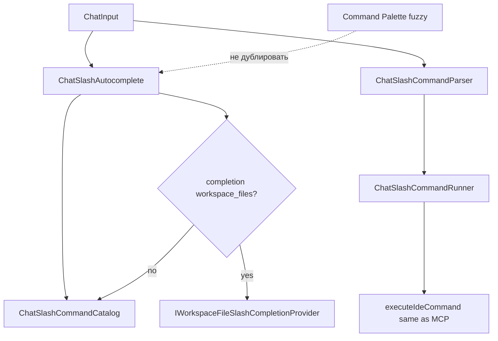

# ADR 0125: Слэш-команды workspace/file — `/file open`, `/solution new`, динамические подсказки

**Статус:** Accepted · Implemented  
**Дата:** 2026-05-18

## Связанные ADR

| ADR | Роль |
|-----|------|
| [0119](0119-chat-slash-commands-intercom-surface.md) | Базовый контур slash в `ChatInput` (парсер, каталог, autocomplete, local execution) |
| [0124](0124-slash-parametric-editor-line-commands.md) | Параметрический slash (`wire_class`, binders); **ортогонален** этому ADR |
| [0107](0107-blank-solution-creation-via-dotnet-new-sln.md) | `dotnet new sln`, `create_new_solution_dialog`; дорожная карта `dotnet new` / `dotnet sln add` |
| [0048](0048-cursor-acp-chat-ide-parity-and-mcp-tool-surface.md) | Workspace: папка без `.sln`, `load_solution`, `open_folder_dialog` |
| [0030](0030-command-ids-hotkeys-and-ui-registry-layers.md) | Канон `command_id`, паритет MCP |
| [0013](0013-command-surface-and-discoverability.md) | Палитра — fuzzy; слэш **дополняет**, не заменяет |
| [0025](0025-sdk-attention-zones-and-capabilities.md) | Нативные диалоги ОС для выбора пути — предпочтительно для «не знаю путь» |
| [0102](0102-data-acquisition-layer-boundary-and-contract.md) | CLI (`IDotnetCommandRunner`) для `dotnet new` / `dotnet sln` — без `Process` в VM |
| [0126](0126-intercom-inspect-slash-and-compact-chrome-status.md) | UX после выбора файла в autocomplete → редактор на MFD/Forward |

### Вне ADR

| Документ | Роль |
|----------|------|
| [intent-melody-language-v1.md](../intent-melody-language-v1.md) | IML `c:so` и др.; slash — отдельная грамматика `/` |
| [`IntentMelody/intent-catalog.toml`](../../IntentMelody/intent-catalog.toml) | Статические `[[command.form.slash]]` |
| [MCP-PROTOCOL.md](../MCP-PROTOCOL.md) | `open_file`, `load_solution`, `create_new_solution_dialog`, … |

## Резюме

Расширить **unified command line** Intercom ([0119](0119-chat-slash-commands-intercom-surface.md)) семейством **workspace / file**:

1. **Статические** slash-маршруты intent-first (`/solution open`, `/file open`, `/solution new`, …) → существующие `command_id` (меню, MCP, палитра).
2. **Динамические подсказки** в autocomplete после пробела — узкий список файлов решения по префиксу пути (не полный fuzzy палитры).
3. **Дорожная карта** для `/solution new console` и родственных команд — через `dotnet new` + `dotnet sln add` ([0107 §6](0107-blank-solution-creation-via-dotnet-new-sln.md#adr0107-vs-parity-cli)), отдельные `command_id` и фазы внедрения.

**Не входит:** замена Solution Explorer, полный fuzzy по репозиторию в слэше, автогенерация тысяч путей в TOML.

---

## Контекст

После [0124](0124-slash-parametric-editor-line-commands.md) в каталоге есть параметрические slash (`/editor line …`, `/portal open`) и слой **B** — произвольный хвост (`/git commit`, `/search`). Для **навигации по workspace** остаётся разрыв:

- `open_file`, `open_solution_dialog`, `create_new_solution_dialog`, `open_folder_dialog`, `load_solution` уже в **IdeCommands** и MCP;
- в Intercom autocomplete их не видно или не хватает **подсказок по файлам** при вводе пути;
- оператор ожидает форму **«как в Slack/CLI»**: `/file open src/Foo.cs`, `/solution new` (далее — шаблон проекта).

Палитра ([0013](0013-command-surface-and-discoverability.md)) остаётся каноном **глобального fuzzy-поиска**; слэш — **сессионный CLI** с иерархией namespace и **опциональной** динамикой только там, где статический каталог бессмысленен.

<a id="adr0125-layers"></a>

### Слои slash для workspace (наследие [0119](0119-chat-slash-commands-intercom-surface.md) / [0124](0124-slash-parametric-editor-line-commands.md))

| Слой | Примеры slash | `command_id` | ArgsTail | Autocomplete |
|------|---------------|--------------|----------|--------------|
| **C. Без хвоста / диалог** | `/solution open`, `/solution new`, `/folder open`, `/file pick` | `*_dialog` | — | Только статический маршрут |
| **B. Путь в хвосте** | `/file open path`, `/solution load path` | `open_file`, `load_solution` | `path` (строка) | Статический маршрут + **динамические** подсказки файлов |
| **A. Parametric** | `/portal open url` | parametric roots | binder | Не для файловых путей в v1 |

**`/file pick`** (или `/file dialog`) — синоним intent «не помню путь» → `open_file_dialog` ([0025](0025-sdk-attention-zones-and-capabilities.md)), без динамики.

---

## Проблема

1. **Discoverability:** команды «Файл» / workspace есть в меню и MCP, но не в контексте `ChatInput`.
2. **Ввод пути вслепую:** без подсказок `/file open` слабее палитры и Solution Explorer.
3. **Риск дублирования:** отдельный парсер путей в VM вместо `command_id` + `BuildArgs` ломает [0030](0030-command-ids-hotkeys-and-ui-registry-layers.md).
4. **Scope creep:** «сделать slash = палитра» нарушает [0119 §8](0119-chat-slash-commands-intercom-surface.md#adr0119-p8) non-goals.

---

## Решение

<a id="adr0125-p1"></a>

### 1. Канонический каталог slash (статика)

Новые и уточнённые маршруты в [`intent-catalog.toml`](../../IntentMelody/intent-catalog.toml) (ручная курация, `help`, `group`):

| Slash path | `command_id` | Help (смысл) | Группа autocomplete |
|------------|--------------|--------------|---------------------|
| `/solution open` | `open_solution_dialog` | Диалог выбора `.sln` / `.slnx` | Workspace |
| `/solution new` | `create_new_solution_dialog` | Новое пустое решение (`dotnet new sln`) | Workspace |
| `/folder open` | `open_folder_dialog` | Открыть папку как workspace | Workspace |
| `/file pick` | `open_file_dialog` | Диалог выбора файла | Файл |
| `/file open` | `open_file` | Открыть файл в редакторе (хвост — путь) | Файл |
| `/solution load` | `load_solution` | Загрузить `.sln` / `.csproj` / каталог по пути (хвост) | Workspace |

**IML-паритет (опционально, не блокер slash):** `c:so` → `/solution open`; новые melody — только при появлении chord UX.

**Именование:** namespace **`file`**, **`solution`**, **`folder`** — читаемые сегменты; без `/fo`, `/sn` ([0119](0119-chat-slash-commands-intercom-surface.md)).

<a id="adr0125-p2"></a>

### 2. Динамические подсказки по файлам

<a id="adr0125-dynamic"></a>

#### 2.1. Когда включается

После успешного разбора строки:

- распознан slash-маршрут с метаданными **`completion = workspace_files`** (см. §3);
- пользователь ввёл **пробел** после полного пути команды (`/file open ` или `/solution load `);
- префикс хвоста (optional) фильтрует список.

До пробела autocomplete показывает только **статические** маршруты ([0119 §6](0119-chat-slash-commands-intercom-surface.md#adr0119-p6)).

#### 2.2. Источник данных

| Источник | Плюсы | Минусы | v1 |
|----------|--------|--------|-----|
| Плоский список из Solution Explorer / `get_solution_files` | Уже есть MCP и VM; пути относительно workspace | Нужен кэш при смене solution | **Да** |
| Hybrid codebase index | Быстрый префиксный поиск | Другая семантика (текст), не «все файлы» | Опционально позже |
| Сканирование диска без solution | Работает без `.sln` | Шум, медленно | **Нет** |

**Кэш:** строить при `LoadSolution` / смене дерева; инвалидировать по событию workspace. Лимит выдачи в popup: **30** записей, сортировка: exact prefix → contains → recently opened (если есть журнал).

#### 2.3. Формат подсказки

Расширение модели autocomplete (не ломая статику):

```csharp
// Концепт — имена уточняются при реализации
public sealed record ChatSlashSuggestion(
    string InsertText,      // полный текст для вставки в поле (путь)
    string SlashPath,       // для группировки: "/file open"
    string Help,            // относительный путь + опционально проект
    string? Group = null);
```

- **`InsertText`:** относительный путь от workspace root, если файл внутри solution; иначе полный путь.
- **`Help`:** кратко: `Features/Chat/ChatSlashCommandCatalog.cs` или `MyApp · Program.cs`.
- Выбор пункта → в поле остаётся `/file open <path>`; **Enter** → runner → `open_file` с нормализованным абсолютным `path`.

#### 2.4. Контур

```text
ChatInput
  → ChatSlashAutocomplete.GetSuggestions(input)
       → статика: ChatSlashCommandCatalog (как сейчас)
       → если route.Completion == workspace_files и есть хвост-префикс:
            IWorkspaceFileSlashCompletionProvider.GetMatches(prefix, limit)
  → Enter → ChatSlashCommandParser + Runner → open_file / load_solution
```

Провайдер живёт в **Features/Chat** или **Features/Workspace** (Application), VM передаёт `Func` / интерфейс с доступом к `SolutionRoots` — без дублирования обхода дерева в Skia.

<a id="adr0125-p3"></a>

### 3. Расширение TOML (метаданные completion)

На `[[command.form.slash]]` добавить опциональное поле (имя зафиксировать при реализации):

```toml
[[command.form.slash]]
path = "/file open"
help = "Открыть файл в редакторе (хвост — путь)."
group = "Файл"
completion = "workspace_files"   # новое: динамика после пробела
```

| Значение `completion` | Поведение |
|----------------------|-----------|
| *(отсутствует)* | Только статический каталог |
| `workspace_files` | Подсказки файлов solution/workspace по префиксу хвоста |

**Не** генерировать строки TOML на каждый файл. Загрузчик (`IntentCatalogLoader`) прокидывает значение в `SlashRouteEntry`.

Для [0124](0124-slash-parametric-editor-line-commands.md) поле **не используется** — там parametric binders, не file list.

<a id="adr0125-p4"></a>

### 4. Семейство `/solution new …` (шаблоны проектов)

Отдельный продуктовый зонтик от «открыть файл». Опирается на [0107](0107-blank-solution-creation-via-dotnet-new-sln.md) и §6 CLI-паритета VS.

#### 4.1. Фазы

| Фаза | Slash (цель) | `command_id` (цель) | CLI / UX |
|------|----------------|---------------------|----------|
| **W1** | `/solution new` | `create_new_solution_dialog` *(есть)* | Диалог `.sln`, `dotnet new sln` |
| **W2** | `/solution new console` | `create_project_in_solution` *(новый)* | `dotnet new console -o …` + `dotnet sln add` |
| **W3** | `/solution new classlib`, `web`, … | тот же или `create_project_from_template` | shortName из `dotnet new list` (курация) |
| **W4** | `/solution new` + интерактивный список шаблонов | обёртка над `dotnet new list` | Autocomplete **шаблонов**, не файлов |

**W1** — статический slash без хвоста (слой C). **W2+** — либо:

- **слой B:** `/solution new console MyApp` → хвост парсится на `template` + `name` (ad-hoc `BuildArgs` в Runner), либо
- **трёхуровневый парсер** `/solution new console` (расширение [0119](0119-chat-slash-commands-intercom-surface.md) — **только** для curated namespace `solution new`, не общий прецедент).

Рекомендация v1 для **W2:** subAction `new` + **четвёртый** токен шаблона в парсере (аналог `editor line select`), whitelist: `console`, `classlib`, `webapi` — без произвольного `dotnet new` shortName в первой итерации.

#### 4.2. Инварианты

| # | Инвариант |
|---|-----------|
| W-I1 | Любое создание проекта идёт через **`IDotnetCommandRunner`**, оркестрация в `Features/Workspace/Application`. |
| W-I2 | Текущее открытое solution **обязательно** для W2+ (иначе понятная ошибка в пузыре slash). |
| W-I3 | Имена slash **не** дублируют короткие IML (`/nc`) — только читаемые сегменты. |
| W-I4 | MCP получает те же `command_id`, что slash (паритет [0008](0008-mcp-contracts-and-testable-infrastructure.md)). |

#### 4.3. Non-goals W-фаз

- Полный каталог `dotnet new list` в autocomplete без курации.
- Замена UI «Add → New Project» из VS.
- NuGet template gallery внутри Intercom.

<a id="adr0125-p5"></a>

### 5. Исполнение args (слой B)

| Slash | Поле JSON | Нормализация хвоста |
|-------|-----------|---------------------|
| `/file open` | `path` | Trim; относительный → абсолютный от workspace root; кавычки optional |
| `/solution load` | `path` | То же; допуск `.sln`, `.csproj`, каталог ([0048](0048-cursor-acp-chat-ide-parity-and-mcp-tool-surface.md)) |

Ошибки (`file not found`, outside workspace) — **DetailText** в пузыре slash ([0124 I3](0124-slash-parametric-editor-line-commands.md#adr0124-p1)).

---

## Диаграмма



---

## Якоря реализации (план)

| Компонент | Назначение |
|-----------|------------|
| [`intent-catalog.toml`](../../IntentMelody/intent-catalog.toml) | Статические пути + `completion = workspace_files` |
| [`SlashRouteEntry`](../../Services/SlashRouteEntry.cs) | Поле `Completion` / enum |
| [`IntentCatalogLoader`](../../Services/IntentCatalogLoader.cs) | Чтение `completion` |
| [`ChatSlashAutocomplete`](../../Features/Chat/ChatSlashAutocomplete.cs) | Ветка динамики |
| `IWorkspaceFileSlashCompletionProvider` *(новый)* | Кэш + filter по префиксу |
| [`ChatSlashCommandRunner`](../../Features/Chat/ChatSlashCommandRunner.cs) | `open_file`, `load_solution` в `BuildArgs` |
| `BlankSolutionCreator` / новый `ProjectTemplateCreator` | W2+ ([0107](0107-blank-solution-creation-via-dotnet-new-sln.md)) |
| Тесты | Статика каталога; provider filter; runner path normalize |

---

## Non-goals

- Fuzzy-поиск **всех** команд и файлов репозитория в slash (остаётся палитра).
- Подсказки для **каждого** slash с хвостом (только `workspace_files` в v1).
- Автогенерация slash из дерева solution в TOML.
- `/f`, `/sol` — короткие алиасы.
- Открытие файлов **вне** workspace без предупреждения (можно позже политикой безопасности).

---

## Отклонённые альтернативы

1. **Только `/open` без namespace** — коллизии с Intercom `/open` (thread); отвергнуто.
2. **Динамика через отдельный символ `@file`** — второй язык в поле; отвергнуто в пользу `completion` на маршруте.
3. **Список файлов из ripgrep `--files`** — тяжелее и не совпадает с Solution Explorer; отвергнуто для v1.
4. **`/solution new` сразу с полным `dotnet new list`** — шум и scope; отвергнуто, фазы W1→W4.

---

## Критерии приёмки

### Фаза F (file + solution static + dynamic)

- [x] В TOML: `/file open`, `/file pick`, `/solution open`, `/solution new`, `/folder open`, `/solution load` (где ещё нет).
- [x] `completion = workspace_files` на `/file open` и при необходимости `/solution load`.
- [x] Autocomplete после `/file open ` показывает файлы по префиксу (≤30).
- [x] Enter на `/file open Features/Foo.cs` вызывает `open_file` с тем же эффектом, что MCP.
- [x] Тесты: provider filter, runner normalization, catalog resolve.

### Фаза W2 (`/solution new console`)

- [x] Новый `command_id` + оркестратор `dotnet new` + `dotnet sln add`.
- [x] Slash + тесты; MCP-запись в ProtocolDocGen.

---

## История изменений

| Дата | Изменение |
|------|-----------|
| 2026-05-18 | Proposed: workspace/file slash, dynamic file completion, дорожная карта `/solution new console`. |
| 2026-05-18 | Accepted · Implemented: F + W2 (console/classlib/webapi), `create_project_in_solution`, `WorkspaceFileSlashCompletionProvider`. |
