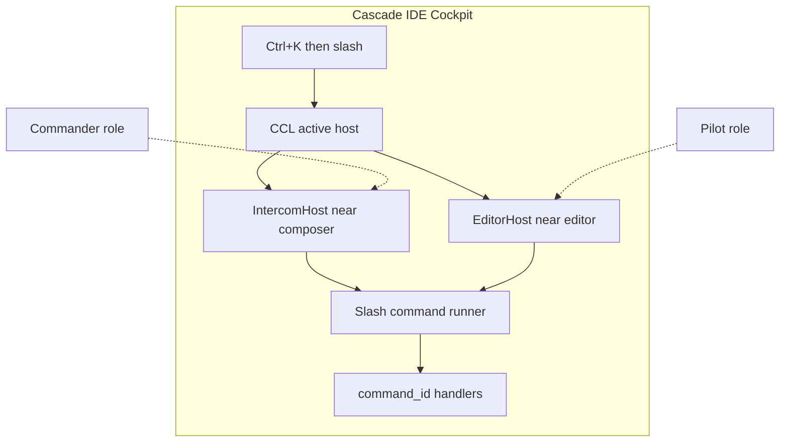

# ADR 0138: Cockpit Command Line — параметрический CLI для Commander и Pilot

**Статус:** Proposed (уточнено автором 2026-05-20)  
**Дата:** 2026-05-20

## Связанные ADR

| ADR | Роль |
|-----|------|
| [0133](0133-commander-cockpit-shared-attention-model-and-instrument-deck.md) | Роли Commander (Intercom-first) и Pilot (редактор-first) |
| [0120](0120-primary-work-surface-intercom-or-editor.md) | Forward = Intercom **или** Editor |
| [0119](0119-chat-slash-commands-intercom-surface.md) | Слэш → `command_id`; каталог; autocomplete |
| [0060](0060-keyboard-chord-stack-fms-tactical-strategic.md) | CascadeChord (Ctrl+K): тактика, короткий таймаут — **не** длинный CLI |
| [0124](0124-slash-parametric-editor-line-commands.md) | `/editor line select` — contiguous `L`, `L R`, `L:R` |
| [0136](0136-intercom-feed-gutter-and-slash-namespace.md) | Gutter ordinals; `/intercom message select` |
| [0137](0137-intercom-message-code-correspondence.md) | Contiguous relate/find; disjoint relate — не MVP |
| [0072](0072-chat-topic-cards-intent-melody-keyboard-contract.md) | Chat navigation intents; chord ≠ CLI |
| [0013](0013-command-surface-and-discoverability.md) | Палитра, `command_id`, discoverability |
| [0030](0030-command-ids-hotkeys-and-ui-registry-layers.md) | Реестр команд |

## Резюме

**Cockpit Command Line (CCL)** — **общая** для всего primary workplace полоса полноценного CLI (slash + autocomplete + сложный синтаксис), **не привязанная только к Intercom**.

| Роль ([0133](0133-commander-cockpit-shared-attention-model-and-instrument-deck.md)) | Primary Forward | Сложные команды |
|--------|-----------------|-----------------|
| **Commander / Lead** | Intercom | Уже «дома» в ленте + composer; CCL усиливает: длинный `/intercom …`, превью, без путаницы с репликой агенту |
| **Pilot** | Редактор | Аккорды для тактики; **сложный** параметрический ввод (напр. несколько диапазонов строк) — **в CCL**, не в chord overlay |

**Единый вход:** **CascadeChord → `/`** (Ctrl+K, затем `/`) переводит фокус в **CCL** независимо от того, открыт Intercom или Editor. Дальше — полный ввод, в т.ч. `[3;5] [8;15] [20]` и превью эффекта **до** применения.

**Не цель:** заменить палитру, Melody `c:` или тактические буквы chord; дублировать MCP.

---

## Контекст (формулировка автора)

### Две роли — одна IDE, разный фокус Forward

**Commander** сидит в **Intercom**: ему нужна богатая, легко расширяемая **командная поверхность** — autocomplete, иерархия `/intercom …`, сложные хвосты (`relate`, `find`, multi-select сообщений). Смешивать это с полем «сообщение агенту» неудобно ([0119](0119-chat-slash-commands-intercom-surface.md)).

**Pilot** сидит в **редакторе**: основной поток — код и **короткие аккорды** ([0060](0060-keyboard-chord-stack-fms-tactical-strategic.md)). Но часто нужна **сложная** команда, которую физически не ввести в chord window, например выделить в файле:

```text
[3;5] [8;15] [20]
```

→ строки **3–5** включительно **и** **8–15** включительно **и** строка **20** (disjoint multi-range).

Тот же класс задач у Commander для **gutter** сообщений:

```text
/intercom message select [3;5] [8;15] [20]
```

→ сообщения #3–#5, #8–#15 и #20.

**Вывод:** Command Line — **слой кокпита**, а не «фича Intercom». Intercom получает **экземпляр** CCL у composer; Editor — **экземпляр** у нижнего края Forward (или dock-adjacent). **Ctrl+K `/`** открывает **тот же режим** везде.

### Почему не Chord и не только Composer

| Поверхность | Ограничение |
|-------------|-------------|
| **Chord overlay** | Короткий таймаут второй клавиши; Melody — короткие токены, не `[3;5] [8;15] [20]` |
| **Composer** (Intercom) | Enter = отправить агенту; черновик портится длинным slash |
| **Палитра** | Fuzzy discoverability, не замена параметрического REPL у активной зоны |

---

## Решение 1: Cockpit Command Line (CCL)

### Термины

| Термин | Значение |
|--------|----------|
| **CCL** | Cockpit Command Line — режим полноценного slash-CLI в Forward |
| **Host** | Конкретная полоса UI: `IntercomHost` (над/под Skia composer) · `EditorHost` (над статусной зоной редактора / dock) |
| **Chord handoff** | Ctrl+K → `/` завершает chord-сессию и фокусирует CCL активного host |

### Инварианты

1. **Один parser, один runner** — `ChatSlashCommandParser` + существующие runners для Intercom; для Editor — те же `command_id` ([0124](0124-slash-parametric-editor-line-commands.md), [0119](0119-chat-slash-commands-intercom-surface.md), палитра).
2. **Контекст host** задаёт **подсказки по умолчанию** (префикс `/intercom` vs `/editor`), но **не запрещает** команды другой зоны, если оператор явно набрал полный путь.
3. **Отдельный буфер** — не `ComposerText`, не `CascadeChordOverlayInputText`.
4. **Enter** = выполнить (после опционального preview); **Esc** = закрыть CCL без побочных эффектов на черновик сообщения / выделение редактора до Apply.

### Размещение host (предложение)

| Host | Когда виден | Позиция |
|------|-------------|----------|
| **IntercomHost** | `PrimaryWorkSurface == Intercom` (Commander preset) | Над composer ленты (по умолчанию): команда → результат в ленте ниже |
| **EditorHost** | `PrimaryWorkSurface == Editor` (Pilot preset) | Над нижним краем Forward editor / под HUD — уточнить в макете [0120](0120-primary-work-surface-intercom-or-editor.md) |

Оба host могут существовать в layout, но **активен** один; chord `/` фокусирует host, соответствующий текущему Forward.



---

## Решение 2: Chord `Ctrl+K` → `/` (глобальный handoff)

| Шаг | Поведение |
|-----|-----------|
| 1 | **CascadeChord** (Ctrl+K) |
| 2 | Вторая клавиша **`/`** |
| 3 | Chord overlay **закрывается** (таймаут снят) |
| 4 | Открывается **CCL** активного Forward host: `/`, фокус, autocomplete |
| 5 | Пользователь вводит произвольную команду (в т.ч. multi-range) |

`command_id` (рабочее имя): **`cockpit.open_command_line`** — не `intercom.*`-only.

**Отклонено:** набор `[3;5] [8;15] [20]` внутри chord HUD ([0060](0060-keyboard-chord-stack-fms-tactical-strategic.md)).

---

## Решение 3: Параметрические multi-range (`[L;R] …`)

### Единый микросинтаксис сегментов (предложение)

Сегмент в **квадратных скобках**; внутри — contiguous диапазон с **`;`** между границами (включительно):

| Сегмент | Разбор |
|---------|--------|
| `[3;5]` | 3, 4, 5 |
| `[20]` | только 20 |
| `[8;15]` | 8…15 |

Список сегментов — **через пробел** (как перечисление интервалов):

```text
[3;5] [8;15] [20]
```

### Применение по домену

| Домен | Пример CCL | Эффект |
|-------|------------|--------|
| **Editor lines** | `/editor line select [3;5] [8;15] [20]` | Multi-range selection / highlight в активном файле ([0124](0124-slash-parametric-editor-line-commands.md) — расширение) |
| **Intercom gutter** | `/intercom message select [3;5] [8;15] [20]` | Multi-select сообщений в detail-ветке ([0136](0136-intercom-feed-gutter-and-slash-namespace.md) — расширение) |

**Паритет с [0124](0124-slash-parametric-editor-line-commands.md):** legacy формы `5 10`, `5:10` остаются для одного contiguous сегмента; **`[a;b]`** — канон для явного сегмента; несколько сегментов — повтор скобок.

**Связь с [0137](0137-intercom-message-code-correspondence.md):** **relate** / event log в MVP — **один contiguous** диапазон (`3:5 relate …`). Multi-segment `[3;5] [8;15]` для **select/highlight** — этот ADR; **relate** на disjoint — отдельная фаза / отдельное решение.

---

## Решение 4: Preview перед применением

Для сложных команд CCL показывает **превью ожидаемого эффекта** до commit (Enter второй раз или явная кнопка Apply — деталь UX в фазе B).

| Пример команды | Превью (иллюстрация) |
|----------------|----------------------|
| `/editor line select [3;5] [8;15] [20]` | Подсветка ghost/рамкой диапазонов в редакторе; текст: «Строки: 3–5, 8–15, 20 (17 строк)» |
| `/intercom message select [3;5] [8;15] [20]` | Подсветка строк ленты #3…#5, #8…#15, #20; «Активно: #20» |

**Режимы (фазы):**

| Фаза | Preview |
|------|---------|
| **A** | Только текстовый summary под строкой CCL (низкая стоимость) |
| **B** | Визуальный ghost highlight в editor / feed |
| **C** | «Dry-run» без мутации + Apply / Enter |

Инвариант: preview **не** меняет selection buffer / не пишет event log до Apply.

---

## Ортогональность входов (обновлённая)

| Вход | Commander | Pilot | Сложный синтаксис |
|------|-----------|-------|-------------------|
| **Chord** (буква) | next/prev topic, тактика | save, debug, … | **Нет** |
| **Chord `/`** | → CCL IntercomHost | → CCL EditorHost | Handoff |
| **CCL** | `/intercom …` | `/editor …` | **Да** |
| **Composer** | prose агенту | — | Короткий slash опционально |
| **Палитра / `c:`** | discoverability | discoverability | Средний |
| **MCP** | полные args | полные args | **Да** |

---

## Принятые решения (по уточнению автора)

| # | Решение |
|---|---------|
| **D1** | CCL — **кокпит-wide**, не только Intercom |
| **D2** | **Ctrl+K `/`** — единый вход в CCL для Commander и Pilot |
| **D3** | Сложные disjoint диапазоны — синтаксис **`[a;b]`** сегментов, несколько сегментов через пробел |
| **D4** | Pilot получает тот же CLI у редактора; chord остаётся для короткой тактики |
| **D5** | Preview перед apply — **желательная** часть дизайна CCL (фаза A текст → B визуал) |

---

## Позиция и обоснование

CCL — не «ещё одна фича Intercom», а **слой между chord и палитрой**: локальный REPL **активной зоны внимания** (Forward). Три типа ввода остаются ортогональными:

| Ввод | Намерение | Договорённость | Реплика |
|------|-----------|----------------|---------|
| **Chord** (буква) | тактика «сейчас» | короткий `command_id` | — |
| **CCL** (`Ctrl+K` → `/`) | параметрика, сложный хвост | полный slash + preview | — |
| **Composer** | — | короткий slash опционально | prose агенту |

**Почему согласовано с кокпитом**

- [0133](0133-commander-cockpit-shared-attention-model-and-instrument-deck.md): Commander и Pilot — preset’ы **одного** workplace; им нужны разные дефолты Forward, но **одна** механика сложных команд и **один** muscle memory (`Ctrl+K` → `/`).
- [0060](0060-keyboard-chord-stack-fms-tactical-strategic.md): аккорд не масштабируется на микро-язык `[3;5] [8;15] [20]` — таймаут и Melody нечитаемы; handoff в CCL сохраняет chord «коротким».
- [0119](0119-chat-slash-commands-intercom-surface.md): composer + Enter = агент; длинный slash портит черновик — CCL даёт **второй буфер** без дублирования parser/runner.
- [0137](0137-intercom-message-code-correspondence.md): multi-segment **select/highlight** (этот ADR) отделён от disjoint **relate** в event log (не MVP).

**Риски (принять осознанно)**

| Риск | Смягчение |
|------|-----------|
| Два host UI (Skia + Avalonia) | Общая VM/сессия; один parser; UI только host-specific chrome |
| Третий буфер в голове (chord / CCL / composer / палитра) | Chord help: «`/` → command line»; autocomplete в CCL |
| Preview на больших файлах | Лимит строк в ghost; фаза A — только текст |
| Relate на disjoint ranges | Не смешивать с CCL v1; отдельное решение после 0137 MVP |

**Рекомендуемый порядок внедрения**

1. CCL shell + `cockpit.open_command_line` + chord `/` (хотя бы **EditorHost** для Pilot).
2. `ParametricSegmentListParser` + `/editor line select […]` + текстовый preview.
3. IntercomHost + `/intercom message select […]` + multi-highlight ленты.
4. Ghost preview (фаза B); Commander polish; опционально disjoint relate.

---

## Набросок API (реализация)

Черновик контрактов для фазы A. Имена и namespace — ориентир; точное размещение файлов — при имплементации. **Не** дублировать `ChatSlashCommandParser` / `ChatSlashCommandRunner` — CCL **переиспользует** их.

### Размещение (предложение)

| Слой | Файл / тип | Роль |
|------|------------|------|
| Domain | `Features/Cockpit/CockpitCommandLineHostKind.cs` | `Intercom` \| `Editor` |
| Session | `Features/Cockpit/ICockpitCommandLineSession.cs` | буфер, preview, commit |
| VM | `ViewModels/CockpitCommandLineViewModel.cs` | binding для обоих host |
| Parse | `Features/Chat/ParametricSegmentListParser.cs` | `[a;b]` … → `IReadOnlyList<IntRange>` |
| Wiring | `MainWindowViewModel` + chord handler | `cockpit.open_command_line` |

### `CockpitCommandLineHostKind`

```csharp
public enum CockpitCommandLineHostKind
{
    Intercom,
    Editor,
}
```

### `ICockpitCommandLineSession`

Единая сессия на главное окно; **активный host** следует за `PrimaryWorkSurface` ([0120](0120-primary-work-surface-intercom-or-editor.md)), пока CCL открыт.

```csharp
public interface ICockpitCommandLineSession
{
    bool IsOpen { get; }
    CockpitCommandLineHostKind ActiveHost { get; }

    string BufferText { get; set; }
    int CaretIndex { get; set; }

    /// <summary>Текстовое превью (фаза A); null если команда не распознана или preview выключен.</summary>
    string? PreviewSummary { get; }

    /// <summary>Опционально: сегменты для ghost highlight (фаза B).</summary>
    IReadOnlyList<IntRange>? PreviewSegments { get; }

    /// <summary>Ctrl+K → / или palette: cockpit.open_command_line.</summary>
    void Open(CockpitCommandLineHostKind? host = null, string initialText = "/");

    void Close(); // Esc — без commit

    /// <summary>Пересчитать preview при изменении BufferText (debounced).</summary>
    void RefreshPreview();

    /// <summary>Enter: parse → runner → side effects; затем Close или очистка буфера.</summary>
    Task<CockpitCommandLineCommitResult> TryCommitAsync(CancellationToken cancellationToken = default);
}

public readonly record struct CockpitCommandLineCommitResult(
    bool Handled,
    bool Success,
    string? UserMessage);
```

**Инварианты сессии**

- `BufferText` **≠** `ComposerText` / `ChatInput` / `CascadeChordOverlayInputText`.
- `Close()` не вызывает handlers; не трогает selection/editor/event log.
- `TryCommitAsync` делегирует в существующий `ChatSlashCommandRunner.TryRunAsync(BufferText)` ([0119](0119-chat-slash-commands-intercom-surface.md)); host влияет только на **default autocomplete prefix**, не на whitelist команд.

### Chord handoff

```csharp
// IdeCommands / chord registry
public const string OpenCommandLine = "cockpit.open_command_line";

// MainWindowViewModel (псевдокод)
void OnChordSlash()
{
    CascadeChord.EndSession();
    var host = PrimaryWorkSurface == PrimaryWorkSurfaceKind.Intercom
        ? CockpitCommandLineHostKind.Intercom
        : CockpitCommandLineHostKind.Editor;
    CommandLineSession.Open(host, initialText: "/");
}
```

### `ParametricSegmentListParser`

Расширение `ChatSlashParametricArgsBuilder.TryParseLineRangeTail` (один contiguous сегмент) → список сегментов в скобках.

```csharp
public readonly record struct IntRange(int Start, int End); // inclusive, 1-based

public static class ParametricSegmentListParser
{
    /// <summary>
    /// Разбор хвоста args: <c>[3;5] [8;15] [20]</c> или legacy один сегмент
    /// (<c>3:5</c>, <c>3 5</c>, <c>5</c>) как один <see cref="IntRange"/>.
    /// </summary>
    public static bool TryParse(
        string? argsTail,
        out IReadOnlyList<IntRange> segments,
        out string error);

    public static string FormatSummary(IReadOnlyList<IntRange> segments, string unitLabel);
    // unitLabel: "строки" | "сообщения"
}
```

**Потребители**

| Команда | После parse |
|---------|-------------|
| `/editor line select …` | `EditorLineSelectHandler` — multi-range selection |
| `/intercom message select …` | `ChatSlashIntercomHandlers` — multi-highlight + active ordinal = последний сегмент |

Preview: `FormatSummary` → `PreviewSummary`; `PreviewSegments` → ghost (фаза B).

### Preview pipeline (фаза A)

```csharp
internal static class CockpitCommandLinePreviewBuilder
{
    public static bool TryBuild(
        string bufferText,
        CockpitCommandLineHostKind host,
        out string? summary,
        out IReadOnlyList<IntRange>? segments);
}
```

Логика: `ChatSlashCommandParser.TryParse` → если action известен и tail содержит segment syntax → summary без мутации VM.

### TOML ([cockpit.command_line]) — черновик

```toml
[cockpit.command_line]
preview_enabled = true
preview_mode = "text"   # "text" | "ghost" (фаза B)
intercom_host = "above_composer"  # Q1
```

### Критерии «API готов к фазе A»

1. `ICockpitCommandLineSession` подключён к IntercomHost и EditorHost (хотя бы один видимый).
2. `ParametricSegmentListParser.TryParse` покрыт unit-тестами (наследие форм из [0124](0124-slash-parametric-editor-line-commands.md) + bracket segments).
3. `TryCommitAsync` → `ChatSlashCommandRunner` без форка parser.
4. `RefreshPreview` не меняет editor/feed до commit.

---

<a id="adr0138-open-questions"></a>

## Открытые вопросы

| # | Вопрос |
|---|--------|
| **Q1** | IntercomHost **над** или **под** composer? |
| **Q2** | Slash в composer Intercom оставляем для коротких команд? |
| **Q3** | Preview: только текст (A) или сразу ghost (B)? |
| **Q4** | Enter once vs Enter=preview / Ctrl+Enter=apply |
| **Q5** | `[3;5]` обязателен или `3:5` остаётся alias одного сегмента? |
| **Q6** | TOML: `[cockpit.command_line]` — height, preview_enabled |
| **Q7** | Disjoint **relate** на `[3;5] [8;15]` — когда (не MVP 0137) |

---

## Альтернативы

| Альтернатива | Почему отклонена |
|--------------|------------------|
| Только Intercom CLI | Не закрывает Pilot multi-line select |
| Только палитра | Нет параметрического REPL у зоны внимания |
| Chord Melody для ranges | Нечитаемо; таймаут |
| Два разных parser | Нарушает [0119](0119-chat-slash-commands-intercom-surface.md) / [0030](0030-command-ids-hotkeys-and-ui-registry-layers.md) |

---

## Последствия

- [0060](0060-keyboard-chord-stack-fms-tactical-strategic.md): `/` = handoff в CCL; обновить chord help.
- [0119](0119-chat-slash-commands-intercom-surface.md): CCL — второй host буфера; composer остаётся для prose.
- [0124](0124-slash-parametric-editor-line-commands.md): парсер multi-segment `[;]`; preview для line select.
- [0136](0136-intercom-feed-gutter-and-slash-namespace.md): multi-highlight + парсер для message select.
- [0133](0133-commander-cockpit-shared-attention-model-and-instrument-deck.md): CCL как shared instrument для обеих ролей.
- [0137](0137-intercom-message-code-correspondence.md): явная граница select multi-range vs relate contiguous.
- Реализация: `MainWindowViewModel` + Skia Intercom host + Avalonia/editor host; `cockpit.open_command_line`.

## Критерии приёмки

### Фаза A (CCL + chord + текстовый preview)

1. Ctrl+K → `/` в Intercom → IntercomHost CCL с `/` и autocomplete.
2. Ctrl+K → `/` в Editor → EditorHost CCL с `/` и autocomplete.
3. `/editor line select [3;5] [8;15] [20]` — текстовое превью диапазонов; Enter — selection в файле.
4. `/intercom message select [3;5] [8;15] [20]` — превью ordinals; Enter — multi-highlight в ленте.
5. Esc не портит composer и не меняет editor до Apply.

### Фаза B (визуальный preview)

6. Ghost highlight в редакторе и ленте при наборе в CCL (до Apply).

---

## Статус реализации

| Компонент | Состояние |
|-----------|-----------|
| ADR | **Proposed** — D1–D5 приняты автором; Q1–Q7 открыты |
| CCL IntercomHost | — |
| CCL EditorHost | — |
| `cockpit.open_command_line` | — |
| Parser `[a;b]` segments | — |
| Preview | — |

---

## История

| Дата | Изменение |
|------|-----------|
| 2026-05-20 | Черновик (Intercom-only ICL) |
| 2026-05-20 | **Пересмотр:** CCL кокпит-wide; Commander/Pilot; `[3;5] [8;15] [20]`; preview; Ctrl+K `/` глобально |
| 2026-05-20 | § «Позиция и обоснование»; § «Набросок API» (`ICockpitCommandLineSession`, `ParametricSegmentListParser`) |
