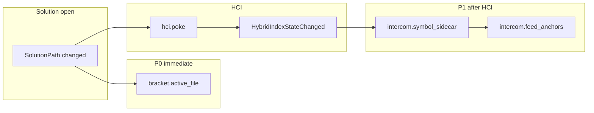

# ADR 0141: Прогрев (warm-up) при открытии solution — отложенная асинхронная оркестрация

**Статус:** Accepted · Implemented (v1: оркестратор, P0–P2, TOML, HIS hint)  
**Дата:** 2026-05-23

## Связанные ADR

| ADR | Роль |
|-----|------|
| [0106](0106-hybrid-codebase-index-cascadeide-integration-and-semantic-map.md) | HCI: `auto_reindex_on_solution_open`, watcher, `HybridIndexStateChanged` |
| [0135](0135-intercom-attach-symbol-cache-and-hci-sidecar.md) | L1 parse cache, L2 symbol sidecar после HCI reindex |
| [0128](0128-intercom-attachment-anchors-and-code-references.md) | Attach / bracket re-resolve, chip `resolveOutcome` |
| [0134](0134-intercom-message-prepare-pipeline-v1.md) | Prepare @ send; fast path без Roslyn |
| [0138](0138-cockpit-command-line-and-parametric-ranges.md) | TCI preview debounced, Enter не блокируется |
| [0140](0140-tci-slash-status-glyphs-and-args-counter.md) | Slash preview не блокирует ввод |

Playbook: `docs/design/playbook-solution-warmup-v1.md`.

## Резюме

При **открытии или смене solution** IDE запускает **единый фоновый конвейер прогрева** (warm-up): тяжёлые, но предсказуемые работы выполняются **асинхронно и без блокировки UI**, чтобы последующие действия оператора (bracket `[M:…]`, reveal attach, slash file completion, re-resolve chips в ленте) были **мгновенными или почти мгновенными**.

Принцип: **pay once on solution open, benefit on every interaction** — в духе уже существующего HCI reindex + symbol sidecar, но с **явным каталогом задач**, **приоритетами**, **отменой при смене scope** и **сигналом готовности** (DataBus / HIS), а не разрозненными `Task.Run` в отдельных фичах.

## Контекст

### Что уже есть (фрагментарно)

| Триггер | Что делает | Ограничение |
|---------|------------|-------------|
| `SolutionPath` → `ApplyHybridCodebaseIndexOrchestrationForCurrentSolution(pokeWhenAutoReindex: true)` | HCI reindex / watcher ([0106](0106-hybrid-codebase-index-cascadeide-integration-and-semantic-map.md)) | Не покрывает bracket-autocomplete, L1 до первого parse |
| После HCI reindex | `IntercomSymbolLineIndexCoordinator.ScheduleRebuild` ([0135](0135-intercom-attach-symbol-cache-and-hci-sidecar.md)) | Стартует **после** HCI; нет связи с «прогреть активный файл» |
| `ReloadIntercomSessionFromDisk` + `RefreshAttachmentAnchorsForCurrentScope` | Re-resolve chips в ленте при смене workspace/solution | Синхронно на UI после reload; не обновляет event log |
| `BracketMemberCompletionProvider` | In-memory индекс членов **по запросу** (lazy) | Первый `[` / `M:` на большом `.cs` ранее **фризил UI** — mitigated debounce + без Roslyn на голый `[` (код 2026-05-23), но **нет** proactive warm активного файла |
| `IntercomAttachmentRoslynWorkspaceCache` (L1) | Parse/model по файлу при resolve | Холодный до первого reveal/send |

Оператор ожидает: открыл solution → подождал N секунд в фоне → дальше `[`, attach, slash **без лагов**. Сейчас часть работы переносится на **первый ввод**, что воспринимается как зависание.

### Проблема

- Нет **единой точки** «что прогреваем при solution open».
- Нет **отмены** при быстрой смене solution (гонки sidecar vs старый scope).
- Нет **приоритета** «сначала активный `.cs` в редакторе, потом весь репозиторий».
- UI не знает **стадию** прогрева (только косвенно через HCI lamp).

## Решение

### 1. `SolutionWarmupOrchestrator` (Application)

Один оркестратор на scope `(workspaceRoot, solutionPath)`:

| Аспект | Значение |
|--------|----------|
| Жизненный цикл | Создаётся/сбрасывается при смене `SolutionPath`; `CancellationToken` отменяет предыдущий прогон |
| Поток | **Никогда** не блокирует UI; тяжёлое — `Task.Run` / очередь с лимитом параллелизма (напр. 2–4 файла) |
| Публикация | `SolutionWarmupStateChanged` в IDE DataBus ([0099](0099-ide-databus-typed-events-and-projections.md)): `Idle` → `Running` → `Ready` / `Partial` / `Cancelled` |

Точка входа (v1): из `MainWindowViewModel.HandleSolutionPathChanged` **после** постановки HCI в очередь, **без** ожидания завершения HCI.

### 2. Каталог задач прогрева (work items)

Каждая задача — `ISolutionWarmupWorkItem`: `Id`, `Priority`, `RunAsync(scope, ct)`.

| Id | Приоритет | Действие | Потребитель |
|----|-----------|----------|-------------|
| `hci.poke` | P0 (уже есть) | Оставить в `HybridIndexOrchestrationPolicy`; оркестратор **не дублирует**, только **подписывается** на `HybridIndexStateChanged` → следующий шаг | Search, orientation |
| `intercom.symbol_sidecar` | P1 | **Integrated:** `ICodebaseIndexReindexObserver` в Core 0.1.2+ во время HCI reindex (не отдельный обход) | Attach reveal, `[M:…]` L2 |
| `intercom.feed_anchors` | P1 | `RefreshAttachmentAnchorsForCurrentScope` на UI **после** `symbol_sidecar` **или** сразу с L1-only (два прохода: быстрый + точный) | Chips в ленте |
| `intercom.bracket.active_file` | **P0** | `BracketMemberCompletionProvider.WarmIndex(absolutePath)` — построить индекс членов для **текущего** `.cs` в редакторе | Composer `[M:…]` |
| `intercom.bracket.recent_files` | P2 | Опционально: N недавних `.cs` из MRU / открытых вкладок | Bracket file axis |
| `intercom.roslyn_l1.open_documents` | P2 | Прогреть L1 cache для открытых `.cs` (без полного solution compile) | Reveal, prepare |
| `slash.workspace_file_index` | P3 | Если есть тяжёлый file index для `/file open` — snapshot в фоне | Slash completion |

**Правило v1:** UI-интеракции **никогда** не ждут `await orchestrator.Ready`; они используют кэш **если есть**, иначе — текущий debounced/lazy путь (как сейчас).

### 3. Порядок и зависимости



- **P0** `bracket.active_file` — не ждёт HCI (только файл на диске).
- **P1** symbol sidecar — **после** HCI (как [0135](0135-intercom-attach-symbol-cache-and-hci-sidecar.md)); feed anchors — после sidecar **или** повторно (cheap merge).

### 4. Контракт «готовности»

| Состояние | Смысл для UI |
|-----------|----------------|
| `Running` | Фоновые задачи; bracket/reveal могут использовать partial cache |
| `Ready` | Все задачи v1 завершены для текущего scope |
| `Partial` | Отмена/таймаут/ошибка части задач; остальное работает lazy |
| `Cancelled` | Смена solution до завершения |

HIS / compact status (опционально v1): «Warm-up…» / «Index ready» — не блокирует ввод ([0138](0138-cockpit-command-line-and-parametric-ranges.md), [0140](0140-tci-slash-status-glyphs-and-args-counter.md)).

### 5. Настройки (TOML, фаза B)

```toml
[solution_warmup]
enabled = true
warm_active_file_on_solution_open = true
warm_feed_anchors_after_symbol_sidecar = true
max_parallel_file_jobs = 2
```

До появления секции — поведение как **enabled = true** только для P0+P1 цепочки, остальное off.

## Не-цели

- Полная загрузка MSBuild/Roslyn **solution workspace** при open (слишком тяжело; отдельно `RevealLoadSolution` по [0128](0128-intercom-attachment-anchors-and-code-references.md)).
- Блокировка Enter / отправки сообщения до `Ready`.
- Переписывание event log attach при feed refresh (in-memory UI достаточно для v1).
- Прогрев **всех** `.cs` в монорепо без лимита (только active + bounded queue).

## Альтернативы

| Вариант | Почему не выбран как единственный |
|---------|-----------------------------------|
| Только lazy + debounce на вводе | Уже делаем; не убирает «первый раз тормозит» |
| Только HCI | Не покрывает bracket L1 и feed chips |
| Синхронный прогрев на UI при open | Регресс UX (зависание главного окна) |

## Последствия

- **Код:** `Features/SolutionWarmup/Application/` (оркестратор, work items), тонкая связка в `MainWindowViewModel` + подписка `ChatPanel` на `feed_anchors` pass.
- **Тесты:** отмена при смене scope; P0 warm вызывается один раз; mock work item order.
- **Документация:** `playbook-solution-warmup-v1.md` — чеклист для агента (что уже прогрето, что ещё lazy).
- **Связь с фиксом 2026-05-23:** debounce bracket + кэш `BracketMemberCompletionProvider` — **первая линия обороны**; ADR 0141 — **стратегическая** линия (proactive).

## Фазы внедрения

| Фаза | Содержание | Критерий |
|------|------------|----------|
| **A** | `SolutionWarmupOrchestrator` + P0 `bracket.active_file` + cancel on scope change | После open solution ввод `[M:` в активном `.cs` без заметного лага |
| **B** | Цепочка HCI → symbol sidecar → `feed_anchors` + `SolutionWarmupStateChanged` | Chips `member_not_found` → `resolved` без клика после warm |
| **C** | TOML, P2 open documents / recent files, HIS hint | Настраиваемо; статус в MFD |

## Критерии приёмки (фаза A+B)

1. Смена solution отменяет предыдущий прогрев (нет записи в sidecar со старым `scope_key`).
2. Активный `.cs` в редакторе: bracket autocomplete по `M:` после open **не парсит с нуля на UI** (индекс уже в cache).
3. Лента Intercom: после завершения P1 якоря с `member_not_found` обновляют chip без reveal (если member есть в workspace).
4. Ввод в composer **не блокируется** во время прогрева (регресс-тест на `[` и `/`).

## Открытые вопросы

- Нужен ли **второй** проход `feed_anchors` только по видимым сообщениям ленты (viewport-limited) vs вся история сессии?
- Делить ли очередь прогрева с HCI file I/O (общий `SemaphoreSlim`) для SSD/CPU?
