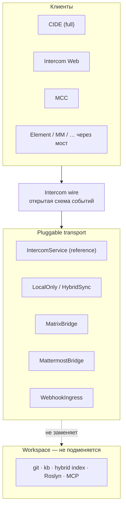

# ADR 0142: Intercom — открытый wire, подключаемые transport и опциональные мосты

**Статус:** Accepted  
**Дата:** 2026-05-24

## Связанные ADR

| ADR | Роль |
|-----|------|
| [0080](0080-intercom-naming-and-multi-party-channel-model.md) | Intercom как канал; слой A (IDE) vs B (внешний контур) |
| [0045](0045-agent-chat-persistence-event-log-and-projections.md) | Event log и проекции — модель событий на клиенте |
| [0132](0132-intercom-federated-transport-and-multi-client-boundary.md) | Multi-client, REST/WS sketch, фазы transport; **этот ADR — канон wire и стратегия адаптеров** |
| [0128](0128-intercom-attachment-anchors-and-code-references.md) | `AttachmentAnchor` в wire — JSON, не prose |
| [0134](0134-intercom-message-prepare-pipeline-v1.md) | Prepare/commit до transport |
| [0133](0133-commander-cockpit-shared-attention-model-and-instrument-deck.md) | MCC подписывается на transport, не владеет store |

### Вне ADR

| Документ | Роль |
|----------|------|
| [intercom-ux-reference-slack-mattermost-v1.md](../design/intercom-ux-reference-slack-mattermost-v1.md) | UX-паттерны; слой B — мосты, не клон продукта |
| [iop-manifest-v1.md](../iop-manifest-v1.md) | IOP: transport не подменяет git/kb/workspace truth |

## Резюме

**Принято:**

1. **Канон командного Intercom** — **открытая схема событий** (topics, messages, roles, structured attach), версионируемая в репозитории; не привязка к одному мессенджеру.
2. **Transport** — **подключаемый** (`IntercomTransport` / sync-адаптер): reference implementation (Intercom service) **и** внешние адаптеры (Matrix, Mattermost, webhooks, …) — **опционально**, без обязанности «все в Element».
3. **Много клиентов у людей** — норма: CIDE, Intercom Web, MCC, Element, корп. Slack/MM — через **мосты** и capability flags, а не через выбор единственного победителя.
4. **Стандарты** — на **конверте** (при необходимости CloudEvents-подобная обёртка), **не** замена доменной семантики Intercom готовым чат-протоколом «как есть».
5. **CIDE** остаётся богатым клиентом: Roslyn, reveal, MCP, prepare-pipeline — **вне** transport; на wire уходит уже подготовленный JSON.

[0132](0132-intercom-federated-transport-and-multi-client-boundary.md) остаётся **картой фаз и multi-client**; этот ADR фиксирует **политику открытого wire** и отношение к Matrix/MM без выбора вендора в v0.

---

## Контекст

Участники команды сидят в **разных** мессенджерах; продукт Cascade **открытый** — сторонние реализации клиента и сервера допустимы. Варианты обсуждались:

- полностью **свой** Intercom service ([0132](0132-intercom-federated-transport-and-multi-client-boundary.md) вариант A);
- **Matrix** (или иной готовый сервер) + тонкий C# wrapper;
- **свой открытый протокол** «на стандартах».

Риск без решения: либо **дублирование** Slack + локальный чат + JIRA ([0132](0132-intercom-federated-transport-and-multi-client-boundary.md) § «Проблема»), либо **замена** Intercom чужой моделью (rooms без topics/attach/agent), либо **вечный Proposed** без канона wire.

---

## Решение

### 1. Три слоя (нормативно)

- **Wire** — *что* передаётся (события [0045](0045-agent-chat-persistence-event-log-and-projections.md), поля [0132](0132-intercom-federated-transport-and-multi-client-boundary.md) §2, attach [0128](0128-intercom-attachment-anchors-and-code-references.md)).
- **Transport** — *как* доставляется и хранится (REST/WS, Matrix CS API, MM REST, …).
- **UX** — *как* рисуется в CIDE ([0123](0123-intercom-full-skia-surface-evolution.md)) — **не** часть wire.

### 2. Открытый wire (канон)

| Артефакт | Назначение |
|----------|------------|
| **Схема событий** | JSON Schema / OpenAPI для message, topic, member; версия `schema_version` |
| **Reference types** | human \| agent \| system; `clientKind`: cide \| web \| mcc \| agent |
| **Attachment** | structured JSON ([0128](0128-intercom-attachment-anchors-and-code-references.md)); prose bracket — convenience на клиенте |
| **Экспорт/импорт** | CIDE local log ↔ wire ([0132](0132-intercom-federated-transport-and-multi-client-boundary.md) фаза 1) |

Публикация: репозиторий продукта (или отдельный `intercom-wire`), лицензия совместима с открытым продуктом ([0101](0101-licensing-and-commercialization-strategy.md) при выборе зависимостей мостов).

**Обратная совместимость wire:** при изменении полей — явная версия схемы; потребители вне репо — отдельная политика, когда появятся.

### 3. Pluggable transport (контракт)

Минимальный интерфейс (имена в коде — черновик):

| Операция | Смысл |
|----------|--------|
| `AppendMessage` | idempotent по client message id |
| `SubscribeTopic` | live / poll cursor |
| `ListTopics` | для Web/MCC |
| `EnsureTopic` | spine key optional |

Реализации (не взаимоисключающие в экосистеме):

| Реализация | Роль |
|------------|------|
| **LocalOnly** | только [0045](0045-agent-chat-persistence-event-log-and-projections.md) в CIDE (сегодня) |
| **IntercomService** | reference server ([0132](0132-intercom-federated-transport-and-multi-client-boundary.md) фаза 2) |
| **HybridSync** | local + periodic push ([0132](0132-intercom-federated-transport-and-multi-client-boundary.md) вариант B) |
| **MatrixBridge** | room ↔ topic; custom event `io.cascade.intercom.message` |
| **MattermostBridge** | channel ↔ topic ([0132](0132-intercom-federated-transport-and-multi-client-boundary.md) фаза 5) |
| **WebhookIngress** | уведомления в Telegram/email без полноценного клиента |

Выбор transport на deployment — **конфиг**, не compile-time ветка в CIDE.

### 4. Много мессенджеров — политика мостов

| Принцип | Содержание |
|---------|------------|
| **Одна правда по задаче** | Канон — Intercom event log на выбранном primary transport; мост **не** создаёт второй независимый store в MCC |
| **Read-only в чужой UI допустим** | Уведомление + deep link в Web/CIDE |
| **Не цель** | Заставить всех перейти на один мессенджер |
| **Matrix / MM** | **Адаптеры**, не замена §2 wire; mapping документируется в ADR моста при внедрении |

### 5. Стандарты (конверт, не семантика)

Допустимо:

- **CloudEvents**-подобный envelope (`id`, `time`, `type`, `data` = Intercom payload) для логов, webhooks, observability;
- **JSON Schema** / OpenAPI 3 для HTTP reference server.

Не требуется:

- полная совместимость с Matrix event types как каноном;
- ActivityPub/XMPP как обязательный transport v0.

### 6. Связь с [0132](0132-intercom-federated-transport-and-multi-client-boundary.md)

| [0132](0132-intercom-federated-transport-and-multi-client-boundary.md) | Этот ADR |
|------------------------------------------------------------------------|----------|
| Фазы 0–5, multi-client, REST sketch | **Статус Accepted** для wire-политики |
| «Intercom service MVP» | **Reference** transport, не единственный |
| «Mattermost bridge optional» | Пример **pluggable** адаптера |
| Proposed (объём transport) | Реализация фаз остаётся по [0132](0132-intercom-federated-transport-and-multi-client-boundary.md); wire — **Accepted** здесь |

---

## Последствия

### Положительные

- Открытый продукт может поставлять **схему + reference server**, сообщество — **мосты** без форка CIDE.
- Matrix/MM снимают ops **доставки**, не заставляя отказаться от topics/attach/agent.
- CIDE, Web, MCC делят **один wire**, разные capability ([0132](0132-intercom-federated-transport-and-multi-client-boundary.md) §1.1).

### Отрицательные / риски

- Поддержка нескольких transport + мостов — **тестовая матрица**.
- Конфликты sync (local vs remote) — политика merge ([0132](0132-intercom-federated-transport-and-multi-client-boundary.md)).
- Лицензии SDK мостов (AGPL Matrix libs и т.д.) — [0101](0101-licensing-and-commercialization-strategy.md).

---

## Не цели

- Выбор Matrix vs Mattermost vs own server **в этом ADR** (отдельный ADR моста при пилоте).
- E2EE, federation, mobile-клиенты v0.
- Замена Skia Intercom UI чужим WebView ([0080](0080-intercom-naming-and-multi-party-channel-model.md) §5).

---

## Anti-patterns

| Anti-pattern | Почему |
|--------------|--------|
| Два независимых message store (MCC + Intercom) | Ломает SA и attach |
| «Канон = Matrix room timeline» без custom mapping | Теряются topic/spine/attach |
| Prose `[M:…]` как единственный wire | [0128](0128-intercom-attachment-anchors-and-code-references.md), [0132](0132-intercom-federated-transport-and-multi-client-boundary.md) §2 |
| Обязательный Element для PO/Lead | Нарушает паритет [0132](0132-intercom-federated-transport-and-multi-client-boundary.md) §1.1 |

---

## Фазы (согласовано с [0132](0132-intercom-federated-transport-and-multi-client-boundary.md))

| Фаза | Содержание | Wire / transport |
|------|------------|------------------|
| **1** | OpenAPI/schema + CIDE export/import | **Accepted** (этот ADR) |
| **2** | Reference Intercom service | `IntercomService` transport |
| **3** | Intercom Web | тот же wire |
| **4** | MCC read/compose | подписка, не свой store |
| **5+** | Matrix / MM / webhook bridges | адаптеры поверх wire |

---

## Отклонённые альтернативы (кратко)

| Альтернатива | Почему не канон |
|--------------|-----------------|
| Только Matrix как единственный backend | Привязка к room model и ops homeserver; mapping всё равно нужен |
| Только свой closed server | Открытый продукт без wire затрудняет мосты и сторонние клиенты |
| «Ничего не писать» — только embed Element | Две правды, слабый attach/reveal ([0080](0080-intercom-naming-and-multi-party-channel-model.md)) |
| Mesh/CRDT v0 | [0132](0132-intercom-federated-transport-and-multi-client-boundary.md) вариант C — отложить |

---

## История

| Дата | Изменение |
|------|-----------|
| 2026-05-24 | Accepted: открытый wire, pluggable transport, мосты опциональны; уточнение к [0132](0132-intercom-federated-transport-and-multi-client-boundary.md). |
