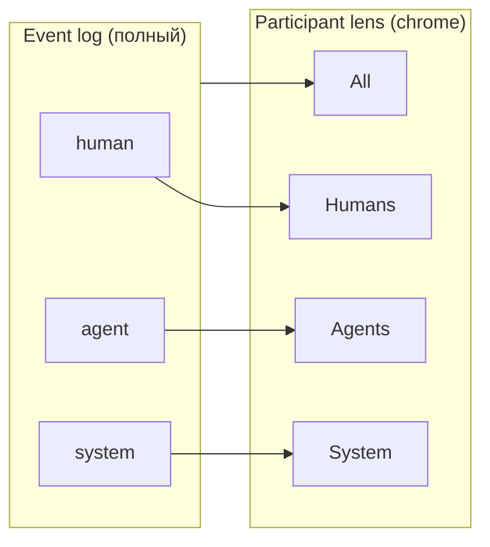

# ADR 0143: Intercom — participant lens ленты (All / Humans / Agents / System)

**Статус:** Accepted  
**Дата:** 2026-05-24

## Связанные ADR

| ADR | Роль |
|-----|------|
| [0080](0080-intercom-naming-and-multi-party-channel-model.md) | Intercom как канал; роли human / agent / system |
| [0045](0045-agent-chat-persistence-event-log-and-projections.md) | Event log — полный log; lens = **проекция** |
| [0123](0123-intercom-full-skia-surface-evolution.md) | Skia chrome + лента; lens в **chrome**, не в скролле |
| [0127](0127-intercom-spine-and-topic-tabs-chrome-navigation.md) | Spine + topic tabs; lens — **ортогональная** ось в том же chrome |
| [0142](0142-intercom-open-wire-pluggable-transports.md) | Wire по `sender_role`; lens **не** transport channel |
| [0119](0119-chat-slash-commands-intercom-surface.md) | `IntercomMessageAudience.SelfOnly` vs `Channel` — доставка, не lens |
| [0132](0132-intercom-federated-transport-and-multi-client-boundary.md) | Export/MCP — полный log, без фильтра lens |
| [0144](0144-intercom-team-transport-cide-sync-and-reference-service.md) | Transport v1 — human fan-out; lens Agents/System остаются локальными |

### Вне ADR

| Документ / код | Роль |
|----------------|------|
| [intercom-ux-reference-slack-mattermost-v1.md](../design/intercom-ux-reference-slack-mattermost-v1.md) | Flat feed, role rail — lens дополняет, не пузыри |
| [`IntercomMessageAudience`](../../Models/Intercom/IntercomMessageAudience.cs) | **Audience** = кому *доставлено* сообщение; **не** путать с lens |

## Резюме

**Принято:** в Intercom вводится **participant lens** (вид ленты) — переключатель в **Skia chrome**, который фильтрует **отображение** сообщений текущей темы по роли отправителя:

| Lens | Показывает |
|------|------------|
| **All** | human + agent + system (по умолчанию) |
| **Humans** | только `human` |
| **Agents** | только `agent` |
| **System** | только `system` (сборка, git, MCP-статус, slash-outcome и т.п.) |

Lens — **клиентская проекция** над event log; **не** отдельные комнаты в transport, **не** дублирование **topic**, **не** замена [`IntercomMessageAudience.Channel`](../../Models/Intercom/IntercomMessageAudience.cs).

---

## Контекст

В длинной теме лента смешивает реплики людей, агента и системные строки. Оператору нужно быстро:

- читать **только команду** (Humans);
- разбирать **только ход агента** (Agents);
- смотреть **только инфраструктурный шум** (System) — CI, git, tool status;
- или видеть **всё** (All).

Идея «каналов Agent/Humans» обсуждалась в связи с [0142](0142-intercom-open-wire-pluggable-transports.md); без фиксации границ возникает путаница с:

- **topic** ([0072](0072-chat-topic-cards-intent-melody-keyboard-contract.md)) — *о чём* линия работы;
- **`IntercomMessageAudience`** — *кому доставлено* (`Channel` / `SelfOnly`);
- **transport channel** (Matrix room, MM channel) — слой B [0132](0132-intercom-federated-transport-and-multi-client-boundary.md).

---

## Решение

### 1. Термины (нормативно)

| Термин | Значение |
|--------|----------|
| **Participant lens** (`FeedParticipantLens`) | UI-фильтр ленты по `sender_role` |
| **Topic** | Линия работы / тред; lens применяется **внутри** выбранной темы |
| **Audience** | Доставка исходящего (`Channel` \| `SelfOnly`); **ортогонально** lens |
| **Transport channel** | Внешний store (Matrix/MM); **не** lens |

В продуктовом тексте **не** называть lens «каналом» без уточнения «вид ленты».

### 2. Модель lens

| `FeedParticipantLens` | Предикат на сообщение |
|----------------------|------------------------|
| `All` | всегда `true` |
| `Humans` | `role == human` |
| `Agents` | `role == agent` |
| `System` | `role == system` |

**Роль** — та же, что в wire [0142](0142-intercom-open-wire-pluggable-transports.md) и event types [0045](0045-agent-chat-persistence-event-log-and-projections.md). Новое поле в событии **не требуется** для v1.

**Классификация `system`:** при записи события отправитель уже помечен `system` (build, git, orchestration, локальный slash-outcome в ленте с меткой «Система» — см. [intercom-ux-reference](../design/intercom-ux-reference-slack-mattermost-v1.md)). Lens **не** переклассифицирует задним числом.

### 3. UI и chrome ([0127](0127-intercom-spine-and-topic-tabs-chrome-navigation.md))

- Переключатель lens — в **Skia chrome** (segmented control / chips), **над** скроллом ленты, **рядом** с topic tabs / spine — не внутри Items ленты.
- **По умолчанию:** `All`.
- **Сохранение:** последний lens — в `[code_navigation_map]`-подобной секции или `[intercom]` в settings (имя TOML — при внедрении); опционально **per-topic** память (v1.1).
- **Пустая лента:** явная подпись «Нет сообщений для Humans» + опционально «N скрыто» при активном фильтре ≠ All.
- **Role rail** ([0123](0123-intercom-full-skia-surface-evolution.md)): при узком lens все видимые строки одной роли — rail может **схлопываться** или оставаться (продуктовый выбор при реализации; default — оставить для единообразия hit-target).

### 4. Composer и исходящие сообщения

| Правило | Содержание |
|---------|------------|
| Lens ≠ адресация | Выбор **Humans** **не** означает «отправить только людям» |
| Compose | По-прежнему в общий поток темы (`IntercomMessageAudience.Channel`), если не задан иной audience |
| SelfOnly | Slash / `/help` — `SelfOnly`; не показываются в lens Humans/Agents/System, только в All (или отдельная политика: SelfOnly всегда только локально и не в export) |

Приватная адресация «только агенту» — **не** этот ADR; отдельное расширение audience/recipient при необходимости.

### 5. Wire, transport, MCP

| Слой | Поведение |
|------|-----------|
| **Локальный log** | Хранит **все** события |
| **Projection / Skia feed** | Применяет lens |
| **Export / MCP / [0132](0132-intercom-federated-transport-and-multi-client-boundary.md)** | **Полный** log без lens |
| **Matrix/MM bridge** | Не создаёт отдельные room per lens |

### 6. Клавиатура (опционально v1.1)

Melody/Chords — по аналогии с [0127](0127-intercom-spine-and-topic-tabs-chrome-navigation.md): цикл lens или прямые chord’ы (`Ctrl+K → S → …`) — **отдельный** шаг intent-catalog при внедрении; v1 достаточно клика в chrome.

---

## Последствия

### Положительные

- Меньше когнитивного шума без разбиения store и без дублирования topics.
- **System** отдельно — удобно для «что упало в CI» без прокрутки диалога агента.
- Согласуется с [0142](0142-intercom-open-wire-pluggable-transports.md): роль на wire, проекции на клиенте.

### Отрицательные / риски

- Пользователь может **не заметить** скрытые сообщения — нужен счётчик/подпись.
- Четыре lens + topic tabs + spine — риск перегруза chrome; compact Forward — приоритет **4 коротких метки** (All / Hum / Agt / Sys) или иконки + tooltip.

---

## Не цели

- Отдельные transport-каналы или Matrix rooms per lens.
- Замена topic navigation или spine.
- Фильтрация export/MCP по lens.
- Переименование `IntercomMessageAudience.Channel` в этом ADR.

---

## Anti-patterns

| Anti-pattern | Почему |
|--------------|--------|
| Хранить только отфильтрованные сообщения в log | Ломает export, ветвление, rewind [0116](0116-intercom-session-tree-and-agent-message-steering.md) |
| Lens меняет `sender_role` | Роль — факт события |
| «Канал Agents» в UI без слова «вид» | Путаница с MM/Matrix и `Audience.Channel` |
| Скрыть system внутри Humans | **System — отдельный lens** (принято здесь) |

---

## Фазы

| Фаза | Содержание |
|------|------------|
| **v1** | Enum + chrome switcher + фильтр projection; default All; подпись пустого состояния |
| **v1.1** | Persist lens в settings; chord в intent-catalog |
| **v2** | Per-topic remembered lens; badge «N hidden» |

---

## Отклонённые альтернативы (кратко)

| Альтернатива | Почему не принято |
|--------------|-------------------|
| Три lens без System (system в All/Humans) | Запрос продукта: **System отдельно** |
| System внутри Agents | Смешивает tool-loop и CI/git |
| Отдельные sub-logs в БД | Дорого; lens достаточно |
| Slack-style channels как store | [0142](0142-intercom-open-wire-pluggable-transports.md), [0132](0132-intercom-federated-transport-and-multi-client-boundary.md) |

---

## История

| Дата | Изменение |
|------|-----------|
| 2026-05-24 | Accepted: participant lens All / Humans / Agents / System; client projection; не transport channel. |
