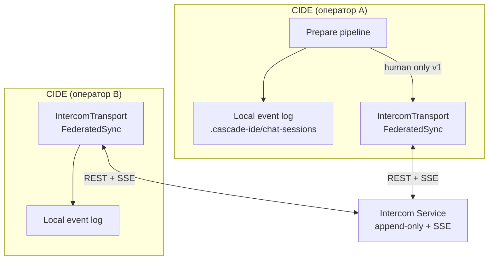
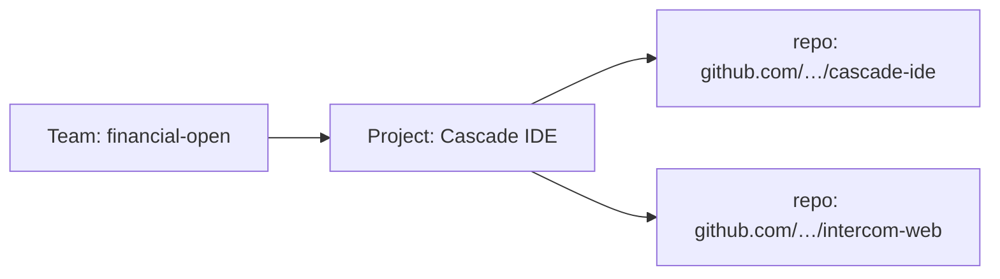
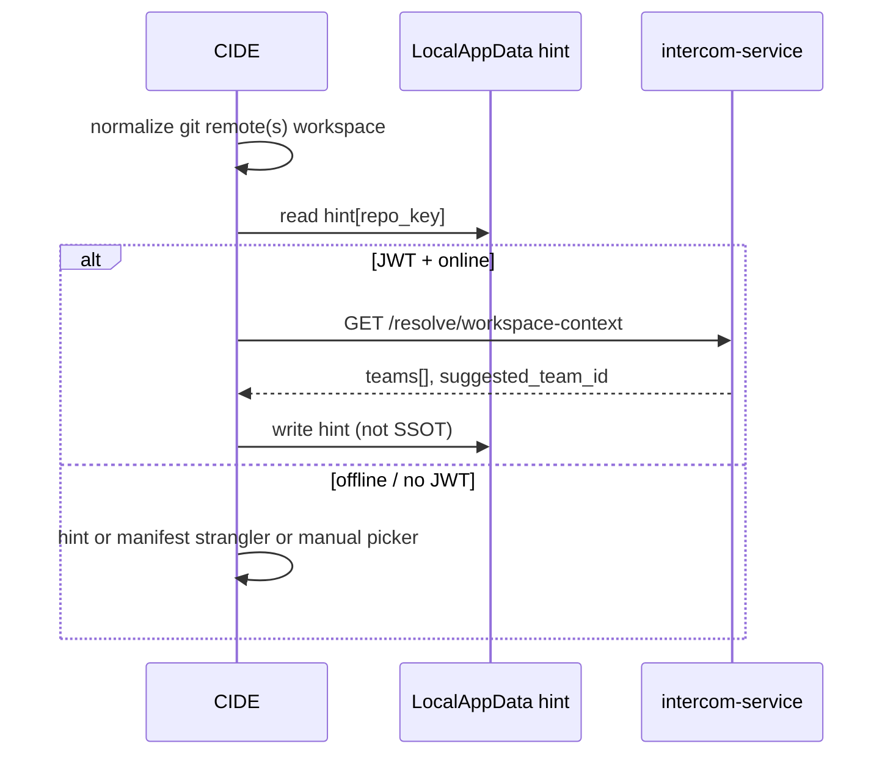
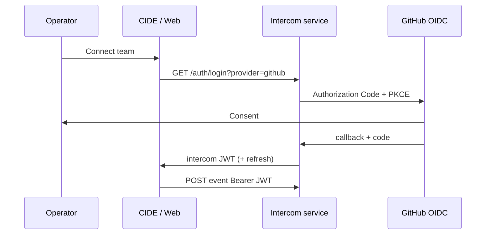

# ADR 0144: Intercom — team transport, reference service и CIDE sync

**Статус:** Accepted  
**Дата:** 2026-05-24

## Связанные ADR

| ADR | Роль |
|-----|------|
| [0142](0142-intercom-open-wire-pluggable-transports.md) | Открытый wire, pluggable transport — **политика** |
| [0132](0132-intercom-federated-transport-and-multi-client-boundary.md) | Multi-client (Web, MCC), паритет ролей — **видение**; transport-реализация → **этот ADR** |
| [0045](0045-agent-chat-persistence-event-log-and-projections.md) | Локальный append-only log — кэш + offline; канон событий |
| [0134](0134-intercom-message-prepare-pipeline-v1.md) | Prepare/commit **до** transport |
| [0128](0128-intercom-attachment-anchors-and-code-references.md) | `AttachmentAnchor`, `SenderWorkspaceContext` |
| [0143](0143-intercom-feed-participant-lens.md) | Participant lens — UI; transport несёт **полный** log |
| [0080](0080-intercom-naming-and-multi-party-channel-model.md) | Intercom как канал; не «чат-виджет» |
| [0028](0028-user-settings-toml-localappdata-and-secrets.md) | Секреты transport (token) — LocalAppData / secrets, не в git |
| [0101](0101-licensing-and-commercialization-strategy.md) | Лицензия reference server и зависимостей |
| [0146](0146-intercom-wire-canonical-protocol-package.md) | Канон wire в `intercom-wire/` — независимо от сервера |
| [0147](0147-intercom-team-identity-roles-and-cide-server-admin.md) | Per-team roles, agent УЗ, CIDE admin — **расширение** §2.2, §8, §10; **teams + projects** §2.1–2.3 |

### Вне ADR

| Документ | Роль |
|----------|------|
| [intercom-ux-reference-slack-mattermost-v1.md](../design/intercom-ux-reference-slack-mattermost-v1.md) | UX-паттерны; не диктует transport |
| [iop-manifest-v1.md](../iop-manifest-v1.md) | IOP: transport не подменяет git/kb |
| [wire/intercom-wire](../../wire/intercom-wire/README.md) (см. §7) | JSON Schema wire v1 + HTTP profile |
| [docs/intercom-wire/README.md](../intercom-wire/README.md) | Указатель из docs |

## Резюме

**Принято** для командного Intercom с **несколькими CIDE** (и последующими Web/MCC):

1. **Intercom Team** — стабильный идентификатор **общей ленты** (`team_id`), **не** абсолютный путь workspace на диске.
2. **Reference Intercom Service** — централизованный append-only store + **realtime** (SSE v1, WebSocket v1.1); каталог `host/intercom-service/` в репозитории **cascade-ide** (`CascadeIDE.slnx`).
3. **CIDE** — реализация `IntercomTransport` (**FederatedSync**): локальный [0045](0045-agent-chat-persistence-event-log-and-projections.md) остаётся; исходящие human-сообщения → transport; входящие → append в log + проекция UI.
4. **Wire v1** — JSON, `schema_version`, mapping событий [0045](0045-agent-chat-persistence-event-log-and-projections.md); attach — structured JSON [0128](0128-intercom-attachment-anchors-and-code-references.md).
5. **Фаза sync v1** — **только human** (`sender_role: human`); agent/system остаются локальными до отдельного RFC.
6. **Auth в пилоте** — **OAuth 2.0 / OIDC** (GitHub первым, другие провайдеры конфигом) → JWT Intercom service; **без** password store; shared team token — только `DEV` bootstrap (§8).

[0132](0132-intercom-federated-transport-and-multi-client-boundary.md) остаётся картой **Web/MCC/паритета**; выбор «client–server vs mesh» для пилота команды — **client–server (вариант A)** — зафиксирован здесь.

---

## Контекст

Сегодня Intercom в CIDE силён локально ([0045](0045-agent-chat-persistence-event-log-and-projections.md), prepare [0134](0134-intercom-message-prepare-pipeline-v1.md), attach [0128](0128-intercom-attachment-anchors-and-code-references.md)), но **второй оператор с CIDE** не видит ленту: нет общего store и realtime.

Обсуждение с командой зафиксировало целевой пилот:

| Требование | Решение |
|------------|---------|
| Второй клиент — **ещё один CIDE** | FederatedSync transport |
| **Realtime** желателен | SSE (primary) + optional WS |
| Сначала **только люди** | Fan-out только `sender_role: human` |
| Workspace «непонятен» | Разделить **team** (transport) и **workspace root** (CIDE) — §1 |
| Вход **сразу нормальный** | Sign in with **GitHub** + generic **OIDC** в пилоте (§8), не «потом» |

[0142](0142-intercom-open-wire-pluggable-transports.md) принял открытый wire и pluggable transport; этот ADR — **нормативная реализация** reference path для команды из 2+ CIDE.

---

## Проблема

1. **Две правды:** локальный NDJSON у каждого разработчика без merge → «что у тебя в чате?».
2. **Путаница workspace:** путь `D:\…` vs `/home/…` нельзя использовать как `team_id`.
3. **Смешение ролей:** без политики sync агентские `message_stream_delta` задуют шум и гонки на сервере.
4. **Вечный Proposed [0132](0132-intercom-federated-transport-and-multi-client-boundary.md)** без критериев «готово для двух CIDE».

---

## Решение

### 1. Термины (нормативно)

| Термин | Значение |
|--------|----------|
| **Intercom Team** | Логическая команда, общий message store на transport. Идентификатор: `team_id` (строка, стабильная, сравнимая). |
| **Workspace root (CIDE)** | Каталог IOP/CIDE для attach, `.cascade-ide/`, git — как сегодня `ResolveAttachWorkspaceRoot()`. **Не** ключ transport. |
| **Member** | Участник team: `member_id` + `display_name` + optional `client_kind` (`cide` \| `web` \| `mcc`). |
| **Topic** | Линия обсуждения в team (аналог channel/thread hybrid [0132](0132-intercom-federated-transport-and-multi-client-boundary.md)). |
| **Transport event** | Запись на сервере, маппинг из [0045](0045-agent-chat-persistence-event-log-and-projections.md) + envelope metadata. |
| **Local-only event** | Событие только в CIDE log (agent stream, system, SelfOnly) — не fan-out в v1. |



### 2. Intercom Team — идентичность `team_id`

**Нормативно:** все клиенты одной **логической команды** используют **один** `team_id`. **Канон team — на сервере** (`intercom-service`), не в git/TOML репозитория и не в monorepo/submodule layout.

| Слой | Источник истины |
|------|-----------------|
| **Team exists, metadata, policy** | Сервер — таблица `Teams` + admin API / CIDE admin ([0147](0147-intercom-team-identity-roles-and-cide-server-admin.md)) |
| **Membership, roles** | Сервер — `TeamMembers` ([0147](0147-intercom-team-identity-roles-and-cide-server-admin.md) §2) |
| **Активный team в CIDE** | Пользователь выбирает из `GET /auth/me` → `teams[]`; кэш **last selected** в user settings ([0028](0028-user-settings-toml-localappdata-and-secrets.md)) — **не** определение team |
| **OAuth / Connect** | `team_id` в state — из выбора пользователя или **invite**; сервер валидирует membership / join policy |

`team_id` **не** вычисляется из абсолютного пути workspace, **не** из monorepo vs submodule, **не** из `git remote`.

#### 2.1 Server-managed teams (normative v1.1)

**Принято:** создание team, `display_name`, **`join_policy`**, invites, members/roles — **только на сервере** (и CIDE admin как клиент API). Layout репозитория на диске **не** создаёт team; связь workspace ↔ team — через **project** (§2.3).

| Операция | Где |
|----------|-----|
| Создать team | `POST /api/v1/teams` (owner bootstrap) или admin CIDE |
| Join policy, GitHub org allowlist | Поля/config **team на сервере** ([0147](0147-intercom-team-identity-roles-and-cide-server-admin.md) §2.1) |
| Пригласить | Invite token через admin API |
| Выбрать team в CIDE | UI picker ← `/auth/me`; `[intercom.transport].team_id` = last selection |

**CIDE settings (LocalAppData):** `base_url`, `oauth_provider`, **optional** `team_id` (last selected team), **`workspace_hints`** (§2.3.1). **Не** committed TOML с определением team.

#### 2.2 Repo manifest — не SSOT (strangler)

Ранний черновик: `.cascade-ide/intercom-team.toml` в git. **Amend:** файл **не** является источником team для transport v1.1+.

| Было (MVP / strangler) | Сейчас (normative) |
|------------------------|---------------------|
| `team_id` в committed TOML | **Сервер**; TOML не обязателен |
| Monorepo root vs submodule = разные teams | **Не** по пути на диске; monorepo/submodule → **repos проекта** §2.3 |
| `git:` + remote URL inference | **Убрать** из normative path |

Код `IntercomTeamManifestResolver` — **strangler** до **§2.3.1** (resolve + local hint); после v1.1 — только fallback **до первого** успешного resolve, не SSOT.

`wire/intercom-wire/schemas/v1/team-manifest.schema.json` — **deprecated** для SSOT; удаление из wire v1.2.

#### 2.3 Team → Project → Repositories

**Принято:** логическая цепочка **не** «team = git root», а:

```text
Team  ──works on──▶  Project  ──links──▶  Repository (git remote URL, normalized)
```

| Сущность | Смысл | Где живёт |
|----------|--------|-----------|
| **Team** | Люди, roles, Intercom transport (`team_id`), topics | Сервер `Teams` |
| **Project** | Продукт / IOP-единица, над которой работает team | Сервер `Projects` |
| **Repository** | Привязка к **git** (origin URL, optional path hint); **не** абсолютный путь диска | Сервер `ProjectRepos` |

**Правила:**

1. **Team не равен repo.** Один team может вести **несколько** projects; один project может иметь **несколько** repos (monorepo + submodule remotes, polyrepo product).
2. **Monorepo vs submodule** — это **сколько repo-ссылок у project**, не «какой `.cascade-ide` root = team_id».
3. **CIDE workspace** (solution/git root локально) → клиент шлёт **normalized remote URL(s)** → сервер: `repos → projects → teams` (фильтр по membership) → **предложить default team** для compose; пользователь может переключить.
4. **Transport** по-прежнему keyed by **`team_id`**; project — контекст маршрутизации и admin, не второй message store.
5. Связи team↔project↔repo — **server-managed** (admin API / CIDE), как §2.1.



**API sketch — project admin (v1.2):**

| Метод | Назначение |
|-------|------------|
| `POST /projects`, `PATCH /projects/{id}` | CRUD project (admin) |
| `PUT /projects/{id}/repos` | Список normalized git URLs |
| `PUT /teams/{team_id}/projects` | Привязка team ↔ project |

#### 2.3.1 Workspace resolve + local hint (v1.1, DX)

**Принято:** чтобы не откатить DX «открыл clone → понятен team», без repo TOML как SSOT:

| Механизм | Роль |
|----------|------|
| **`GET /api/v1/resolve/workspace-context`** | Сервер: `repo URL(s) → projects → teams` (фильтр membership) |
| **Local workspace hint** | CIDE LocalAppData: кэш **последнего** успешного resolve / ручного выбора **per normalized repo** — **не SSOT**, offline fallback |
| **`IntercomTeamManifestResolver`** | Strangler: если нет hint и нет JWT — одноразовый bootstrap; после resolve **не** перезаписывает server hint |

**Flow (CIDE):**



**`GET /api/v1/resolve/workspace-context` (normative sketch v1.1):**

| Param | Содержание |
|-------|------------|
| `repo_url` | Повторяемый query param; 1..N remotes (root `origin`; опционально submodule remotes v1.2) |
| Auth | `Authorization: Bearer` — только teams, где caller ∈ membership |

**Response (orientир):**

```json
{
  "normalized_repo_urls": ["github.com/ai-guiders/cascade-ide"],
  "projects": [
    { "project_id": "cascade-ide", "display_name": "Cascade IDE" }
  ],
  "teams": [
    {
      "team_id": "financial-open",
      "display_name": "Financial Open",
      "team_role": "member",
      "project_id": "cascade-ide"
    }
  ],
  "suggested_team_id": "financial-open"
}
```

`suggested_team_id` — пересечение repo→project→team и `/auth/me`; при неоднозначности — `null`, CIDE показывает picker.

**Repo URL normalization (normative):**

| Правило | Пример |
|---------|--------|
| Lowercase host | `GitHub.com` → `github.com` |
| Без `.git` suffix | `repo.git` → `repo` |
| SSH → HTTPS host/path | `git@github.com:Org/Repo` → `github.com/org/repo` |
| Без credentials / userinfo | — |
| Несколько remotes | v1.1: **`origin` only**; v1.2: все remotes workspace + union match |

**Local hint (CIDE, [0028](0028-user-settings-toml-localappdata-and-secrets.md)):**

```toml
# [intercom.transport.workspace_hints] — LocalAppData only, NOT in git
[intercom.transport.workspace_hints."github.com/ai-guiders/cascade-ide"]
team_id = "financial-open"
project_id = "cascade-ide"          # optional, from last resolve
updated_at_utc = "2026-05-24T12:00:00Z"
source = "resolve"                  # resolve | manual | manifest_strangler
```

| Поле | Правило |
|------|---------|
| Key | **Normalized** repo URL (§ выше) |
| `team_id` | Last used / suggested; **invalidate** если `/auth/me` не содержит team |
| `source = manifest_strangler` | Допустимо до первого resolve; затем перезаписать |

**Не SSOT:** hint может устареть; server policy (join, roles) всегда wins at Connect/post.

**Не v1.1:** автосоздание project/team из clone без admin; IOP manifest в git как SSOT project (может **подсказать** `project_id` после регистрации на сервере).

#### 2.3.2 Risks и v1 scope (не «всё сразу в production»)

Целевая модель §2.1–2.3 **полная**; **реализация и ops** — **волнами**. ADR описывает конечное состояние; ниже — что **обязательно** в ближайших волнах и где сознательные дыры.

| Волна | Deliver | Не блокирует transport |
|-------|---------|------------------------|
| **v1 / фаза 1** ([0147](0147-intercom-team-identity-roles-and-cide-server-admin.md)) | Server teams, roles, join policy, invite; human fan-out; DEV `open` / `first_owner` | Project CRUD UI, agent accounts, multi-IdP registry |
| **v1.1** | `GET /resolve/workspace-context`, workspace hints, strangler manifest → hint; manual team picker | Полный project admin, submodule remotes в resolve |
| **v1.2** | `Projects` / `ProjectRepos` / `TeamProject` на сервере; admin link repos | Account linking (Google+Microsoft → один member) |
| **v2+** | Agent transport fan-out, `idp_domain`, native WebAuthn на service | — |

**Риски и mitigations:**

| Риск | Mitigation |
|------|------------|
| **Resolve хрупкий** (нет origin, SSH/https drift, fork) | Нормализация URL §2.3.1; v1.1 `origin` only; **manual picker** всегда; offline → local hint |
| **Bootstrap chicken-egg** (нет server / owner) | CIDE local server host; DEV join policy; LocalOnly без transport |
| **DX без repo TOML** | §2.3.1 hints + resolve; manifest strangler временно |
| **Project дублирует IOP / solution** | `project_id` **стыкуется** с IOP manifest ([0121](0121-intent-oriented-programming-paradigm.md)) — server shell для transport/admin, IOP остаётся продуктовым описанием в git; один канонический id при регистрации project |
| **Solo-dev overkill** | LocalOnly + один WitDB файл — valid; federated — когда 2+ CIDE |
| **Agent УЗ до fan-out** | Модель в [0147](0147-intercom-team-identity-roles-and-cide-server-admin.md) §3; код — фаза 3–4 |
| **Local hint устарел** | Invalidate по `/auth/me`; server policy wins |
| **Passwordless friction в LAN** | Development `open` / invite bootstrap — не «стыдный» режим |

**Production vs pilot:** Production-like = `invite_required`, TLS, per-member JWT, **без** committed team TOML, **без** shared team token. Pilot LAN может ослабить join policy; **не** ослабляет passwordless и anti-spoof `member_id`.

**Порядок кода (рекомендация):** roles + invite + resolve/hints **раньше**, чем полный project admin UI; transport MVP **не ждёт** v1.2 project layer, если есть hints + picker + minimal repo seed (фаза 1b [0147](0147-intercom-team-identity-roles-and-cide-server-admin.md)).

#### 2.4 Member identity

| Поле | Пилот (норма) |
|------|----------------|
| `member_id` | Стабильный ключ с сервера после OIDC (`iss` + `sub` → canonical id) |
| `display_name` | Claims IdP (GitHub login, name) → fallback `member_id` |

`git config` / локальный UUID — **не** источник истины для transport после Connect; только до первого входа или offline-only.

Два человека в одной ленте различаются по **`member_id`**, не по пути диска.

### 3. Reference Intercom Service

| Аспект | Решение |
|--------|---------|
| **Репозиторий** | `cascade-ide` — `host/intercom-service/` (тот же git, что IDE) |
| **Стек** | ASP.NET Minimal API + **EF Core** (`IntercomDbContext`); **v1 default:** [WitDatabase](https://github.com/dmitrat/WitDatabase) (`intercom.witdb`, `UseWitDb`); **v1.1+ ops:** shared server RDBMS через тот же EF — провайдер из конфига (§3.1) |
| **Store** | Append-only `transport_events` (LSM-friendly append на Wit); проекции topic/message — в сервисе |
| **Realtime** | `GET /teams/{team_id}/stream` — **SSE** (primary v1) |
| **Альтернатива** | `WS` — v1.1, тот же payload |
| **Идемпотентность** | `client_event_id` (UUID) unique per team — повтор POST не дублирует |

**Не цель v1:** HA, sharding, E2EE, Matrix federation.

#### 3.1 Database provider (EF Core, конфигурируемо)

**Принято:** persistence — **`IntercomDbContext` + EF Core**; выбор движка — **deployment**, не переписывание домена. Postgres в ранних черновиках — **пример** shared RDBMS, не единственный вариант.

| Режим | Когда | Провайдер EF |
|-------|-------|----------------|
| **Пилот v1 (default)** | Один процесс, LAN/Tailscale/VPS | **WitDatabase** — файл `intercom.witdb` (`UseWitDb`) |
| **Ops v1.1+** | Несколько инстансов `intercom-service`, managed backup | **Shared server RDBMS** — Npgsql (Postgres), SQL Server, MariaDB, … — **из конфига** |

**Смена провайдера (ориентир):** connection string + `UseNpgsql` / `UseSqlServer` / … в `Program.cs` (или `Database:Provider` + factory); **EF migrations** вместо `EnsureCreated()`; секреты — env/vault.

**Почему Wit в v1:** append-heavy `transport_events`, один writer, zero ops — см. [WitDatabase](https://github.com/dmitrat/WitDatabase). **Почему shared RDBMS позже:** несколько writer'ов **не** делят один witdb-файл по сети; нужен client–server store (не «потому что EF требует Postgres»).

**Anti-pattern:** NFS/SMB-шара одного `intercom.witdb` между репликами — вместо этого shared RDBMS или один инстанс.

### 4. HTTP API v1 (нормативный sketch)

Базовый путь: `/api/v1`. Защищённые маршруты: `Authorization: Bearer <intercom_jwt>` (после OIDC).

| Метод | Путь | Назначение |
|-------|------|------------|
| `GET` | `/auth/login` | Redirect / metadata для OAuth (`provider`, `team_id`, PKCE) |
| `GET` | `/auth/callback/{provider}` | OIDC callback → выдача JWT + refresh |
| `POST` | `/auth/token` | Refresh access token |
| `POST` | `/auth/logout` | Revoke refresh (опционально в MVP) |
| `GET` | `/auth/me` | Текущий member + teams |
| `GET` | `/teams/{team_id}` | Meta team (опционально health) |
| `GET` | `/teams/{team_id}/topics` | Список topics |
| `POST` | `/teams/{team_id}/topics` | Создать topic (`title`, optional `spine_key`) |
| `GET` | `/topics/{topic_id}/events` | История (`after_seq`, limit) |
| `POST` | `/topics/{topic_id}/events` | Append (idempotent `client_event_id`) |
| `GET` | `/teams/{team_id}/stream` | SSE: новые events по team (filter `topic_id` query optional) |

**Topic v0 пилота:** сервис при первом подключении team создаёт topic `general` если нет topics.

### 5. Wire envelope и mapping [0045](0045-agent-chat-persistence-event-log-and-projections.md)

Каждая запись transport:

```json
{
  "schema_version": 1,
  "seq": 1204,
  "team_id": "financial-open",
  "topic_id": "…",
  "client_event_id": "…",
  "occurred_at_utc": "2026-05-24T12:00:00Z",
  "event_kind": "message_added",
  "sender": {
    "member_id": "…",
    "display_name": "Dmitry",
    "sender_role": "human",
    "client_kind": "cide"
  },
  "payload": { }
}
```

`payload` — тот же JSON, что в локальном NDJSON [0045](0045-agent-chat-persistence-event-log-and-projections.md) для поддерживаемых kind.

| Local `event_kind` | Sync v1 | Примечание |
|--------------------|---------|------------|
| `message_added` | да, если human | `role: user` → `sender_role: human` |
| `message_completed` | да, если human | дедуп с `message_added` по `message_id` на ingest |
| `message_edited` | v1.1 | |
| `message_stream_delta` | **нет** | agent local |
| `thread_forked` | v1.1 | |
| `message_range_related` | v1.1 | |
| `clarification_*` | **нет** | local / agent |

| Local `role` ([ChatHistoryMessagePayload](../../Models/AgentChat/ChatHistoryPayloads.cs)) | Wire `sender_role` |
|---------------------------------------------------------------------------------------------|-------------------|
| `user` | `human` |
| `assistant` | `agent` |
| (system payloads) | `system` |

**Attachment** в `payload.attachments[]` — [`AttachmentAnchor`](../../Models/Intercom/AttachmentAnchor.cs). **Prose bracket** на wire не уходит ([0128](0128-intercom-attachment-anchors-and-code-references.md)).

**`sender_workspace_context`** — опционально на каждом human message ([`SenderWorkspaceContext`](../../Models/Intercom/SenderWorkspaceContext.cs)); у каждого отправителя свой snapshot (ветка/commit/solution).

### 6. CIDE: `IntercomTransport` и FederatedSync

| Реализация | Когда |
|------------|-------|
| `LocalOnlyTransport` | Нет `team_id` / нет `base_url` |
| `FederatedSyncTransport` | Настроены `team_id`, `base_url`, **JWT** (после Connect Intercom / OIDC) |

**Исходящий путь (после [0134](0134-intercom-message-prepare-pipeline-v1.md) commit):**

1. Append в локальный log (как сегодня).
2. Если `sender_role` → human и audience `Channel` ([`IntercomMessageAudience`](../../Models/Intercom/IntercomMessageAudience.cs)) — `POST` transport (async, retry queue offline).
3. Ошибка transport **не** откатывает локальный log; UI — статус доставки (degraded).

**Входящий путь:**

1. SSE receiver → parse envelope → **idempotent append** в local log (`client_event_id` / `seq`).
2. `ChatHistoryMessageProjector` / Skia refresh — как для локальных событий.
3. Чужие attach: re-resolve на **локальном** workspace root получателя ([0128](0128-intercom-attachment-anchors-and-code-references.md)).

**Конфиг** (settings + secrets):

```toml
[intercom.transport]
enabled = true
base_url = "https://intercom.example:5080"
# oauth: Connect Intercom в UI → refresh/access в secrets ([0028](0028-user-settings-toml-localappdata-and-secrets.md))
sse_reconnect_backoff_ms = 1000
default_topic_id = ""   # empty → follow "general" from server
```

### 7. Артефакты wire (`wire/intercom-wire/`)

Канон в репозитории **cascade-ide** ([0146](0146-intercom-wire-canonical-protocol-package.md)).

| Путь | Содержание |
|------|------------|
| `wire/intercom-wire/schemas/v1/transport-envelope.schema.json` | Envelope + payload refs |
| `wire/intercom-wire/schemas/v1/event-kinds.json` | Реестр `event_kind` |
| `wire/intercom-wire/schemas/v1/extension-registry.json` | `relates_to`, `code_doc_link`, … |
| `wire/intercom-wire/schemas/v1/team-manifest.schema.json` | ~~`intercom-team.toml`~~ deprecated SSOT; team на сервере §2.1 |
| `wire/intercom-wire/profiles/reference-http-v1/openapi.yaml` | HTTP+SSE profile (не wire) |

Генерация C# DTO (опционально): `tools/IntercomWireCodegen` или NSwag в CI — **не блокирует** v1; PR в wire и PR в service **раздельно**.

### 8. Auth и deployment

**Принцип:** **не** свой login/password store; **OAuth 2.0 / OpenID Connect** (внешние IdP) + короткоживущие **JWT** Intercom service — **с первого пилота** (`intercom-service` MVP + CIDE Connect), не откладывать.

| Режим | Модель | Когда |
|-------|--------|-------|
| **Пилот (норма)** | OIDC → JWT per **member** | 2+ CIDE, LAN, VPS, будущий Web |
| **DEV bootstrap** | Shared team `Bearer` | Только `ASPNETCORE_ENVIRONMENT=Development` + явный env `INTERCOM_DEV_TEAM_TOKEN`; **запрещён** в Production |

#### 8.1 OAuth / OIDC (пилот — норма)

| Решение | Содержание |
|---------|------------|
| **Протокол** | OAuth 2.0 Authorization Code + **PKCE** (Web, desktop CIDE через system browser) |
| **Первый провайдер** | **GitHub** (Sign in with GitHub) — естественно для dev-команды, `sub` + login/display name в claims |
| **Расширение** | Любой **OIDC**-совместимый IdP — конфиг deployment, не форк wire. Ориентир registry: **Google**, **Microsoft Entra**, **Yandex ID**, **LinkedIn**, GitLab, Keycloak, Authentik, … ([0147](0147-intercom-team-identity-roles-and-cide-server-admin.md) §2.2) |
| **Member identity** | `member_id` = стабильный ключ из claims (`iss` + `sub` или provider-specific id); `display_name` / avatar из claims |
| **API после входа** | `Authorization: Bearer <intercom_jwt>`; SSE с тем же JWT (query `access_token` или заголовок — зафиксировать в OpenAPI) |
| **Logout** | «Disconnect Intercom» в CIDE: удалить refresh/access; `POST /auth/logout` в MVP |
| **Team membership (пилот)** | После OIDC: join по **server** `join_policy` + invite ([0147](0147-intercom-team-identity-roles-and-cide-server-admin.md) §2.1); не auto-join из repo TOML |

**Не делаем:**

- Собственные пароли в SQLite как основной способ входа.
- Production с единым shared secret на всю команду.

**CIDE (desktop) — в пилоте:**

1. **Connect Intercom** (настройки / первый send в Channel) → system browser → loopback `http://127.0.0.1:<port>/callback` + PKCE.
2. Refresh token в secrets ([0028](0028-user-settings-toml-localappdata-and-secrets.md)); access — авто-обновление перед POST/SSE.
3. `member_id` / `display_name` на wire = mapping сервера из OIDC (§2.2).
4. **Disconnect** = logout + transport `LocalOnly` до повторного Connect.

**Intercom Web:**

- Тот же OIDC; BFF или SPA + PKCE — выбор при реализации `intercom-web` ([0132](0132-intercom-federated-transport-and-multi-client-boundary.md) фаза 3).

**Реализация reference server (ориентир):**

- ASP.NET Core `AddAuthentication().AddOpenIdConnect(...)` / multiple schemes;
- выдача **своих** JWT после успешного external login (не подмена GitHub token на каждый API-вызов);
- секреты OAuth client — env / vault, не в git.



Deployment пилота:

| Режим | Когда |
|-------|-------|
| **LAN** | `http://192.168.x.x:5080` — два CIDE в одной сети |
| **VPS** | Удалённая команда; TLS reverse proxy |
| **localhost tunnel** | Временный ngrok/cloudflared — только dev |

### 9. Offline, merge, порядок

| Правило | Содержание |
|---------|------------|
| **Источник порядка на сервере** | Монотонный `seq` per team |
| **Источник истины для UI** | Локальный log после merge |
| **Конфликт** | Серверный append wins для transport events; локальные-only never overwritten |
| **Offline queue** | Исходящие POST в SQLite/file queue; flush при reconnect |
| **Дубликаты** | `client_event_id` + `message_id` dedup на ingest |

### 10. Связь с [0143](0143-intercom-feed-participant-lens.md) и агентом

| Слой | Поведение |
|------|-----------|
| **Transport v1** | Только human |
| **Participant lens Humans** | Совпадает с тем, что ушло в team |
| **Lens Agents / System** | Локальные события; у другого CIDE **не** появятся в v1 |
| **Agent v2** | Отдельное решение: server-side BFF или fan-out `sender_role: agent` с policy |

### 11. Фазы и критерии готовности

| Фаза | Содержание | Критерий «готово» |
|------|------------|-------------------|
| **0** | Этот ADR Accepted | README + cross-links |
| **1** | `wire/intercom-wire/schemas/v1/*` + profile OpenAPI + server team API sketch | Schema ↔ `AttachmentAnchor`; extensions в registry |
| **2** | `intercom-service` MVP: events + SSE + **OIDC** (GitHub + 1 generic OIDC) + JWT | Два аккаунта GitHub → оба POST в `general`; SSE у обоих |
| **3** | CIDE: `FederatedSyncTransport` + **Connect / Disconnect** | Два CIDE без ручного копирования secret |
| **3.1** | `message_edited`, multi-topic, team invite | Changelog wire |
| **4** | Agent fan-out (optional) | RFC + ADR amend |
| **5** | Intercom Web ([0132](0132-intercom-federated-transport-and-multi-client-boundary.md) фаза 3) — **отдельный org-репо** [0145](0145-intercom-web-pwa-team-client.md) | Тот же OIDC + CORS |

**Не блокирует:** chips/prose [0128](0128-intercom-attachment-anchors-and-code-references.md), lens UI [0143](0143-intercom-feed-participant-lens.md).

### 12. Отношение к [0142](0142-intercom-open-wire-pluggable-transports.md) и мостам

| [0142](0142-intercom-open-wire-pluggable-transports.md) | Этот ADR |
|--------------------------------------------------------|----------|
| Pluggable transport | `IntercomService` = **reference** реализация |
| LocalOnly | Остаётся без team |
| MatrixBridge / MM | Поверх того же envelope; **после** фазы 3 |
| Protobuf | Не v1; по [0041](0041-protobuf-for-agent-and-ide-messages.md) при метриках |

---

## Последствия

### Положительные

- Два+ CIDE делят одну ленту с realtime без клонирования Slack.
- Явное разделение team vs workspace root снимает путаницу путей.
- Локальный log [0045](0045-agent-chat-persistence-event-log-and-projections.md) сохраняется — offline и агент не ломаются.

### Отрицательные / риски

- Операционка сервиса (uptime, backup SQLite).
- OAuth client secrets / redirect URI — дисциплина env и TLS; DEV bootstrap token не в Production.
- Attach на разных machine paths — re-resolve может fail → excerpt + deep link остаются fallback ([0132](0132-intercom-federated-transport-and-multi-client-boundary.md)).

---

## Не цели

- Intercom Web / MCC UI (фазы 5+ [0132](0132-intercom-federated-transport-and-multi-client-boundary.md); OIDC уже в пилоте).
- Собственная password-БД как основной login (только OIDC + DEV bootstrap).
- Shared team token в Production.
- Mesh/CRDT без сервера ([0132](0132-intercom-federated-transport-and-multi-client-boundary.md) вариант C).
- E2EE, org-wide ACL, read receipts.
- Protobuf на wire v1.
- Fan-out агента в team v1.

---

## Anti-patterns

| Anti-pattern | Почему |
|--------------|--------|
| `team_id` = абсолютный путь диска | Ломает второй CIDE |
| **Team definition / join policy в repo TOML** | SSOT — сервер §2.1; monorepo/submodule не задают team |
| **Local workspace hint как SSOT** | Hint — кэш §2.3.1; server + membership wins |
| Два message store (MCC + service) | [0142](0142-intercom-open-wire-pluggable-transports.md) |
| Sync всех `message_stream_delta` в v1 | Шум, гонки, трафик |
| Transport без idempotency | Дубликаты при retry |
| Секрет OAuth/JWT в committed manifest | [0028](0028-user-settings-toml-localappdata-and-secrets.md) |
| Shared team token в Production | Только per-member JWT после OIDC |

---

## Открытые вопросы

1. ~~**Postgres vs WitDatabase file**~~ → **§3.1:** v1 — Wit file + один инстанс; multi-instance — shared RDBMS через EF (**провайдер из конфига**, Postgres — пример).
2. ~~**Единый team на monorepo vs submodule**~~ → **§2.1:** teams server-managed; repo layout irrelevant; выбор team из `/auth/me`.
3. **Порог fan-out agent** — метрики + amend §10 после фазы 3.
4. ~~**Team invite после OIDC**~~ → [0147](0147-intercom-team-identity-roles-and-cide-server-admin.md) §2.1 (`join_policy`, invite token, `github_org`).
5. **SSE + JWT** — заголовок vs `?access_token=` (some proxies); в OpenAPI auth v1.

---

<a id="adr0144-history"></a>

## История

| Дата | Изменение |
|------|-----------|
| 2026-05-24 | Accepted: team transport, reference service, CIDE FederatedSync, SSE v1, human-only sync phase, `team_id` ≠ workspace path. |
| 2026-05-24 | §8.1: OAuth/OIDC (GitHub + generic), JWT. |
| 2026-05-24 | Auth **в пилоте** (фазы 2–3): OIDC обязателен; shared token — только DEV bootstrap. |
| 2026-05-24 | Store: **WitDatabase** (`intercom.witdb`), не generic SQLite; [WitDatabase](https://github.com/dmitrat/WitDatabase). |
| 2026-05-24 | §3.1: EF provider из конфига; shared RDBMS (Postgres и др.) — v1.1 ops, не привязка к Npgsql. |
| 2026-05-24 | §2.1–2.2: teams server-managed; repo `intercom-team.toml` не SSOT; monorepo/submodule не задают team. |
| 2026-05-24 | §2.3: Team → Project → Repositories; workspace resolve через git remote, не disk path. |
| 2026-05-24 | §2.3.1: `GET /resolve/workspace-context` + local workspace hints (v1.1 DX). |
| 2026-05-24 | §2.3.2: Risks и v1 scope — волны реализации, не big-bang production. |
