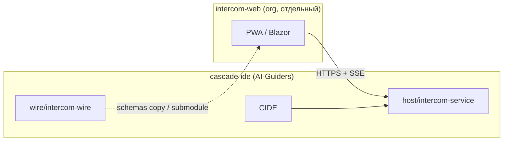

# ADR 0145: Intercom Web — PWA team client

| Поле | Значение |
|------|----------|
| **Статус** | Accepted |
| **Дата** | 2026-05-24 |
| **Amend** | 2026-05-24 — отдельный репозиторий org GitHub; wire/server — в [cascade-ide](https://github.com/AI-Guiders/cascade-ide) |
| **Связь** | [0144](0144-intercom-team-transport-cide-sync-and-reference-service.md) transport · [0146](0146-intercom-wire-canonical-protocol-package.md) wire · [0132](0132-intercom-federated-transport-and-multi-client-boundary.md) multi-client |

## Резюме

**`intercom-web`** — браузерный team client (PWA): read+compose human channel через **reference** `host/intercom-service` и wire v1. Живёт в **отдельном репозитории** org GitHub, не в `cascade-ide`.

## Контекст

CIDE покрывает разработчика; PO/Lead/QA — браузер ([0132](0132-intercom-federated-transport-and-multi-client-boundary.md) фаза 3). IDE, wire и reference server — один продуктовый репо **cascade-ide**; web — другой runtime (браузер), другой релизный цикл, отдельный deploy — логично вынести в org.

## Решения

| Тема | Решение |
|------|---------|
| **Репозиторий** | **[AI-Guiders/intercom-web](https://github.com/AI-Guiders/intercom-web)** (MIT) |
| **Не в cascade-ide** | Не смешивать Node/Blazor web с Avalonia IDE в одном git |
| **Wire** | Канон: `cascade-ide/wire/intercom-wire/` — потребление через копию схем в CI, submodule, или raw URL на `main` (без NuGet на v1) |
| **API** | HTTP+SSE к развёрнутому `intercom-service` ([profile](../../wire/intercom-wire/profiles/reference-http-v1/openapi.yaml)); BFF не обязателен в v1 |
| **Стек (v1)** | SPA: Vite + React + TS + `vite-plugin-pwa` **или** Blazor WASM — выбор в репо web; ADR не диктует, если соблюдён wire |
| **Auth** | OAuth Authorization Code + **PKCE**; `redirect_uri` = `{origin}/auth/callback`; JWT + refresh (storage — решение web-репо) |
| **SSE** | `fetch` + stream parser + `Authorization: Bearer` (не голый `EventSource` без заголовка) |
| **CORS** | `Cors:AllowedOrigins` на сервере включает origin PWA |
| **Не v1** | Skia-лента, полный slash, agent BFF, attach re-resolve, team-console + Mission |

## Граница репозиториев

| Компонент | Репозиторий |
|-----------|-------------|
| Wire, ADR, reference server, IDE transport | **cascade-ide** |
| Browser client | **intercom-web** (org) |
| NuGet wire | Не v1 |

## Последствия

- Web-релизы без пересборки IDE.
- В web-репо — свой CI (build PWA, lint, e2e).
- Нужны TLS + OAuth redirect URI production для домена PWA.
- Deep link в CIDE: `cascade-ide://` или документированный URL.

## Не цели (v1)

- MCC / SA dashboard ([0132](0132-intercom-federated-transport-and-multi-client-boundary.md) фаза 4).
- Fan-out `message_stream_delta`, clarification events.
- E2EE, read receipts.
