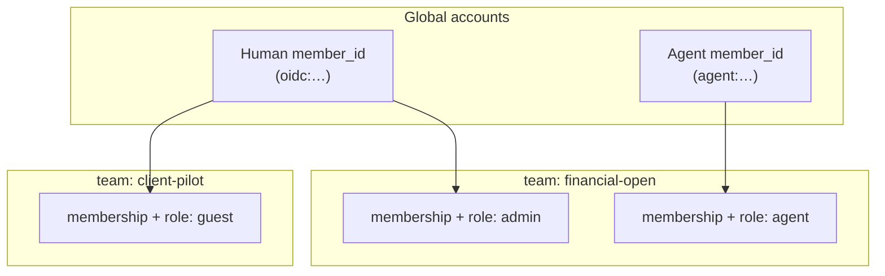
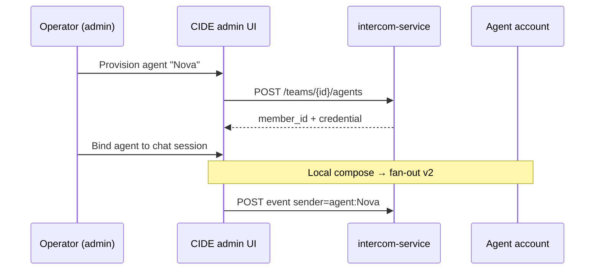

# ADR 0147: Intercom — team identity, per-team roles, agent accounts и admin из CIDE

| Поле | Значение |
|------|----------|
| **Статус** | Accepted |
| **Дата** | 2026-05-24 |
| **Расширяет** | [0144](0144-intercom-team-transport-cide-sync-and-reference-service.md) §2.2, §8, §10, §11; закрывает часть open questions [0144](0144-intercom-team-transport-cide-sync-and-reference-service.md#adr0144-history) |

## Связанные ADR

| ADR | Роль |
|-----|------|
| [0144](0144-intercom-team-transport-cide-sync-and-reference-service.md) | Team transport, `member_id`, human-only sync v1, reference `intercom-service` |
| [0145](0145-intercom-web-pwa-team-client.md) | Web client — compose v1; **не** server/team admin v1 |
| [0146](0146-intercom-wire-canonical-protocol-package.md) | Wire schemas; расширения identity — отдельный PR в `wire/intercom-wire/` |
| [0142](0142-intercom-open-wire-pluggable-transports.md) | Pluggable transport; admin API — часть reference profile |
| [0132](0132-intercom-federated-transport-and-multi-client-boundary.md) | Multi-client; MCC/team-console admin — фаза 4+, не замена CIDE admin для dev |
| [0080](0080-intercom-naming-and-multi-party-channel-model.md) | Канал: human + agent + system в эфире |
| [0143](0143-intercom-feed-participant-lens.md) | Lens Agents; transport identity агента ≠ локальный pseudo-name |
| [0038](0038-agent-facade-ai-provider-and-tool-orchestration.md) | Контуры агента в CIDE; привязка к agent account |
| [0028](0028-user-settings-toml-localappdata-and-secrets.md) | Секреты agent credential, refresh human OAuth |
| [0138](0138-cockpit-command-line-and-parametric-ranges.md) | Slash/CCL как поверхность admin-команд |

### Вне ADR

| Документ | Роль |
|----------|------|
| [host/intercom-service/README.md](../../host/intercom-service/README.md) | Dev deploy; wizard в CIDE ссылается сюда |
| [wire/intercom-wire/profiles/reference-http-v1/openapi.yaml](../../wire/intercom-wire/profiles/reference-http-v1/openapi.yaml) | Admin/membership endpoints — amend profile |

## Резюме

- **Учётная запись (account)** — глобальная сущность с стабильным `member_id`; **членство в team** — отдельная запись с **ролью per team** (один человек — admin в team A, guest в team B).
- **Human login** — **passwordless-first:** OIDC + PKCE через IdP (passkeys/2FA — у провайдера); без паролей Intercom.
- **Агент** — полноценная УЗ (`member_kind: agent`); право **выбрать display name** в рамках policy team.
- **Join policy** — default `invite_required` (**любой** IdP); optional `github_org` только для GitHub.
- **Display name** — user default (редко меняется) + optional nickname per team (§2.4).
- **CIDE** — primary admin client; teams/projects server-managed; workspace resolve §2.3.1; **волны** §2.3.2.

---

## Контекст

[0144](0144-intercom-team-transport-cide-sync-and-reference-service.md) зафиксировал team transport, OIDC → JWT и плоскую модель `TeamMemberEntity` (join без роли). Пилот с двумя CIDE уже требует:

1. **Кто может** создавать topics, приглашать, поднимать reference server, выдавать agent credentials.
2. **Разные команды** — один оператор в нескольких `team_id` с **разными ролями**; workspace привязывается через **project → repos** ([0144](0144-intercom-team-transport-cide-sync-and-reference-service.md) §2.3), не через TOML в git.
3. **Идентичность агента** — при fan-out ([0144](0144-intercom-team-transport-cide-sync-and-reference-service.md) §10 фаза 4) сообщения агента должны быть **узнаваемы в ленте** (имя, аватар/ glyph, lens [0143](0143-intercom-feed-participant-lens.md)), а не только локальный label в одном CIDE.

Сегодня администрирование reference server — README + ручной `dotnet run` + правка `appsettings`. В CIDE есть transport settings (Connect/Disconnect), но нет **team/server admin** surface. [0145](0145-intercom-web-pwa-team-client.md) сознательно не берёт team-console v1.

---

## Проблема

| # | Проблема |
|---|----------|
| 1 | **Плоское membership** — нет роли per team; нельзя выразить «тот же GitHub login — maintainer здесь, read-only там». |
| 2 | **Агент без УЗ** — локально `role: assistant`; на wire нет канонического `member_id` агента и policy на display name. |
| 3 | **Admin вне продукта** — барьер для пилота 2+ CIDE; дублирование с будущим web-console не определено. |
| 4 | **Смешение слоёв** — путаница между transport `sender_role`, team **RBAC** и UI participant lens. |

---

## Решение

### 1. Термины (нормативно)

| Термин | Значение |
|--------|----------|
| **Account (УЗ)** | Глобальная запись участника Intercom с каноническим `member_id`. |
| **Human account** | УЗ после OIDC (`issuer` + `sub` → `member_id`, см. [0144](0144-intercom-team-transport-cide-sync-and-reference-service.md) §2.2). |
| **Agent account** | УЗ, созданная явно (provision); `member_kind = agent`; credentials — machine JWT / API key, не OIDC login. |
| **System account** | Зарезервировано для service/system sender (webhook, CI bot); v1.1+. |
| **Team membership** | Связь `(team_id, member_id)` + **`team_role`** + опциональные per-team overrides. |
| **Team role** | RBAC **внутри одного team**; не глобальная роль пользователя. |
| **Display name** | Имя в ленте; human — §2.4 (default пользователя + optional per-team); agent — §3 |
| **Server admin (CIDE)** | UI/slash для ops reference server и team policy — **не** супerset Production infra. |



### 2. Per-team roles (human и agent)

**Нормативно:** `team_role` хранится **только** на `TeamMembership`, не в JWT как единственный глобальный claim.

| `team_role` | Права (ориентир v1) |
|-------------|---------------------|
| `owner` | Как `admin` + promote/demote owners, delete team, смена `join_policy`; **co-owners** — см. §2.3 |
| `admin` | Members/invites, agent accounts, topics policy, CIDE server admin для team |
| `member` | Compose human messages, topics по policy, read members |
| `guest` | Read team feed; compose — опционально по team policy |
| `agent` | Только для `member_kind: agent`: append от имени агента, без admin |

**Правило:** один `member_id` **может** иметь разные `team_role` в разных `team_id`. API **всегда** проверяет `(team_id, member_id) → role` для маршрута.

**JWT (ориентир):** access token содержит `member_id`, `member_kind`; **не** embed полный список ролей всех teams (растёт). Сервер / CIDE cache: `GET /auth/me` → teams + roles; при admin action — refresh или scoped claim `team_id` + `team_role` в query/body.

**Первый human OIDC в пустой team:** auto-join как `owner` (DEV: `allowDevAutoJoin` → `admin`, см. [0144](0144-intercom-team-transport-cide-sync-and-reference-service.md) §8.1 amend).

#### 2.1 Join policy: invite token и GitHub org (не «или/или»)

**Сейчас в коде (MVP):** любой успешный OAuth с `team_id` в OAuth state → безусловный `JoinTeamAsync` — **временный пилот**, закрывается фазой 1.1.

**Принято v1.1:** team задаёт **`join_policy`** (одна активная policy на team). В продукте доступны **оба механизма** — invite token и GitHub org; team admin выбирает, какой режим включён. Default для production-like deploy — **`invite_required`**.

| `join_policy` | Когда | Поведение |
|---------------|-------|-----------|
| `invite_required` | **Default** (LAN/VPS после пилота) | В OAuth state или redeem **до** token exchange — одноразовый **invite token**; роль берётся из invite |
| `github_org` | Open-source / org-команда на GitHub | После OAuth GitHub — проверка membership в allowlisted org (и опционально repo collaborators); join с `default_team_role` |
| `first_owner` | Пустой team | Первый human → `owner`; дальше — по policy |
| `open` | **Только** `Development` + явный env | Как сегодня; **запрещён** в Production |

**Magic link (invite token)** — не отдельный login, а **пропуск к join** после того же OIDC:

1. Admin в CIDE: `POST /teams/{team_id}/invites` → `{ invite_id, token, expires_at, team_role }`.
2. Ссылка: `cascade-ide://intercom/join?team=…&invite=…` или копипаст token в Settings → Connect.
3. CIDE кладёт `invite_token` в OAuth state (или `POST /auth/redeem-invite` до login).
4. После GitHub/OIDC callback сервер: валидный token → `JoinTeamAsync` с ролью из invite → consume token (single-use или N-use — в invite).

**Плюсы invite:** работает с **любым** OIDC; точная роль (`guest` vs `member`); внешний подрядчик без org; audit «кто пригласил».

**GitHub org allowlist** — **team policy**, не замена invite:

- Конфиг: `github_orgs = ["AI-Guiders"]`, optional `github_repos = ["AI-Guiders/cascade-ide"]`.
- На callback: GitHub API `GET /user/memberships/orgs/{org}` (или equivalent) с token exchange.
- Match → join с `default_team_role` (обычно `member`); **без** персонального invite.
- **Минус:** только GitHub; org membership ≠ «должен видеть этот team»; для client team text teams — invite.

**Рекомендация по сценариям:**

| Сценарий | Policy |
|----------|--------|
| Два CIDE, доверенная LAN | `open` (dev) → потом `invite_required` |
| Репо в org GitHub, вся org в team | `github_org` + `default_team_role = member` |
| PO/конtractor, другой IdP | `invite_required`, role `guest` |
| Первый bootstrap team | `first_owner`, затем admin переключает на `invite_required` |

Пример **team policy на сервере** (поля `TeamEntity` / admin API, не repo TOML):

```json
{
  "team_id": "financial-open",
  "display_name": "Financial Open",
  "join_policy": "invite_required",
  "default_team_role": "member",
  "join_github_orgs": ["AI-Guiders"]
}
```

`join_github_orgs` — только при `join_policy = "github_org"`.

**CIDE admin:** wizard показывает активную policy, кнопка «Создать invite», для `github_org` — проверка «твой login в org?» перед Connect.

#### 2.2 Identity providers (multi-OIDC, passwordless-first)

**Принято:** human УЗ — **без пароля Intercom**. Вход только через **OAuth 2.0 / OIDC + PKCE** (system browser в CIDE); см. **§2.5**. Список IdP — конфиг deployment; не форк wire.

| `provider_id` (ориентир) | IdP | Примечание |
|------------------------|-----|------------|
| `github` | GitHub OAuth | Первый в коде; org allowlist §2.1 |
| `google` | Google / Google Workspace | OIDC; optional domain allowlist v1.2 (`hd` claim) |
| `microsoft` | Microsoft Entra ID / personal | OIDC (`login.microsoftonline.com` / tenant) |
| `yandex` | Yandex ID | OIDC ([Yandex OAuth](https://yandex.ru/dev/id/doc/en/)); `sub` + login |
| `linkedin` | LinkedIn | OIDC (OpenID Connect product); dev app + redirect URI |
| `gitlab` | GitLab.com / self-hosted | OIDC |
| `oidc` | Generic | Произвольный `authority` (Keycloak, Authentik, Okta, …) |

**API (ориентир v1.1):**

| Метод | Путь | Назначение |
|-------|------|------------|
| `GET` | `/api/v1/auth/providers` | Список `{ provider_id, display_name, enabled }` для UI Connect |
| `GET` | `/api/v1/auth/login?provider={id}&team_id=…` | Как сегодня; `provider` из registry |

**Конфиг сервера (sketch):** массив провайдеров в `appsettings` / env; секреты — vault, не git ([0028](0028-user-settings-toml-localappdata-and-secrets.md)).

```json
"Auth": {
  "Providers": [
    { "Id": "github", "Kind": "github", "ClientId": "…", "ClientSecret": "…" },
    { "Id": "google", "Kind": "oidc", "Authority": "https://accounts.google.com", "ClientId": "…", "Scopes": "openid profile email" },
    { "Id": "microsoft", "Kind": "oidc", "Authority": "https://login.microsoftonline.com/{tenant}/v2.0", "ClientId": "…" },
    { "Id": "yandex", "Kind": "oidc", "Authority": "https://oauth.yandex.ru", "ClientId": "…" },
    { "Id": "linkedin", "Kind": "oidc", "Authority": "https://www.linkedin.com/oauth", "ClientId": "…" }
  ]
}
```

(Точные `Authority` / endpoints — по документации IdP при реализации; LinkedIn/Yandex могут требовать provider-specific adapter поверх generic OIDC.)

**`member_id` (нормативно, как [0144](0144-intercom-team-transport-cide-sync-and-reference-service.md) §2.2):**

- Generic OIDC: `oidc:{EscapeDataString(iss)}:{sub}`
- GitHub shortcut (существующий код): `github:{numeric_id}` — **сохраняется** для обратной совместимости
- **Один человек, два IdP** → **два** `member_id`, пока нет account linking (v2+, не v1)

**CIDE:**

- Settings → Connect: picker провайдера из `GET /auth/providers` (fallback: `github`, `oidc` как сегодня).
- User override `[intercom.transport].oauth_provider` — `provider_id` из registry.
- **Invite** (§2.1) **не зависит** от провайдера: contractor на Yandex и dev на GitHub — один team через invite.

**Join policy vs IdP:**

| Policy | IdP scope |
|--------|-----------|
| `invite_required` | **Все** провайдеры |
| `github_org` | Только `provider=github` |
| `idp_domain` (v1.2) | Generic: allowlist email domain / Entra tenant id / Google `hd` — **не** только GitHub |

**Не цель v1:** автоматический merge аккаунтов Google+Microsoft одного человека; SSO federation hub.

#### 2.3 Ownership: co-owners (не один «супер-user»)

**Принято v1.1:** у team **может быть несколько** `owner` (**co-owners**). Это **норма**, не исключение: maintainer-пара, bus factor, смена ответственного без «передачи короны» одному successor.

| Решение | Содержание |
|---------|------------|
| **Модель** | `owner` — роль на membership; **N ≥ 1** owners на team одновременно |
| **Первый bootstrap** | `first_owner` / пустой team → первый human = `owner` (можно сразу пригласить второго owner через invite) |
| **Promote** | Любой `owner` → `PATCH member` role=`owner`; `admin` **не** может promote в owner без уже существующего owner (anti-escalation) |
| **Demote** | `owner` → `admin`/`member` только если после demote остаётся **≥ 1** owner |
| **Delete team** | Любой `owner`; если owners > 1 — optional confirm второго owner (v1.1 soft: warning; v1.2: explicit ack) |
| **Self-demote last owner** | **Запрещено** (409 `last_owner`) |

**Почему не single owner only:**

| Single owner | Co-owners |
|--------------|-----------|
| Проще ACL | Ближе к реальной dev-команде (2+ maintainer) |
| Один bus factor | Нет блокировки при отпуске/болезни |
| «Transfer ownership» как обязательный ритуал | Promote/demote без смены «единственного» id |

**Transfer ownership** в UX = **promote нового owner** + опционально **demote себя**; отдельного глобального «team.owner_id» **нет** (v1.1). Опционально v2: `TeamEntity.PrimaryContactMemberId` для billing/support — не блокирует co-owners.

**API (amend):**

| Метод | Путь | Правило |
|-------|------|---------|
| `PATCH` | `/teams/{team_id}/members/{member_id}` | role=`owner` → caller must be `owner`; role≠owner on owner target → leave ≥1 owner |
| `DELETE` | `/teams/{team_id}` | any `owner` |

**CIDE:** Settings → Members → «Сделать owner» / «Снять owner»; slash `/intercom team member role …`.

**Anti-pattern:** ровно один owner как hardcoded invariant в DB — мешает co-owners и не даёт выигрыша, если есть правило «не demote последнего».

#### 2.4 Display name для human: default пользователя + optional per-team

**Принято v1.1:** имя в ленте — **не** «каждый раз из IdP» и **не** обязательный prompt при каждом join. Люди редко меняют имя → **один раз** задают **default**, при необходимости — nickname в конкретном team.

**Три слоя (разрешение для wire / UI):**

```text
effective_display_name(team) =
  TeamMemberEntity.TeamDisplayName   // optional per-team
  ?? MemberEntity.DisplayName        // default пользователя (self-chosen)
  ?? idp_display_name_fallback       // только при первом создании УЗ
```

| Слой | Где | Кто меняет | Когда |
|------|-----|------------|-------|
| **IdP claim** | OAuth userinfo | IdP | Первый login → seed, если default ещё нет |
| **Default (`MemberEntity.DisplayName`)** | Глобально на УЗ | **Сам пользователь** | Settings → Profile; редко |
| **Per-team (`TeamDisplayName`)** | Membership | **Сам пользователь** или admin | Optional; «Dmitry (client)» vs «Dima» в другом team |

**Правила:**

1. **Первый OIDC:** если `DisplayName` пуст — заполнить из IdP (`name`, `login`, …); предложить в CIDE «Как показывать в Intercom?» (можно принять as-is).
2. **Повторный login:** IdP **не перезаписывает** user default автоматически (имена меняют редко). Кнопка «Синхронизировать с {provider}» — явное действие.
3. **Join нового team:** использовать **default**; per-team override — опционально, не блокирует Connect.
4. **Сообщения на wire:** `sender.display_name` = `effective_display_name(team)`; `sender.member_id` — канон (anti-spoof §3).
5. **Admin** может сбросить per-team override; **не** меняет глобальный default без policy (moderation v1.2).

**CIDE:**

- Settings → Intercom → **Profile:** «Имя в Intercom» (default для всех teams).
- Settings → Intercom → **Team X:** optional «Имя в этом team» (override).
- `/intercom profile name …` — правка default; `/intercom team profile name …` — per-team.

**API (amend):**

| Метод | Путь | Кто | Назначение |
|-------|------|-----|------------|
| `GET` | `/auth/me` | self | `display_name` (default) + `teams[]` с `effective_display_name` |
| `PATCH` | `/auth/me` | self | `{ "display_name": "…" }` — user default |
| `PATCH` | `/teams/{team_id}/members/me` | self | `{ "team_display_name": "…" \| null }` — set/clear override |

`GET /auth/me` → `teams[]`: `{ team_id, team_role, display_name }` где `display_name` = **effective** для этого team.

#### 2.5 Passwordless-first (современный вход)

**Принято:** продуктовая норма для human — **passwordless**; Intercom **не** хранит пароли, secret questions, TOTP seeds и **не** показывает форму login/password в CIDE или web v1.

| Слой | Модель |
|------|--------|
| **Human → Intercom** | IdP login (browser) → Intercom JWT + refresh в secrets ([0028](0028-user-settings-toml-localappdata-and-secrets.md)) |
| **Passkeys / WebAuthn** | На стороне **IdP** (Google, Microsoft, Apple, Authentik, …) — Intercom не дублирует |
| **2FA / Authenticator** | IdP policy (TOTP, push, hardware key) — см. обсуждение §2.2; не в `intercom-service` |
| **Agent → API** | Machine credential (JWT refresh / scoped token) — не пароль человека |
| **DEV bootstrap** | Shared `Bearer` token — только Development; **не** «passwordless exception» в Production |

**UX CIDE (норма):**

- Кнопки «Connect with GitHub / Google / …» — **не** поля email/password.
- System browser / loopback callback + PKCE ([0144](0144-intercom-team-transport-cide-sync-and-reference-service.md) §8).
- Сессия: refresh token в OS-backed store; повторный Connect — только если refresh revoked/expired.

**Passkeys в practice:** оператор включает passkey в Google/Microsoft/GitHub — при Connect видит **Face ID / Windows Hello / security key** у IdP; для Intercom это прозрачно (тот же OIDC code flow).

**Enterprise:** team может выбрать **Authentik / Entra / Keycloak** с mandatory WebAuthn + invite — единая passwordless policy для всех clients ([0145](0145-intercom-web-pwa-team-client.md)).

**Не v1 (осознанно):**

- Native WebAuthn **напрямую** к `intercom-service` (свой passkey registry) — дублирует IdP; v2+ только при отдельном RFC.
- «Magic link email» как primary login — допустим **через** IdP, не как home-grown email+token store в Intercom.

**SSH / VPS** (ops) — не пользовательский login в team; см. infra в [0144](0144-intercom-team-transport-cide-sync-and-reference-service.md) §8 deployment.

### 3. Agent accounts и право на имя

#### 3.1 Provision

| Шаг | Кто | Действие |
|-----|-----|----------|
| 1 | `admin` / `owner` team | Создать agent account (`POST …/agents` или CIDE wizard) |
| 2 | Система | Выдать `member_id` вида `agent:{uuid}`, credential (JWT refresh или API key) |
| 3 | Admin или agent operator | Задать **`display_name`** (и optional `short_label`, avatar glyph) |
| 4 | Policy | Team может требовать **approve** смены имени admin-ом |

**Нормативно:** агент **имеет право выбрать имя** при создании и сменить его позже, если policy team не запрещает; имя **не** равно произвольной строке в payload без привязки к УЗ (anti-spoof).

#### 3.2 Отображение vs wire

| Поле envelope `sender` | Human | Agent (fan-out v2) |
|------------------------|-------|---------------------|
| `member_id` | OIDC-derived | `agent:{uuid}` |
| `display_name` | §2.4 effective per team | Выбранное имя agent account |
| `sender_role` | `human` | `agent` |
| `client_kind` | `cide` \| `web` | `cide` \| `service` |

**Локально до fan-out:** CIDE может показывать agent lens без transport; при publish — только через provisioned account ([0144](0144-intercom-team-transport-cide-sync-and-reference-service.md) §10).

**Оператор-человек (v1.1 extension):** optional wire extension `operator_member_id` — кто нажал «отправить от агента»; не подменяет `sender.member_id` агента.

#### 3.3 Привязка к CIDE

| CIDE контур | Привязка |
|-------------|----------|
| Chat agent (MAF/LLM) | Session → `agent_member_id` из team settings или выбор в composer |
| Autonomous agent [0038](0038-agent-facade-ai-provider-and-tool-orchestration.md) | Credential agent account в secrets [0028](0028-user-settings-toml-localappdata-and-secrets.md) |
| Cursor ACP | External — без transport identity v1; локальный lens only |

### 4. CIDE как admin surface

**Принято:** для пилота reference path **администрирование server + team policy** — в **CIDE**, не в отдельной web-консоли v1.

| Зона | CIDE (да) | Не CIDE |
|------|-----------|---------|
| Start/stop **local** `intercom-service` | ✓ | — |
| Health, SSE status, версия API | ✓ | — |
| Members, roles, invites | ✓ | intercom-web v1 |
| Agent accounts + rename | ✓ | — |
| OAuth App wizard (hints, callback URLs) | ✓ | — |
| TLS, reverse proxy, vault secrets | hints only | VPS ops |
| HA / shared DB | status read-only v1.1 | ops (EF provider из конфига, § [0144](0144-intercom-team-transport-cide-sync-and-reference-service.md) §3.1) |

**UI (ориентир):**

1. **Settings → Intercom → Team & Server** — панель + статус.
2. **Slash** (intent-catalog): `/intercom server …`, `/intercom team …`, `/intercom agent …` — паритет с IDE commands; preview через catalog [0138](0138-cockpit-command-line-and-parametric-ranges.md).

**Паритет клиентов:** `intercom-web` и будущий team-console **могут** вызывать тот же admin API позже; CIDE остаётся **first** admin client для dev-команды.



### 5. HTTP API sketch (reference profile amend)

Базовый путь: `/api/v1`. Все маршруты — Bearer JWT + проверка `team_role`.

| Метод | Путь | `team_role` min | Назначение |
|-------|------|-----------------|------------|
| `GET` | `/auth/me` | — | `member_id`, default `display_name`, **teams[]** `{ team_id, team_role, display_name }` (effective) |
| `POST` | `/teams` | bootstrap | Создать team (первый owner) — server-managed ([0144](0144-intercom-team-transport-cide-sync-and-reference-service.md) §2.1) |
| `PATCH` | `/teams/{team_id}` | `owner`/`admin` | `display_name`, `join_policy`, policy JSON |
| `PATCH` | `/auth/me` | self | User default `display_name` (§2.4) |
| `PATCH` | `/teams/{team_id}/members/me` | self | Per-team `team_display_name` set/clear |
| `GET` | `/teams/{team_id}/members` | `member` | Список members + roles + effective display names |
| `PATCH` | `/teams/{team_id}/members/{member_id}` | `admin` | Смена role, guest ban; optional clear чужого `team_display_name` (v1.2) |
| `POST` | `/teams/{team_id}/invites` | `admin` | Создать invite token (`team_role`, TTL, max_uses) |
| `POST` | `/auth/redeem-invite` | — | Optional: привязать invite к OAuth state до callback |
| `POST` | `/teams/{team_id}/agents` | `admin` | Provision agent account |
| `PATCH` | `/teams/{team_id}/agents/{member_id}` | `admin` or self-agent | Display name, revoke credential |
| `GET` | `/teams/{team_id}/admin/health` | `admin` | Extended health (queue, SSE clients) — v1.1 |
| `GET` | `/resolve/workspace-context` | member | repo URL(s) → projects, teams, `suggested_team_id` ([0144](0144-intercom-team-transport-cide-sync-and-reference-service.md) §2.3.1) |

**CIDE workspace resolve (§ [0144](0144-intercom-team-transport-cide-sync-and-reference-service.md) §2.3.1):**

1. On workspace/solution open: normalize `origin` → lookup **`[intercom.transport.workspace_hints]`** (LocalAppData).
2. If connected: `GET /resolve/workspace-context` → update hint; prefill `team_id` if empty or user confirms.
3. Strangler: `IntercomTeamManifestResolver` only if no hint; write hint with `source = manifest_strangler`.
4. Manual team change → hint update `source = manual`.
5. `/auth/me` without team → clear stale hint entry.

**CIDE local host** (не HTTP server API): process supervisor в IDE — `IntercomServerHostService` (имя ориентир), конфиг порта из `launchSettings` / user override.

### 6. Data model amend (reference server)

Расширение [Entities.cs](../../host/intercom-service/src/IntercomService/Data/Entities.cs):

| Сущность | Поле | Тип |
|----------|------|-----|
| `MemberEntity` | `MemberKind` | `human` \| `agent` \| `system` |
| `MemberEntity` | `DisplayName` | **User default** (self-chosen; seed from IdP once) |
| `MemberEntity` | `AvatarGlyph` | optional string (agents / v1.2 humans) |
| `TeamMemberEntity` | `TeamRole` | см. §2 |
| `TeamMemberEntity` | `TeamDisplayName` | optional per-team override (§2.4) |
| `AgentCredentialEntity` | v1.1 | hashed token, `member_id`, expires |
| `TeamEntity` | `JoinPolicy`, `JoinPolicyJson` | server-side §2.1 ([0144](0144-intercom-team-transport-cide-sync-and-reference-service.md) §2.1) |
| `TeamInviteEntity` | v1.1 | hashed token, `team_id`, `team_role`, expires, max_uses, created_by |
| `ProjectEntity`, `ProjectRepoEntity`, `TeamProjectEntity` | v1.2 | § [0144](0144-intercom-team-transport-cide-sync-and-reference-service.md) §2.3 |

Миграция WitDB — вместе с реализацией фазы 1.

### 7. Связь с transport v1 / v2

| Фаза | Identity | Transport |
|------|----------|-----------|
| **v1 (0144)** | Human OIDC; flat join → **0147 фаза 1** добавляет roles | Human-only fan-out |
| **0147 фаза 1** | Roles + CIDE admin read/write members | Без изменения wire |
| **0147 фаза 2** | Agent accounts; credentials | Локальный agent still local-only |
| **0147 фаза 3** | Agent fan-out | `sender_role: agent` + agent `member_id`; RFC amend [0144](0144-intercom-team-transport-cide-sync-and-reference-service.md) §10 |

---

## Фазы реализации

| Фаза | Содержание | Критерий «готово» |
|------|------------|-------------------|
| **1** | `TeamRole` + `/auth/me`; join policy; **`/resolve/workspace-context`** + workspace hints | Открыл clone → suggested team; guest blocked |
| **1b** | Project/repo links on server (minimal seed для resolve) | Resolve возвращает project + team для registered repo |
| **2** | CIDE local server host + health; admin slash `/intercom server` | Один клик dev server; второй CIDE подключается |
| **3** | Agent provision + rename policy; secrets в CIDE | Agent «Nova» в UI; credential rotate |
| **4** | Agent transport fan-out + extension `operator_member_id` | Два CIDE видят agent message с тем же именем |

---

## Последствия

### Положительные

- Мульти-team операторы без отдельных GitHub identities.
- Агенты — first-class участники эфира [0080](0080-intercom-naming-and-multi-party-channel-model.md), готовность к lens и audit.
- Пилот 2+ CIDE без «админки в README».

### Отрицательные / риски

- RBAC surface растёт — нужны тесты matrix role × endpoint.
- Agent credential leakage — rotate + short TTL; не commit secrets [0028](0028-user-settings-toml-localappdata-and-secrets.md).
- Имя агента: moderation/spoof — admin approve policy.

---

## Не цели

- Глобальная org-wide IAM (Entra groups sync) — v2+.
- Agent OIDC login «как человек».
- Полный SA dashboard ([0132](0132-intercom-federated-transport-and-multi-client-boundary.md) фаза 4) вместо CIDE для dev admin.
- E2EE, cross-team federation одного message store.

---

## Anti-patterns

| Anti-pattern | Почему |
|--------------|--------|
| Глобальная роль «admin» в JWT без `team_id` | Ломает multi-team |
| `display_name` только в payload без `member_id` | Spoof в ленте |
| Agent fan-out без provisioned account | Несогласованность lens / audit |
| Production OAuth secrets в CIDE settings git | [0028](0028-user-settings-toml-localappdata-and-secrets.md) |
| Дублировать admin только в web v1 | Барьер для dev пилота |
| Login/password форма в Intercom UI | Ломает passwordless-first §2.5; пароли — только IdP |
| TOTP/WebAuthn registry в intercom-service v1 | Дублирует IdP; attack surface |

---

## Открытые вопросы

1. ~~**Per-team display name**~~ → **§2.4:** user default на `MemberEntity` + optional `TeamDisplayName`; IdP не перезаписывает default на каждом login.
2. ~~**Invite model**~~ → **§2.1:** `join_policy` per team; default `invite_required`; optional `github_org`; `open` только Development.
3. **Agent credential shape** — JWT refresh vs opaque API key (склонность: symmetric с human refresh, scoped `member_kind=agent`).
4. ~~**Owner transfer**~~ → **§2.3:** co-owners (N≥1); promote/demote; запрет demote последнего owner.

---

<a id="adr0147-history"></a>

## История

| Дата | Изменение |
|------|-----------|
| 2026-05-24 | Accepted: per-team roles, agent accounts with display name, CIDE server/team admin, API sketch, фазы 1–4. |
| 2026-05-24 | §2.1: join policy — invite token (default) + optional GitHub org; закрыт open question invite model. |
| 2026-05-24 | §2.2: multi-OIDC registry (Google, Microsoft, Yandex, LinkedIn, …); `GET /auth/providers`. |
| 2026-05-24 | §2.3: co-owners (N≥1), promote/demote safeguards; закрыт open question owner transfer. |
| 2026-05-24 | §2.4: display name — user default + optional per-team; IdP seed once, без auto-sync. |
| 2026-05-24 | §2.5: passwordless-first; passkeys/2FA делегированы IdP; без login form в Intercom. |
| 2026-05-24 | Join policy example → server `TeamEntity`; align с [0144](0144-intercom-team-transport-cide-sync-and-reference-service.md) §2.1 server-managed teams. |
| 2026-05-24 | Data model hint: Project / ProjectRepo / TeamProject ([0144](0144-intercom-team-transport-cide-sync-and-reference-service.md) §2.3). |
| 2026-05-24 | CIDE workspace resolve flow + API `/resolve/workspace-context` ([0144](0144-intercom-team-transport-cide-sync-and-reference-service.md) §2.3.1). |
