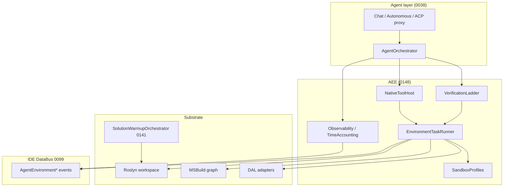
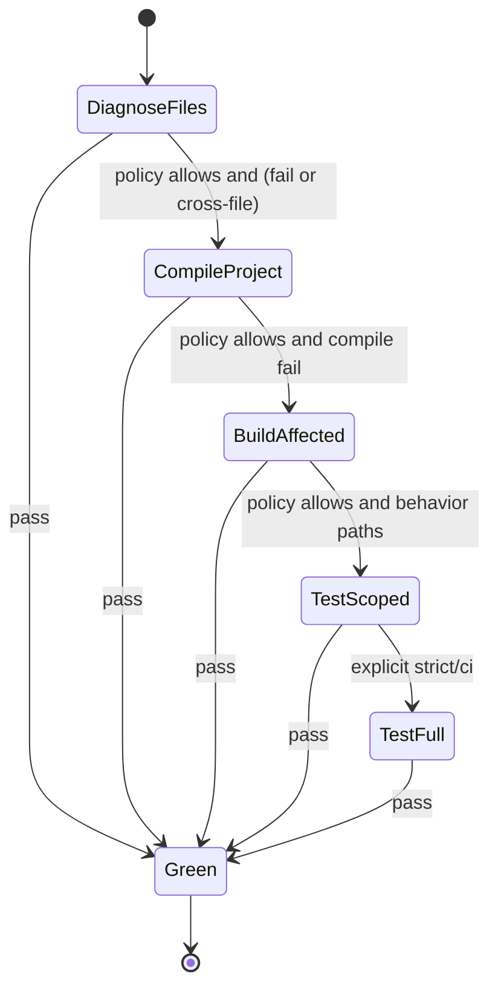

# ADR 0148: Agent Execution Environment — verification ladder, task runner и native tooling в standalone CIDE

| Поле | Значение |
|------|----------|
| **Статус** | Accepted · In progress (W1–W2 в коде; W3–W6 частично) |
| **Дата** | 2026-05-24 |
| **Дополняет** | [0038](0038-agent-facade-ai-provider-and-tool-orchestration.md) §«Направление» (единый оркестратор); [0141](0141-solution-scoped-warmup-orchestration.md) (warm substrate) |

## Связанные ADR

| ADR | Роль |
|-----|------|
| [0038](0038-agent-facade-ai-provider-and-tool-orchestration.md) | Фасад LLM, автономный JSON-цикл, `safety.*`; **техдолг:** нет единого оркестратора — закрывает этот ADR |
| [0008](0008-mcp-contracts-and-testable-infrastructure.md) | Контракты MCP, тестируемость, `IIdeMcpActions` |
| [0002](0002-debug-human-agent-parity.md) | Паритет человек ↔ агент на общих поверхностях |
| [0019](0019-shared-git-core-ide-and-git-mcp.md) | Git через shared core, не raw shell |
| [0020](0020-agent-reasoning-visibility-and-provider-limits.md) | Слои видимости: ответ / трасс / сырой лог |
| [0042](0042-pre-flight-planned-changes-and-review-before-apply.md) | Pre-flight и review before apply — ортогонально verify ladder |
| [0052](0052-agent-contract-cli-and-snapshot-tests.md) | Контракт агента, снапшот-тесты |
| [0058](0058-agent-roslyn-mcp-coupling-settings-toml.md) | TOML-сопряжение агент ↔ Roslyn |
| [0099](0099-ide-databus-typed-events-and-projections.md) | DataBus: push-события среды |
| [0102](0102-data-acquisition-layer-boundary-and-contract.md) | DAL — внешний I/O, не в VM |
| [0138](0138-cockpit-command-line-and-parametric-ranges.md) | CCL/slash — пульт агента и verify |
| [0141](0141-solution-scoped-warmup-orchestration.md) | Warm-up при open solution — **substrate** для AEE |
| [0147](0147-intercom-team-identity-roles-and-cide-server-admin.md) | Пример: 20 мин wall-clock на ADR→код; bottleneck = среда |

### Вне ADR

| Документ | Роль |
|----------|------|
| [MCP-PROTOCOL.md](../MCP-PROTOCOL.md) | Канон `IdeCommands`; external MCP — **optional tier** |
| [debug-human-agent-parity-v1.md](../debug-human-agent-parity-v1.md) | Паритет отладки |
| [north-star-cursor-mcp-cascade-workbench-v1.md](../design/north-star-cursor-mcp-cascade-workbench-v1.md) | Standalone CIDE vs Cursor shell |
| [playbook-agent-environment-v1.md](../design/playbook-agent-environment-v1.md) | Краткий playbook: два такта, W1, анти-паттерны |
| [naming-layers-v1.md](../design/naming-layers-v1.md) | Semantic ids: verify rungs, safety, Endsley SA, trace, anchor, CASA |
| [agent-verify-epoch-view-v1.md](../design/agent-verify-epoch-view-v1.md) | UX: Verify Epoch block, PFD instrument, green rule |

## Резюме

- **Проблема:** wall-clock агента доминирует **latency среды** (build, test, shell, lock файлов/БД), а не «скорость рассуждения» модели.
- **Решение:** **Agent Execution Environment (AEE)** — подсистемный контур: **native tools** (Roslyn in-proc; build/test via supervised host), **Verification Ladder**, **Environment Task Runner**, **push** через DataBus, **sandbox**.
- **MLP (Minimum Lovable Product):** оператор видит **живой прогресс**, **отмену**, **разложение времени** reasoning vs environment; агент по умолчанию **не гоняет full suite**; Roslyn/build/test — **through-runner**, не блокирующий shell в чате.
- **Идеал:** reasoning и verify **пайплайнятся**; warm substrate из [0141](0141-solution-scoped-warmup-orchestration.md); batch native API; изолированные dev-сервисы; тот же AEE для человека (CCL) и агента ([0002](0002-debug-human-agent-parity.md)).
- **Enabler:** C# / solution verify — **library-first open stack** (.NET MIT/Apache): Roslyn in-proc, MSBuild/VSTest через **supervised host** или библиотеки — не форк `dotnet.exe` (§2.3, §5.2).

**Нормативно:** shell — escape hatch. External MCP ([0008](0008-mcp-contracts-and-testable-infrastructure.md)) — polyglot at `safety.autonomous`; C# / solution — **native AEE** (§5, §5.2).

---

## Контекст

### Эмпирика (2026-05-24)

Реализация [0144](0144-intercom-team-transport-cide-sync-and-reference-service.md) + [0147](0147-intercom-team-identity-roles-and-cide-server-admin.md) «целиком» заняла **~20 минут wall-clock**. Большая доля — не проектирование, а:

| Фактор | Пример |
|--------|--------|
| `dotnet build` / `dotnet test` | 5–30+ с × N итераций |
| Lock WitDB / dev DB | 500 на `/auth/me` до `RecreateDatabaseOnStart` |
| xUnit + shared factory | порядок тестов, duplicate PK |
| Serial round-trip | правка → ждём → правка |

**Вывод:** для standalone CIDE UX агента определяется **Execution Environment**, не только промпт и модель.

### Standalone vs Cursor / external agent

| Cursor / внешний агент | Standalone CIDE (целевое) |
|------------------------|---------------------------|
| Shell как универсальный API | Solution model in-process |
| Каждый MCP — subprocess + JSON | Native tools + optional MCP |
| Build = блокирующий терминал в сессии | Runner + push events |
| Общий workspace, риск lock | Sandbox profiles для side effects |
| Оператор не видит «где время» | Time accounting + instrument |

North-star: [north-star-cursor-mcp-cascade-workbench-v1.md](../design/north-star-cursor-mcp-cascade-workbench-v1.md) — переход **из** Cursor **в** контур, где среда **принадлежит IDE**.

### Когнитивный vs средовой такт

| Такт | Ограничение | Типичный dev tooling |
|------|-------------|----------------------|
| **Когнитивный** | Скорость мышления (оператор; агент ×10–×100) | Не учитывается |
| **Среды** | Build, test, shell, I/O, lock, cold start | **Единственный** bottleneck в UX |

Классический tooling (shell, full rebuild, blocking test) оптимизирован под **темп человека**, не под **bandwidth мышления**. AEE снимает разрыв не «быстрее токены», а **сопоставлением среды с когнитивной скоростью** — ladder, runner, push, warm substrate. Playbook: [playbook-agent-environment-v1.md](../design/playbook-agent-environment-v1.md).

### Открытый .NET stack (стратегический enabler)

**Принято:** standalone moat AEE опирается на то, что **весь C# / solution pipeline — открытый и библиотечный** (MIT / Apache 2.0 в исходниках). CLI (`dotnet build`, `dotnet test`, `dotnet format`) — **тонкая оболочка** над теми же API; Cursor/MCP/shell-first **всегда** платит subprocess + cold workspace + сериализацию.

| Слой | Репозиторий (ориентир) | Лицензия (исходники) | Роль в AEE |
|------|------------------------|----------------------|------------|
| Runtime, host (`hostfxr`) | [dotnet/runtime](https://github.com/dotnet/runtime) | MIT | Host in-proc tools |
| SDK / `dotnet` CLI | [dotnet/sdk](https://github.com/dotnet/sdk) | MIT | Escape hatch; не primary |
| Сборка SDK «целиком» (VMR) | [dotnet/dotnet](https://github.com/dotnet/dotnet) | MIT | Дистрибьюторы (Red Hat, Canonical); **не** цель CIDE как IDE |
| MSBuild | [dotnet/msbuild](https://github.com/dotnet/msbuild) | MIT | `compile.project`–`build.affected` |
| Roslyn (compile, analyze, **format**) | [dotnet/roslyn](https://github.com/dotnet/roslyn) | MIT | `diagnose.files`; format in-proc |
| `dotnet format` (код) | в [dotnet/sdk](https://github.com/dotnet/sdk) ([dotnet/format](https://github.com/dotnet/format) archived) | MIT | Референс; **не** subprocess default |
| NuGet client | [NuGet/NuGet.Client](https://github.com/NuGet/NuGet.Client) | Apache 2.0 | Restore в runner |
| VSTest | [microsoft/vstest](https://github.com/microsoft/vstest) | MIT | `test.scoped` |
| Managed debugger | [Samsung/netcoredbg](https://github.com/Samsung/netcoredbg) | MIT | `build.affected`+ attach ([0002](0002-debug-human-agent-parity.md)) |

**Нормативно — три уровня стратегии (не равны по cost):**

| Уровень | Что | Для CIDE |
|---------|-----|----------|
| **A — native AEE (default)** | Roslyn in-proc; MSBuild/VSTest via **supervised worker** + open libs | **MLP**; shared warm substrate [0141](0141-solution-scoped-warmup-orchestration.md) |
| **B — свой CLI на тех же пакетах** | `cide verify`, `cide format` как thin host над NuGet | Опционально; runner всё равно in-proc или supervised child |
| **C — полный форк SDK / `dotnet`** | [dotnet/dotnet](https://github.com/dotnet/dotnet) source-build | **Вне scope** продукта IDE; отдельный продукт уровня дистрибьютора |

**Границы открытости (честно):**

| Не открыто / ограничено | Влияние на AEE |
|-------------------------|----------------|
| Visual Studio IDE | Не нужен — CIDE свой host |
| NuGet.org (сервис) | Клиент открыт; feed — внешний |
| Часть NuGet-пакетов VSTest (Code Coverage и др.) | Repo MIT; бинарники в пакете — [.NET Library License](https://github.com/microsoft/vstest/issues/4587); **не** default L3 path |
| C# debugger VS Code extension | Proprietary «VS family»; **netcoredbg** — MIT alternative |
| Prebuilt deps в полном source-build SDK | [dotnet/source-build](https://github.com/dotnet/source-build); **не** блокер уровня A |
| Торговая марка «.NET» / «dotnet» | Свой брендинг CLI; библиотеки — по лицензии |

**Техдолг (2026-05):** `McpDotnetBuildTestService` / `IDotnetCommandRunner` — subprocess `dotnet build|test|format`. **W2+:** L0 in-proc Roslyn; L1–L2 **supervised build host** (§5.2); shell — E-tier.

### Что уже есть (фрагменты)

| Компонент | ADR / код | Пробел |
|-----------|-----------|--------|
| LLM chat, ACP, автономный JSON | [0038](0038-agent-facade-ai-provider-and-tool-orchestration.md) | Нет единого **environment** слоя |
| Roslyn / build / test MCP | [0058](0058-agent-roslyn-mcp-coupling-settings-toml.md), host MCP | Subprocess + blocking; не runner |
| Solution warm-up | [0141](0141-solution-scoped-warmup-orchestration.md) | UX агента не подписан; нет verify |
| DataBus | [0099](0099-ide-databus-typed-events-and-projections.md) | Нет каноничных `AgentEnvironment*` events |
| Pre-flight / review | [0042](0042-pre-flight-planned-changes-and-review-before-apply.md) | Про **намерение правок**, не build/test ladder |
| `safety.observe`…`safety.autonomous` | [0038](0038-agent-facade-ai-provider-and-tool-orchestration.md) §5 | Про **IDE commands**, не verify depth |

---

## Проблема

| # | Проблема |
|---|----------|
| 1 | **Shell-first agent loop** — каждая проверка = новый процесс + полная сериализация контекста; UX «агент молчит 30 с». |
| 2 | **Нет лестницы verify** — агент (и человек через агента) по умолчанию тянет `dotnet test` solution вместо Roslyn → affected project → filtered tests. |
| 3 | **Нет оркестрации среды** — build/test/git/process конкурируют; нет cancel/coalesce/queue. |
| 4 | **Pull вместо push** — агент опрашивает shell; IDE уже **знает** diagnostics/build state, но не публикует в едином контракте. |
| 5 | **Side effects на operator workspace** — lock PDB/DB, `.witdb`, порты; агент ломает dev-сессию человека. |
| 6 | **Непрозрачное время** — оператор не отличает «модель думает» от «MSBuild жует». |
| 7 | **Дублирование контуров** — chat autonomous, ACP, будущий server-admin agent — разные ad-hoc вызовы shell. |

---

## Решение

### 1. Термины (нормативно)

| Термин | Значение |
|--------|----------|
| **AEE** (Agent Execution Environment) | Подсистема CIDE: native tools + runner + ladder + sandbox + observability. **Не** LLM-провайдер. |
| **Agent run** | Одна сессия работы агента (chat turn chain, autonomous task, slash job) с `run_id`. |
| **Environment task** | Единица работы среды: `roslyn_diagnose`, `build_project`, `test_filter`, `git_status`, `process_supervise`, … |
| **Verification ladder** | Упорядоченные **rungs** (`diagnose.files` … `test.full`): cheap → expensive; policy какая rung **достаточна** для «green». Legacy `L0…L4` — deprecated alias ([naming-layers-v1.md](../design/naming-layers-v1.md) §1). |
| **Native tool** | In-process API AEE (`IAeeTool`), без обязательного MCP/stdio. |
| **External tool** | MCP или shell — **tier E** (escape). |
| **Sandbox profile** | Именованный набор правил изоляции side effects (`operator`, `agent_ephemeral`, `agent_worktree`). |
| **Time slice** | Запись `{ phase: reasoning \| environment, duration_ms, detail? }` в trace run. |
| **Warm substrate** | Состояние от [0141](0141-solution-scoped-warmup-orchestration.md) + MSBuild/Roslyn workspace, которое AEE **переиспользует**. |



### 2. Agent Orchestrator (единая точка шага)

**Принято (идеал / MLP):** реализовать **AgentOrchestrator** — evolution пункта «Направление» из [0038](0038-agent-facade-ai-provider-and-tool-orchestration.md).

| Ответственность | Содержание |
|-----------------|------------|
| **Step model** | Один шаг = `{ plan?, tool_calls[], verify_policy?, sandbox_profile }` — общий для chat-autonomous и server-side jobs |
| **Tool routing** | Native first → DAL → external MCP (`safety.autonomous`) → shell (E, deny by default) |
| **Verify gate** | После mutate-tools: автоматический climb ladder до policy-green или явный fail |
| **Epoch contract** | Не treat green на snapshot **S** как валидный для правок **S′**; ждать `AgentRunCompleted` или stale (§8.2) |
| **Trace** | Append-only шаги в event log ([0045](0045-agent-chat-persistence-event-log-and-projections.md)) + optional export |
| **Safety** | Наследует `safety.*` [0038](0038-agent-facade-ai-provider-and-tool-orchestration.md); high-risk → [0042](0042-pre-flight-planned-changes-and-review-before-apply.md) |

**Не цель:** заменить `AiProviderManager` — orchestrator **ниже** LLM, **выше** AEE.

### 2.1. Layer naming (verify vs другие «L»)

Голые `L0…L4` в verify-контексте **deprecated**. Канон — semantic **`verify_rung`**; реестр всех «L» в стеке (safety, Endsley SA, trace, Intercom anchor, CASA memory): [naming-layers-v1.md](../design/naming-layers-v1.md). UX verify epoch: [agent-verify-epoch-view-v1.md](../design/agent-verify-epoch-view-v1.md).

| verify_rung (канон) | Legacy | Alias id (миграция) |
|---------------------|--------|---------------------|
| `diagnose.files` | L0 | `roslyn_file` |
| `compile.project` | L1 | `roslyn_project` |
| `build.affected` | L2 | `build_project` |
| `test.scoped` | L3 | `test_filtered` |
| `test.full` | L4 | `test_full`, `integration` |

### 3. Verification Ladder (нормативно)

**Принято:** каждый agent run задаёт **`verify_policy`**; default — **`standard`** (см. таблицу).

| verify_rung | Действие | Типичная latency | Когда «достаточно» |
|-------------|----------|------------------|---------------------|
| `diagnose.files` | Diagnostics по **затронутым** `.cs` | 100 ms – 2 s | Syntax/types в edited files |
| `compile.project` | Compile / semantic model **affected projects** | 2–15 s | Локальная правка без cross-project ripple |
| `build.affected` | `dotnet build` **project(s)**, не whole solution | 5–30 s | NuGet/refs изменились |
| `test.scoped` | `dotnet test --filter` по **trait/namespace/class** | 10–60 s | Behavior change, unit scope |
| `test.full` | Full suite, multi-project, dockerized deps | минуты | Release gate, explicit human/agent ask |

**Policy presets** (TOML `[agent.environment]`):

| Policy | Max rung без escalate | Escalate |
|--------|----------------------|----------|
| `minimal` | `diagnose.files` | Только по явному запросу |
| `standard` (**default**) | `build.affected` | `test.scoped` если `build.affected` green и были test-touching paths |
| `strict` | `test.scoped` | `test.full` перед «done» на main branches |
| `ci_parity` | `test.full` | — |

**Правила:**

1. **Monotonic climb:** `diagnose.files` fail → не запускать `test.full` «на удачу»; fix или stop.
2. **Coalesce:** N правок за T секунд → **один** `compile.project`/`build.affected`, не N.
3. **Verify epoch (одна цепочка):** в MLP **не более одного** активного verify run на workspace scope; новый verify после `coalesce_window_ms` → **implicit cancel predecessor** (§8.2).
4. **Incremental graph:** affected projects из Roslyn/MSBuild — **не** rebuild whole solution по умолчанию.
5. **Human parity:** `/agent verify quick|standard|strict` ([0138](0138-cockpit-command-line-and-parametric-ranges.md)) вызывает **тот же** ladder API.



### 4. Environment Task Runner

**Принято:** фоновый **`EnvironmentTaskRunner`** — единая очередь environment tasks.

| Аспект | Норма |
|--------|-------|
| **Concurrency** | Configurable cap (default 2): build + test не дублировать |
| **Priority** | Interactive (operator CCL) > agent run foreground > background warm |
| **Cancel** | `CancellationToken` per task; cascade cancel run |
| **Dedup** | Key `(kind, target, sandbox_id)` — merge pending identical |
| **Verify chains (MLP)** | Одна активная verify-цепочка на scope; новый run → cancel predecessor + `verify_snapshot_id` (§8.2) |
| **Progress** | Streaming: `Started`, `Progress`, `Completed`, `Failed`, **`Died`** на DataBus |
| **Artifacts** | Structured result DTO (не raw stdout только): `{ diagnostics[], test_results[], exit_code, log_ref? }` |
| **Persistence** | Last N results in LocalAppData для HUD; full log optional |

**Task kinds (канон v1):**

| `task_kind` | Описание |
|-------------|----------|
| `roslyn.diagnose` | `diagnose.files` |
| `msbuild.compile` | `compile.project` / `build.affected` (через **build host**, §5.2) |
| `dotnet.test` | `test.scoped` / `test.full` (через **test host** или supervised VSTest, §5.2) |
| `git.*` | через [0019](0019-shared-git-core-ide-and-git-mcp.md) |
| `process.supervise` | local `intercom-service`, tools with ports |
| `shell.escape` | **E-tier**, audit log + confirm L2+ |

### 5. Native Tool Host (`IAeeTool`)

**Принято:** AEE экспонирует **`IAeeTool`** — native API без stdio MCP. **Не всё** грузится в AppDomain CIDE: Roslyn/L0 — in-process; **L1+ build/test — supervised worker** (§5.2), чтобы не тащить MSBuild-таски и утечки в UI-процесс.

| Surface | MLP | Идеал |
|---------|-----|-------|
| `workspace.read/write` batch | ✓ | ✓ zero-copy paths |
| `roslyn.*` | ✓ in-proc | ✓ shared with [0058](0058-agent-roslyn-mcp-coupling-settings-toml.md) limits |
| `msbuild.affected` | ✓ via build host | ✓ cached graph; опц. in-proc MSBuild |
| `test.run_filter` | ✓ via test host | ✓ in-proc VSTest OM |
| `git.*` | read + status MLP | full через shared core |
| `solution.warm_status` | read | subscribe |

**Batch rule (идеал):** `ApplyPatchBatch` + `GetDiagnosticsBatch` — **один** IPC/orchestrator round-trip на «шаг агента».

External MCP остаётся для: polyglot LSP, tinvest, telegram, **third-party** — tier **E** или **L3 external** per [0038](0038-agent-facade-ai-provider-and-tool-orchestration.md).

#### 5.1. Карта ladder → open-stack API (норматив v1)

| Rung / task | Subprocess (legacy / E-tier) | **MLP (норма)** | Идеал / опция |
|-------------|------------------------------|-----------------|---------------|
| `diagnose.files` | Roslyn MCP stdio | **In-proc** shared workspace | — |
| format / cleanup | `dotnet format` | **In-proc** `Formatter` + code fixes | — |
| `compile.project` | cold `dotnet build` | **Supervised build host** (§5.2) | MSBuild in-proc / `BuildManager` |
| `build.affected` graph | full solution build | build host + incremental closure | in-proc graph cache |
| `test.scoped` | cold `dotnet test --filter` | **Supervised test host** (§5.2) | VSTest OM in-proc |
| debug attach | external DAP | netcoredbg / [0002](0002-debug-human-agent-parity.md) | — |

**Правило:** для C# / solution **сначала** библиотечный API (Roslyn, MSBuild, VSTest) — не fork SDK (§2.3). **Где MSBuild/VSTest** — MLP предпочитает **долгоживущий supervised worker** (named pipe / gRPC / stdio JSON), а не загрузку MSBuild-тасков в процесс Avalonia: warm graph и structured DTO без cold CLI, но **изоляция** от крашей/утечек компиляции.

**Правило fork:** форк `dotnet/sdk` или VMR **не** является допустимым решением verify в IDE.

#### 5.2. Supervised build/test host (MLP, W2)

**Принято (review 2026-05-25):** отдельный **долгоживущий worker-процесс** (child of CIDE, не «каждый раз новый `dotnet build`») держит warm MSBuild/VSTest graph; CIDE/AEE общается по IPC.

| Аспект | Норма |
|--------|-------|
| **Зачем** | MSBuild кэширует состояние, грузит таски в ALC — in-proc в UI = утечки, блокировки, риск краша кабины |
| **Не то же, что E-tier** | Worker **переиспользуется**; cancel/progress/structured result — как у runner |
| **Протокол** | MLP: named pipes или line-delimited JSON; идеал: gRPC |
| **Падение worker** | Runner перезапускает host; CIDE жив; fallback E-tier `dotnet build` с audit |
| **Roslyn** | Остаётся **in-proc** в CIDE (shared с [0141](0141-solution-scoped-warmup-orchestration.md)); build host **не** дублирует Roslyn workspace без необходимости |

**Открыто (идеал):** один host на build+test vs два; общий `AssemblyLoadContext` policy в worker.

### 6. Sandbox profiles (side effects)

**Принято:** agent run выбирает **`sandbox_profile`**; default **`agent_ephemeral`**.

| Profile | FS writes | Processes / ports | Git mutate | DB (dev services) |
|---------|-----------|-------------------|------------|-------------------|
| `operator` | Реальный workspace | Shared | Allowed (L2+) | Shared — **человек** |
| `agent_ephemeral` | Workspace OK; **deny** lock-sensitive dirs without copy | Ephemeral ports | Branch-only | Temp data dir |
| `agent_worktree` | Git worktree path | Isolated | Commit in worktree | Temp |
| `read_only` | Deny writes | Deny spawn | Deny | Read-only |

**Пример (0147 lesson):** `intercom-service` dev → runner поднимает instance с `Intercom:DataDirectory=%Temp%/cide-agent/{run_id}` и `RecreateDatabaseOnStart=true` — **не** трогает operator `data/intercom.witdb`.

**Контракт dev-сервиса (норматив для `agent_ephemeral`):** подмена data dir / connection string **работает только если приложение** читает конфигурацию (env, CLI, `IOptions`, layered config) — **не** хардкод единственного пути в `appsettings.json` без override.

| Требование | Зачем |
|------------|-------|
| Data directory / DB path — через **конфиг + env/CLI** | Runner может задать `Intercom:DataDirectory`, `ConnectionStrings__*`, и т.п. |
| Порты — через **конфиг** или ephemeral assignment | `process.supervise` не конфликтует с operator |
| Нет эксклюзивного lock файла БД в operator path без override | Иначе агент блокирует человека даже при «ephemeral» профиле |

**Если контракт не выполнен:** не обещать изоляцию только подменой ключей — использовать **`agent_worktree`** (W6), отдельный клон, или **read_only** + без локального dev DB. Идеал: FS-sandbox / symlink data root (отложено).

**Playbook:** требования к тестируемым сервисам и чеклист перед agent run — [playbook-agent-environment-v1.md](../design/playbook-agent-environment-v1.md) (§ sandbox, после review).

### 7. Warm substrate ([0141](0141-solution-scoped-warmup-orchestration.md) integration)

**Принято:** AEE **не дублирует** warm-up; **подписывается** на него.

| Событие 0141 | Действие AEE |
|--------------|--------------|
| `SolutionWarmupStateChanged → Running` | Agent run may start L0 immediately on open docs |
| `→ Ready` | Promote L1 cache hit rate; defer full solution build |
| Solution scope cancel | Cancel pending environment tasks for old scope |

**Идеал:** warm items `agent.msbuild_graph`, `agent.test_catalog` в каталоге [0141](0141-solution-scoped-warmup-orchestration.md) §2 (P2/P3).

### 8. Observability и Time Accounting

**Environment Consistency Matrix (W1–MLP)** — единый язык для runner, UI, orchestrator ([playbook](../design/playbook-agent-environment-v1.md) §«Матрица согласованности»):

| Зона риска | Норма (W1–MLP) | Не в MLP |
|------------|----------------|----------|
| **Stale context** | `verify_snapshot_id` (HEAD + dirty set) + coalesce 1.5 s; orchestrator: green на **S** ≠ green на **S′**; implicit cancel predecessor | Auto-rollback operator tree; worktree на каждый verify |
| **State bleeding** | **Fresh substrate bundle** per `test.scoped`+ task (data dir + ports + temp); recreate/wipe | Rollback transaction как единственный механизм |
| **Metrics** | `reasoning` \| `environment` \| `blocked` (только при активном env task) | `idle_user`, психометрия фокуса — **W3+** |
| **Source generators** | SG-aware `diagnose.files`; stale SG → `compile.project` supervised host | Дублировать 0141 warm отдельным драйвером |

**MLP must-have:**

```text
Agent run a1b2…
  Reasoning:           4.2s
  Environment:        16.8s
    diagnose.files:    0.8s  ✓
    build.affected:    9.1s  ✓  (IntercomService)
    test.scoped:       6.9s  ✓
  Status: green (standard policy) · max rung: build.affected
```

| Sink | Назначение |
|------|------------|
| **Chat trace** | Collapsible block per run ([0020](0020-agent-reasoning-visibility-and-provider-limits.md)) |
| **PFD instrument** | `AgentEnvironmentInstrument` — running task, cancel ([0021](0021-pfd-mfd-cockpit-attention-model.md), [0063](0063-instrument-deck-named-composition-one-anchor.md)) |
| **DataBus** | `AgentEnvironmentTaskChanged`, `AgentRunPhaseChanged` |
| **LocalAppData** | Rolling metrics: p50 build, cache hit — для [0054](0054-benchmarking-methodology-and-baselines.md) |

**Фазы time slice (уточнение):** `reasoning` | `environment` | **`idle_user`** (нет фокуса CIDE / ввода — не считать environment blocked) | `blocked` только при активном run и ожидании среды.

Playbook: [playbook-agent-environment-v1.md](../design/playbook-agent-environment-v1.md) §«Слепые зоны».

### 8.1. Концептуальные риски (review Orion 2026-05-25)

Четыре зоны, не покрытые runner/ladder «в лоб». Детали и чеклисты — playbook §«Слепые зоны»; здесь — норма для ADR.

#### 8.1.1. Stale context (verify epoch)

**Принято:** каждый environment verify run несёт **`verify_snapshot_id`** (git HEAD + hash затронутых путей на старт). Пока run `running`, правки в пересекающихся файлах помечают snapshot **stale** (DataBus + chat glyph).

| Поведение | MLP | Идеал |
|-----------|-----|-------|
| UI: «verify устарел, перезапусти» | ✓ | |
| Агент autonomous: не assume green без completed run на **текущем** snapshot | ✓ | |
| Когнитивный такт в `agent_worktree` до green | — | W4/W6 default для long agent runs |
| Auto-rollback operator tree к pre-verify | ✗ | только explicit human |

**Не заменяет** git revert агента: при failed run — **новый verify**, не откат «40 секунд мысли» без политики.

**Implicit cancel predecessor (MLP):** если стартует verify epoch **E2**, а **E1** ещё `running` на L1+ — runner шлёт `CancellationToken` в supervised host для E1, фиксирует `cancelled` в time slices, UI показывает одну активную цепочку. **Параллельные** verify-цепочки в одной session — запрещены (race в glyph / snapshot).

**Write → stale (human parity):** правка файла из `in_verification` dirty set **мгновенно** помечает epoch `stale` в DataBus (`AgentVerifyEpochStale`), даже если compile ещё не убит; опционально W3: визуальное «заморожение»/тускнение gutter для файлов epoch ([0140](0140-tci-slash-status-glyphs-and-args-counter.md) family).

#### 8.1.2. Ephemeral DB idempotency (fresh substrate per jump)

**Принято:** для L3+ integration каждый **новый** environment task (или новый climb после failed rung) получает **fresh substrate bundle** — не только `*.witdb`, а **data dir + выделенные порты + temp/mock scope** (recreate / wipe), если предыдущий run писал side effects.

| Поведение | Норма |
|-----------|-------|
| `agent_ephemeral` + L3 | Новый `{run_id}` data dir **или** explicit recreate перед task |
| Повтор `standard` verify подряд | Не reuse dirty WitDB без recreate |
| Test host | Может держать rollback fixture **внутри одного** task; между tasks — fresh |

#### 8.1.3. Source generators и L0

**Принято:** L0 использует Roslyn с **`GetSourceGeneratedDocumentsAsync`** (как roslyn-mcp); при проектах с SG — warm path из [0141](0141-solution-scoped-warmup-orchestration.md) или **не climb** с L0 на L1 без build host, если generated docs stale.

**Отклонено для MLP:** «прогретый GeneratorDriver в памяти CIDE» без интеграции с 0141 — дублирование; сначала переиспользовать HCI/sidecar и build host incremental.

#### 8.1.4. Metrics dilution (`idle_user` vs `blocked`)

**Принято:** time slices различают ожидание **среды** (`blocked`, только при активном environment task) и **отсутствие внимания оператора** (`idle_user`: потеря фокуса CIDE / нет ввода ≥ N с — порог в settings, W3+).

**Не смешивать** `idle_user` с `environment` в отчётах эффективности агента; LocalAppData rolling metrics могут фильтровать `idle_user` отдельно.

#### 8.1.5. Supervised host death (hard environment failure)

**Принято:** crash/OOM/segfault build или test host — **`AgentEnvironmentTaskDied`** (`task_id`, `host_kind`, `exit_code?`, `stderr_tail?`), не бесконечный wait на timeout.

| Действие | Владелец |
|----------|----------|
| Runner | Перезапуск supervised host; task → `died` |
| Orchestrator | Не assume green; системный alert агенту: среда аварийно завершилась (возможен user code: SG loop, static ctor) |
| UI | Glyph «environment died» + retry verify |

**Не путать** с `Failed` (тесты красные / compile errors) — `Died` = инфраструктура хоста.

### 8.2. Ссылка на матрицу

Сводная таблица W1–MLP — §8 «Environment Consistency Matrix»; детали §8.1; playbook §«Матрица согласованности» и §«Операционные инварианты».

### 9. UI / CCL ([0138](0138-cockpit-command-line-and-parametric-ranges.md))

| Команда | Действие |
|---------|----------|
| `/agent status` | Очередь runner, active run, sandbox |
| `/agent verify [minimal\|standard\|strict]` | Ladder без нового agent run |
| `/agent cancel` | Cancel run + runner tasks |
| `/agent last` | Time accounting последнего run |
| `/agent sandbox [profile]` | Default profile для session |

**Паритет:** те же команды доступны агенту как native tools (`ide_agent.*`).

### 10. DataBus events (sketch)

Namespace: `CascadeIDE.Agent.Environment`.

| Event | Payload (orientир) |
|-------|-------------------|
| `AgentRunStarted` | `run_id`, `sandbox_profile`, `verify_policy` |
| `AgentRunPhaseChanged` | `run_id`, `phase`: reasoning \| environment |
| `AgentEnvironmentTaskChanged` | `task_id`, `kind`, `state`, `progress?`, `message?` |
| `AgentEnvironmentTaskCompleted` | `task_id`, `result_summary`, `duration_ms` |
| `AgentEnvironmentTaskDied` | `task_id`, `host_kind`, `exit_code?`, `stderr_tail?` |
| `AgentVerifyEpochStale` | `run_id`, `verify_snapshot_id`, `reason`: write_in_epoch \| superseded \| cancel |
| `AgentRunCompleted` | `run_id`, `green`, `max_rung_reached` (semantic `verify_rung`), `time_slices[]` |

Projections: PFD `AgentEnvironmentInstrument`, chat Verify Epoch block ([agent-verify-epoch-view-v1.md](../design/agent-verify-epoch-view-v1.md)), strip glyph ([0140](0140-tci-slash-status-glyphs-and-args-counter.md) family).

### 11. Settings TOML ([0028](0028-user-settings-toml-localappdata-and-secrets.md))

```toml
[agent.environment]
default_verify_policy = "standard"
default_sandbox_profile = "agent_ephemeral"
runner_max_concurrency = 2
coalesce_window_ms = 1500
shell_escape_tier = "deny"   # deny | l3_only | allow_with_audit

[agent.environment.ladder]
diagnose_files_enabled = true
test_full_require_explicit = true
# legacy aliases (read until removal): l0_enabled, l4_require_explicit

[agent.environment.time_accounting]
show_in_chat = true
pfd_instrument_enabled = true
```

Roslyn limits — по-прежнему [0058](0058-agent-roslyn-mcp-coupling-settings-toml.md); AEE **читает** ту же секцию.

### 12. Human–agent parity ([0002](0002-debug-human-agent-parity.md), [0008](0008-mcp-contracts-and-testable-infrastructure.md))

| Surface | Человек | Агент |
|---------|---------|-------|
| Verify ladder | `/agent verify`, palette | orchestrator auto + tool |
| Cancel | `/agent cancel`, instrument | `run.cancel` |
| Diagnostics | Error list / F8 | `diagnose.files` native |
| Debug attach | Debug strip [0002](0002-debug-human-agent-parity.md) | `debug_attach` native (`build.affected`+) |
| Verify epoch UI | Chat Verify Epoch + PFD instrument | Same projection ([agent-verify-epoch-view-v1.md](../design/agent-verify-epoch-view-v1.md)) |

**Правило:** если агент может вызвать — человек имеет **эквивалентную** UI/CCL команду без MCP.

---

## MLP vs идеал

| Capability | **MLP** (shippable) | **Идеал** (полный AEE) |
|------------|---------------------|-------------------------|
| Verification ladder through `test.scoped` | ✓ | `test.full` + ci_parity |
| Task runner + cancel + progress | ✓ | Dedup + priority lanes |
| Time accounting in chat | ✓ | PFD instrument + baselines |
| Native Roslyn + filtered test | ✓ | Full MSBuild graph cache |
| Sandbox: ephemeral DB/ports | ✓ | Git worktree profile |
| AgentOrchestrator v1 | minimal step + verify | Full plan/review [0042](0042-pre-flight-planned-changes-and-review-before-apply.md) integration |
| Batch native tools | partial | Zero-copy batch |
| Warm substrate hooks | subscribe 0141 | Agent-specific warm items |
| Shell escape | audit + deny default | Policy per repo |
| External MCP | unchanged | Tier registry |

**MLP — не «урезанный продукт»:** оператор **любит** его, потому что агент **перестаёт висеть** на build/test без прозрачности. Идеал добавляет **изоляцию, batch, CI-parity, cockpit** — без смены архитектуры.

---

## Реализация (порядок поставки, не scope cut)

| Wave | Deliver | Зависимости |
|------|---------|-------------|
| W1 | `EnvironmentTaskRunner` + DataBus events + time slices | [0099](0099-ide-databus-typed-events-and-projections.md) |
| W2 | L0 in-proc Roslyn + L1–L2 via **supervised build host** + ladder policy | §5.2; E-tier subprocess только fallback |
| W3 | MLP UI: chat trace + `/agent verify\|cancel\|status` | [0138](0138-cockpit-command-line-and-parametric-ranges.md) |
| W4 | Sandbox ephemeral (DB/ports) + intercom pattern | [0147](0147-intercom-team-identity-roles-and-cide-server-admin.md) host |
| W5 | PFD instrument + warm hooks [0141](0141-solution-scoped-warmup-orchestration.md) | [0063](0063-instrument-deck-named-composition-one-anchor.md) |
| W6 | Batch native tools + worktree sandbox | [0019](0019-shared-git-core-ide-and-git-mcp.md) |

---

## Статус реализации (2026-05-27)

| Wave | Состояние | Артефакты (кратко) |
|------|-----------|-------------------|
| **W1** | **В коде** | `EnvironmentTaskRunner`, `IEnvironmentJobBackend`, DataBus-события, time slices |
| **W2** | **В коде** | `VerificationLadder`, `AgentRoslynL0Diagnostics`, `BuildTestHostFactory` (`supervised-inproc` \| `supervised-worker-process` \| `supervised-worker-daemon`), `CascadeIDE.BuildVerifyWorker` |
| **W3** | **Частично** | `AgentEnvironmentService`, slash `/agent verify\|cancel\|status\|last` (`ChatSlashAgentActions`); PFD instrument + Verify Epoch UI — spec [agent-verify-epoch-view-v1.md](../design/agent-verify-epoch-view-v1.md), **не в коде** |
| **W4** | **Частично** | `AgentSandboxManager` (ephemeral substrate); dev-service config contract — не полный |
| **W5** | **Частично** | L0 warmup paths из solution warm-up (`AgentL0WarmupPathCollector`, `[agent.environment]` в TOML) |
| **W6** | **Частично** | `StartVerifyBatch`, `AgentWorktreeSandbox`; batch native API / политики — не MLP-complete |

Дизайн worker/daemon: [build-verify-out-of-process-worker-v1.md](../design/build-verify-out-of-process-worker-v1.md).

**Не ставим `Implemented`:** MLP-контур ещё не стабилен на target hardware; открытые вопросы §Open questions (orchestrator ownership, verify epoch UX, host restart).

---

## Последствия

### Плюсы

- Wall-clock agent tasks падают за счёт ladder + coalesce + warm substrate.
- UX: оператор **видит** среду и может **отменить**.
- Standalone CIDE получает **moat** vs Cursor shell-loop.
- **Open .NET stack:** in-process verify на MIT/Apache libs — стратегический enabler без форка SDK (§2.3).
- Закрывает техдолг [0038](0038-agent-facade-ai-provider-and-tool-orchestration.md) §«Направление» #1.

### Минусы / риски

| Риск | Mitigation |
|------|------------|
| Дублирование Roslyn MCP vs native | Single library; MCP = thin wrapper over AEE |
| Сложность sandbox | Default `agent_ephemeral`; **dev-service config contract** (§6); worktree если контракт не выполнен |
| Stale verify + parallel edits | **verify_snapshot_id** + stale UI; worktree for long autonomous (§8.1.1) |
| Parallel verify chains | **Implicit cancel predecessor**; одна цепочка на scope (§8.1.1) |
| DB / port / temp state bleeding | **Fresh substrate bundle** per L3+ task (§8.1.2) |
| Metrics mix human idle + environment | **`idle_user`** W3+; MLP: `blocked` only on active env task (§8, §8.1.4) |
| L0 false negatives with SG | Generated documents + ladder policy (§8.1.3) |
| Supervised host crash | **`AgentEnvironmentTaskDied`** + host restart (§8.1.5) |
| MSBuild in UI process | **Supervised build host** (§5.2); in-proc MSBuild — идеал, не MLP gate |
| Runner bugs block agent | Escape hatch shell tier E + human takeover |
| Over-engineering | **MLP gate** чёткий; waves — порядок, не обязательность |

---

## Отклонённые альтернативы

| Альтернатива | Почему нет |
|--------------|------------|
| **Shell-only agent** (как Cursor default) | Bottleneck среды остаётся; не moat standalone |
| **MCP-only** (все tools subprocess) | Latency + JSON tax; Roslyn/build suffer most |
| **MSBuild fully in-proc в CIDE (MLP)** | Риск утечек/крашей UI; supervised host (§5.2) достаточен |
| **Full fork `dotnet` SDK as IDE requirement** | Cost дистрибьютора; библиотеки + worker (§2.3, §5) достаточны |
| **Full verify always (L4)** | 20-min → hours; wrong default |
| **No sandbox** («агент осторожен») | WitDB lock и подобное — уже воспроизведено |
| **Verify только в CI, не в IDE** | Поздний feedback; ломает agent loop |
| **Protobuf agent bus [0041](0041-protobuf-for-agent-and-ide-messages.md) v1** | Events DataBus JSON достаточно; protobuf later |

---

## Open questions

| # | Вопрос |
|---|--------|
| 1 | **Orchestrator ownership:** один `AgentOrchestrator` service vs partial в `AutonomousAgentService` + chat VM? |
| 2 | **ACP parity:** Cursor CLI через ACP — проксировать AEE или оставить external? |
| 3 | **L3 default filter:** auto from `[TestClass]` touched vs manual trait? |
| 4 | **CASCOPE:** новый analyzer «agent shell in Features/ without runner»? |
| 5 | **Cross-platform:** `process.supervise` on Linux/macOS — parity windows first? |
| 6 | **Build/test host IPC:** named pipes vs gRPC; один host vs build+test split? |
| 7 | **Sandbox без config contract:** auto-downgrade to `agent_worktree` vs hard fail? |
| 8 | **Verify epoch UX:** stale glyph — chat W1; PFD/gutter dim W3+ |
| 9 | **idle_user detection:** focus API Avalonia vs heuristic only? |
| 10 | **Host restart policy:** auto-restart vs require `/agent verify` after `Died`? |

---

## ADR0148-history

| Дата | Изменение |
|------|-----------|
| 2026-05-25 | Orion round 2: Environment Consistency Matrix; implicit cancel predecessor; substrate bundle; `TaskDied`/`EpochStale`; §8.1.5 host death |
| 2026-05-25 | Orion review: §8.1 stale context (verify epoch), DB fresh substrate, idle_user metrics, L0+SG; playbook §«Слепые зоны» |
| 2026-05-25 | Review: §5.2 supervised build/test host (MLP, не MSBuild in UI); §6 dev-service config contract; W2/risks/open Q обновлены |
| 2026-05-24 | §2.2–2.3: когнитивный vs средовой такт; открытый .NET stack (enabler, три уровня A/B/C, границы); §5.1 ladder→API; техдолг subprocess |
| 2026-05-27 | **Accepted · In progress:** W1–W2 + частично W3–W6 в `Features/Agent/Environment/`; статус синхронизирован с README |
| 2026-05-31 | Semantic `verify_rung` ids; naming registry [naming-layers-v1.md](../design/naming-layers-v1.md); Verify Epoch UX spec; legacy L0–L4 deprecated in normative prose |
| 2026-05-24 | Proposed: AEE, ladder, runner, MLP vs ideal; мотивация 0144/0147 wall-clock |
