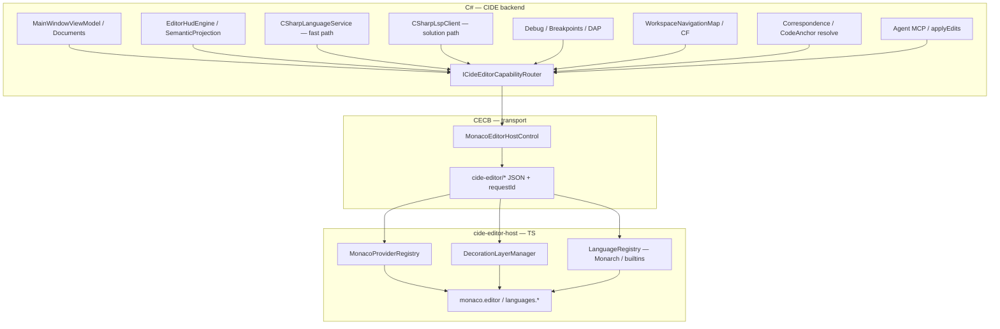
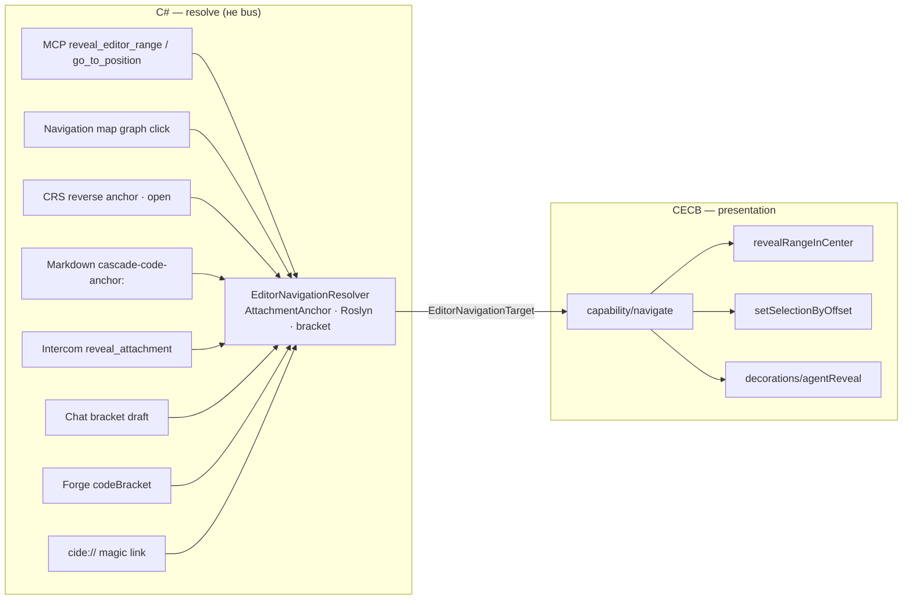

# ADR 0163: Monaco-native capability bus и полный перевод Forward-редактора

**Статус:** Proposed  
**Дата:** 2026-06-21  
**Заменяет / уточняет:** [0162](0162-monaco-forward-editor-webview2-host.md) §2.1 (dual-path `avalonia_edit`), §5 (фазы M6 «optional default») — **направление:** единственный Forward-хост = Monaco; AvaloniaEdit **выводится из Forward**, не из всего CIDE.  
**Дополняет:** [0103](0103-editor-hud-substrate-semantic-projection-and-surface-adapter.md), [0085](0085-editor-hud-inline-layer-and-hud-banner.md), [LANGUAGE-SERVICES-PLAN.md](../LANGUAGE-SERVICES-PLAN.md)

## Связанные ADR

| ADR | Роль |
|-----|------|
| [0162](0162-monaco-forward-editor-webview2-host.md) | WebView2 island, `cide-editor/*` v0, `IEditorSurfaceAdapter`, strangler M0–M6 |
| [0103](0103-editor-hud-substrate-semantic-projection-and-surface-adapter.md) | Субстрат HUD, hi-freq bounded-контур, адаптер поверхности |
| [0084](0084-agent-edits-editor-source-of-truth-presence-channel.md) | Versioned buffer, applyEdits |
| [0085](0085-editor-hud-inline-layer-and-hud-banner.md) | Inline vs HUD banner |
| [0152](0152-editor-control-flow-virtual-spacing.md) | CF gutter / virtual spacing |
| [0130](0130-editor-agent-range-reveal-without-selection.md) | Agent range reveal |
| [0128](0128-intercom-attachment-anchors-and-code-references.md) | **CodeAnchor** / `AttachmentAnchor` — file + line range + member |
| [0137](0137-intercom-message-code-correspondence.md) | L4 discourse ↔ code; gutter infer |
| [0155](0155-documentation-code-correspondence-and-architectural-drift.md) | Correspondence L0–L4, drift |
| [0156](0156-correspondence-mfd-surface-and-reverse-code-anchors.md) | CRS MFD; reverse anchors → CodeAnchor |
| [0157](0157-cide-magic-link-protocol.md) | `cide://` → IDE navigation |
| [0039](0039-workspace-navigation-affordances.md) | Карта намерений; graph → reveal |
| [0040](0040-lsp-launch-line-settings-toml-presets-and-environment.md) | LSP presets, OmniSharp |
| [0009](0009-strangler-migration-and-exceptions.md) | Strangler, удаление legacy после parity |

### Вне ADR

| Документ | Роль |
|----------|------|
| [editor-hud-inline-migration-inventory-v1](../design/editor-hud-inline-migration-inventory-v1.md) | Таблица Avalonia adorners → целевой владелец |
| [LANGUAGE-SERVICES-PLAN.md](../LANGUAGE-SERVICES-PLAN.md) | Roslyn in-process + LSP hybrid |
| `Assets/cide-editor/` | Bundled Monaco + bridge v1 |

---

<a id="adr0163-context"></a>

## 1. Контекст

### 1.1 Что мы костыляли в AvaloniaEdit

В Forward-редакторе на **AvaloniaEdit** значительная часть «IDE-ощущения» была **самописной презентацией**, а не API редактора:

| Область | Avalonia-подход | Боль |
|---------|-----------------|------|
| Squiggles / волны | `IBackgroundRenderer` | Z-order, redraw, hit-test вручную |
| Completion / signature | `EditorIntelligence` + Avalonia `Popup` | Не VS Code UX; дублирование LSP |
| Hover / Quick Info | `ToolTip` на `TextEditor` + debounce | Placement, race с кареткой |
| Reference highlights | Отдельный renderer | Нет связи с selection API |
| Inlay hints (`var` → type) | EOL renderer ([AvaloniaEdit #429](https://github.com/AvaloniaUI/AvaloniaEdit/discussions/429)) | Нет intra-line inlays |
| Breakpoints / debug line | `IBackgroundRenderer` + margin hit-test | Дублирование с DAP UI |
| Agent reveal | `EditorAgentRangeReveal` renderer | Отдельный lifecycle |
| CF gutter | Custom spacing generator + glyph renderer | Layout-хак |
| Подсветка синтаксиса | **TextMate** через AvaloniaEdit | Два стека тем (Avalonia + TM) |

[0103](0103-editor-hud-substrate-semantic-projection-and-surface-adapter.md) правильно отделил **субстрат** (`EditorHudEngine`, `SemanticProjectionPipeline`, DAL-полосы) от **поверхности**. Но реализация поверхности на AvaloniaEdit оставалась дорогой и неполной.

### 1.2 Что даёт Monaco «из коробки»

**Monaco Editor** (тот же движок, что под VS Code) уже предоставляет:

- `monaco.editor.create` + `ITextModel` + versioned edits
- **`deltaDecorations`** — слоистые decoration sets (аналог нашего `setId`)
- **`registerCompletionItemProvider`**, **`registerHoverProvider`**, **`registerSignatureHelpProvider`**
- **`registerDefinitionProvider`**, **`registerReferenceProvider`**, **`registerRenameProvider`**
- **`registerCodeLensProvider`**, **`registerInlayHintsProvider`**
- **`registerDocumentSemanticTokensProvider`** (LSP semantic highlighting)
- Built-in **minimap**, **sticky scroll** (опция), **glyph margin**, **folding**
- **Monarch** — декларативные грамматики для десятков языков в `vs/basic-languages`
- **Diff editor**, **multi-cursor**, **accessibility** — без Avalonia adorners

Мы **не обязаны** переносить Avalonia-рендереры 1:1; цель — **подключить те же capability-бэкенды CIDE** к нативным Monaco provider API.

### 1.3 Текущее состояние (ветка `feature/monaco-forward-editor-m0`)

- Forward dock: **только** `MonacoEditorHostControl` (Avalonia `TextEditor` удалён).
- Bridge v1: `setModel`, `applyEdits`, `setDecorations`, LSP-like **request/response** для completion/hover/signature, CF glyphs, debug/breakpoint overlays, agent reveal, epoch dim.
- Roslyn fast path: `CSharpLanguageService` из C# по `editor/requestCompletion` и т.д.
- **Проблема v1:** bridge — **плоский список сообщений**, провайдеры регистрируются вручную в `cide-editor-bridge.js`; нет единой **шины capabilities**, нет LSP как первого класса, TextMate/Monarch стратегия не зафиксирована.

### 1.4 Зачем отдельный ADR от 0162

[0162](0162-monaco-forward-editor-webview2-host.md) фиксировал **опциональный** dual-path и осторожный strangler. Практика M0–M3+ показала:

1. Parity по UX **быстрее** через Monaco API, чем через доводку Avalonia adorners.
2. Поддерживать **два** forward-хоста — двойная стоимость (inventory в [editor-hud-inline-migration-inventory-v1](../design/editor-hud-inline-migration-inventory-v1.md)).
3. Нужен **явный контракт** между CIDE backend и Monaco — не разрастающийся `switch` в bridge.js.

Этот ADR фиксирует **полный перевод Forward** и архитектуру **CIDE Editor Capability Bus**.

---

<a id="adr0163-decision"></a>

## 2. Решение

### 2.1 Направление продукта

1. **Forward-редактор = Monaco + WebView2** — единственный поддерживаемый хост для документов в `DocumentsDockView`.
2. **`[editor].forward_host = "monaco_webview2"`** — единственное значение в production; `avalonia_edit` **deprecated**, удаляется после sign-off чеклиста §6.
3. **AvaloniaEdit** остаётся в репозитории только как:
   - legacy тесты / strangler artifacts до удаления;
   - **не** как runtime path Forward.

4. **Субстрат [0103](0103-editor-hud-substrate-semantic-projection-and-surface-adapter.md) не меняется:** `EditorHudEngine`, `WorkspaceDiagnosticsCoordinator`, LSP hosts, agent MCP — по-прежнему в C#; меняется только **адаптер презентации** (`MonacoWebViewSurfaceAdapter` + bus).

### 2.2 CIDE Editor Capability Bus (CECB)

Вводим **шину capabilities** между **C# backend** и **Monaco host** — ортогонально DataBus [0099](0099-ide-databus-typed-events-and-projections.md) (editor hi-freq **не** в DataBus, см. [0103](0103-editor-hud-substrate-semantic-projection-and-surface-adapter.md)).



**Принципы bus:**

| Принцип | Смысл |
|---------|--------|
| **Capability-oriented** | Сообщения именуются по способности: `capability/completion`, `capability/hover`, `capability/codeLens`, `capability/semanticTokens`, `capability/decorations`, … — не по внутреннему классу C# |
| **Request / response** | Async: `requestId`, timeout, cancel (как сейчас completion/hover) |
| **Push / subscribe** | Decorations, theme, model, debug overlay — push с `setId` и version guard |
| **Router в C#** | `ICideEditorCapabilityRouter`: для `.cs` + LSP ready → LSP; иначе Roslyn; diagnostics — всегда из `WorkspaceDiagnosticsCoordinator` snapshot |
| **Thin JS** | `cide-editor-bridge.js` только: transport, registry, correlation — **без бизнес-логики Roslyn** |
| **Versioned document** | [0084](0084-agent-edits-editor-source-of-truth-presence-channel.md): `modelVersion` на все mutating push; reject on mismatch |

**Не дублировать LSP в кастомных сообщениях:** если capability есть в LSP 3.17 — bus **проксирует** к `CSharpLspClient`, Monaco provider делает `connection.sendRequest`. Кастомные `editor/requestCompletion` — **временный** fast path до полного LSP wiring (strangler).

### 2.3 Маппинг: Avalonia-костыль → Monaco-native

| Inventory ([migration doc](../design/editor-hud-inline-migration-inventory-v1.md)) | Monaco API | Bus / setId |
|-------------------------------------------------------------------------------------|------------|-------------|
| `EditorDiagnosticBackgroundRenderer` | `deltaDecorations` | `decorations/diagnostics` |
| `EditorIntelligence` completion | `registerCompletionItemProvider` | `capability/completion` |
| `EditorIntelligence` signature | `registerSignatureHelpProvider` | `capability/signatureHelp` |
| Inline hover / Quick Info | `registerHoverProvider` | `capability/hover` |
| Reference highlights | `deltaDecorations` + optional `registerDocumentHighlightProvider` | `decorations/highlights` |
| Inlay hints | `registerInlayHintsProvider` | `capability/inlayHints` |
| Breakpoints / debug line | `glyphMargin` + `deltaDecorations` `isWholeLine` | `decorations/breakpoints`, `decorations/debugLine` |
| Agent reveal [0130](0130-editor-agent-range-reveal-without-selection.md) | `deltaDecorations` + `revealRangeInCenter` | `decorations/agentReveal` |
| CF gutter [0152](0152-editor-control-flow-virtual-spacing.md) | `glyphMarginClassName` + optional `lineHeight` decoration | `decorations/cfGutter` |
| Epoch verify dim | CSS overlay on container | `editor/setEpochDim` |
| HUD **banner** (file-level) | **Остаётся Avalonia chrome** над WebView ([0085](0085-editor-hud-inline-layer-and-hud-banner.md)) | C# `StickyScrollHost` + optional Monaco stickyScroll |
| TextMate syntax | **Monarch / built-in languages** (§2.4) | `language/register` |

### 2.4 Correspondence, CodeAnchor и навигация — граница bus

**Correspondence (L0–L4), reverse anchors, CRS** ([0155](0155-documentation-code-correspondence-and-architectural-drift.md), [0156](0156-correspondence-mfd-surface-and-reverse-code-anchors.md)) — это **домен и поверхности MFD/PFD**, не Monaco. На bus попадает только **итог навигации в буфер** после резолва якоря.



**`EditorNavigationTarget` (C#, sketch):** `filePath`, `startLine`, `endLine`, `startColumn?`, `memberKey?`, `presentation` (`RevealTransient` \| `RevealPersistent` \| `SelectAndReveal` \| `ScrollOnly`), `durationMs?`, `source` (audit: `mcp`, `navigation_map`, `crs`, `intercom`, `markdown`, `chat_draft`, `forge`).

| Источник | ADR | Режим на Monaco |
|----------|-----|-----------------|
| `reveal_editor_range` | [0130](0130-editor-agent-range-reveal-without-selection.md) | `RevealTransient` + `decorations/agentReveal` |
| `go_to_position` / `/editor line select` | [0124](0124-slash-parametric-editor-line-commands.md) | `SelectAndReveal` |
| Клик узла карты намерений / CF | [0039](0039-workspace-navigation-affordances.md) | `SelectAndReveal` или `RevealTransient` |
| CRS «open» reverse anchor | [0156](0156-correspondence-mfd-surface-and-reverse-code-anchors.md) | open file + `SelectAndReveal` |
| `cascade-code-anchor:` в Markdown preview | [0156](0156-correspondence-mfd-surface-and-reverse-code-anchors.md) §2.4 | `SelectAndReveal` |
| Intercom `reveal_attachment` | [0128](0128-intercom-attachment-anchors-and-code-references.md) | как [0130](0130-editor-agent-range-reveal-without-selection.md) |
| Chat bracket ghost (composer) | [0128](0128-intercom-attachment-anchors-and-code-references.md) · `AnchorDraftPreviewCoordinator` | `RevealPersistent` |
| Forge artifact `codeBracket` | [0159](0159-bracket-forge-artifact-reference.md) | `SelectAndReveal` |
| `member_key` / `syntax_scope` в MCP | [0130](0130-editor-agent-range-reveal-without-selection.md) фаза 2 | resolve в C# (`AttachmentAnchorRoslynResolver`), затем тот же `capability/navigate` |

**Единая точка входа в C#:** `IEditorNavigationService.NavigateAsync(EditorNavigationTarget)` → open/activate document → `ICideEditorCapabilityRouter.PushNavigate(...)` → Monaco. Сегодня разрозненные `RevealEditorRangeInDock`, `GoToPosition`, `EditorAgentRangeReveal` **сходятся сюда** (strangler M7).

**Что остаётся вне Monaco:**

- `get_correspondence_context`, бейдж L0–L4 на PFD, страница **CRS** — VM / Skia / Markdown, без WebView.
- Индексация reverse anchors (`WorkspaceCorrespondenceCodeAnchorsLoader`, Forge Lens [0158](0158-forge-lens-crs-overlay.md)) — workspace layer.
- Intercom L4 gutter infer ([0137](0137-intercom-message-code-correspondence.md)) — event log; reveal по клику — через тот же `Navigate`.

**Будущее (M9+):** `registerCodeLensProvider` — линзы «ADR §…», «reverse: design/foo.md» на текущей строке; клик → `EditorNavigationTarget` с `source=codelens_correspondence`. Данные от [0155](0155-documentation-code-correspondence-and-architectural-drift.md) / CRS, не дублировать парсинг в JS.

### 2.5 Языки: Monarch, built-ins, LSP

**Стратегия (слои):**

1. **Built-in Monaco languages** — `csharp`, `json`, `markdown`, `xml`, `yaml`, `powershell`, `typescript`, … — из vendored `monaco/min/vs`; `languageId` из `CideEditorLanguageIds.FromFilePath` (уже есть).
2. **Monarch для кастомных** — TOML workspace grammar, `.axaml` как XML-подмножество, domain DSL — **декларативные** `*.monarch.ts` в `Assets/cide-editor/lang/`, регистрация через bus `language/registerMonarch`.
3. **Не тащить TextMate runtime в Forward** — C# pipeline `RegistryOptions` / `EnsureTextMateOnEditor` **не** используется для Monaco host ([inventory §TextMate](../design/editor-hud-inline-migration-inventory-v1.md)).
4. **Семантическая подсветка `.cs`** — при активном LSP: `textDocument/semanticTokens` → `registerDocumentSemanticTokensProvider`; синтаксис остаётся Monarch/builtin, семантика — LSP.
5. **Конвертация TM → Monarch** — одноразовый tooling при необходимости (не hot path); предпочтение: builtin > hand-written Monarch > TM bridge (`monaco-textmate` — spike only, тяжёлый bundle).

**CodeLens:** `registerCodeLensProvider` — источники: navigation map anchors, test run lenses (future), Roslyn — только через LSP `textDocument/codeLens` когда доступен.

### 2.6 CodeLens, DeltaDecorations, providers — единая дисциплина

**DecorationLayerManager (JS):**

- Фиксированный набор `setId` (enum в shared manifest, C# + TS):
  - `diagnostics`, `highlights`, `breakpoints`, `debugLine`, `agentReveal`, `cfGutter`, `agentEpoch` (optional)
- Один вызов `editor.deltaDecorations` per setId — **не** смешивать слои.
- C# mapper per concern: `MonacoEditorDiagnosticsMapper`, `MonacoEditorDebugMapper`, … → **тонкие**, без UI логики.

**ProviderRegistry (JS):**

- При `editor/ready` регистрирует providers **один раз**.
- Каждый provider → `postToHost({ type: 'capability/...', requestId, ... })` → C# router.

### 2.7 IPC (наследие 0162 §3)

Без изменений по честности: WebView2 out-of-process, throttle hi-freq ([0103](0103-editor-hud-substrate-semantic-projection-and-surface-adapter.md)). Bus **не** обещает in-process latency; coalesce caret/selection 16–50 ms.

Origin: `https://cide-editor.local/` virtual host ([0162 §4](0162-monaco-forward-editor-webview2-host.md#adr0162-bridge)).

---

<a id="adr0163-phases"></a>

## 3. Фазы (продолжение 0162 §5)

| Фаза | Объём | Критерий |
|------|--------|----------|
| **M7** | Formalize **CECB**: `ICideEditorCapabilityRouter`, `IEditorNavigationService`, manifest `setId`, refactor bridge v1 → `capability/*` | Нет новых raw `editor/requestX` без записи в manifest |
| **M8** | **LSP-first** для `.cs` в solution: completion, hover, definition, diagnostics, semantic tokens через LSP; Roslyn — fallback | [LANGUAGE-SERVICES-PLAN.md](../LANGUAGE-SERVICES-PLAN.md) этапы 2–4 |
| **M9** | **Monarch pack** + убрать TextMate из Forward; inlay hints + **CodeLens** (correspondence / test lenses) | Все расширения из `EditorLanguageSupport` имеют languageId |
| **M10** | CF virtual spacing parity [0152](0152-editor-control-flow-virtual-spacing.md); удалить `avalonia_edit`, dead Avalonia editor services | CI без forward Avalonia path; ADR 0162 → Superseded by 0163 |
| **M11** | Theme code gen [0086](0086-ui-theme-toml-canonical-json-mcp-wire.md) → Monaco `defineTheme` | Один источник токенов |

**Текущая ветка** закрывает пред-M7 smoke (Monaco-only dock, bridge v1, Roslyn providers, debug/breakpoints/reveal). **M7+** — структурный рефакторинг, не блокер для ручной оценки «подойдёт ли Monaco».

---

<a id="adr0163-checklist"></a>

## 4. Чеклист sign-off «Monaco вместо Avalonia Forward»

Перед M10 (удаление `avalonia_edit`):

- [ ] Completion / hover / signature — `.cs` с solution и без
- [ ] Diagnostics squiggles + Problems panel sync
- [ ] Go to definition / references (LSP или Roslyn)
- [ ] Breakpoint gutter + debug current line + DAP session
- [ ] Agent `applyEdits` + version mismatch handling [0084](0084-agent-edits-editor-source-of-truth-presence-channel.md)
- [ ] Карта намерений: caret, reveal, CF glyphs
- [ ] **Correspondence / anchors:** CRS reverse anchor → editor; `reveal_editor_range`; Markdown `cascade-code-anchor:`; Intercom reveal
- [ ] Chat bracket ghost preview
- [ ] Markdown preview ← `EditorText` VM
- [ ] Тема читаема (dark+ / CascadeTheme)
- [ ] Память / latency приемлемы на целевой машине (несколько вкладок)

---

<a id="adr0163-consequences"></a>

## 5. Последствия

### Положительные

- Один forward stack; снятие класса Avalonia `IBackgroundRenderer` / `EditorIntelligence` debt.
- Нативный UX ближе к VS Code; проще нанимать/переиспользовать паттерны из экосистемы Monaco.
- Чёткая граница: **C# = brains**, **Monaco = face**, **bus = contract**.
- LSP и Roslyn сосуществуют через router — без форка логики в JS.

### Отрицательные

- WebView2 process per heavy editor surface; Linux/macOS WebView — отдельный риск ([0162](0162-monaco-forward-editor-webview2-host.md)).
- Две темы до M11 (Avalonia chrome + Monaco editor).
- Миграция bridge v1 → CECB — тактический churn.
- Monarch ≠ TextMate 1:1 — ручная работа для экзотических грамматик.

### Не входит в scope

- Photino-shell / Electron
- Forge write path WebView
- Замена Skia Intercom / cockpit
- Полный отказ от AvaloniaEdit в **тестовых** фикстурах до M10

---

<a id="adr0163-alternatives"></a>

## 6. Отклонённые альтернативы

| Альтернатива | Почему нет |
|--------------|------------|
| Оставить dual-path навсегда | Двойная стоимость; Avalonia forward не догонит Monaco по UX |
| Весь LSP в JS (monaco-languageclient в странице) | Дублирует `CSharpLspClient` в C#; граница доверия хуже |
| Прямой JSON-RPC LSP из WebView в OmniSharp | Обходит agent/MCP/DAL; сложнее auth и lifecycle |
| Только Roslyn, без LSP | Нет solution-wide refs/defs; против [LANGUAGE-SERVICES-PLAN.md](../LANGUAGE-SERVICES-PLAN.md) |
| `monaco-textmate` для всех языков | Раздувает bundle; Monarch+builtin достаточно для v1 |
| Расширять AvaloniaEdit adorners до parity | Уже отвергнуто опытом M0–M3+ |

---

<a id="adr0163-ownership"></a>

## 7. Ownership (sketch)

| Компонент | Расположение |
|-----------|--------------|
| `ICideEditorCapabilityRouter`, `IEditorNavigationService`, capability handlers | `Features/Editor/Application/Monaco/` |
| Bus manifest (`setId`, message types) | `Features/Editor/Application/Monaco/CideEditorBusManifest.cs` + `cide-editor/bus-manifest.json` |
| `MonacoEditorHostControl` | `Features/Editor/Presentation/` |
| Provider registry + decoration layers | `Assets/cide-editor/cide-editor-host/` (split from monolithic bridge) |
| Monarch grammars | `Assets/cide-editor/lang/*.monarch.js` |
| LSP adapter | `Services/Lsp/` (existing) — invoked from router |

---

<a id="adr0163-config"></a>

## 8. Конфиг (целевой)

```toml
[editor]
forward_host = "monaco_webview2"   # единственное поддерживаемое значение после M10

[editor.monaco]
# будущее: semantic_tokens = true, code_lens = true, sticky_scroll = "monaco" | "avalonia_banner"
```

До M10: deprecated `avalonia_edit` может остаться в parser с warning в log.

---

<a id="adr0163-history"></a>

## История изменений

| Дата | Изменение |
|------|-----------|
| 2026-06-21 | Proposed: полный перевод Forward на Monaco; CIDE Editor Capability Bus; Monarch/LSP стратегия; фазы M7–M11 |
| 2026-06-21 | §2.4: Correspondence / CodeAnchor / reveal — resolve в C#, единый `capability/navigate` на bus |
