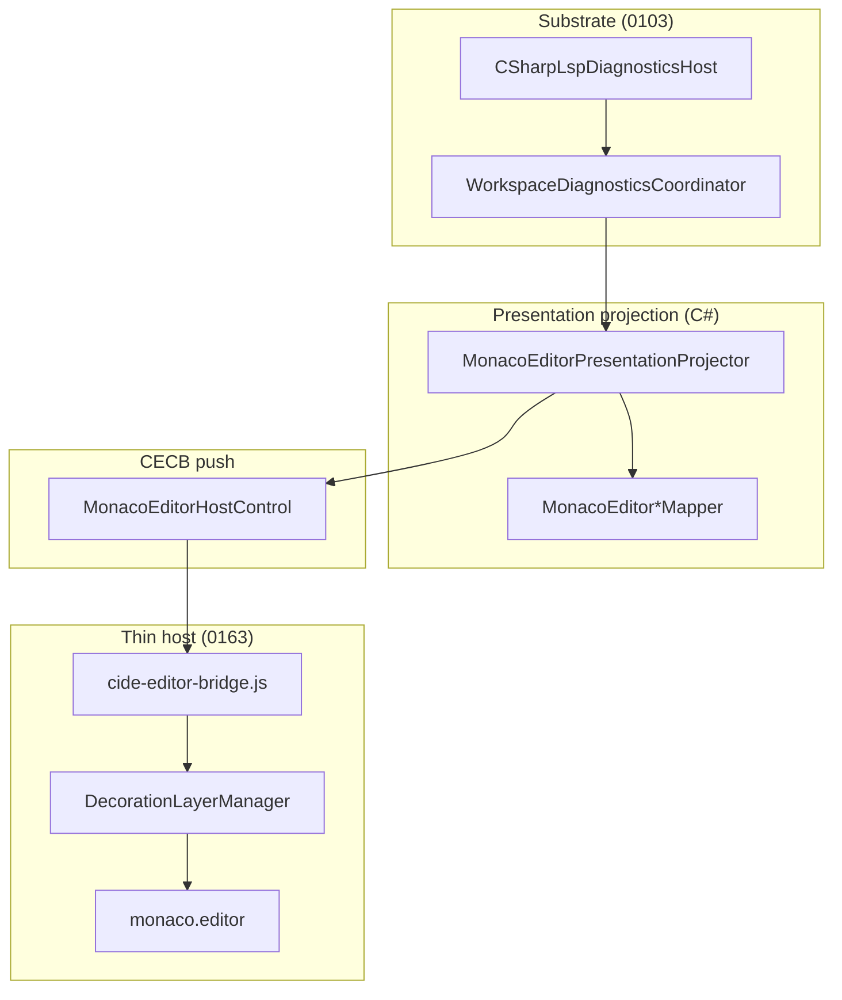

# ADR 0164: Monaco presentation projection, line-first CECB push и dock chrome

**Статус:** Accepted · Implemented  
**Дата:** 2026-06-24  
**Дополняет:** [0163](0163-monaco-native-capability-bus-full-forward-migration.md) §2.6 (DecorationLayerManager, mappers), [0103](0103-editor-hud-substrate-semantic-projection-and-surface-adapter.md) (субстрат HUD), [0085](0085-editor-hud-inline-layer-and-hud-banner.md) (inline vs banner), [0084](0084-agent-edits-editor-source-of-truth-presence-channel.md) (versioned buffer)

## Связанные ADR

| ADR | Роль |
|-----|------|
| [0163](0163-monaco-native-capability-bus-full-forward-migration.md) | CECB, `setId`, `ICideEditorCapabilityRouter`, thin JS |
| [0162](0162-monaco-forward-editor-webview2-host.md) | WebView2 host, `MonacoEditorSessionState`, bridge transport |
| [0103](0103-editor-hud-substrate-semantic-projection-and-surface-adapter.md) | `WorkspaceDiagnosticsCoordinator` → полосы; `IEditorSurfaceAdapter` |
| [0085](0085-editor-hud-inline-layer-and-hud-banner.md) | Inline squiggles / inlays vs file-level HUD banner |
| [0084](0084-agent-edits-editor-source-of-truth-presence-channel.md) | `modelVersion` на mutating push |
| [0152](0152-editor-control-flow-virtual-spacing.md) | CF gutter / virtual lane (отдельный `setId`) |
| [0009](0009-strangler-migration-and-exceptions.md) | Strangler: view оркестрирует, не владеет политикой |

### Вне ADR

| Документ | Роль |
|----------|------|
| [editor-hud-inline-migration-inventory-v1](../design/editor-hud-inline-migration-inventory-v1.md) | Inventory Avalonia adorners → Monaco |
| [monaco-presentation-projection-v1](../design/monaco-presentation-projection-v1.md) | Краткий контракт-DTO (companion к этому ADR) |

---

<a id="adr0164-context"></a>

## 1. Контекст

[0163](0163-monaco-native-capability-bus-full-forward-migration.md) зафиксировал **CECB** и `DecorationLayerManager`, но первая реализация M7–M10 оставила **adhoc** на границе C#↔JS:

| Симптом | Причина |
|---------|---------|
| Squiggles / Error Lens «съезжали» с текста | UTF-16 **offset** на push-DTO + roundtrip offset↔line в C# и JS |
| Var-inlay и diagnostic label конфликтовали | Политика inline **в `DockDocumentView`**, не в projection |
| `*` на вкладке не появлялся | `DockDocumentViewModel.Title` — snapshot при открытии, без проекции `IsDirty` |
| Stale diagnostics после быстрой правки | Push без **version guard** относительно `MonacoEditorSessionState` |

[0103](0103-editor-hud-substrate-semantic-projection-and-surface-adapter.md) отделяет **субстрат** (DAL, `EditorDiagnosticStrip`) от **презентации**. Для Monaco не хватает именованного слоя **presentation projection** между coordinator и bridge.

---

<a id="adr0164-decision"></a>

## 2. Решение

### 2.1 Три слоя (не смешивать)



| Слой | Владелец | Запрещено |
|------|----------|-----------|
| Substrate | `WorkspaceDiagnosticsCoordinator`, LSP hosts | Offset/line логика в View |
| Presentation projection | `MonacoEditorPresentationProjector`, `MonacoEditorDiagnosticsMapper`, … | LSP I/O, WebView вызовы |
| Thin host | `decoration-layer-manager.js`, transport в bridge | Бизнес-политика 0085, Roslyn |

### 2.2 `MonacoEditorPresentationProjector`

Единая точка сборки **Editor HUD inline push** для активного буфера:

- вход: `modelVersion`, `sourceText`, `EditorDiagnosticStrip[]`, `EditorTrailingInlayPart[]` (var hints);
- выход: `Push { DiagnosticDecorations, InlayHints }`;
- вызывается из `DockDocumentView.MonacoForward` → `MonacoEditorHostControl.PushEditorHudPresentationAsync`.

**Политика 0085** (только здесь, не в view):

- var/type inlay **не** на строках с диагностикой (`Line1` из strip);
- diagnostic EOL label — **одна** на строку (группировка по `Line1`).

### 2.3 Контракт push-DTO: line-first

**Whole-line decoration sets** (`diagnostics`, `debugLine`, …) — **line/column-first** (1-based, как Monaco/LSP):

```csharp
// CideEditorDecoration — whole-line
StartLine, StartColumn?, EndLine?, EndColumn?
IsWholeLine = true
// StartOffset / Length не используются
```

**Token-span sets** (`highlights`) — по-прежнему `startOffset` + `length`.

**Inlay hints:**

```csharp
// CideEditorInlayHint
AtEndOfLine = true  // diagnostic Error Lens
// EOL column = model.getLineMaxColumn(line) только в JS
```

**JS:** `DecorationLayerManager.resolveRange` — **единственное** место перевода line-DTO → `monaco.Range`. Bridge не содержит diagnostic-specific column heuristics.

### 2.4 Version guard

Все HUD presentation push несут `expectedModelVersion`:

- C#: `MonacoEditorHostControl` сравнивает с `MonacoEditorSessionState.Version` до dispatch;
- JS: `versionGuard` отбрасывает `setDecorations` / `setInlayHints` при mismatch.

Согласовано с [0084](0084-agent-edits-editor-source-of-truth-presence-channel.md): не рисовать диагностики для устаревшего снимка текста.

### 2.5 Dock chrome projection

`OpenDocumentViewModel` — source of truth для dirty/pinned/title.

`DocumentsWorkspaceViewModel.BindDockChrome` / `UnbindDockChrome`:

- проекция `DisplayTitle` → `DockDocumentViewModel.Title` при `IsDirty` / `IsPinned`;
- `DockDocumentViewModel` — тонкая обёртка **без** собственной подписки на `PropertyChanged`.

### 2.6 Что остаётся в strangler (v1)

| Concern | Где сейчас | Целевое (post-v1) |
|---------|------------|-------------------|
| Agent reveal | bridge `decorationSets` | `DecorationLayerManager` + line DTO |
| CF gutter | bridge + `setCfContentLane` | [0152](0152-editor-control-flow-virtual-spacing.md) parity в manager |
| Reference highlights | offset mapper | без изменений (span-based) |
| `setModelMarkers` | не используется | spike v2 вместо custom squiggles |

---

<a id="adr0164-implementation"></a>

## 3. Реализация (as-built)

| Файл | Роль |
|------|------|
| `Features/Editor/Application/Monaco/MonacoEditorPresentationProjector.cs` | Сборка `Push`, `MergeInlayHints` |
| `Features/Editor/Application/Monaco/MonacoEditorDiagnosticsMapper.cs` | strips → line decorations + `AtEndOfLine` inlays |
| `Features/Editor/Presentation/MonacoEditorHostControl.axaml.cs` | `PushEditorHudPresentationAsync`, version guard |
| `Features/Editor/Application/Monaco/CideEditorBridgeProtocol.cs` | `StartLine`…, `AtEndOfLine`, `ExpectedModelVersion` |
| `Assets/cide-editor/decoration-layer-manager.js` | `DecorationLayerManager` |
| `Features/Documents/DocumentsWorkspaceViewModel.cs` | `BindDockChrome` / `UnbindDockChrome` |
| `CascadeIDE.Tests/MonacoEditorPresentationProjectorTests.cs` | Контракт line-first + merge policy |

Оркестрация таймеров и `DiagnosticsChanged` — по-прежнему в `Views/DockDocumentView.MonacoForward.cs` (strangler); **данные и политика** — в `Features/Editor`.

---

<a id="adr0164-consequences"></a>

## 4. Последствия

**Плюсы**

- Один контракт координат на границе C#↔Monaco; меньше классов багов «съехало».
- Политика inline тестируется в C# без WebView.
- Dock `*` синхронизируется централизованно.

**Минусы / долг**

- Два пути decoration в JS (manager + legacy `decorationSets` для reveal/CF) до консолидации.
- C# всё ещё может передать `AtEndOfLine` inlay с placeholder column — дисциплина на code review.

**Тесты**

- Unit: `MonacoEditorPresentationProjectorTests`.
- Sign-off: пункты чеклиста [0163 §4](0163-monaco-native-capability-bus-full-forward-migration.md#adr0163-checklist) (squiggles, dirty tab, build sync).

---

<a id="adr0164-alternatives"></a>

## 5. Отклонённые альтернативы

| Альтернатива | Почему нет |
|--------------|------------|
| Только JS-fix offset→line в bridge | Дублирование; политика утекает в host |
| `monaco.editor.setModelMarkers` в v1 | Другой UX (не whole-line squiggle + Error Lens); отложено |
| `PropertyChanged` в `DockDocumentViewModel` | Дублирование проекции; нет единого владельца dock chrome |
| Считать EOL column в C# | Рассинхрон с Monaco model (CRLF, virtual text); host authoritative |
| Поток диагностик в IDE DataBus | Конфликт с [0103](0103-editor-hud-substrate-semantic-projection-and-surface-adapter.md): hi-freq не в DataBus |

---

<a id="adr0164-history"></a>

## 6. История

| Дата | Событие |
|------|---------|
| 2026-06-24 | Accepted · Implemented: projector, line-first DTO, `DecorationLayerManager`, version guard, `BindDockChrome` |
| 2026-06-24 | Companion: [monaco-presentation-projection-v1.md](../design/monaco-presentation-projection-v1.md) |
