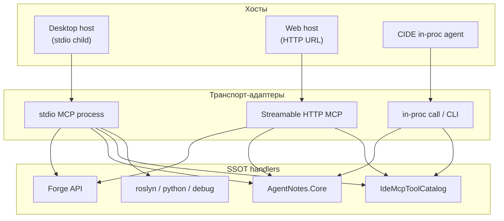

# ADR 0165: Стратификация транспорта MCP — stdio, HTTP-first, матрица хостов

**Статус:** Proposed  
**Дата:** 2026-06-25

## Резюме

Стек MCP в экосистеме IOP/CIDE сегодня в основном **stdio** (хост порождает subprocess). Это корректно для **локальных** IDE-хостов (Cursor, Claude Desktop), но **не покрывает** веб-агентов (ChatGPT, Claude в браузере), shared remote MCP и multi-client без fork процесса.

**Принято направление:** не переписывать тулы; разделить **handler (SSOT)** и **транспорт-адаптер**. Сервисы с общим состоянием и удалённым доступом — **HTTP-first** (Streamable HTTP MCP на loopback или forge API); локальные language/debug драйверы — **stdio навсегда**; Cascade IDE — **stdio для внешнего хоста** + **loopback HTTP в GUI-процессе** ([0082](0082-acp-ide-mcp-loopback-single-process.md)).

---

## Связанные ADR

| ADR | Роль |
|-----|------|
| [0008](0008-mcp-contracts-and-testable-infrastructure.md) | Контракты MCP, тестируемая инфраструктура |
| [0043](0043-mcp-transport-recovery-human-agent-parity.md) | Восстановление транспорта; граница хост vs IDE |
| [0048](0048-cursor-acp-chat-ide-parity-and-mcp-tool-surface.md) | ACP, `mcpServers`, авто IDE MCP |
| [0052](0052-agent-contract-cli-and-snapshot-tests.md) | CLI паритет с MCP (`--agent-contract`) |
| [0082](0082-acp-ide-mcp-loopback-single-process.md) | Loopback HTTP/SSE в **том же** процессе GUI (не второй `CascadeIDE`) |
| [0118](0118-agent-notes-core-2-toml-and-knowledge-path.md) | Agent Notes Core in-proc; TOML SSOT с MCP |
| [0132](0132-intercom-federated-transport-and-multi-client-boundary.md) | Intercom transport ≠ MCP transport |
| [0142](0142-intercom-open-wire-pluggable-transports.md) | Pluggable transport для Intercom |
| [0148](0148-agent-execution-environment-verification-ladder-and-native-tooling.md) | AEE, verify ladder, native tooling |

### Вне репо (смежные решения)

| Документ | Роль |
|----------|------|
| [MCP-PROTOCOL.md](../MCP-PROTOCOL.md) | Транспорт stdio, внешние MCP, `--mcp-stdio` |
| agent-forge: **FORGE-ADR-0014 B** (`AgentForge.Mcp`) | stdio-мост → `POST /api/v1/mcp/invoke` |
| agent-forge: [docs/mcp.md](https://github.com/AI-Guiders/agent-forge/blob/main/docs/mcp.md) | Forge HTTP API как SSOT тулов |
| agent-notes-mcp: ADR 014 (`--config` TOML) | Stdio MCP + localhost `/health` (2.0) |
| kb-public: ChatGPT Desktop stack | ChatGPT **не** stdio; HTTP connectors / туннель |

---

<a id="adr0165-context"></a>

## 1. Контекст

### 1.1 Два класса MCP-хостов

| Класс хоста | Типичный транспорт | Примеры |
|-------------|-------------------|---------|
| **Локальный desktop** | stdio (child process) | Cursor, Claude Desktop, VS Code |
| **Веб / облако / shared** | HTTP / Streamable HTTP | ChatGPT connectors, Claude.ai, удалённый агент |

MCP-спека допускает оба; **stdio не «устарел»** — он правильный там, где хост **владеет жизненным циклом** subprocess.

### 1.2 Текущий стек (2026-06)

| Сервер | Транспорт сегодня | SSOT логики |
|--------|-------------------|-------------|
| **Agent Forge** | stdio (`AgentForge.Mcp`) → HTTP `:8770` | Forge API `/api/v1/mcp/invoke` |
| **agent-notes-mcp** | stdio + loopback `/health` | `AIGuiders.AgentNotes.Core` |
| **Cascade IDE** | `--mcp-stdio` (полный exe) | `IdeMcpToolCatalog` / `IdeMcpServer` |
| **roslyn / python / dotnet-debug / build-test** | stdio | Локальный процесс + машинные артефакты |
| **hybrid-codebase-index** | stdio | Локальный индекс |

Проблема не в «всё stdio плохо», а в том, что **весь стек только stdio** закрывает контур Cursor/IDE, но **не** ChatGPT, не shared forge для нескольких клиентов одновременно, не лёгкий attach к **уже запущенной** IDE-сессии.

### 1.3 Известные боли

| Симптом | Связь |
|---------|--------|
| Второе (третье) окно CIDE при ACP + `acp_auto_inject_ide_mcp` | [0082](0082-acp-ide-mcp-loopback-single-process.md) |
| ChatGPT / Claude web не запускают `command` + `args` | Нужен HTTP endpoint или `mcp-remote` + туннель |
| Дублирование forge-тулов в bridge и API | Уже решено в forge: bridge тонкий |
| agent-notes: Cursor vs CIDE vs веб | Core общий ([0118](0118-agent-notes-core-2-toml-and-knowledge-path.md)); транспорт — нет |

---

<a id="adr0165-decision"></a>

## 2. Решение

### 2.1 Три слоя (обязательная модель)



**Инвариант:** `tools/list` и `tools/call` реализуются **один раз** на уровне SSOT; stdio и HTTP — тонкие JSON-RPC фасады.

### 2.2 Тиры серверов

#### Tier A — stdio only (не мигрировать на HTTP)

Локальные драйверы машины разработчика:

- `roslyn-mcp`, `python-mcp`, `python-debug-mcp`, `dotnet-debug-mcp`, `dotnet-build-test-mcp`
- Причины: PDB, `netcoredbg`, venv, PATH, безопасность (отладчик не экспонировать в сеть)

**Для веб-хостов:** не подключать напрямую. Допустим только локальный desktop-агент.

#### Tier B — HTTP-first, stdio-bridge сохранить

| Сервис | HTTP SSOT | Stdio-bridge | Примечание |
|--------|-----------|--------------|------------|
| **Agent Forge** | `:8770` `/api/v1/mcp/invoke` | `AgentForge.Mcp` | Эталон ([FORGE-ADR-0014 B](https://github.com/AI-Guiders/agent-forge)) |
| **agent-notes** | loopback Streamable HTTP `/mcp` (целевое) | `agent-notes-mcp --config` | Тот же Core, тот же TOML |
| **Cascade IDE** | loopback в GUI ([0082](0082-acp-ide-mcp-loopback-single-process.md)) | `--mcp-stdio` для Cursor | UI/reveal требуют живой сессии |

#### Tier C — хост-специфичные исключения

- **ChatGPT:** Custom connector → HTTP URL (forge, notes, позже CIDE loopback через **туннель** только dev)
- **Claude Desktop:** `claude_desktop_config.json` → `command`/`args` (stdio); на Windows MSIX — виртуализированный путь к config
- **Cursor:** `.cursor/mcp.json` → stdio; для forge/notes — bridges как сейчас

### 2.3 Cascade IDE — два контура (не смешивать)

| Контур | Транспорт | Когда |
|--------|-----------|-------|
| **External ProcessHost** | `CascadeIDE.exe --mcp-stdio` | Cursor / Claude Desktop порождают IDE |
| **In-GUI ACP / built-in agent** | loopback HTTP/SSE **в том же процессе** | [0082](0082-acp-ide-mcp-loopback-single-process.md) — без второго окна |
| **Headless contract** | `--agent-contract` CLI | CI, снапшоты ([0052](0052-agent-contract-cli-and-snapshot-tests.md)) |

Реализация loopback **не дублирует** каталог тулов: тот же pipeline, что `IdeMcpServer`.

Настройки (целевые ключи в `[mcp]`):

```toml
[mcp]
# существующие: external_servers_json, acp_auto_inject_ide_mcp, …

# целевое (фаза 3):
loopback_enabled = true
loopback_bind = "127.0.0.1"
loopback_port = 0          # 0 = ephemeral
loopback_token_rotate = "session"  # session | launch
acp_ide_mcp_transport = "loopback" # loopback | stdio (default loopback когда GUI жив)
```

### 2.4 Agent Forge — нативный HTTP MCP (фаза 1)

Поверх существующего invoke:

1. Добавить **Streamable HTTP** endpoint на forge-server (`/mcp` или `/api/v1/mcp/stream`).
2. `ListTools` → тот же `GET /api/v1/capabilities`.
3. `CallTool` → тот же `POST /api/v1/mcp/invoke`.
4. Auth: `FORGE_API_TOKEN` / device login (уже есть).
5. **`AgentForge.Mcp` не удалять** — остаётся для Cursor/Claude Desktop.

### 2.5 agent-notes — HTTP рядом с status (фаза 2)

1. Handlers уже в Core ([0118](0118-agent-notes-core-2-toml-and-knowledge-path.md)).
2. Поднять Streamable HTTP на loopback (рядом с `/health` из 2.0).
3. Stdio-процесс → второй адаптер к тем же handlers.
4. CIDE in-proc **без изменений** контракта `knowledge_path`.

### 2.6 Безопасность loopback / tunnel

| Угроза | Митигация |
|--------|-----------|
| Локальный процесс без auth | `127.0.0.1` only; случайный session token в `Authorization` |
| Tunnel в ChatGPT (dev) | Отдельные read-only токены; не prod KB; явный opt-in |
| Экспорт debug/roslyn в HTTP | **Запрещено** (Tier A) |

### 2.7 Явные non-goals

1. **Единый HTTP-сервер на весь стек** — отклонено (разные trust boundary).
2. **Убрать stdio** — отклонено; desktop-хосты останутся на child process.
3. **Переписать каждый тул под HTTP** — отклонено; только адаптеры.
4. **`mcp-remote` поверх всего stdio как архитектура** — костыль для ChatGPT; допустим временно, не SSOT.
5. **Смешивать Intercom team transport с MCP** — [0132](0132-intercom-federated-transport-and-multi-client-boundary.md), [0142](0142-intercom-open-wire-pluggable-transports.md).

---

<a id="adr0165-phases"></a>

## 3. Фазы внедрения

| Фаза | Объём | Переписывание тулов |
|------|-------|---------------------|
| **0** | Этот ADR + инвентарь серверов | 0 |
| **1** | Forge Streamable HTTP MCP | 0 (invoke уже есть) |
| **2** | agent-notes HTTP MCP + stdio wrapper | 0 (Core есть) |
| **3** | CIDE loopback ([0082](0082-acp-ide-mcp-loopback-single-process.md)) | 0 (catalog общий) |
| **4** | Опционально: лёгкий `McpSidecar` без Avalonia; генератор конфигов Cursor/Claude | Минимальный |

Критерий готовности фазы 1: ChatGPT connector и Cursor `forge-mcp` работают **параллельно** к одному forge API.

---

<a id="adr0165-host-matrix"></a>

## 4. Матрица хостов (нормативная)

| Хост | Forge | agent-notes | CIDE `ide_*` | roslyn/python/debug |
|------|-------|-------------|--------------|---------------------|
| **Cursor** | stdio bridge | stdio `--config` | stdio `--mcp-stdio` | stdio |
| **Claude Desktop** | stdio в `claude_desktop_config.json` | stdio | stdio (тяжёлый; sidecar позже) | stdio |
| **ChatGPT / веб** | HTTP connector | HTTP + tunnel (dev) | HTTP loopback + tunnel | ❌ |
| **CIDE built-in** | HTTP → `:8770` | Core in-proc | in-proc / loopback | stdio subprocess |

---

<a id="adr0165-consequences"></a>

## 5. Последствия

**Плюсы**

- Один контур тулов для desktop и web без форка логики.
- Forge и KB готовы к multi-client и Docker без смены Cursor-конфига.
- CIDE перестаёт плодить полные вторые экземпляры при ACP ([0082](0082-acp-ide-mcp-loopback-single-process.md)).

**Минусы / долг**

- Два транспорта на сервис → тестировать оба пути.
- Документация хостов (Cursor vs ChatGPT vs Claude Desktop) усложняется.
- Windows MSIX paths для Claude Desktop — операционный overhead.

**Документы к обновлению при реализации**

- [MCP-PROTOCOL.md](../MCP-PROTOCOL.md) — § транспорт, loopback, матрица хостов
- [0082](0082-acp-ide-mcp-loopback-single-process.md) — ссылка на 0165 как ecosystem frame
- agent-forge `docs/mcp.md` — Streamable HTTP endpoint
- agent-notes-mcp README — HTTP + stdio parity

---

<a id="adr0165-open"></a>

## 6. Открытые вопросы

1. **Streamable HTTP vs SSE** на forge и CIDE — зафиксировать по фактической поддержке в cursor-agent и MCP SDK .NET (приоритет: Streamable HTTP в спеке 2025+).
2. **Стабильный порт** loopback в `settings.toml` vs ephemeral — нужен ли пользователям для firewall-скриптов.
3. **Multi-window CIDE** ([0017](0017-multi-window-workspace-and-agent-surfaces.md)): один loopback на процесс приложения vs per-window endpoint.
4. **Публикация forge HTTP** за пределы localhost — отдельный ADR (auth, TLS, tenancy).

---

## 7. Отклонённые альтернативы

| Альтернатива | Почему нет |
|--------------|------------|
| Только stdio везде | Блокирует ChatGPT и shared remote |
| Только HTTP везде | Desktop-хосты не форкают HTTP child; debug/roslyn не в сеть |
| Один monolithic `iop-mcp-server` | Смешивает trust boundary; ломает независимый lifecycle forge/notes |
| IPC-прокси во втором CIDE-процессе | [0082](0082-acp-ide-mcp-loopback-single-process.md) §5 — запасной, не приоритет |
