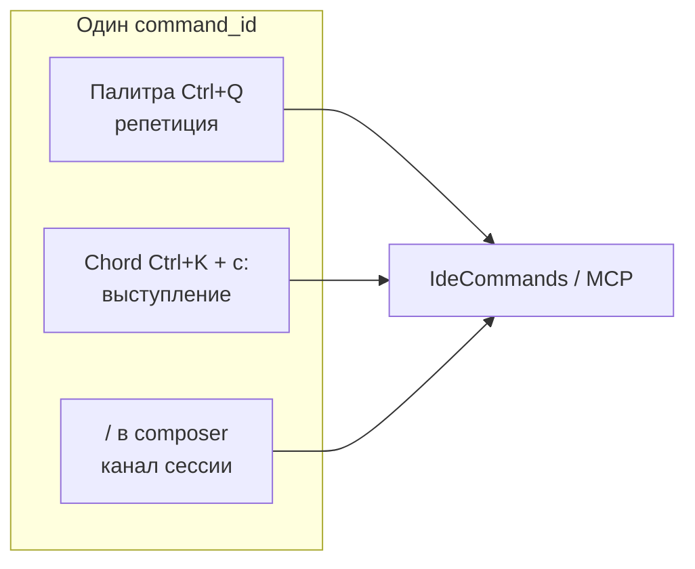
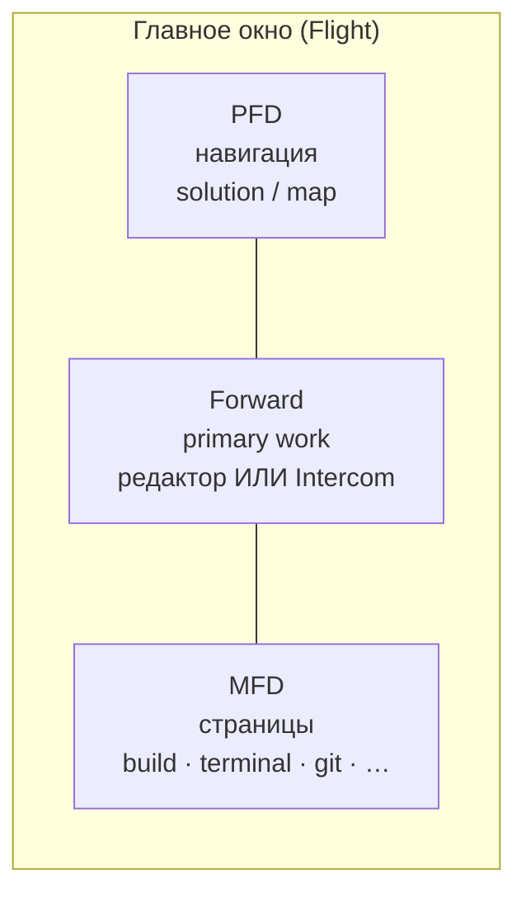
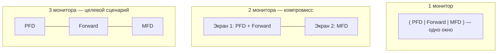

# Cascade IDE — Design Handbook v1

**Статус:** v1 (живой hub, не ADR)  
**Аудитория:** дизайнеры, UX-авторы, продукт; разработка — для согласования терминов и границ.  
**Дата:** 2026-05-19

Этот документ **сводит** принципы, мотивацию и навигацию в **одно чтение для дизайнера**. **ADR читать не обязательно** — они фиксируют решения для разработки; здесь — *зачем так* и *как это выглядит в UI*. Ссылки на ADR — только если нужны детали, статус или спор с инженерами.

!!! tip "Маршрут для дизайнера (без ADR)"
    1. **§2 целиком** — принципы и мотивация (главное).  
    2. **§3** — зоны PFD / Forward / MFD; **§3.1** — 1/2/3 монитора (не путать с тремя зонами).  
    3. [Раскладка UI](../ui-ux/cascade-ide-ui-layout-v1.md) + wireframe в `docs/ui-ux/`.  
    4. **§8** — приоритеты работы дизайнера.  
    5. По задаче — **§6** (тематические ссылки), не весь каталог ADR.  
    6. **Intercom** — [intercom-design-hub-v1.md](intercom-design-hub-v1.md) (домены D1–D9, макеты).  
    7. Макеты — **§9**.

**English (краткий обзор продукта):** [Concept overview](../en/concept-overview.md) · [UI layout EN](../en/ui-ux/cascade-ide-ui-layout-v1.md).

---

## 1. Что такое Cascade IDE (CIDE)

**Agent-first IDE для .NET** на Avalonia: человек и AI-агент делят **один кокпит** — те же команды, та же раскладка, тот же канал **Intercom** (не «чат сбоку»).

| Идея | Где подробнее |
|------|----------------|
| IOP — дисциплина намерения и верификации | [IOP-манифест](../iop-manifest-v1.md), [ADR 0121](../adr/0121-intent-oriented-programming-paradigm.md) |
| Intercom = канал сессии | [ADR 0080](../adr/0080-intercom-naming-and-multi-party-channel-model.md) |
| In-proc MCP — паритет агента и IDE | [MCP-протокол](../MCP-PROTOCOL.md), [ADR 0008](../adr/0008-mcp-contracts-and-testable-infrastructure.md) |
| North star «workbench» | [north-star-cursor-mcp-cascade-workbench-v1.md](north-star-cursor-mcp-cascade-workbench-v1.md) |

---

## 2. Принципы и мотивация (читать здесь, не в ADR)

Ниже — **самодостаточный** слой для дизайна. Таблица в §2.6 — шпаргалка; ADR в конце §2.7 — по желанию.

### 2.1 «Хороший актёр»: инструмент не спорит с задачей

> Хороший актёр — тот, кого не видно: на сцене остаётся персонаж, а не исполнитель.

**Мотивация.** Разработчик держит в голове **задачу и код**. IDE, ассистент и панели — **суфлёры**, не второй спектакль про «возможности продукта». Каждый пиксель, который требует внимания без причины, — налог на поток.

**Для дизайна:**

- В норме интерфейс **спокойный**; акцент — на Forward (код или Intercom).
- Промо-эффекты, пульсации и «умные» всплытия без запроса — **анти-паттерн**.
- Новый элемент обосновываем: *какую роль внимания он несёт?* Если «просто удобно иметь» — скорее MFD или палитра, не лобовое.

---

### 2.2 Иерархия внимания (кокпит) — не декор

**Мотивация.** В IDE одновременно приходят сигналы: код, сборка, git, агент, ошибки. Без **явной иерархии** UI уезжает в крайности: всё спрятано (нет обратной связи) или всё на экране (нет фокуса). Авиация десятилетиями отрабатывала **куда смотреть сначала** — мы переносим **дисциплину внимания**, а не косплей кабины.

Главный враг — **переключение контекста**: «где я был», «какая панель главная», «почему всплыло сейчас». «Всё в одном окне» у нас значит **согласованный контур** (код + минимум нужного рядом), а не бесконечное раздувание панелей и встроенных чатов.

**Для дизайна:**

| Зона | Вопрос, на который отвечает | Плотность |
|------|-----------------------------|-----------|
| **Forward** | «Что я делаю **сейчас**?» (редактор или Intercom) | Максимальный фокус, минимум отвлечений |
| **PFD** | «**Где** я в проекте / решении?» | Навигация, карта, контекст полёта |
| **MFD** | «Что нужно **вторично**?» (лог, терминал, git, health) | Осознанное переключение **страницы**, не конкурент Forward |

**EICAS / health / оповещения** (когда есть в макете) — **сводный канал тревог**, а не ещё десять toast’ов поверх редактора.

!!! note "Нейроотличие и когнитивная нагрузка"
    Явные якоря и меньше конкурирующих сигналов особенно важны тем, кому **дорого** возвращаться в поток после прерывания (в т.ч. СДВГ). Это не «лечение интерфейсом», а **эргономика**: пресеты, отключаемый шум, предсказуемые места элементов.

---

### 2.3 Не «вторая VS Code / Rider» и не «Copilot в каждой строке»

**Мотивация.** Классический **Visual Studio** для .NET долго задавал планку: предсказуемое действие, инструменты **по делу**, единый контур. Это наш **позитивный** ориентир по DX.

Другой **класс риска** — когда облачный inline-ассистент **по умолчанию везде**: подсказки без запроса, неясно, что попадёт в буфер, помощь **не отключается** по-настоящему, всё завязано на аккаунт вендора. Тогда IDE становится **«плохим актёром»** — выходит на передний план вместо задачи.

**CascadeIDE** сознательно **не** копирует:

- бесконечное размножение боковых панелей и вкладок «как в VS Code»;
- облачный ghost text в каждой строке как единственный путь помощи;
- второй «кокпит» для агента (отдельный чат с другой моделью команд).

**Для дизайна:**

- Новая панель — **исключение с ролью**, не «ещё одна колонка по умолчанию».
- AI-помощь — **в контуре Intercom / команд / diff**, с явным вкл/выкл и видимым следом, а не фоновая магия в редакторе.
- Внешние чаты и сервисы — **мосты** (второй монитор, интеграция), не десятый встроенный мессенджер в PFD.

---

### 2.4 AI и агент: суверенитет, локальность, прозрачность

**Мотивация.** Продукт **agent-first**, но оператор остаётся **капитаном**. Агент силён, когда его действия **наблюдаемы** и **согласованы** с тем, что может сделать человек теми же командами.

| Принцип | Что это значит для человека | Следствие для UI |
|---------|----------------------------|------------------|
| **Суверенитет** | Можно **отключить или ограничить** класс помощи (не «спрятали, но облако всё равно шлёт») | Настройки с понятными режимами; нет «вечно включённого» inline |
| **Локальность** | Критичный путь — **репозиторий и IDE**; облако — **явная** граница | Не смешивать «файл на диске» и «ответ модели» без различимых состояний |
| **Прозрачность** | Поведение, влияющее на код, **объяснимо** (что сделал агент, какой diff) | Лента Intercom, статусы, отклонение/принятие изменений в Forward |
| **Невидимость по умолчанию** | Помощь **не конкурирует** с кодом за внимание, пока не запрошена | Нет навязчивых подсказок в строке; запрос — через Intercom, команду, палитру |
| **Паритет команд** | То, что видишь в UI, агент может вызвать тем же **`command_id`** | Один каталог команд: палитра, слэш, MCP — не три разных мира |
| **Честность рассуждения** | Не притворяемся «полным мышлением» без границ провайдера | Слои «thinking», лимиты, явные ошибки API — без театра |

**Intercom** — не «чат с ботом», а **канал сессии** (как рация в работе): темы, spine, composer внизу, слэши с подсказками — см. §5.2, [intercom-design-hub](intercom-design-hub-v1.md), [intercom-ux-reference](intercom-ux-reference-slack-mattermost-v1.md).

**Партнёр для проектирования:** агент в том же контуре — для **обсуждения и спора до кода** (снять ветвления → ADR → быстрая реализация), без замены вкуса и ответственности человека — [philosophy §8](cascadeide-philosophy-v1.md#8-агент-как-партнёр-для-проектирования-до-кода), [IOP manifest](../iop-manifest-v1.md).

---

### 2.5 Dark cockpit и тревога по делу

**Мотивация.** В штатном полёте приборы **не кричат**. Тревога — когда параметр вышел за норму. Аналог в IDE: в спокойной работе — **тихий фон**, chip и баннеры — когда есть **смысл прервать**.

**Для дизайна:**

- Статус «идёт сборка / агент думает» — **компактный** (toolbar, chip), не полоска на всю ленту без нужды.
- Ошибки и блокеры — **заметны**, но **сводятся** (health, EICAS), а не дублируются в трёх углах экрана.
- Цвет акцента — для **фокуса и действия**, не для декора каждой секции.

---

### 2.6 Команды: три входа (репетиция, выступление, канал)

**Мотивация.** Разные режимы работы мозга: **учиться** действию, **делать** на автомате, **оставаться в канале сессии** и всё равно вызвать IDE-действие. Три поверхности — одна модель `command_id` (палитра, аккорд, MCP не расходятся).

| Режим | Вход | Зачем |
|-------|------|--------|
| **Репетиция** | Палитра (Ctrl+Q) | Поиск, полный каталог, онбординг, редкие команды |
| **Выступление** | CascadeChord (Ctrl+K) + Melody `c:` | Освоенные действия с клавиатуры; короткие alias — здесь, не в слэше |
| **Канал сессии** | Слэш в composer (`/` + autocomplete) | Те же `command_id`, когда фокус уже в Intercom: `/build run`, `/topic …`, `/help` — иерархия вместо мнемоник ([0119](../adr/0119-chat-slash-commands-intercom-surface.md)) |

**Для дизайна:**

- Слэш — **иерархические подсказки** (`/` → namespace → действие), autocomplete обязателен; не дублировать «сжатые» формы палитры/аккорда (`/br` и т.п.).
- Обычный текст в composer — **агенту**; неизвестный `/` — **отклонять локально**, не «отправить модели наугад».
- Визуально различать **три affordance** в онбординге и help, не смешивать «палитра = всё».

---

### 2.7 Анти-паттерны (сводка «чего не рисуем»)

| Не делаем | Почему |
|-----------|--------|
| Ещё одна колонка «на всякий случай» | Размывает Forward; ломает кокпит |
| Inline AI в каждой строке по умолчанию | «Плохой актёр», суверенитет, непредсказуемый буфер |
| Дублировать навигацию (вкладки + overview + слэш + хвост в ленте) | Один **быстрый** путь + один **масштабный** (Navigator) — [0127](../adr/0127-intercom-spine-and-topic-tabs-chrome-navigation.md) |
| Toast на каждое событие сборки | Сводим в MFD / health |
| Сырые hex-цвета в макете без семантики | Только имена токенов — [ide-chrome-tokens-v1.md](ide-chrome-tokens-v1.md) |
| Отдельный UX только для агента | Паритет команд и Intercom |
| Пузыри / рамка на каждом сообщении Intercom | Отвлекают; flat feed Slack/MM; **большинство строк без акцента**, рамка редко — [intercom-ux-reference](intercom-ux-reference-slack-mattermost-v1.md) |

---

### 2.8 Шпаргалка принципов

| # | Принцип | Одна фраза |
|---|---------|------------|
| P1 | Инструмент исчезает | В фокусе задача, не IDE |
| P2 | Кокпит / зоны | Forward — сейчас; PFD — где; MFD — вторично |
| P3 | Не клон VS Code + inline AI | Согласованный контур, не панельный зоопарк |
| P4 | Суверенитет AI | Вкл/выкл, прозрачность, паритет с агентом |
| P5 | Dark cockpit | Тишина в норме; тревога — по делу |
| P6 | Три входа команд | Палитра учит, аккорд ускоряет, слэш — discoverability в Intercom |
| P7 | Intercom = канал сессии | Не generic chat sidebar |

**Ценности проекта (кратко):** открытость, наблюдаемость, паритет человека и агента — [ADR 0100](../adr/0100-project-constitution.md) (инженерам).

---

### 2.9 Когда всё же открывать ADR

| Ситуация | Документ |
|----------|----------|
| Спор «можно ли так в продукте» | Соответствующий ADR из §6 + статус в [adr-nav](../site/adr-nav/index.md) |
| Нужны точные термины PFD/MFD/EICAS | [0021](../adr/0021-pfd-mfd-cockpit-attention-model.md) |
| Фиксация AI-политики для compliance | [0071](../adr/0071-ai-assistance-sovereignty-locality-invisibility.md) |
| Разработчик просит «как в коде» | [concept-to-implementation-map](../ui-ux/concept-to-implementation-map-v1.md) |
| Длинный нарратив про метафоры | [cascadeide-philosophy-v1.md](cascadeide-philosophy-v1.md) |

**Инженерный индекс ADR по темам:** [adr-map-v1.md](../en/architecture/adr-map-v1.md) — не обязателен для дизайн-ревью макета.

---

## 3. Раскладка: три зоны внимания (Flight)

Сейчас в поставке один UI-режим — **Flight**. Главное окно — **три колонки** (без полосы вкладок на всю ширину снизу).

| Зона | Имя | Роль для дизайна |
|------|-----|------------------|
| **PFD** | Primary Flight Display | «Где я в проекте?» — дерево, карта, инструменты навигации |
| **Forward** | Лобовое / primary work | **Главный фокус:** редактор *или* полноэкранный Intercom ([0120](../adr/0120-primary-work-surface-intercom-or-editor.md)) |
| **MFD** | Multi-Function Display | Вторичные «приборы»: терминал, сборка, Git, health — **страницы**, не конкурент Forward |

### 3.1 Один, два или три **монитора** (не путать с «тремя зонами»)

**Канон для дизайна — всегда три *роли* зон (PFD · Forward · MFD).** Сколько **физических дисплеев** — настройка пользователя; для команды **не** требуем «у всех три монитора» ([ADR 0017](../adr/0017-multi-window-workspace-and-agent-surfaces.md)).

| Дисплеев | Типичная презентация (`presentation`) | Что рисуем |
|----------|----------------------------------------|------------|
| **1** | `(PFD+Forward+MFD)` или три колонки в одном `MainGrid` | Все зоны в **одном** главном окне — как в layout v1 |
| **2** | `(PFD+Forward) (MFD)` | Главное окно: PFD + Forward; второе окно / экран — **MFD** (чат, терминал, build…) |
| **3** | `(PFD) (Forward) (MFD)` | **Идеал** при достаточном железе: **по одной зоне на экран** (три `TopLevel`), слева направо в порядке скобок в строке пресета |

**Важно для макетов:**

- **Не** смешивать «три колонки в макете окна» и «обязательно три монитора у каждого пользователя».
- **Три отдельных окна на одном ультрашироком мониторе** — не цель по умолчанию; обычно хватает одного окна + вынесения MFD на 2-й экран ([0017](../adr/0017-multi-window-workspace-and-agent-surfaces.md)).
- Пресет по дисплеям — **личный** (`settings.toml`, ключ `presentation`), не обязательный team-wide в `.cascade/workspace.toml`.

**Где «три монитора» звучит как норма для *команды*:** совместная работа и общий экран в комнате — [IOP-манифест](../iop-manifest-v1.md), [ADR 0122](../adr/0122-collaborative-iop-environment-and-shared-situational-display.md). Это **видение экипажа**, не минимальные требования к одиночному рабочему месту.

**Эталон имён и MCP:** [cascade-ide-ui-layout-v1.md](../ui-ux/cascade-ide-ui-layout-v1.md) · wireframe: `docs/ui-ux/cascade-ide-main-window-wireframe.png`.

**Норматив мультиоконности:** [ADR 0017](../adr/0017-multi-window-workspace-and-agent-surfaces.md) · [0021 §13](../adr/0021-pfd-mfd-cockpit-attention-model.md).

**Куда класть новую панель:** [attention-zone-panel-playbook-v1.md](attention-zone-panel-playbook-v1.md).

---

## 4. Типы UI-слоёв (чтобы не путать визуальные системы)

| Слой | Где в коде | Когда использовать |
|------|------------|-------------------|
| **IDE chrome** | `CascadeTheme`, `Views/UiKit/`, MFD-страницы AXAML | Меню, настройки, оболочка страниц MFD |
| **Skia surfaces** | `Views/SkiaKit/`, `Views/Chat/Skia/` | Плотные ленты, Intercom, карты — пиксельный контроль |
| **Cockpit / приборы** | `Cockpit/PrimitivesKit/`, CDS | «Приборная» семантика, не обычные панели настроек |

Разделение IDE vs cockpit: [ADR 0066](../adr/0066-cockpit-ui-vs-ide-presentation-layer.md) · playbook: [skia-surfaces-vs-overlays-v1.md](skia-surfaces-vs-overlays-v1.md).

**Токены chrome (v1):** [ide-chrome-tokens-v1.md](ide-chrome-tokens-v1.md) · темы: [ADR 0086](../adr/0086-ui-theme-toml-canonical-json-mcp-wire.md).

**Skia kit (примитивы UI):** [ADR 0117](../adr/0117-ide-skia-kit.md).

---

## 5. Навигация по темам (детали)

Используй таблицу как **оглавление**. Статусы ADR — в [навигаторе](../site/adr-nav/index.md); здесь помечено только направление для дизайна.

### 5.1 Раскладка, chrome, мультиокно

| Тема | Документ | ADR (норматив) |
|------|----------|----------------|
| Макет Flight, контролы | [ui-ux/cascade-ide-ui-layout-v1.md](../ui-ux/cascade-ide-ui-layout-v1.md) | [0021](../adr/0021-pfd-mfd-cockpit-attention-model.md), [0046](../adr/0046-presentation-layout-authority-and-cockpit-invariants.md) |
| Концепт → код, архив Focus/Power | [concept-to-implementation-map-v1.md](../ui-ux/concept-to-implementation-map-v1.md) | — |
| Референс-скрины | [ui-ux/concept-screens/](../ui-ux/concept-screens/README.md) | — |
| Forward = редактор или Intercom | — | [0120](../adr/0120-primary-work-surface-intercom-or-editor.md) Proposed |
| Плавающий chrome | — | [0012](../adr/0012-floating-workspace-chrome.md) |
| Remote operator (не мобильная IDE) | — | [0117-remote](../adr/0117-remote-operator-surface-multidevice.md) Proposed |

### 5.2 Intercom (канал, темы, composer)

Intercom — **не один экран**, а **несколько доменов** (лента, composer, attach, мост в редактор, навигация тем, три входа команд). Для дизайна — отдельный хаб с иерархией документов и чеклистом референс-PNG.

| С чего начать | Содержание |
|---------------|------------|
| **[intercom-design-hub-v1.md](intercom-design-hub-v1.md)** | Домены **D1–D9**, карта доков, порядок итераций, [чеклист макетов](../ui-ux/concept-screens/intercom/README.md) |
| [intercom-ux-reference-slack-mattermost-v1.md](intercom-ux-reference-slack-mattermost-v1.md) | Границы Slack/MM, flat feed, `/attach`, клик → рамка |
| [ide-chrome-tokens-v1.md](ide-chrome-tokens-v1.md) | Токены оболочки вокруг Skia-ленты |

**Сквозные UX-развилки** (фиксировать в макете, не смешивать):

| Развилка | Дизайн по умолчанию |
|----------|---------------------|
| Attach vs `/editor line` vs `/file open` | Разные slash и chip; см. hub **D4–D6** |
| Клик по chip в ленте | Open + scroll + **рамка**; Shift → selection |
| `@` vs `[path]` vs `/attach` | Люди vs inline-якорь vs slash с autocomplete |
| Палитра / Chord / slash | Один `command_id`, три affordance — §2.6 |

| Тема (ADR-указатель) | ADR |
|----------------------|-----|
| Канал, multi-party | [0080](../adr/0080-intercom-naming-and-multi-party-channel-model.md) |
| Topic cards | [0072](../adr/0072-chat-topic-cards-intent-melody-keyboard-contract.md) |
| Spine, tabs, Navigator | [0127](../adr/0127-intercom-spine-and-topic-tabs-chrome-navigation.md) Proposed |
| Slash, **attach / якоря** | [0128](../adr/0128-intercom-attachment-anchors-and-code-references.md) Proposed · [0119](../adr/0119-chat-slash-commands-intercom-surface.md), [0124](../adr/0124-slash-parametric-editor-line-commands.md)–[0125](../adr/0125-slash-workspace-file-commands-and-dynamic-completion.md) |
| Skia лента | [0123](../adr/0123-intercom-full-skia-surface-evolution.md), [0057](../adr/0057-chat-surface-pipeline-adoption.md) |
| Forward fullscreen | [0120](../adr/0120-primary-work-surface-intercom-or-editor.md) Proposed |

### 5.3 Команды, палитра, клавиатура

| Тема | ADR / design |
|------|----------------|
| **Три входа** (репетиция / выступление / канал) | §2.6 handbook · [philosophy §7](cascadeide-philosophy-v1.md) |
| Поверхность команд | [0013](../adr/0013-command-surface-and-discoverability.md) |
| Палитра overlay | [0070](../adr/0070-command-palette-direct-overlay-surface.md) |
| Chord stack (Ctrl+K) | [0060](../adr/0060-keyboard-chord-stack-fms-tactical-strategic.md) (§1a — слэш) |
| Slash в composer | [0119](../adr/0119-chat-slash-commands-intercom-surface.md), [0124](../adr/0124-slash-parametric-editor-line-commands.md)–[0126](../adr/0126-intercom-inspect-slash-and-compact-chrome-status.md) |
| Реестр команд (справочник) | [ide-command-registry-v1.md](ide-command-registry-v1.md) |
| Intent / Melody | [intent-melody-language-v1.md](../intent-melody-language-v1.md), [ADR 0109](../adr/0109-declarative-parametric-melody-catalog-toml-and-code-binders.md) |

### 5.4 Карты, графы, semantic map (PFD)

| Тема | ADR |
|------|-----|
| Semantic map / control flow | [0053](../adr/0053-semantic-map-control-flow-pfd.md), [0113](../adr/0113-hci-semantic-map-orientation-layer.md) |
| Рёбра графа | [0114](../adr/0114-graph-edge-relation-kind-taxonomy.md) |
| Graph-backed surfaces | [0067](../adr/0067-graph-backed-surfaces-contract.md), [0115](../adr/0115-cds-graph-backed-shared-layer.md) |

### 5.5 Агент, знания, health

| Тема | ADR / design |
|------|----------------|
| Видимость рассуждения | [0020](../adr/0020-agent-reasoning-visibility-and-provider-limits.md) |
| Knowledge / agent-notes | [0118](../adr/0118-agent-notes-core-2-toml-and-knowledge-path.md), [0119 multi-root](../adr/0119-agent-notes-core-2-1-multi-root-knowledge.md) |
| IDE Health / readiness | [environment-readiness-glance-v1.md](environment-readiness-glance-v1.md), [0095](../adr/0095-workspace-solution-ide-health-stratification.md) |

### 5.6 IOP и совместная работа (перспектива)

| Тема | ADR |
|------|-----|
| IOP парадигма | [0121](../adr/0121-intent-oriented-programming-paradigm.md) |
| Collaborative IOP / shared display | [0122](../adr/0122-collaborative-iop-environment-and-shared-situational-display.md) |

---

## 6. Что реализовано vs в работе vs архив

| Метка | Значение для дизайна |
|-------|----------------------|
| **Implemented** в ADR | Можно опираться на код и [layout v1](../ui-ux/cascade-ide-ui-layout-v1.md) |
| **Accepted / Proposed** | Направление согласовано; макет может опережать код — помечай «target state» |
| **`docs/ui-ux/concept-*`, Power/Focus PNG** | **Архив вдохновения** — не сверять с билдом без [concept-to-implementation-map](../ui-ux/concept-to-implementation-map-v1.md) |
| **`docs/design/*` без ADR** | Черновик или playbook; норматив — только после ADR или явной отсылки из ADR |

Актуальный срез кода: [architecture/current-architecture-v1.md](../architecture/current-architecture-v1.md) (RU) / [EN](../en/architecture/current-architecture-v1.md).

---

## 7. Глоссарий (для общего языка с командой)

| Термин | Кратко |
|--------|--------|
| **PFD / Forward / MFD** | Три зоны внимания главного окна ([0021](../adr/0021-pfd-mfd-cockpit-attention-model.md)) |
| **Intercom** | Канал диалога и команд в сессии, не generic chat |
| **Topic / topic card** | Тема работы в сессии; карточка с summary |
| **Spine** | Продуктовая линия «над чем работаем в целом» ([0096](../adr/0096-intercom-topic-card-summary-and-product-spine.md), [0127](../adr/0127-intercom-spine-and-topic-tabs-chrome-navigation.md)) |
| **Forward (primary work surface)** | Редактор или Intercom на всю центральную колонку |
| **MFD page** | Страница в правой колонке (терминал, build, …) |
| **IDS** | IDE Display System — overlay поверх workspace (палитра, модалки) ([0079](../adr/0079-ide-display-system-ids-overlay-pipeline.md)) |
| **CDS** | Pipeline «канал → compositor → surface» для приборов кабины ([0036](../adr/0036-cds-channel-compositor-surface-pipeline.md)) |
| **MCP** | Протокол инструментов агента внутри IDE |
| **IOP** | Intent-Oriented Programming — дисциплина намерения и верификации |
| **Melody / Chord** | Клавиатурная «мелодия» команд после Ctrl+K ([0060](../adr/0060-keyboard-chord-stack-fms-tactical-strategic.md)) |
| **Slash / unified command line** | `/…` в composer Intercom → тот же `command_id`, что палитра/MCP ([0119](../adr/0119-chat-slash-commands-intercom-surface.md)) |

---

## 8. Фокус работы дизайнера (сейчас)

Приоритеты согласованы с продуктом; детали — в linked ADR/playbook, не дублируем норматив здесь.

### 8.1 Визуальный язык (две системы — не смешивать)

| Система | Для чего | С чего начать |
|---------|----------|----------------|
| **IDE chrome** | Меню, MFD-страницы, оболочка, Intercom AXAML-рамка | [ide-chrome-tokens-v1.md](ide-chrome-tokens-v1.md), `CascadeTheme.*`, [Views/UiKit/](../../Views/UiKit/) |
| **Cockpit / deck** | Лампы, полосы, readout, annunciator, semantic map | [ADR 0064](../adr/0064-deck-primitives-visual-language-render-layer-and-palette.md), [0065](../adr/0065-instrument-categories-domain-taxonomy.md), код `Cockpit/PrimitivesKit/` |

**Задача дизайнера:** единая **семантика состояний** (норма / внимание / тревога / отключено), палитра **Dark Cockpit**, типографика и плотность — отдельно для chrome и для приборов. Не «один Figma на всё подряд».

### 8.2 Набор компонентов (переиспользуемые примитивы)

Цель — **библиотека**, которую потом подключаем в Skia/CDS, а не разовые макеты экранов.

| Кластер | Примеры | Норматив / код |
|---------|---------|----------------|
| **Deck-индикаторы** | Lamp, Bar, Sign, Readout, annunciator | [0063](../adr/0063-instrument-deck-named-composition-one-anchor.md), [0064](../adr/0064-deck-primitives-visual-language-render-layer-and-palette.md) |
| **SkiaKit (IDE-плотные UI)** | Composer strip, popup list, sectioned card, mono code strip | [ADR 0117](../adr/0117-ide-skia-kit.md), `Views/SkiaKit/` |
| **Intercom (Skia chrome + лента)** | Spine, tab bar, topic card, **message row** (flat, без balloon), status chip | [0123](../adr/0123-intercom-full-skia-surface-evolution.md), [0127](../adr/0127-intercom-spine-and-topic-tabs-chrome-navigation.md) Proposed; лента — [intercom-ux-reference](intercom-ux-reference-slack-mattermost-v1.md) |
| **Chrome-контролы** | Section, status chip, inset surface | [ide-chrome-tokens-v1.md](ide-chrome-tokens-v1.md), `Views/UiKit/` |

**Deliverable:** Figma (или аналог) + **именованные спецификации** (как `CascadeTheme.X` / `DeckPrimitiveKind`), экспорт референсов в `docs/ui-ux/concept-screens/`.

### 8.3 Ещё важно (рядом с твоими двумя пунктами)

| # | Задача | Зачем |
|---|--------|--------|
| 3 | **Intercom navigation v1** — spine + вкладки + navigator (target по [0127](../adr/0127-intercom-spine-and-topic-tabs-chrome-navigation.md)) | Ежедневное переключение тем без «второго мира» overview |
| 4 | **Раскладка Flight + пресеты 1/2/3 монитора** | Wireframe и плотность зон; см. §3.1 |
| 5 | **Состояния и оповещения** (health, EICAS, compact status) | Dark cockpit: тишина в норме, тревога по делу — [environment-readiness-glance-v1.md](environment-readiness-glance-v1.md) |
| 6 | **Command / discoverability** | Три входа (палитра / аккорд / слэш), единый autocomplete слэша, иконки intent — [0013](../adr/0013-command-surface-and-discoverability.md), [0119](../adr/0119-chat-slash-commands-intercom-surface.md) |
| 7 | **Темы** (светлая / тёмная / Power-циан) | Пресеты поверх одних токенов — [0086](../adr/0086-ui-theme-toml-canonical-json-mcp-wire.md) |

**Не в фокусе дизайнера v1:** внутренние implementation-map, DAL/CCU, editor HUD migration — см. исключённые чертежи в `docs/design/` (не на публичном сайте).

### 8.4 Порядок (предложение)

1. Прочитать §2–3 handbook → согласовать словарь с командой.  
2. **IDE chrome tokens** + 1–2 эталонных экрана (MFD page + Intercom compact).  
3. **Deck primitives** (лампы/readout) для health / semantic map.  
4. **Intercom** по [intercom-design-hub](intercom-design-hub-v1.md): P0 макеты (feed, chips, reveal frame) → chrome 0127.  
5. Мультимониторные **storyboard**-ы (1/2/3 экрана) — без смены семантики зон.

---

## 9. Как участвовать дизайнеру

1. **Согласовать scope** — какая зона (§3) и тема из §5; для новой панели — [attention-zone-panel-playbook-v1.md](attention-zone-panel-playbook-v1.md).
2. **Макеты** — PNG/Figma-экспорт в `docs/ui-ux/concept-screens/` + строка в `concept-screens/README.md` (что это, дата, связанный ADR или issue).
3. **Не дублировать ADR** — в handbook/макете достаточно ссылки; нормативные формулировки — в ADR после ревью с командой.
4. **Токены** — новые цвета/отступы для chrome через [ide-chrome-tokens-v1.md](ide-chrome-tokens-v1.md), не сырые `#RRGGBB` в макете без семантического имени.
5. **Инженерная карта** — если нужны все ADR по слоям: [adr-map-v1.md](../en/architecture/adr-map-v1.md).

**Вопросы по статусу решения:** [adr-nav](../site/adr-nav/index.md) или issue в [GitHub](https://github.com/AI-Guiders/cascade-ide).

---

## 10. Связанные входы (не дублировать)

| Документ | Роль |
|----------|------|
| [README design/](README.md) | Каталог `docs/design/` |
| [ui-ux/README.md](../ui-ux/README.md) | Макеты, wireframe, локализация |
| [ADR 0076](../adr/0076-ui-ux-principles-hub.md) | Нормативный UX-центр (сниппеты) |
| [feature-archetype-v1.md](feature-archetype-v1.md) | Чеклист «новая фича» для дизайн+dev |
| [adr-map-v1.md](../en/architecture/adr-map-v1.md) | ADR по темам для архитекторов |
| [concept-overview EN](../en/concept-overview.md) | 5-минутный обзор на английском |

---

*Версия handbook: **v1**. Предложения по структуре — PR в `docs/design/cide-design-handbook-v1.md`.*
