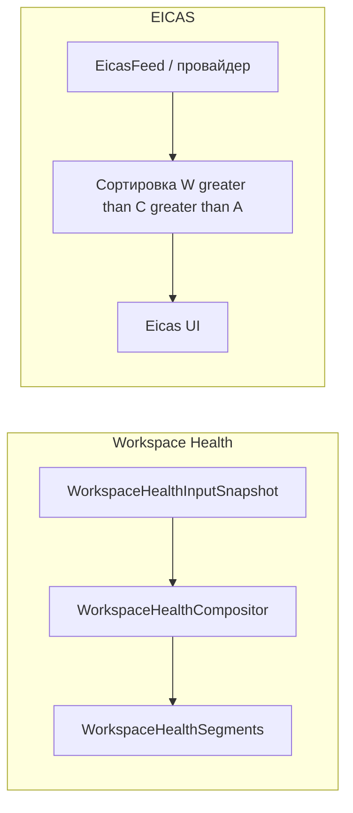

# Workspace Health — полоса и страница (реализация: `WorkspaceHealth*`) — implementation map (v1)

**Статус:** живой чертёж (не ADR). **Обновлено:** 2026-04-11 — каноническое имя контура: **Workspace Health**; типы в коде: `WorkspaceHealth*`; §1: «слот презентации vs канал»; ссылка на ADR 0021 §1.2. Ранее: 2026-04-06 — `WorkspaceHealthSecondaryPageView` + строка в §3/§4; отсылка к ADR: [содержимое якоря PFD/MFD vs Page канала](../adr/0021-pfd-mfd-cockpit-attention-model.md#anchor-pfd-mfd-content-vs-telemetry-page). Ранее: 2026-04-05 — §7.1: **решение v1 = вариант A** (отдельный контур EICAS); ранее — union types / вариант B, углубление, фазы.  
**Решения и термины** — в [ADR 0021](../adr/0021-pfd-mfd-cockpit-attention-model.md) (PFD/MFD/EICAS, ARINC 661-идеи); **канонический словарь** «канал / слой представления / имена в коде» — [§1.1](../adr/0021-pfd-mfd-cockpit-attention-model.md#glossary-channel-presentation). Лексикон **Workspace Health** и эволюция имён — [ADR 0022](../adr/0022-workspace-health-lexicon.md). Здесь — **где в коде** и **что дальше**, чтобы не раздувать ADR.

---

## 1. Термины (глоссарий)

| Термин | Смысл |
|--------|--------|
| **Зона PFD / MFD / EICAS** | Семантическая роль участка UI из ADR 0021: первичный контекст, вторичные потоки, канал оповещений. **Где** на экране задаётся **пресетом** (TOML/capabilities), не перетаскиванием в сессии. |
| **Снимок Workspace Health** | `WorkspaceHealthInputSnapshot`: нормализованные входы (build/tests/debug/git) до композитора. Не привязан к форме «полоски». |
| **Композитор смысла (semantic)** | `WorkspaceHealthCompositor`: из снимка собирает упорядоченные `WorkspaceHealthSegment` (порядок, флаги вроде `IsBuildRunning`). Отвечает за **состав каналов**, не за пиксели и не за зону PFD/MFD. |
| **Раскладка зоны / страницы (chrome layout)** | Куда на экране попадают блоки: полоса снизу, сетка на странице MFD, карточка в PFD. Задаётся **пресетом** и шаблонами (AXAML) и/или отдельным слоем в коде; рабочее имя в дизайне — *compositor страницы зоны* / *display page layout*. Только **геометрия контейнера** в зоне, не дублирует порядок build/tests — тот уже зафиксирован композитором смысла. |
| **Поверхность (surface)** | **Слой представления:** как **показать** те же сегменты (полоса, страница, карточка в хроме). Выбор Strip vs Page (`workspace_health_surface`, enum `WorkspaceHealthUiSurface`) — пресет и разметка; **снимок и композитор смысла не зависят** от этого слоя. Это не «хост событий» и не шина сообщений — только UI. |
| **Strip (полоса)** | Конкретная поверхность представления: узкая горизонтальная полоса — [`WorkspaceHealthStripView`](../../Views/WorkspaceHealthStripView.axaml). |
| **Page (страница)** | Другая поверхность представления **только для канала Workspace Health** (`workspace_health_surface`): те же сегменты в регионе PFD/MFD вместо полосы. Это **не** определение всего содержимого якоря — см. [ADR 0021](../adr/0021-pfd-mfd-cockpit-attention-model.md#anchor-pfd-mfd-content-vs-telemetry-page). |
| **Канал EICAS** | Оповещения W/C/A — отдельный **семантический** контур от Workspace Health (ADR §5). Визуально — полоса, список, оверлей и т.д.; контейнер в текущей разметке: `EicasAlertsBarView`, TOML `eicas_alerts_bar`. **Не путать** со Strip/Page: те относятся к **представлению** build/tests/debug/git, а не к каналу CAS. |

Типы `WorkspaceHealth*` задают **смысл** сегментов (build/tests/debug/git); [`WorkspaceHealthStripView`](../../Views/WorkspaceHealthStripView.axaml) — одна из **поверхностей представления**; при странице MFD / блоке PFD те же данные идут в **другую разметку** без смены композитора.

**Показ и данные развязаны:** **Strip** или **Page** — это только **слой представления** (настройки пресета), не ветвление логики снимка и не хост событий. Strip отнимает высоту у лобового; Page не отнимает ту же полосу, но требует перехода взгляда — пользователь сам решает, что важнее, **не меняя** источники данных и `WorkspaceHealthCompositor`.

| Уровень | Смысл | Заметка |
|--------|--------|--------|
| **Слот презентации** | Геометрия и роль поверхности: полоса vs **полная страница** региона MFD/PFD и т.д. | Разговорное «dedicated page» как «отдельная страница» часто про этот уровень. |
| **Канал содержимого** | Какой поток данных заполняет слот | Workspace Health (этот документ), EICAS, статус окружения, другие инструменты — **разные** каналы. |

**`DedicatedPage` в пресете Workspace Health** (`workspace_health_surface`, enum `WorkspaceHealthUiSurface`) относится **только** к **каналу Workspace Health**: те же `WorkspaceHealthSegments`, другая разметка ([`WorkspaceHealthSecondaryPageView`](../../Views/WorkspaceHealthSecondaryPageView.axaml)). Это **не** имя для «любой» полноэкранной страницы вторичного контура. Полное разведение терминов и рекомендуемые формулировки — [ADR 0021 §1.2](../adr/0021-pfd-mfd-cockpit-attention-model.md#glossary-presentation-vs-channel).

---

## 2. Идея в одном абзаце

Несколько источников (сборка, тесты, отладка, git) **подают состояние и строки**; **один** слой (`WorkspaceHealthCompositor`) задаёт **порядок и состав** сегментов — независимо от **слоя представления** (**Strip** или **Page**). Текущая разметка полосы: [`WorkspaceHealthStripView`](../../Views/WorkspaceHealthStripView.axaml) (Balanced/Focus vs Power cockpit).

---

## 3. Карта файлов

| Компонент | Путь | Роль |
|-----------|------|------|
| Снимок входов | `Features/UiChrome/WorkspaceHealthInputSnapshot.cs` | `WorkspaceHealthInputSnapshot` + `WorkspaceHealthSegmentInput` (build/tests/debug/git). Точка расширения без раздувания сигнатур. |
| Композитор | `Features/UiChrome/WorkspaceHealthCompositor.cs` | `Rebuild(ObservableCollection<WorkspaceHealthSegment>, WorkspaceHealthInputSnapshot)`; порядок: Build → Tests → Debug → Git; `IsBuildRunning` только на сегменте Build. |
| Модель сегмента | `Features/UiChrome/WorkspaceHealthSegment.cs` | `LineText` (полная строка), `CockpitShort` (Power), флаги для шаблона. |
| Источник enum | `Features/UiChrome/WorkspaceHealthSource.cs` | `Build`, `Tests`, `Debug`, `Git`. |
| Форматирование строк | `Features/UiChrome/WorkspaceHealthFormat.cs` | Статические сегменты `BuildSegment` / `TestsSegment` / `DebugSegment` / `GitSegment` и `Compose(...)` — чистая логика без VM/DAP; удобно для юнит-тестов. |
| Провайдер снимка | `Features/UiChrome/IWorkspaceHealthProvider.cs`, `WorkspaceHealthProvider.cs` | `GetSnapshot()` собирает входы (build/tests/DAP/instrumentation/git из `UiChromeViewModel`) в `WorkspaceHealthInputSnapshot`. `MainWindowViewModel` не знает текст каждой строки по отдельности — только держит провайдер и передаёт снимок в композитор. |
| VM | `ViewModels/MainWindowViewModel.WorkspaceHealth.cs` | `RebuildWorkspaceHealth()` вызывает `WorkspaceHealthCompositor.Rebuild(WorkspaceHealthSegments, _workspaceHealth.GetSnapshot())`. |
| Инвалидация | `ViewModels/MainWindowViewModel.LayoutNotifications.cs` | `RebuildWorkspaceHealth` при смене данных build/tests/debug. |
| Git-строки | `Features/UiChrome/UiChromeViewModel.cs` | `WorkspaceHealthGitText`, `WorkspaceHealthGitCockpitShort`; подписка в `MainWindowViewModel` на `Chrome.PropertyChanged`. |
| Свойства для UI | `ViewModels/MainWindowViewModel.Presentation.cs` | `WorkspaceHealthBuild*` / `WorkspaceHealthTests*` / `WorkspaceHealthDebug*` читают сегменты из `_workspaceHealth.GetSnapshot()`; флаги сессии отладки по-прежнему из DAP. |
| Полоса хрома над нижним доком | `Views/WorkspaceChromeBandView.axaml` | Сетка колонок как у `MainGrid` (0–4); слот `EicasAlertsBarView` и вложенный `WorkspaceHealthStripView`. Включение полосы Workspace Health: `ShowWorkspaceHealthStrip` (`workspace_health_strip` + `WorkspaceHealthUiSurface.BottomStrip` в capabilities). По смыслу — контейнер **представления** нижней зоны (EICAS + Strip), не «хост событий». |
| UI полосы | `Views/WorkspaceHealthStripView.axaml` | `ItemsControl` по `WorkspaceHealthSegments`; разные шаблоны для Power vs остальные режимы. |
| Страница вторичного контура (v1 — зона Mfd) | `Views/WorkspaceHealthSecondaryPageView.axaml` | Тот же `WorkspaceHealthSegments` при `ShowWorkspaceHealthSecondaryPage` (`workspace_health_strip` + `DedicatedPage`); в `MainWindow` — над `ChatPanelView` в колонке зоны Mfd. |
| Тесты | `CascadeIDE.Tests/WorkspaceHealthCompositorTests.cs`, `WorkspaceHealthFormatTests.cs` | Композитор: порядок, `IsBuildRunning`. Формат: сегменты и `Compose` для снимка. |

---

## 4. Поток данных (кратко)

1. Состояние меняется (сборка, тесты, DAP, git, …).
2. Свойства `WorkspaceHealth*` уведомляют UI (частично через `[NotifyPropertyChangedFor]`, частично явный `OnPropertyChanged` для отладки).
3. `RebuildWorkspaceHealth()` берёт снимок через `IWorkspaceHealthProvider.GetSnapshot()` (внутри — делегаты/DAP/`UiChromeViewModel` + `WorkspaceHealthFormat`) и вызывает `WorkspaceHealthCompositor.Rebuild`.
4. `WorkspaceHealthSegments` обновляется; привязка к `WorkspaceHealthStripView` (через `WorkspaceChromeBandView`) или к `WorkspaceHealthSecondaryPageView` в колонке зоны Mfd при `DedicatedPage`.

Альтернативная реализация провайдера (агент, MCP, моки в тестах VM) подменяет только сбор снимка, не композитор и не разметку полосы.

---

## 5. Статус vs ADR 0021 (первая строка таблицы ARINC)

| Идея ADR | В коде сейчас |
|----------|----------------|
| Один композитор «стекла», много источников | Да: один `Rebuild` + снимок входов. |
| Источники не владеют отдельным слоем toast без правил | Частично: строки централизованы; отдельные toast-цепочки не сводились сюда. |
| EICAS / Warning–Caution–Advisory | Нет: сегменты без уровня приоритета; полоса не EICAS-лента. |
| Декларативный merge из TOML | Частично: видимость полосы через capabilities/режимы; **порядок/состав** сегментов пока не из конфига. |

---

## 6. Краткий backlog (приоритет на усмотрение продукта)

1. **Пустые / placeholder-сегменты** — см. §7.2; согласовать с Dark Cockpit ([ADR 0021 §6](../adr/0021-pfd-mfd-cockpit-attention-model.md)).
2. **Приоритет / EICAS** — отдельный контур оповещений и уровни W/C/A ([ADR §5](../adr/0021-pfd-mfd-cockpit-attention-model.md)); см. §7.1 и §7.3.
3. **Конфиг** — порядок/видимость сегментов Workspace Health по режиму (TOML / capabilities); §7.4.
4. **Раскладка без нижней полосы** — Page / карточка PFD; тот же снимок + композитор, **другой слой представления** (§1, §7.5).
5. **Провайдер снимка** — сделано: `IWorkspaceHealthProvider`, `WorkspaceHealthProvider`, `WorkspaceHealthFormat`.

---

## 7. Углубление: два контура, приоритет, Dark Cockpit

Ниже — рабочая модель для реализации **без смешения** «статуса работы» (сборка, тесты, отладка, git) и **оповещений EICAS** (Warning / Caution / Advisory). ADR уже разводит их по смыслу; в коде это стоит закрепить явно.

### 7.1 Два контура данных

| Контур | Назначение | Примеры | Приоритет W/C/A |
|--------|------------|---------|------------------|
| **Workspace Health** | Ориентир «что происходит с задачей» (build/tests/debug/git) | Сборка, тесты, сессия отладки, git | **Не применяется** — фиксированный канонический порядок в `WorkspaceHealthCompositor` (Build → Tests → Debug → Git) |
| **EICAS / CAS** | Оповещения, требующие внимания или действия | Падение MCP при L3, блокировка агента, критичная ошибка по файлу в фокусе | **Да** — сортировка и отсечение по уровню ([ADR §5](../adr/0021-pfd-mfd-cockpit-attention-model.md)) |

**Почему «просто один список» опасен без дисциплины:** смешение в одной коллекции без явного тега «work vs alert» ведёт к спецслучаям в шаблонах и к риску раздуть полосу (Dark Cockpit). Это **не** запрет на один `ItemsControl`: при **явном** дискриминаторе проблема «полуслучайного порядка» снимается на уровне типов.

- **Вариант A:** `WorkspaceHealthCompositor` остаётся только про **Workspace Health**. EICAS — отдельная модель (`EicasMessage`, коллекция для UI), отдельный мини-композитор или сортировка по `Severity`; **размещение и представление** (`MainWindow` / зона `eicas` по пресету) задают, рисовать ли полосу над доком, оверлей или компактный список ([ADR §5](../adr/0021-pfd-mfd-cockpit-attention-model.md) уже допускает варианты). Это не тот же выбор, что Strip/Page для Workspace Health.
- **Вариант B:** дискриминированное объединение — один список элементов ленты, каждый элемент знает вариант: **работа** (build/tests/…) или **EICAS**; один `ItemsControl` с шаблоном по типу/варианту; `Rebuild` строит упорядоченную последовательность с **разными** правилами сортировки для каждой группы (сначала канон работы, внутри EICAS — по W/C/A), без смешения в одну «кучу».

**Решение для v1:** принят **вариант A** — отдельный контур EICAS в коде и в источниках данных. Это **сознательная цена** за ясность двух смыслов (работа vs оповещение), простые границы тестов и соответствие ADR; **не** избегание объединённого списка ради осторожности. Вариант B остаётся запасной траекторией для последующих версий (в т.ч. при зрелом C# union types и явном продуктовом решении о «одном ментальном канале»).

**C# и union types:** в языке появляются [union types](https://learn.microsoft.com/en-us/dotnet/csharp/language-reference/builtin-types/union) (`union` / закрытый набор кейсов, исчерпывающий pattern matching) — удобный носитель для варианта B на уровне модели. На **.NET 11 Preview 2** атрибуты/интерфейс для unions в BCL ещё не обязательны в рантайме; в документации указано объявлять их в проекте до стабилизации превью. Пока целевой LangVersion репо ниже — тот же смысл можно выразить вручную через `[Union]`/ручной union-шаблон из спеки или остаться на record-иерархии + общий интерфейс, с пониманием, что компилятор не выгонит за забытую ветку так же жёстко.

Вариант B после принятия union types в toolchain становится **существенно привлекательнее**: меньше страха перед «if в разметке», больше ответственности за то, **должен** ли пользователь видеть работу и оповещения в одном ментальном канале (продукт/ADR), а не только за типобезопасность.

Текущий код (`WorkspaceHealthSegment` без уровня приоритета) соответствует **только** первому контуру; расширение под EICAS — **новые типы**, а не «добавить поле Priority в Build».

Визуально слои могут быть **рядом** (полоса Workspace Health + узкая EICAS под/над ней по пресету), но **логика и источники** остаются раздельными.

### 7.2 Пустые сегменты и Dark Cockpit

**Проблема:** при пустых строках (нет git, тесты не запускались) либо пропадают «слоты», либо остаётся шум из placeholder’ов.

| Политика | Поведение | Плюсы / минусы |
|----------|-----------|----------------|
| **Compact** | В полосу попадают только сегменты с непустым `LineText` (после trim) | Меньше шума, соответствует «не показывать лишнее» ([Dark Cockpit §6](../adr/0021-pfd-mfd-cockpit-attention-model.md)); меняется длина полосы |
| **Fixed slots** | Всегда 4 (или N) ячеек; пустые — «—» / приглушённый placeholder | Стабильный scan pattern; риск визуального мусора в тихом режиме |
| **Режим-зависимый** | Focus/Balanced — compact; Power — fixed для нижнего ряда кокпита | Согласуется с разными шаблонами в `WorkspaceHealthStripView` |

**Рекомендация для первой итерации:** ввести флаг политики на уровне VM или пресета (`StripEmptySegmentPolicy: Compact | FixedFour`), реализовать **фильтрацию или placeholder** в одном месте — либо в `WorkspaceHealthCompositor.Append` (не добавлять пустые), либо в отдельном шаге **после** `Rebuild` (нормализация коллекции). Не размазывать условия по AXAML.

### 7.3 Приоритет и сортировка

- **Workspace Health:** порядок **не** конфигурируется приоритетом опасности — только **фиксированная пермутация** (при необходимости единственный конфиг: массив enum порядка в TOML, без W/C/A).
- **EICAS:** сортировка по **уровню** и времени/идентификатору; дубликаты сообщений — политика слияния (одна строка на источник). Связь с **escalation** и таймерами — в [ADR §5](../adr/0021-pfd-mfd-cockpit-attention-model.md), не в `WorkspaceHealthFormat`.

### 7.4 Конфиг сегментов Workspace Health

Цель: **какие** источники включены в каком `UiMode` / capability, без смешения с EICAS.

- **Минимум:** расширение capabilities (например скрыть git в Focus).
- **Полный вариант:** в `workspace.toml` опциональный блок в духе `attention_strip_order = ["build", "tests", "debug", "git"]` и/или `attention_strip_enabled = { git = false }` — парсится в структуру рядом с `UiWorkspaceToml`, merge с бандлом ([ADR 0021 §2.1 / §17](../adr/0021-pfd-mfd-cockpit-attention-model.md)).
- **Композитор:** читает не сырой TOML, а **уже слитый** `WorkspaceHealthLayoutPolicy` (immutable) на один вызов `Rebuild`, чтобы тестировать без файлов.

### 7.5 Page и нижняя полоса

Тот же `WorkspaceHealthInputSnapshot` и тот же порядок сегментов подаются в **другую разметку представления** (Page): полноэкранная страница MFD или блок в PFD. Меняются только шаблоны (не одна строка на сегмент, допускается многострочный вывод). Композитор смысла **не** ветвится по Strip/Page.

### 7.6 Фазы внедрения (предложение)

| Фаза | Содержание | Критерий готовности |
|------|------------|---------------------|
| **F1** | Политика пустых сегментов + тесты на `WorkspaceHealthCompositor` / нормализацию | Предсказуемое поведение в Focus vs Power |
| **F2** | Модель `EicasMessage`, провайдер, представление канала EICAS в зоне пресета (хотя бы список + цвет W/C/A) | Один Warning виден без охоты по вкладкам ([§18 / EICAS в ADR](../adr/0021-pfd-mfd-cockpit-attention-model.md)) |
| **F3** | Dark Cockpit transition: из «тихо» в Warning (бейдж/полоса/оверлей по пресету) | Нет постоянной четвёртой колонки |
| **F4** | TOML / merge для порядка и включения сегментов Workspace Health | Согласовано с roadmap `.cascade/workspace.toml` |
| **F5** | Страница Workspace Health (Page) как альтернатива Strip | Тот же снимок, другой AXAML |

---

## 8. Связанные документы

- [`environment-readiness-glance-v1.md`](environment-readiness-glance-v1.md) — канал **готовности окружения** (LSP, инструменты, glance); **не** Workspace Health. ADR: [0023](../adr/0023-environment-readiness-glance.md).
- [ADR 0021](../adr/0021-pfd-mfd-cockpit-attention-model.md) — модель внимания, зоны, EICAS (§5), Dark Cockpit (§6), метрики.
- [ADR 0010](../adr/0010-ui-modes-toml-configuration.md) — режимы UI и capabilities.
- [`cascade-ide-ui-layout-v1.md`](../ux/cascade-ide-ui-layout-v1.md) — раскладка окон.
