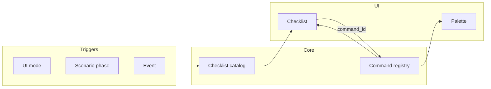

<!-- English translation of adr/0014-situational-checklists.md. Canonical Russian: ../../adr/0014-situational-checklists.md -->

# ADR 0014: Situational Checklists (Model, Triggers, UI)

**Status:** Accepted  
**Date:** 2026-04-02  

## Related ADRs

| ADR | Role |
|-----|------|
| [0013](0013-command-surface-and-discoverability.md) | Palette and command surface — parent decision |
| [0010](0010-ui-modes-toml-configuration.md) | Modes |
| [0011](0011-debug-situational-awareness.md) | Status strip vs checklist steps |
| [0002](0002-debug-human-agent-parity.md) | Single debug state layer for human and agent |
| [0008](0008-mcp-contracts-and-testable-infrastructure.md) | Stable MCP contracts and testable infrastructure |

## Summary

- Situational **checklists**: model, triggers, UI; child of [0013](0013-command-surface-and-discoverability.md).
- Discoverability via palette and task context, not a separate app.

## Split with [0013](0013-command-surface-and-discoverability.md)

- **[0013](0013-command-surface-and-discoverability.md)** — command surface: palette, discoverability overall, minimal toolbar.
- **0014 (this ADR)** — **situational checklists**: scenario catalog, triggers, binding steps to `command_id`, checklist card behavior.

---

## Context

[0013](0013-command-surface-and-discoverability.md) introduces discoverability beyond palette search and proposes **mini-checklists** as situational hints (including aviation metaphor). This ADR records **checklist mechanics** separately; otherwise “what entry points exist” (0013) mixes with “how one scenario’s steps are structured”.

## Decision

A checklist is not a palette replacement but a **narrow layer** of “what makes sense to do *now* in this situation”, even when the user does not know command names. Details — [“Vision: mechanics”](#checklist-vision) below.

## Vision: situational checklist mechanics

Below — target implementation vision (iterations and checklist set per plan).

### Roles of three mechanisms

| Mechanism | Purpose |
|-----------|---------|
| **Command palette** | Find **any** known command by name / substring / hotkey. |
| **Situational checklist** | Show a **short ordered scenario** for current context; answers “what people usually do next”, not “what commands exist in the product”. |
| **Toolbar** | Rare **anchor** actions; do not move whole scenarios here. |

A step bound to a command invokes the **same** operation as the palette and (by contract) automation — via the **unified registry** (`command_id`) from [0013](0013-command-surface-and-discoverability.md) / [0008](0008-mcp-contracts-and-testable-infrastructure.md).

### Logical checklist model

- **`checklist_id`** — stable id (telemetry, mode binding, content evolution).
- **`situation`** — relevance condition (see triggers below).
- **`steps[]`** — ordered steps: human-readable text; optional **`command_id`** from registry; optional **deep link** (open panel, file, setting).
- **Step UI state** (session or persisted in settings — per iteration): e.g. `todo` / `done` / `skipped` / `na`.
- **`anchors`** — where a checklist *may* appear (compact card at editor edge, strip, first-run modal, etc.); one scenario need not be tied to one widget forever.

A checklist **guides attention** and delegates to the command layer on click; it need not “do magic” bypassing the registry.

### When a checklist is relevant (triggers)

Rules are **declarative in TOML** — same spirit as UI mode config ([0010](0010-ui-modes-toml-configuration.md)); a parallel JSON “official” format for this is **not** needed (see 0010 on one textual config stack). Show conditions — structure like `when` with `ui_mode`, `phase`, events, etc. (exact schema at implementation), without logic in VM.

- **UI mode** ([0010](0010-ui-modes-toml-configuration.md)) — e.g. in Debug show “typical debug loop”.
- **Scenario phase** — high-level state machine (`no solution` → `build` → `debug` → …); each phase may have its checklist or step branch.
- **Event** — first launch, first breakpoint in session, build failure, etc.
- **Explicit request** — “Show checklist…” from palette or context menu.

### UI behavior

- Default — **compact card** (collapsible); visual reference — mockup [docs/ui-ux/concept-screens/cascade-ide-checklist-ui-concept.png](../ui-ux/concept-screens/cascade-ide-checklist-ui-concept.png).
- Click on a step with `command_id` = same invocation as from the palette; mark `done` — manually and/or heuristically after successful command (complexity per iteration).
- **Do not obstruct:** Hide / “do not show for this scenario” without losing reopen from palette.
- **Link to [0011](0011-debug-situational-awareness.md):** awareness strip is about *state*; checklist is about *typical next steps*. Do not mix long log and long checklist in one zone.

### Data flow (target)

### Out of nearest v1 scope

- Long “aviation” preflight lists with dozens of items per action.
- Embedded knowledge base inside the checklist (except links to commands and external docs).
- Mandatory sync of checklist “ticks” with the agent: parity on **commands** ([0002](0002-debug-human-agent-parity.md)); checklist state for the human may stay local until a separate decision.

### Rollout order (recommendation)

1. **Command registry + palette** ([0013](0013-command-surface-and-discoverability.md)) — shared base for toolbar, MCP, checklist steps.  
2. **Checklist catalog + UI card** — steps with `command_id`, triggers and hide rules as above.

## Consequences

- Need a **scenario catalog** (steps, `command_id`, `situation` rules) on top of the **unified command registry**; otherwise the checklist becomes a second source of truth.
- Checklist UI is a **presentation of invocations** through the same registry as palette and MCP.
- Tests and docs (later): which checklists show by default in which modes.

## Rejected alternatives (as end state)

- **Checklist as a separate command channel** without `command_id` and registry — rejected: diverges from palette and agent.
- **Long checklists only**, no palette — rejected: see [0013](0013-command-surface-and-discoverability.md).

## Discussion (open questions for next iterations)

- **Scenario set** per UI mode and overlap with [0011](0011-debug-situational-awareness.md) / [0012](0012-floating-workspace-chrome.md) (where to show the card with floating chrome).
- Separate UX for **first launch** vs **day two**.
