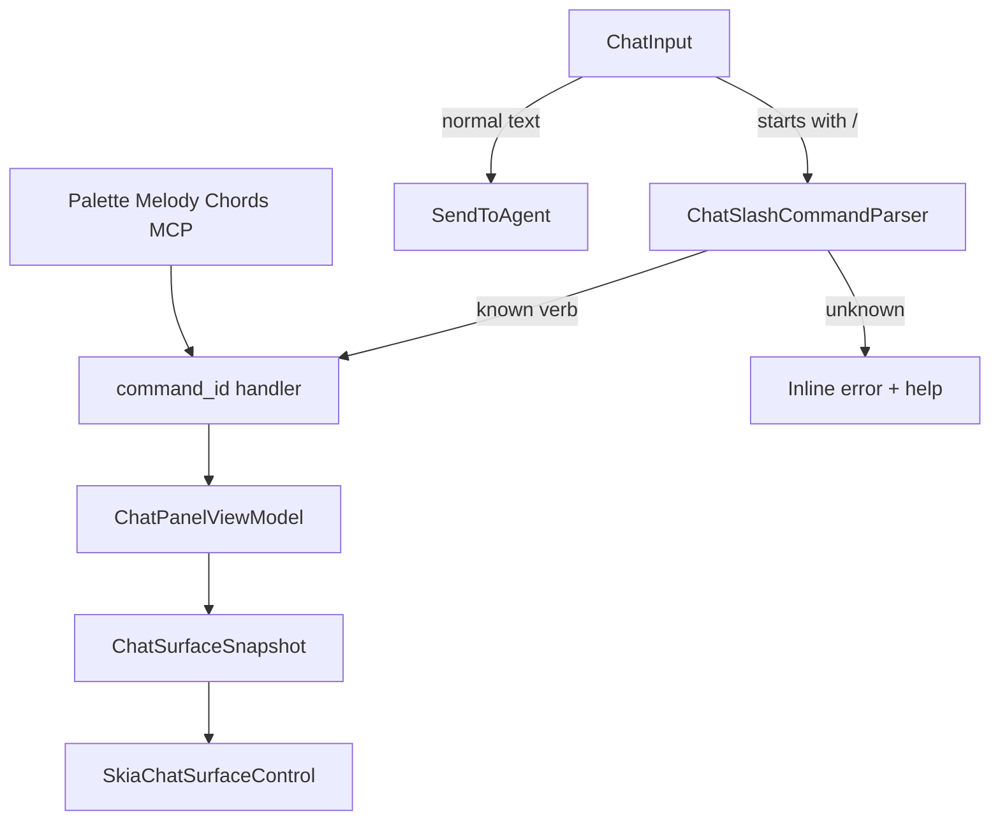

# ADR 0119: Slash commands in chat — unified command line (Intercom + IDE)

**Status:** Proposed  
**Date:** 2026-05-17  
**Updated:** 2026-05-17 — extended to IDE verbs (`/build run`, `/test run`, `/debug launch`); autocomplete required. [§ History](#adr0119-history)

## Related ADRs

| ADR | Role |
|-----|------|
| [0080](0080-intercom-naming-and-multi-party-channel-model.md) | Chat as **Intercom** — central channel, not “bot window” |
| [0072](0072-chat-topic-cards-intent-melody-keyboard-contract.md) | Topic cards, overview/detail, **intent-first** navigation (Melody/Chords) |
| [0096](0096-intercom-topic-card-summary-and-product-spine.md) | Card content, spine, carry-forward into thread |
| [0013](0013-command-surface-and-discoverability.md) | Palette and discoverability — slashes **complement**, do not replace |
| [0030](0030-command-ids-hotkeys-and-ui-registry-layers.md) | Canonical `command_id`, registry, MCP parity |
| [0060](0060-keyboard-chord-stack-fms-tactical-strategic.md) | CascadeChord, Command Melody `c:` — **orthogonal** input |
| [0008](0008-mcp-contracts-and-testable-infrastructure.md) | Agent parity: same effects via `ide_execute_command` |
| [0048](0048-cursor-acp-chat-ide-parity-and-mcp-tool-surface.md) | What goes to the agent vs local IDE action |
| [0057](0057-chat-surface-pipeline-adoption.md) | Snapshot/layout after VM state change |
| [0116](0116-intercom-session-tree-and-agent-message-steering.md) | Session tree, steer — do not mix with slash parser |
| [0002](0002-debug-human-agent-parity.md) | `/build`, `/test`, `/debug` — same `command_id` as agent via MCP |
| [0018](0018-ide-commands-canonical-xml-documentation.md) | Canonical `IdeCommands` names for catalog projection |
| [0120](0120-primary-work-surface-intercom-or-editor.md) | Intercom in Forward — slashes as primary session CLI |

### Outside ADR

| Document | Role |
|----------|------|
| [MCP-PROTOCOL.md](../../MCP-PROTOCOL.md) | `ide_execute_command`, `send_chat`, chat_* MCP |
| [intent-melody-language-v1.md](../../intent-melody-language-v1.md) | `c:` grammar — **not** `/` grammar in chat |

## Summary

- **`ChatInput`** is an **alternative IDE command line**: stay in chat for Intercom *and* frequent actions (`/build run`, `/test run`, `/debug launch`, `/card …`).
- Slash → **`command_id`** ([0030](0030-command-ids-hotkeys-and-ui-registry-layers.md)); catalog is a **projection** of the registry onto **readable** slash paths (`/build run`, `/overview`), not a second executor in the VM.
- **Discoverability via autocomplete** (namespace → action hierarchy, hints, `/help`), **not** via short mnemonics like `/br` (compressed forms stay in **`c:`** Melody and chords, [0060](0060-keyboard-chord-stack-fms-tactical-strategic.md)).
- **Autocomplete is required** — extended catalog is not accepted without it.
- Palette, Melody `c:`, and chords remain; slash is a **peer input** for those already in the message field ([0013](0013-command-surface-and-discoverability.md)).
- Rollout **in phases**: Intercom verbs → IDE namespaces → extension from palette.

---

## Context

Intercom in CIDE ([0080](0080-intercom-naming-and-multi-party-channel-model.md)) is increasingly the **central surface**: agent dialogue, topic catalog ([0072](0072-chat-topic-cards-intent-melody-keyboard-contract.md)), product spine ([0096](0096-intercom-topic-card-summary-and-product-spine.md)), clarifications ([0031](0031-agent-chat-clarification-batches-and-threading.md)).

Power users already have:

- **palette** and fuzzy search ([0013](0013-command-surface-and-discoverability.md));
- **global hotkeys** and **CascadeChord** ([0060](0060-keyboard-chord-stack-fms-tactical-strategic.md));
- **Command Melody** `c:` in the palette ([0112](0112-command-palette-query-modes-strategy.md));
- **chat navigation intents** with MCP parity (`chat_show_thread_overview`, `chat_open_selected_thread`, … — [0072 §4](0072-chat-topic-cards-intent-melody-keyboard-contract.md)).

That is **not enough** when the operator **is already typing in the message field** and expects a Slack/Discord-style model or **CLI inside chat**:

- Intercom: `/card New topic`, `/overview`, `/spine focus=…`;
- IDE: `/build run`, `/test run`, `/debug launch` — **without** switching to palette, toolbar, or mandatory chords.

Product hypothesis: if Intercom is the **central surface**, chat becomes the **single session control point**, not only a channel to the agent.

---

## Problem

1. **Discoverability gap:** chat commands exist in the registry and MCP but are **not visible** in the input context where the main thought stream lives.
2. **Duplication risk:** ad-hoc `/card` parsing in `SendChatAsync` bypasses the intent layer [0072 §5](0072-chat-topic-cards-intent-melody-keyboard-contract.md) and diverges from pointer/MCP.
3. **Mixing with the agent:** without a “slash = local” rule, `/export` may go to the LLM as plain text.
4. **Prefix conflict:** `c:` is reserved for palette/Melody ([0112](0112-command-palette-query-modes-strategy.md)); **`/`** is a separate space **only in ChatInput**.

---

## Decision

<a id="adr0119-p1"></a>

### 1. ChatInput as **unified command line** (slash prefix)

- A line starting with **`/`** (after trim) is a **slash command** (one- or two-level; see [§4](#adr0119-p4)).
- Parse **on send** (Enter) and **incrementally** for autocomplete ([§6](#adr0119-p6)) — autocomplete is **not optional** for the accepted catalog size.
- Do **not** intercept `/` in the middle of a normal message; ordinary agent dialogue has **no** leading slash.

<a id="adr0119-p2"></a>

### 2. Intent-first: slash → `command_id` → VM → snapshot

**Invariant** (extension of [0072 §5](0072-chat-topic-cards-intent-melody-keyboard-contract.md)):

```text
ChatInput (/verb args…) → ChatSlashCommandParser → command_id (+ args)
  → IdeMcpCommandExecutor / ChatPanel handlers (as palette/MCP)
  → ChatPanelViewModel state → ChatSurfaceCompositor → Skia render
```

- Slash commands do **not** change Skia directly or read hit-target geometry.
- Pointer, Melody, Chords, palette, MCP, and slash **converge** on the same `command_id` where possible.

<a id="adr0119-p3"></a>

### 3. Execution modes

| Mode | Behavior | Example |
|------|----------|---------|
| **Local** | Message **not** sent to agent; `command_id` runs; input cleared (or one-line status). | `/overview`, `/export` |
| **Local + echo** | Local + short system line in feed (optional, v1+). | `/card` with “topic created …” |
| **Reject** | Unknown verb — UI error, **no** agent send. | `/foo` |
| **Pass-through** *(forbidden by default)* | Send text to agent as-is. | **Do not** use for unrecognized `/` |

**v1 rule:** unrecognized line with leading `/` → **Reject** with hint “unknown command, Tab — list”.

<a id="adr0119-p4"></a>

### 4. v1 grammar

**Two levels** (like “namespace / action”):

```ebnf
slash_line   = "/" head (WS tail)? WS? ;
head         = flat_verb | namespace ;
flat_verb    = letter { letter | digit | "-" } ;     (* overview, card, help, export *)
namespace    = letter { letter | digit } ;           (* build, test, debug, git, chat *)
tail         = action (WS arg_token)* | arg_tail ;   (* run | launch | …  OR  rest for flat *)
action       = letter { letter | digit | "-" } ;
arg_tail     = { arg_token } ;                       (* /card Topic name — all after head *)
arg_token    = quoted_string | bare_token ;
```

**Examples:**

| Input | Parse |
|-------|--------|
| `/overview` | flat: `overview` |
| `/card ADR 0119` | flat: `card`, args: `ADR 0119` |
| `/build run` | namespace: `build`, action: `run` |
| `/test run` | namespace: `test`, action: `run` |
| `/debug launch` | namespace: `debug`, action: `launch` |

- **Case:** case-insensitive.
- **Named args** (`configuration=Release`) — v2; v1 uses positional tail where needed.

<a id="adr0119-p5"></a>

### 5. Catalog: projection onto `command_id`, not a second registry

<a id="adr0119-p5a"></a>

#### 5a. Source of truth

- **Execution** only through existing `ide_execute_command` / `IdeMcpCommandExecutor` ([0030](0030-command-ids-hotkeys-and-ui-registry-layers.md), [0008](0008-mcp-contracts-and-testable-infrastructure.md)).
- **Slash catalog** (`ChatSlashCommandCatalog`) is a **mapping** (slash path → `command_id` + arg template), built from:
  1. **Curated** table in code (v1);
  2. v2+ — **projection** of a subset of `IdeCommandPaletteCatalog` / `IdeCommands` metadata (palette title need not match slash; slash path is explicit).
- **Not Melody:** the catalog has **no** separate “2–3 letter” entries (`/br`, `/tr`) as shortcuts to `namespace action` — the operator picks **`/build` → `run`** from autocomplete or types the full form.
- **Forbidden:** duplicate `dotnet build` / test / debug logic in `ChatPanelViewModel`.

<a id="adr0119-p5b"></a>

#### 5b. Intercom (flat verbs) — phase A

| Slash | `command_id` | Note |
|-------|----------------|------|
| `/overview` | `chat_show_thread_overview` | |
| `/open` | `chat_open_selected_thread` | |
| `/card <title>` | *new* or `fork_chat_thread` + title | product |
| `/spine …` | `chat_set_product_spine` | tail → focus / milestones |
| `/spine-toggle` | `chat_toggle_product_spine_in_agent_context` | |
| `/export` | `chat_export_readable` | |
| `/help` | local catalog | no MCP |

<a id="adr0119-p5c"></a>

#### 5c. IDE namespaces — phase B (without leaving chat)

| Slash | `command_id` | Note |
|-------|----------------|------|
| `/build run` | `build` or `build_structured` | structured JSON to feed/panel — UI policy |
| `/build ui` | `build_solution_ui` | toolbar path, text to output |
| `/test run` | `run_tests` | |
| `/test affected` | `run_affected_tests` | optional `changed_paths` from git |
| `/debug launch` | `debug_launch` | target from launch profile / current |
| `/debug continue` | *debug_start_or_continue* (UI id) | add `IdeCommands` constant if missing |
| `/git status` | `git_status` | phase C when in registry |

Further namespaces (`nav`, `index`, `palette`) — **as discoverability allows**, not “all of IdeCommands at once”.

**Parity:** agent calls the same `build` / `run_tests` / `debug_launch` via MCP; operator uses `/build run` in chat.

<a id="adr0119-p6"></a>

### 6. Discoverability: autocomplete and help (required)

Without autocomplete, extension to `/build`, `/test`, … is **not accepted** — the operator **must not** memorize namespaces and actions and **must not** rely on compressed slash mnemonics (unlike `c:` in the palette).

**UI behavior (v1 minimum):**

| Input step | Popup shows |
|------------|-------------|
| `/` | top-level: flat verbs + namespaces (`build`, `test`, `debug`, `card`, …) |
| `/build ` | actions: `run`, `ui`, … + one-line description |
| `/build r` | prefix filter (`run`) |
| unknown prefix | “no matches” + link to `/help` |

- **Tab** — complete token / select highlighted; **↑↓** — navigate; **Esc** — close popup without clearing line.
- Under each item — **short help** (from `IdeCommands` doc / curated catalog) and optional **hotkey** from TOML ([0030](0030-command-ids-hotkeys-and-ui-registry-layers.md)).
- **`/help`** and **`/help build`** — text/interactive list in feed or overlay (local).
- v1 source: `ChatSlashCommandCatalog` in code; v2 — TOML `chat-slash-aliases.toml` analogous to [0109](0109-declarative-parametric-melody-catalog-toml-and-code-binders.md).

<a id="adr0119-p7"></a>

### 7. Relation to agent and spine ([0096](0096-intercom-topic-card-summary-and-product-spine.md))

- Slash commands are **local by default** — they do **not** expand the agent prompt.
- `/spine-toggle` and `/spine` change session metadata; including spine in agent context is **explicit** ([0096 §4](0096-intercom-topic-card-summary-and-product-spine.md#adr0096-p4)), not a side effect of any slash.
- **Carry-forward** into the thread remains a **normal message** or separate intent; slash need **not** generate agent text.

<a id="adr0119-p8"></a>

### 8. Non-goals and boundaries

**Non-goals:**

- **Full replacement** of Command Palette: fuzzy search over *all* commands without namespace structure stays in the palette.
- Automatic **1:1** “every palette row = slash” without curated aliases and UX filter (too noisy).
- Slash commands in **other** fields (terminal, editor, palette) — only `ChatInput`.
- Plugins with arbitrary verbs **without** catalog / `command_id` entry.
- Pass-through of unrecognized `/…` to the agent.
- **Short slash aliases** (2–3 characters, “melody after `/”): `/br` instead of `/build run`, auto-generation from [0109](0109-declarative-parametric-melody-catalog-toml-and-code-binders.md) without a dedicated slash path — discoverability is **hierarchical autocomplete** and readable `namespace` / `action` / flat verbs only.

**In scope (deliberately):**

- **Alternative input** to the same IDE actions as palette/chords/MCP — including `/build run`, `/test run`, `/debug launch`.
- Operator **may stay in chat** for the frequent loop “ask agent → build → run tests → debug”.

---

## Input orthogonality (summary)

| Input | Where | Prefix / form |
|-------|-------|----------------|
| Palette | overlay | fuzzy, `c:` Melody |
| Hotkeys / Chord | global | TOML → `command_id` |
| Chat Melody aliases | palette / intents | `ato`, `atb`, … ([0072](0072-chat-topic-cards-intent-melody-keyboard-contract.md)) |
| **Chat slash** | `ChatInput` | `/verb` or `/namespace action` (**this ADR**) |
| MCP | agent | `ide_execute_command` |

---

## Diagram



---

## Implementation anchors (plan)

| Component | Role |
|-----------|------|
| `Features/Chat/ChatSlashCommandCatalog.cs` *(new)* | verb → descriptor (`command_id`, help, arg hint) |
| `Features/Chat/ChatSlashCommandParser.cs` *(new)* | parse line, validate |
| [`ChatPanelViewModel`](../../Features/Chat/ChatPanelViewModel.cs) | call parser in `SendChatAsync` **before** `ApplyProductSpineToOutboundMessage` / ACP |
| [`IdeMcpCommandExecutor`](../../ViewModels/IdeMcpCommandExecutor.cs) | same `command_id` as MCP |
| [`ChatPanelView.axaml`](../../Views/ChatPanelView.axaml) | autocomplete popup (**required** before phase B) |
| `ChatSlashAutocompleteControl` *(new)* | hierarchical popup bound to `ChatInput` |
| [`IdeCommands`](../../Services/IdeCommands.SolutionWorkspace.cs) | new `command_id` only if uncovered (`chat_create_or_rename_topic`) |

**Rollout order:**

| Phase | Content | Done when |
|-------|---------|-----------|
| **A** | Parser (flat + namespace/action), Intercom catalog, local execution | `/overview`, `/export` do not go to agent |
| **A′** | **Autocomplete** for flat + namespace list | hints after `/` and `/build ` |
| **B** | IDE: `/build run`, `/test run`, `/debug launch` → `command_id` | parity with MCP `build` / `run_tests` / `debug_launch` |
| **C** | Extend catalog (`/git status`, `/nav`, palette projection) | by discoverability + autocomplete, not big-bang |

Tests: parser unit tests; “slash local” integration; catalog help snapshots.

---

## Rejected alternatives

1. **Parse slashes in the palette** (`/card` in Command Palette) — mixes overlay and Intercom; rejected.
2. **MCP-only commands without `command_id`** — breaks [0030](0030-command-ids-hotkeys-and-ui-registry-layers.md); rejected.
3. **Send unrecognized `/` to the agent** — noise and leaks; rejected.
4. **Short slashes like Melody** (`/br` = build run) — duplicates `c:` / chords, collisions and a second parser; Intercom discoverability is **autocomplete**, not mnemonics; rejected.

---

## Change history

<a id="adr0119-history"></a>

| Date | Change |
|------|--------|
| 2026-05-17 | Proposed: slash commands in ChatInput, v1 catalog, intent-first, non-goals. |
| 2026-05-17 | Extended: unified command line — IDE namespaces (`/build run`, `/test run`, `/debug launch`); autocomplete required; phases A–C. |
| 2026-05-17 | Clarified: slash discoverability is **autocomplete**; short aliases (`/br`) and “melody after `/`” are **non-goals** (compression — `c:` Melody). |
