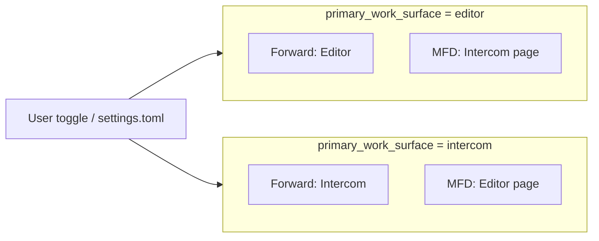

# ADR 0120: Primary work surface — Intercom or Editor (Agent / Editor analogue)

**Status:** Accepted · Implemented  
**Date:** 2026-05-17

## Related ADRs

| ADR | Role |
|-----|------|
| [0017](0017-multi-window-workspace-and-agent-surfaces.md) | PFD / Forward / MFD topology, `presentation`, multi-window |
| [0021](0021-pfd-mfd-cockpit-attention-model.md) | Attention anchors; Forward = forward field of view |
| [0010](0010-ui-modes-toml-configuration.md) | UI modes in TOML; place for “agent-central” preset |
| [0028](0028-user-settings-toml-localappdata-and-secrets.md) | `%LocalAppData%\CascadeIDE\settings.toml` |
| [0080](0080-intercom-naming-and-multi-party-channel-model.md) | Intercom — session channel, not “chat widget” |
| [0098](0098-semantic-first-document-as-projection.md) | Editor — powerful channel, not sole truth |
| [0044](0044-avalonia-host-skia-agent-chat-surface.md) | Skia host for agent chat surface |
| [0072](0072-chat-topic-cards-intent-melody-keyboard-contract.md) | Topic cards in overview/detail |
| [0119](0119-chat-slash-commands-intercom-surface.md) | Slash commands in `ChatInput` — stronger when Intercom is central |
| [0121](0121-intent-oriented-programming-paradigm.md) | IOP: discipline of communication; Intercom as goal-centric hub; honest stream limits |
| [0074](0074-settings-ui-mfd-compact-layout-overflow.md) | MFD density in a narrow column |

### Outside ADR

| Document | Role |
|----------|------|
| [ui-ux/README.md](../ui-ux/README.md) | Current Flight line; legacy Focus/Balanced/Power — archive |
| [iop-manifest-v1.md](../iop-manifest-v1.md) | IOP: Intercom communication hub; no promise to digest any inbound stream |

## Summary

- New setting **`primary_work_surface`**: **`intercom`** | **`editor`** (analogue of **Agent / Editor** in Cursor).
- Defines **what occupies the Forward anchor** (forward field): full **Intercom** (chat + catalog + spine) or **code editor**.
- Secondary contour (MFD) shows the **other** surface (editor or shell pages) without losing features.
- **Do not** confuse with OS **primary monitor** ([0017 § primary vs Forward](0017-multi-window-workspace-and-agent-surfaces.md#adr0017-p5-primary-vs-forward)).
- Product default: **`editor`**; “like Cursor” preset — **`intercom`**. Ties to [0119](0119-chat-slash-commands-intercom-surface.md).
- With **`intercom`**, the forward anchor is not a “message feed” but the **communication hub around a goal** (people + agents → intent → implementation), see [0121](0121-intent-oriented-programming-paradigm.md), [iop-manifest-v1.md](../iop-manifest-v1.md).

---

## Context

Some users (including when working **in Cursor** with chat on the **main screen**) spend most of the session in agent dialogue. For them the cockpit metaphor “Forward = editor, chat on MFD” is **inverted** relative to real attention: center is **thought and conversation**, code **on demand**.

CIDE already has:

- **three anchors** PFD / Forward / MFD ([0021](0021-pfd-mfd-cockpit-attention-model.md));
- **Intercom** as product model ([0080](0080-intercom-naming-and-multi-party-channel-model.md), [0072](0072-chat-topic-cards-intent-melody-keyboard-contract.md), [0096](0096-intercom-topic-card-summary-and-product-spine.md));
- **configurable screen topology** via `presentation` ([0017](0017-multi-window-workspace-and-agent-surfaces.md));
- **UI modes** in TOML ([0010](0010-ui-modes-toml-configuration.md)).

Missing: an **explicit “what is in the center” switch** without manual monitor rearrangement and without changing the whole `presentation` string.

---

## Problem

1. **Forward is mentally fixed as editor** in the default layout — agent-central users perceive chat **peripherally**.
2. **Monitor confusion:** “center screen” ≠ OS **primary display** — see [0017](0017-multi-window-workspace-and-agent-surfaces.md); need a separate **`primary_work_surface`** axis.
3. **0119 (slashes)** and **topic cards** win when Intercom is already in the forward anchor; without 0120 architecture stays “chat on the side”.
4. **Risk of “removing the editor”:** product goal is **change default focus**, not abandon code ([0098](0098-semantic-first-document-as-projection.md)).

---

## Decision

<a id="adr0120-p1"></a>

### 1. `primary_work_surface` axis

Allowed values:

| Value | **Forward** anchor | Typical editor placement |
|-------|-------------------|---------------------------|
| **`editor`** *(CIDE default)* | Code editor (AvaloniaEdit) | MFD: **Intercom** / chat shell page |
| **`intercom`** | **Intercom** (full `ChatPanel` + Skia: overview, spine, detail) | MFD: **Editor** as page or docked panel; PFD unchanged in meaning |

**Invariant:** both surfaces **remain available**; only the **default attention anchor** changes, like Agent / Editor toggle in Cursor.

<a id="adr0120-p2"></a>

### 2. Orthogonality to other axes

| Axis | Question | Relation to `primary_work_surface` |
|------|----------|--------------------------------------|
| **`presentation`** ([0017](0017-multi-window-workspace-and-agent-surfaces.md)) | How many windows and P/F/M shares | Independent: `(P+F+M)` on one display **and** `intercom` in Forward |
| **OS primary monitor** | Where Windows puts taskbar | Does **not** set Forward; see [0017 §5](0017-multi-window-workspace-and-agent-surfaces.md#adr0017-p5-primary-vs-forward) |
| **UiMode / Flight** ([0010](0010-ui-modes-toml-configuration.md)) | Panel visibility, capabilities | May **narrow** chrome (Dark Cockpit); does not replace anchor |
| **Melody / Chords** ([0060](0060-keyboard-chord-stack-fms-tactical-strategic.md)) | M/P/F zone focus | Kept; `focus_forward` focuses **forward anchor** (chat or editor) |

<a id="adr0120-p3"></a>

### 3. UX contract for switching

- **Explicit toggle** in UI (toggle, menu item, optional hotkey) — labels **`Intercom`** / **`Editor`** or **`Agent`** / **`Editor`** (copy TBD in UX; data canon — `intercom` | `editor`).
- Switching does **not reset** chat session or **close** open files; only **Forward host** and **default MFD page** change.
- State **persisted** in `settings.toml` ([0028](0028-user-settings-toml-localappdata-and-secrets.md)).

<a id="adr0120-p4"></a>

### 4. Configuration (target schema)

```toml
# settings.toml (fragment)
[workspace]
primary_work_surface = "intercom"   # "editor" | "intercom"
```

Optionally in **`UiModes/Flight.toml`** (or separate `AgentCentral.toml` preset):

```toml
primary_work_surface = "intercom"
# capabilities: wider chat, narrower IDE Health strip, …
```

**Default when key missing:** `editor` (compatible with current CIDE).

<a id="adr0120-p5"></a>

### 5. Relation to Intercom and [0119](0119-chat-slash-commands-intercom-surface.md)

When **`primary_work_surface = intercom`**:

- Forward shows **topic catalog**, spine, detail — [0072](0072-chat-topic-cards-intent-melody-keyboard-contract.md), [0096](0096-intercom-topic-card-summary-and-product-spine.md).
- **`ChatInput`** is the natural session **command line**; slash commands ([0119](0119-chat-slash-commands-intercom-surface.md)) become the **primary** path to `build` / `test` / `card`, not peripheral.

When **`editor`** — behavior as today; 0119 remains useful but chat need not be central.

<a id="adr0120-p5b"></a>

#### 5.1. Intercom-central ≠ endless stream

`primary_work_surface = intercom` does **not** mean “everything inbound in one feed” and does **not** promise that the product or agents will **handle any volume** of human messages — without structure, **people cannot either** ([0121](0121-intent-oriented-programming-paradigm.md) § “Risks and boundaries”, [iop-manifest-v1.md](../iop-manifest-v1.md) § “Honestly about human message volume”).

What central Intercom is for:

- **lines of work** (topic cards, spine) instead of chaotic chat;
- **clarification batches** and threads ([0031](0031-agent-chat-clarification-batches-and-threading.md));
- **intent-first** and slash/MCP as one contract ([0119](0119-chat-slash-commands-intercom-surface.md));
- the human in Forward is **arbiter of intent and delta**, not dispatcher of every message.

0120 changes the **attention anchor**; IOP and the topic catalog define **how** that anchor does not become noise.

<a id="adr0120-p6"></a>

### 6. Editor when Intercom-central

- Editor is **not removed**: move to MFD “Code” page / dock / split — layout detail in implementation.
- **Go to definition**, open file from chat, anchors [0080](0080-intercom-naming-and-multi-party-channel-model.md) — still move focus to **editor** (temporary or with surface switch), without breaking deep links.
- Semantic map / PFD **need not** move to Forward.

---

## Non-goals

- Replacing the three-zone PFD / Forward / MFD model with “chat only”.
- Identifying `primary_work_surface` with OS **primary monitor**.
- Mandatory `presentation` string change on every Agent/Editor toggle.
- Removing **Editor** mode or abandoning AvaloniaEdit in Forward **forever**.
- **Endless feed** as the target UX for Intercom-central — contradicts [0080](0080-intercom-naming-and-multi-party-channel-model.md), [0072](0072-chat-topic-cards-intent-melody-keyboard-contract.md), [0121](0121-intent-oriented-programming-paradigm.md).

---

## Implementation anchors (plan)

| Component | Role |
|-----------|------|
| `settings.toml` | `workspace.primary_work_surface` |
| `MainWindow` / `MainGrid` | conditional host in Forward column |
| `MfdShellView` / secondary pages | second surface when `intercom` |
| `MainWindowViewModel` | property + switch command; save to settings |
| `IdeCommands` *(optional)* | `set_primary_work_surface`, `toggle_primary_work_surface` for MCP |
| [0119](0119-chat-slash-commands-intercom-surface.md) | slash implementation — after or parallel with host swap |

**Order:**

1. Setting + toggle + host swap in `MainWindow` (no `presentation` change).
2. MFD editor page when `intercom`.
3. TOML “agent-central” preset + UX docs.
4. MCP / hotkey as needed.

---

## Open decisions (before Accepted)

| # | Question | Direction |
|---|----------|-----------|
| 1 | UI labels: **Intercom** vs **Agent** | Product: Intercom ([0080](0080-intercom-naming-and-multi-party-channel-model.md)); Cursor users — alias “Agent” on toggle |
| 2 | Editor on MFD: separate **page** vs **dock** | Page v1 (simpler parity with current shell) |
| 3 | Auto-switch to Editor on go-to-definition | Optional v2; v1 — explicit transition |

---

## Diagram



---

## Rejected alternatives

1. **Only change `presentation`** without a separate key — insufficient for one monitor and quick Agent/Editor toggle.
2. **Chat always in Forward, editor only in popup** — breaks MCP/debug parity and familiar MFD shell.
3. **New fourth “Intercom” anchor** instead of Forward swap — bloats [0021](0021-pfd-mfd-cockpit-attention-model.md) without need.

---

## Change history

<a id="adr0120-history"></a>

| Date | Change |
|------|--------|
| 2026-05-17 | Proposed: `primary_work_surface` (intercom \| editor), Forward/MFD swap, link to 0119. |
| 2026-05-17 | §5.1: Intercom-central = goal-centric communication hub; stream boundaries (0121, IOP manifest). |
