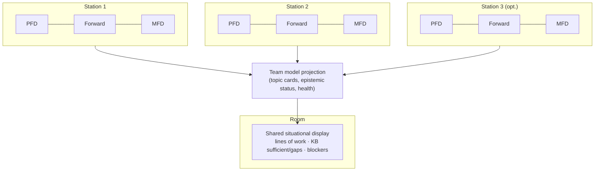

<!-- English translation of adr/0122-collaborative-iop-environment-and-shared-situational-display.md. Canonical Russian: ../../adr/0122-collaborative-iop-environment-and-shared-situational-display.md -->

# ADR 0122: Collaborative IOP Environment — Workstations and Shared Situational Display

**Status:** Proposed  
**Date:** 2026-05-17

## Related ADRs

| ADR | Role |
|-----|------|
| [0121](0121-intent-oriented-programming-paradigm.md) | IOP — discipline of communication; environment, not application only |
| [0100](0100-project-constitution.md) | Agent-first, cockpit, shared operational model |
| [0017](0017-multi-window-workspace-and-agent-surfaces.md) | Canonical layout: `(P)(F)(M)` on three monitors per workstation |
| [0021](0021-pfd-mfd-cockpit-attention-model.md) | PFD / Forward / MFD attention anchors; Endsley SA |
| [0080](0080-intercom-naming-and-multi-party-channel-model.md) | Intercom — multiple participants; external team contour |
| [0120](0120-primary-work-surface-intercom-or-editor.md) | Personal Forward: Intercom or editor |
| [0072](0072-chat-topic-cards-intent-melody-keyboard-contract.md) | Topic cards — lines of work |
| [0096](0096-intercom-topic-card-summary-and-product-spine.md) | Product spine on cards |
| [0045](0045-agent-chat-persistence-event-log-and-projections.md) | Event log → UI projections |
| [0095](0095-workspace-solution-ide-health-stratification.md) | Workspace/solution health stratification |
| [0061](0061-context-aware-adr-map-pfd-knowledge-indicator.md) | PFD as “which knowledge/constraints apply here” |
| [0014](0014-situational-checklists.md) | Situational checklists — “what next” scenarios |

### Outside ADR

| Document | Role |
|----------|------|
| [iop-manifest-v1.md](../iop-manifest-v1.md) | Public IOP wording |
| [ui-ux/cascade-ide-ui-layout-v1.md](../ui-ux/cascade-ide-ui-layout-v1.md) | PFD / Forward / MFD layout |

## Summary

- **Cascade / IOP** in perspective is not only an **app on one desk** but a **team work environment**: several workstations with the canonical cockpit layout **plus** (optionally) a **shared situational display** in the room’s common field of view.
- Each participant has their **own** `(P)(F)(M)` contour ([0017](0017-multi-window-workspace-and-agent-surfaces.md)); the team has a **shared projection** of the agreed picture: **what is in progress**, **where agents have sufficient context**, **where gaps need filling** (KB, playbooks, clarifications).
- The shared screen is **not** a chat mirror or endless feed; it is a **team situational display** (working names: **room board** / **team PFD**): an aggregate of lines of work, intent status, and epistemic summary.
- Sync technology (LAN, projection service, external Intercom contour [0080](0080-intercom-naming-and-multi-party-channel-model.md) §5) is a **later** step; this ADR fixes the **environment product model**.

---

## Context

IOP ([0121](0121-intent-oriented-programming-paradigm.md)) centers on a **shared information flow** among people, agents, and artifacts. On one workstation that is already expressed by the cockpit: PFD — short situation, Forward — forward work (code or Intercom), MFD — secondary contour ([0021](0021-pfd-mfd-cockpit-attention-model.md), [0120](0120-primary-work-surface-intercom-or-editor.md)).

The broader product vision: **2–3 people** at separate desks (each with **three monitors** — canonical `(P)(F)(M)`), plus a **large screen** in the room’s shared view. On it — not “Slack on the wall” but **what the team must see together without shouting over shoulders**:

- which **lines of work / goals** are active;
- whether **agents (and people) have enough** context (KB, playbooks, workspace scope);
- **where to supplement** knowledge, clarify intent, or unblock verification;
- when needed — **blockers**, phase (synthesis / clarification / verification), agreed **next steps** at team level.

Then IOP is no longer “IDE for one pilot” but an **environment** where communication and intent are **collectively observable**, without mixing in raw message firehose ([0121](0121-intent-oriented-programming-paradigm.md), [0120](0120-primary-work-surface-intercom-or-editor.md) §5.1).

---

## Problem

1. **Personal cockpit only** does not answer “what are *we* doing now” — everyone sees their own Forward; the shared picture lives in heads or a side messenger.
2. **Mirroring chat on the wall** amplifies noise ([0120](0120-primary-work-surface-intercom-or-editor.md)): teams already cannot digest message streams.
3. **Application vs environment:** without an explicit model, CIDE reads as “another window” instead of a **contour** connecting workstations and a shared display.
4. IOP’s **epistemic layer** (KB, agent-notes, context gaps) is mostly **personal** or agent-facing; pairs of developers + agents need a **room-suitable summary**.

---

## Decision (direction)

### 1. Two levels: workstation and room

| Level | Physics | IOP role |
|-------|---------|----------|
| **Workstation (station)** | 1 participant, typically **3 monitors**, `(P)(F)(M)` preset ([0017](0017-multi-window-workspace-and-agent-surfaces.md)) | Personal cycle: intent → synthesis → verification; Intercom/editor in Forward ([0120](0120-primary-work-surface-intercom-or-editor.md)) |
| **Room** | 2–N stations + **shared display** in common view | **Collective situational awareness**: agreed picture of work and knowledge **without** reading all private chats |

CIDE on a station remains **executor and verifier**; the shared screen is a **read-mostly projection** of the team model (with “raise to room board” for a chosen line — UX detail later).

### 2. Shared situational display (team situational display)

**Purpose:** team-level answers in **5–15 seconds of glance**, PFD-style ([0021](0021-pfd-mfd-cockpit-attention-model.md)), not feed reading.

**Typical content (intent canon, not final mockup):**

| Block | Meaning | Sources (conceptual) |
|-------|---------|----------------------|
| **Lines in progress** | Active topic cards / intents, phase, owner (human/agent) | [0072](0072-chat-topic-cards-intent-melody-keyboard-contract.md), [0096](0096-intercom-topic-card-summary-and-product-spine.md), [0045](0045-agent-chat-persistence-event-log-and-projections.md) projections |
| **Epistemic summary** | Per line or workspace: **sufficient** / **needs supplement** (playbook, KB, ADR terrain, agent-notes scope) | KB router, [0061](0061-context-aware-adr-map-pfd-knowledge-indicator.md), agent-notes |
| **Agreed gaps** | Explicit “clarify / add to KB / await verification” | Clarification batches [0031](0031-agent-chat-clarification-batches-and-threading.md), pre-flight / checklists [0014](0014-situational-checklists.md) |
| **Contour health** | Build, tests, critical IDE Health signals — **aggregate**, not full log | [0095](0095-workspace-solution-ide-health-stratification.md) |

**Invariants:**

- **Do not** duplicate full Intercom chat on the shared display.
- **Do not** mix “private agent dialogue” and “team picture” without explicit “publish to room board”.
- Updates are **projections and deltas**, IOP-style “arbiter of delta”, not token streams.

### 3. Relation to Intercom and multi-party

- **Intercom at the station** — where to **agree** on intent and run a line of work ([0080](0080-intercom-naming-and-multi-party-channel-model.md), [0120](0120-primary-work-surface-intercom-or-editor.md)).
- **Shared display** — **observable layer** of the same lines and epistemic status for people in the room; agents on stations keep the same MCP/repo contour.
- “Who is on the air” ([0080](0080-intercom-naming-and-multi-party-channel-model.md) §2) on the wall — **roles and lines**, not necessarily chat avatars.

### 4. Environment vs application (wording)

| | **Application (narrow)** | **Environment (IOP)** |
|---|--------------------------|------------------------|
| Unit | One `TopLevel`, one workspace | N **stations** + optional **room display** + shared repo/KB |
| Attention | Personal PFD/Forward/MFD | Personal cockpit **+** team PFD on the wall |
| Communication | Local Intercom | Agreed flow **visible** to the team on the aggregate |

Cascade IDE is the **working implementation** of IOP at the station; **room projection** extends the same paradigm, not a separate “wall chat”.

### 5. Environment-first and voice in the room (honest)

The **environment-first** model ([0121](0121-intent-oriented-programming-paradigm.md)) fits the room well: environment = stations + **shared picture**, not “another messenger”. But in one physical room people **usually do not chat in text** — they **talk**. Agents **cannot** reliably capture the whole spoken stream; if **everything** is recorded and transcribed, you spend a long time separating **decisions and agreements** from **noise** (half-phrases, tangents, changes of mind) — the same trap as an endless message feed, only in audio.

**IOP direction (not a v1 commit):**

| What | Meaning |
|------|---------|
| **Shared display** | Shows the **agreed model** (lines, KB gaps, phase) — what the team **already decided**, not a raw conversation log |
| **Voice in the room** | Stays **human bandwidth**; the system is not required to be “microphone on the whole room” |
| **Capture after talk** | Short **artifact of agreement**: topic card update / room pin / structured note (“intent minutes”), optionally a **voice packet** in a thread on explicit action ([0080](0080-intercom-naming-and-multi-party-channel-model.md) § async voice packets, not always-on) |
| **Agent work** | Grounded in **delta and artifacts** (git, MCP, card, ADR), not reconstructing every remark at the desk |

**Invariant:** environment-first does **not** mean “record and transcribe everything said at the whiteboard”. It means: **after** verbal agreement — **explicitly** enter what became team truth (intent, knowledge gap, next step) into the contour. Coffee-machine talk **need not** land in Intercom; the **outcome** does.

---

## Non-goals

- Full **real-time multiplayer** in one editor (shared cursors, CRDT) — out of scope for this ADR.
- Replacing a **corporate messenger** or building the full team contour inside CIDE ([0080](0080-intercom-naming-and-multi-party-channel-model.md) §5).
- Mandatory **fourth monitor** per person — the shared display is **for the room**, not personal.
- Choosing sync transport (WebSocket, Mattermost widget, local HTTP) — follow-up ADR/sketch.
- **Continuous transcription** of the whole room conversation as the sole source of truth for agents — against IOP (noise, privacy, long manual cleanup).

---

## Consequences

- UX/MCP roadmap may distinguish **`ide_get_ui_layout`** (station) from a future **`team_situational_snapshot`** / room consumer API.
- Topic cards and spine ([0096](0096-intercom-topic-card-summary-and-product-spine.md)) should allow **short room summaries**, not only station overview.
- IOP manifest and onboarding can describe the **team room** as a reference scenario, not solo developer only.
- External Intercom contour ([0080](0080-intercom-naming-and-multi-party-channel-model.md)) may feed the **same** room projection with explicit “two truths” policy if conversation lives outside.

---

## Diagram

---

## Open questions (before Accepted)

| # | Question | Direction |
|---|----------|-----------|
| 1 | UI name: **Room board**, **Team PFD**, … | Short; no confusion with personal PFD |
| 2 | Who **publishes** to the wall: all active cards auto vs explicit “pin for room” | v1 — explicit pin + auto aggregate “in progress” |
| 3 | One workspace per room vs several | One shared workspace/session id per room for v1 hypothesis |
| 4 | Projection transport | Local service / MCP relay / read-only web page on the big screen |
| 5 | Room voice vs intent capture | v1 — **manual/semi-automatic** artifact after talk; always-on room STT — not default |

---

## Change history

| Date | Change |
|------|--------|
| 2026-05-17 | Proposed: collaborative IOP environment, `(P)(F)(M)` stations, shared situational display. |
| 2026-05-17 | §5: environment-first; room voice — no full transcription default; agreement artifacts. |
