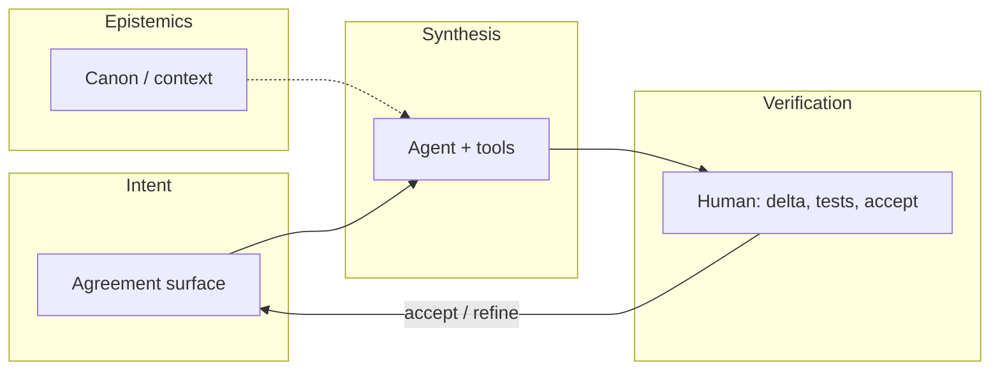

# IOP — Intent-Oriented Programming

**Intent-Oriented Programming (IOP)** is first of all a **discipline of communication** around development: not “slash commands reinvented,” but a way to agree on goals, processes, and changes so they stay **visible** to everyone in the contour (people, agent, artifacts).

**Communication is the whole key.** With communication come aligned intent, transparency, and meaningful code; without it — local order in files and global chaos, which agents made painfully visible. IT is about **information flow**; writing software is only part of that flow.

This text is an **IOP manifest**: why, what it is, what it is not, how to enter, pillars, session shape. An **ecosystem** (IDE, KB, concrete products) is an **application example**, not a synonym for the discipline — see [§ Example: Cascade ecosystem](#example-cascade-ecosystem).

**How to enter:** you do not have to read the whole manifest first — [§ Two entry thresholds](#two-entry-thresholds).

!!! info "Normative detail"
    Non-goals and ADR links — [ADR 0121](adr/0121-intent-oriented-programming-paradigm.md) (Accepted).  
    Russian: [манифест IOP (RU)](../iop-manifest-v1.md).

---

## Why IOP

IT is **information** technology: the work is a **coherent flow of meaning** — who talks to whom, about what, toward which goals, with which processes, and what observers can see. Without communication and transparency, shipping code is pointless: local order in files, global chaos in the team.

IOP centers **explicit intent** (goal, target state, agreed process) and an **observable execution delta**. Code in the repo stays the source of truth for the program; IOP is a **discipline of communication** in which code is the verifiable outcome of agreement, not a replacement for talking.

---

## What IOP is not

- **Not** “zoomers invented `/build`” — slashes, palette, hotkeys are **surfaces** for one meaning.
- **Not** a replacement for OOP/FP: classes and functions remain; what changes is how the team **agrees on work** before and after edits.
- **Not** documentation for a specific product or KB: the manifest does not replace a knowledge-base guide, router, or IDE onboarding.

---

## Two entry thresholds

From outside, IOP is often shown **already assembled** — as if philosophy and full infrastructure were required on day one. In practice many people started differently, and that remains normal.

| Path | What it is |
|------|------------|
| **Curiosity** | A folder, one honest dialogue with the agent, one hypothesis — without a ready-made “system around it” |
| **Integrated** | An existing contour: product, canon, familiar surfaces — convenient for those already inside |

Both converge on one discipline: **explicit intent**, **observable delta**, human and agent in one flow of meaning (artifacts, not side chat). The difference is **what you show first**, not “real” vs “lite” IOP.

**A note on history (one reference, not a rule for everyone).** It began with conversation — “how do you even think?” — before canon or markers existed. The contour was not handed down: it was **built together** — human and agent, questions, disagreement, clarification. Then a shared file the agent could append between sessions. Later, separately, came the knowledge base, IDE, channels such as Intercom — a **consequence** of practice, not an entry ticket. The human stays captain; without the agent in the same loop, much of what we now call IOP would not have been shaped in time.

Showing skeptics only the summit paints a false picture. Narrating the start as if everything already existed does too.

---

## Three pillars of IOP

### 1. Flow of meaning and explicit intent

At the center is an **aligned information flow** (people, agent, artifacts, status). An **intent** is not a button — it is a **named agreement** on a goal or target state in that flow. One meaning can appear in chat, commands, ADRs — without scattered “worlds.”

### 2. Two-loop verification

| Loop | Who | What |
|------|-----|------|
| **Synthesis** | Agent + tools | Edits, build, refactors, automation |
| **Verification** | Human | Diff, tests, diagnostics, deliberate acceptance |

Infrastructure keeps intent inside project “physics”; the human is captain at verification.

### 3. Epistemic layer

Beyond code and types — **canon and context routing** so intent is not held only in memory and the last chat message. How canon is structured in a given environment is **implementation** (use case), not the manifest.

---

## Agent before implementation

In IOP the agent helps **before** commit and heavy automation: walk corners, push back, narrow scope — without waiting on a colleague. That does not replace human review or auto-write ADRs: the operator stays captain.

---

## Honestly about human message volume

IOP does **not** promise “we will handle any inbound stream” — **people do not handle that either** when everything lands in one endless feed. The bet is to **structure** communication, not amplify noise:

- **lines of work** instead of one chaotic chat;
- **clarification batches** and threads, not every message = an immediate autonomous sprint;
- **one meaning** across surfaces — less “wrote in chat / did in palette / agent missed it”;
- **verification** — the human arbitrates **delta**, not every token.

If communication is not structured, neither agents nor IDEs will save the day. IOP is about structuring it **first**.

---

## Session shape

---

## Example: Cascade ecosystem

A **use case**, not the definition of IOP. [Cascade IDE](https://github.com/AI-Guiders/cascade-ide) is an open **working implementation** of the discipline for .NET: agent-first IDE, in-proc MCP, KB canon ([kb-public](https://github.com/AI-Guiders/kb-public), agent-notes). Other stacks (Cursor + MCP, your own product) can carry the same pillars differently.

### How the pillars map to the stack

| IOP pillar | In the Cascade ecosystem |
|------------|--------------------------|
| Flow and intent | Intercom, topic cards, ADR/KB, `command_id`, Intent Melody (`c:`), slashes ([0119](adr/0119-chat-slash-commands-intercom-surface.md)), palette, same commands via MCP |
| Verification | Diff in Forward, Roslyn diagnostics, tests, deliberate merge |
| Epistemics | `knowledge/`, router, [SHOWCASE](https://github.com/AI-Guiders/kb-public) — **KB guide**, not this manifest |

### Intercom

**Intercom** ([ADR 0080](adr/0080-intercom-naming-and-multi-party-channel-model.md)) — not a “chat widget” but the **communication hub around a goal** in this use case. [0120](adr/0120-primary-work-surface-intercom-or-editor.md): `primary_work_surface = intercom` when connection is the forward anchor. Design — [intercom-design-hub](../design/intercom-design-hub-v1.md); agent as sparring — [philosophy §8](../design/cascadeide-philosophy-v1.md#8-агент-как-партнёр-для-проектирования-до-кода).

### Team environment (perspective)

Not only an IDE window: PFD / Forward / MFD ([0017](adr/0017-multi-window-workspace-and-agent-surfaces.md)), shared room display ([0122](adr/0122-collaborative-iop-environment-and-shared-situational-display.md) Proposed). The screen gets **what you already agreed on** — not a transcript of everything said aloud.

Product onboarding (not IOP): [handbook §1.1](../design/cide-design-handbook-v1.md#11-two-entry-thresholds-cide).

---

## Read next

| If you want… | Document |
|--------------|----------|
| **IOP (manifest)** | this file · [ADR 0121](adr/0121-intent-oriented-programming-paradigm.md) |
| **Cascade ecosystem (use case)** | [§ above](#example-cascade-ecosystem) · [handbook](../design/cide-design-handbook-v1.md) · [ADR navigator](site/adr-nav/index.md) |
| **KB (separate from IOP)** | [kb-public / SHOWCASE](https://github.com/AI-Guiders/kb-public) |
| UI layout, Melody, agent-first policy | [UI layout](ui-ux/cascade-ide-ui-layout-v1.md) · [intent-melody](../intent-melody-language-v1.md) · [architecture-policy](architecture-policy.md) |

---

*Cascade IDE — MIT · [GitHub](https://github.com/AI-Guiders/cascade-ide) · [AI-Guiders](https://ai-guiders.github.io/)*
