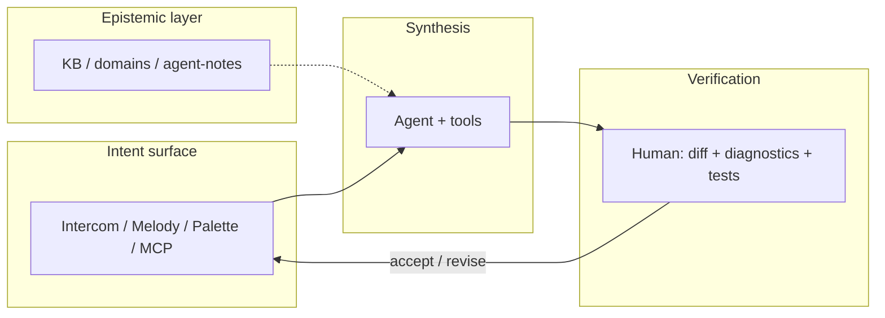

# IOP — Intent-Oriented Programming

**Intent-Oriented Programming** shifts focus from hand-written syntax to **intent** and **target state**. **Cascade IDE** is an open *reference implementation* of this model for **.NET** and **agent-first** workflows.

!!! info "Normative detail"
    Non-goals and ADR links — [ADR 0121](adr/0121-intent-oriented-programming-paradigm.md) (Proposed).  
    Russian: [манифест IOP (RU)](../iop-manifest-v1.md).

---

## Why IOP

Human brains are strong **meaning generators** and weak **syntax compilers** for hundred-thousand-line monoliths. IOP puts you back in the **architect / strategist** seat: state an intent → observe synthesis → **verify the delta** in the editor. C# and the repo remain the source of truth; IOP is an **orchestration layer**, not a replacement for code.

---

## Three pillars in Cascade IDE

### 1. Intent instead of syntax

The atom is an **intent**: `command_id`, Intent Melody (`c:`), **Intercom** slash commands ([ADR 0119](adr/0119-chat-slash-commands-intercom-surface.md)), palette, and the **same commands via MCP**. One meaning — many surfaces; no ad-hoc parsers that bypass the intent layer.

### 2. Two-loop verification

| Loop | Who | What |
|------|-----|------|
| **Synthesis** | Agent + MCP | Edits, build, refactors, git |
| **Verification** | You | Diff in Forward, Roslyn diagnostics, tests, deliberate merge |

Infrastructure (HCI, Roslyn MCP, build/test, git) keeps intents inside project “physics”.

### 3. Epistemic context

Beyond types-in-code alone: **knowledge domains** — [kb-public](https://github.com/AI-Guiders/kb-public), agent-notes, `knowledge/domains/`. The agent routes context through team **light ontology**; the KB is a higher-order rulebook.

---

## Session shape

---

## Read next

| If you want… | Document |
|--------------|----------|
| Cockpit PFD / Forward / MFD | [UI layout](ui-ux/cascade-ide-ui-layout-v1.md) |
| Intercom and slashes | [ADR 0119](adr/0119-chat-slash-commands-intercom-surface.md) |
| Intent Melody | [intent-melody-language-v1.md](../intent-melody-language-v1.md), [ADR 0109](adr/0109-declarative-parametric-melody-catalog-toml-and-code-binders.md) |
| All decisions | [ADR navigator](site/adr-nav/index.md) |
| Agent-first policy | [architecture-policy.md](architecture-policy.md) |

---

*Cascade IDE — MIT · [GitHub](https://github.com/AI-Guiders/cascade-ide) · [AI-Guiders](https://ai-guiders.github.io/)*
