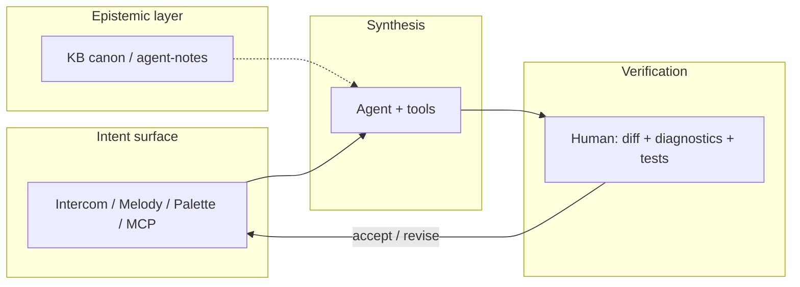

# IOP — Intent-Oriented Programming

**Intent-Oriented Programming (IOP)** is first of all a **discipline of communication** around development: not “slash commands reinvented,” but a way to agree on goals, processes, and changes so they stay **visible** to everyone in the contour (people, agent, artifacts).

**Communication is the whole key.** With communication come aligned intent, transparency, and meaningful code; without it — local order in files and global chaos, which agents made painfully visible. IT is about **information flow**; writing software is only part of that flow.

**Cascade IDE** is an open **working implementation** of IOP (one example stack, not the only carrier): a **.NET** **agent-first** IDE where the flow is explicit.

**How to enter:** you do not have to start with this whole manifest — see [§ Two entry thresholds](#two-entry-thresholds-project-aware) (folder + dialogue vs an already integrated contour). This is **project-aware** IOP/KB practice, not a single-product feature.

!!! info "Normative detail"
    Non-goals and ADR links — [ADR 0121](adr/0121-intent-oriented-programming-paradigm.md) (Accepted).  
    Russian: [манифест IOP (RU)](../iop-manifest-v1.md).

---

## Why IOP

IT is **information** technology: the work is a **coherent flow of meaning** — who talks to whom, about what, toward which goals, with which processes, and what observers can see. Without communication and transparency, shipping code is pointless: local order in files, global chaos in the team.

IOP in the IDE centers **explicit intent** (goal, target state, agreed process) and an **observable execution delta**. C# and the repo stay the source of truth for program text; IOP is a **discipline of communication** in which code is the verifiable outcome of agreement, not a replacement for talking.

---

## What IOP is not

- **Not** “zoomers invented `/build`” — slashes, palette, and Melody are **surfaces** for one meaning.
- **Not** a replacement for OOP/FP: classes and functions remain; what changes is how the team **agrees on work** before and after edits.

---

## Two entry thresholds (project-aware)

A mature IOP/KB contour **from outside** often looks like: philosophy first, shed “instrumental thinking” (“just give me a button”), then you may work. That describes the **summit**, not the only legitimate start. Many began differently — and that remains the **canonical** entry.

| Path | Where you start | What accumulates | Typical carrier |
|------|-----------------|------------------|-----------------|
| **Curiosity** | A **folder** workspace (project-aware root), one dialogue with the agent: *“how do you even think?”*, one hypothesis, one `project-id` when clear | Practice → questions → playbook/ADR in canon → MCP and product **as pain appears**, not “learn everything first” | Any environment with repo + agent; `[PRIMARY:…]`, `[SCOPE:…]` when needed (KB `playbook-multi-project-context-v1`) |
| **Integrated** | Ready-made contour: router, hot-context, product cockpit, ADRs, three command surfaces | Faster for people **already inside**; risky as the **only** demo to skeptics | [SHOWCASE](https://github.com/AI-Guiders/kb-public) → KB index; in CIDE — [handbook](../design/cide-design-handbook-v1.md), Intercom, ADRs |

Both paths **converge** on one discipline: explicit intent, observable delta, agent and human in the **same** information flow (artifacts, not “chat on the side”). The difference is **presentation order**, not “lite IOP vs real IOP”.

**Project-aware:** “folder” is a concrete `workspace_path` and, when needed, **primary** / **scope** in the thread so the agent does not mix repositories or load all of canon. IOP does not require learning the full MCP map first — it requires **not confusing** products when there are several.

**Onboarding mistakes:**

| Mistake | Why it hurts |
|---------|----------------|
| Show only the integrated path (“read the manifest/handbook or you won’t get it”) | Blocks people who could enter via curiosity |
| Promise the curiosity path needs no discipline | The contour degrades into “chat with buttons” without intent and verification |
| Tie IOP to one IDE brand | IOP is about meaning flow; CIDE, Cursor+MCP, other stacks are **examples** |

**Agent before heavy implementation:** in both paths the agent helps **before** commit — discuss, push back, narrow scope (see [§ Intercom](#intercom--communication-hub-around-a-goal-perspective)). That does not replace human review: the operator stays captain.

**Example implementation (Cascade IDE):** after dialogue — ADR/playbook in `docs/`, fast code in the same contour (Intercom, in-proc MCP, editor); product design onboarding — [handbook §1.1](../design/cide-design-handbook-v1.md#11-two-entry-thresholds-cide).

---

## Three pillars in Cascade IDE

### 1. Information flow and explicit intent

At the center is a **aligned information flow** (people, agent, artifacts, status). An **intent** is not a button — it is a **named agreement** on a goal or target state in that flow. In CIDE it is carried by Intercom, topic cards, ADR/KB, `command_id`, Intent Melody (`c:`), slashes ([ADR 0119](adr/0119-chat-slash-commands-intercom-surface.md)), palette, and the **same commands via MCP** — one meaning, many channels, no scattered parsers.

### 2. Two-loop verification

| Loop | Who | What |
|------|-----|------|
| **Synthesis** | Agent + MCP | Edits, build, refactors, git |
| **Verification** | You | Diff in Forward, Roslyn diagnostics, tests, deliberate merge |

Infrastructure (HCI, Roslyn MCP, build/test, git) keeps intents inside project “physics”.

### 3. Epistemic context

Beyond relying on C# types alone — **knowledge canon and context routing**: [kb-public](https://github.com/AI-Guiders/kb-public), agent-notes, the `knowledge/` tree (folders such as `domains/agent-operations/` are **paths in the KB repo**, not a product/DDD/KE “domain”). The agent attaches playbooks via router / team **light ontology**; the KB is a higher-order normative layer.

---

## Intercom — communication hub around a goal (perspective)

**Intercom** ([ADR 0080](adr/0080-intercom-naming-and-multi-party-channel-model.md)) in the IOP perspective is not a “chat widget” but the **hub of communication around a goal**: people and agents **agree**, **surface intent**, clarify context, and **drive implementation** in the same contour (editor, MCP, verification). Topic cards, spine, slashes ([0119](adr/0119-chat-slash-commands-intercom-surface.md)) are **lines of work**, not a feed for its own sake.

Cockpit placement — [ADR 0120](adr/0120-primary-work-surface-intercom-or-editor.md) (Accepted · Implemented): **`primary_work_surface = intercom`** when the forward anchor is connection and intent, not code alone.

### Agent as sparring partner before implementation

In an agent-first contour the agent helps **before** commit and PR: **cheaply** walk corners — **discuss, push back, narrow scope** — without waiting on a colleague. General rule — [§ Two entry thresholds](#two-entry-thresholds-project-aware); in CIDE — [philosophy §8](../design/cascadeide-philosophy-v1.md#8-агент-как-партнёр-для-проектирования-до-кода).

---

## Honestly about human message volume

IOP does **not** promise “we will handle any inbound stream” — **people do not handle that either** when everything lands in one endless feed. The product bet is to **structure** communication, not amplify noise:

- **lines of work** (topic cards, overview/detail) instead of one chaotic chat;
- **clarification batches** and threads ([0031](adr/0031-agent-chat-clarification-batches-and-threading.md)), not every message = an immediate autonomous sprint;
- **intent-first** and MCP parity — less “wrote in chat / did in palette / agent missed it”;
- **verification** — the human is not required to digest everything; they arbitrate **delta**, not every token.

If communication is not structured, neither agents nor the IDE will save the day. IOP is about structuring it **first**.

---

## Environment, not application only (perspective)

IOP and Cascade in perspective are a **team work environment**, not only an IDE window on one desk.

**Picture:** 2–3 people at separate workstations — each with the **canonical** three-monitor PFD / Forward / MFD layout ([ADR 0017](adr/0017-multi-window-workspace-and-agent-surfaces.md)); in the room’s shared field of view — a **large screen** with the **team situation**, not a chat mirror:

- what is **in progress** (lines / topic cards);
- where **context is sufficient** for agents and people (KB, playbooks, scope);
- where knowledge or intent **needs supplement**;
- when needed — blockers and phase (synthesis / clarification / verification).

The personal cockpit stays for **your** cycle; the shared display is the **team PFD for the room** (read-mostly projection of the agreed model). Details — [ADR 0122](adr/0122-collaborative-iop-environment-and-shared-situational-display.md) (Proposed).

**Voice in the room.** When the team sits together, people usually **talk** rather than type in chat — and an agent cannot honestly promise it “heard the whole conversation”.

IOP does **not** assume you **record and transcribe every spoken remark** and then mine decisions from the transcript: too much noise (half-phrases, jokes, changes of mind) and too few clear outcomes — the same trap as an endless message feed.

The shared display and Intercom get **what you already agreed on**: a topic card, a room-board pin, a short structured note — **not** a verbatim log of everything said aloud.

---

## Session shape

---

## Read next

| If you want… | Document |
|--------------|----------|
| **Two entry thresholds (IOP/KB, project-aware)** | [§ above](#two-entry-thresholds-project-aware) · KB: `playbook-multi-project-context-v1`, `SHOWCASE.md` |
| Cockpit PFD / Forward / MFD | [UI layout](ui-ux/cascade-ide-ui-layout-v1.md) |
| Intercom and slashes | [ADR 0119](adr/0119-chat-slash-commands-intercom-surface.md) |
| Team environment and shared display | [ADR 0122](adr/0122-collaborative-iop-environment-and-shared-situational-display.md) |
| Intent Melody | [intent-melody-language-v1.md](../intent-melody-language-v1.md), [ADR 0109](adr/0109-declarative-parametric-melody-catalog-toml-and-code-binders.md) |
| All decisions | [ADR navigator](site/adr-nav/index.md) |
| Agent-first policy | [architecture-policy.md](architecture-policy.md) |

---

*Cascade IDE — MIT · [GitHub](https://github.com/AI-Guiders/cascade-ide) · [AI-Guiders](https://ai-guiders.github.io/)*
