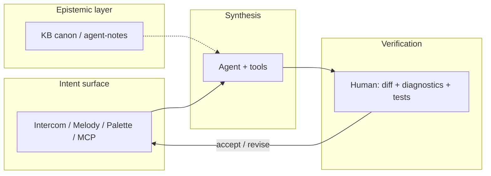

# IOP — Intent-Oriented Programming

**Интенционально-ориентированное программирование (IOP)** — прежде всего **дисциплина коммуникации** вокруг разработки: не «изобретённые заново слэш-команды», а способ договариваться о целях, процессах и изменениях так, чтобы это было **видно** всем участникам контура (люди, агент, артефакты).

**В коммуникации весь ключ.** Будет коммуникация — будут согласованные намерения, прозрачность и осмысленный код; не будет — локальный порядок в файлах и глобальный хаос, что агенты обнажили с новой силой. ИТ в глобальном смысле про **информационный поток**; ПО и его написание — лишь часть этого потока.

**Cascade IDE** — открытая **рабочая реализация** IOP (пример стека, не единственный носитель): agent-first IDE для .NET, где поток сделан явным.

**Как войти:** не обязательно с этого манифеста целиком — см. [§ Два порога входа](#два-порога-входа-project-aware) (папка + разговор vs уже собранный контур). Это **project-aware** правило IOP и KB, не фича одного продукта.

!!! info "Нормативная привязка"
    Детали, non-goals и связи с ADR — [ADR 0121](adr/0121-intent-oriented-programming-paradigm.md) (Accepted).  
    English: [IOP manifest (EN)](en/iop-manifest-v1.md).

---

## Зачем IOP

ИТ называются **информационными**, потому что предмет работы — не синтаксис, а **согласованный поток смысла**: кто с кем и о чём говорит, какие цели и процессы, что считается сделанным, что видно наблюдателю. Если коммуникации нет и ничего не прозрачно — разрабатывать ПО бессмысленно: будет локальный порядок в файлах и глобальный хаос в команде.

IOP в IDE ставит в центр **явное намерение** (цель, целевое состояние, договорённый процесс) и **наблюдаемую дельту** исполнения. C# и репозиторий остаются источником правды для текста программы; IOP — не «вместо кода», а **дисциплина коммуникации**, в которой код — проверяемый результат договорённости.

---

## Что IOP не есть

- **Не** «зумеры придумали `/build`» — слэш, палитра и Melody — только **поверхности** одного смысла.
- **Не** замена ООП/ФП: классы и функции остаются; меняется то, *как команда договаривается* о работе до и после правок.

---

## Два порога входа (project-aware)

Зрелый контур IOP/KB **снаружи** часто выглядит так: сначала философия, отказ от «инструментального мышления» («дай кнопку»), потом можно работать. Это описывает **вершину**, а не единственный законный старт. Исторически многие начинали иначе — и это остаётся **каноническим** входом.

| Путь | С чего начинают | Что накапливается | Типичный носитель |
|------|-----------------|-------------------|-------------------|
| **Любопытство** | **Папка** и один честный разговор с агентом: *«как ты вообще думаешь?»*, одна гипотеза — **без** готовой KB, без `[PRIMARY]` / `[SCOPE]`, без «сначала выучи манифест» | Практика → общий **файл**, куда агент может писать (тулы) → позже playbook/ADR, KB, маркеры, MCP и продукт **по мере боли** | Любая среда: репо + агент + возможность зафиксировать договорённость в артефакте |
| **Интегрированный** | Уже собранный контур: router, hot-context, product cockpit, ADR, три входа команд, project-aware маркеры | Быстрее для тех, кто **внутри**; опасен как **единственная** демонстрация скептику | [SHOWCASE](https://github.com/AI-Guiders/kb-public) → индекс KB; в CIDE — [handbook](design/cide-design-handbook-v1.md), Intercom, ADR |

Оба пути **сходятся** в одну дисциплину: явное намерение, наблюдаемая дельта, агент и человек в **одном** информационном потоке (артефакты, не «чат сбоку»). Разница — **порядок подачи**, не «упрощённая IOP vs настоящая».

**Как это росло на практике (не ретроактивно):** сначала был **диалог и любопытство** — не «я вам дала контур», а **совместный труд**: человек и агент вместе выясняли, что нужно. Потом — **один файлик**, в который агент мог писать с инструментами (память между сессиями). Потом — канон KB, `[PRIMARY]` / `[SCOPE]`, router, IDE, Intercom. **Project-aware** — слой **зрелости**, а не условие первого дня; не описывать старт так, будто маркеры и база уже были.

**Совместное создание:** оператор — капитан (вкус, приёмка, scope), но контур **не спускается сверху** «готовым подарком агентам». Его **собирают в диалоге** — вопросы, споры, черновики в файле, потом нормализация в playbook. IOP честен, когда признаёт: без агента в этом цикле многие артефакты просто не появились бы вовремя.

**Project-aware (когда уже несколько репо):** конкретный `workspace_path`, при необходимости **primary** / **scope** в треде — чтобы не смешивать продукты и не тащить весь канон (см. KB `playbook-multi-project-context-v1`). IOP не требует сначала выучить карту MCP.

**Ошибки онбординга:**

| Ошибка | Почему больно |
|--------|----------------|
| Показывать только интегрированный путь («прочитай манифест/handbook, иначе не поймёшь») | Отсекает тех, кто мог бы зайти с любопытства |
| Обещать, что путь любопытства обойдётся без дисциплины | Контур деградирует в «чат с кнопками» без намерения и верификации |
| Привязывать IOP к одному бренду IDE | IOP — про поток смысла; CIDE, Cursor+MCP, другой стек — **примеры** |
| Рассказывать старт «как будто KB и PRIMARY уже были» или «человек дал агентам контур» | Искажает историю; отталкивает и скептиков, и тех, кто мог бы войти с диалога |

**Агент до «тяжёлой» реализации:** в обоих путях агент полезен **до** коммита — обсудить, оспорить, сузить scope (см. [§ Intercom](#intercom--центр-коммуникации-вокруг-цели-перспектива)). Это не отменяет ревью людей: оператор остаётся капитаном.

**Пример реализации (Cascade IDE):** после диалога — ADR/playbook в `docs/`, быстрый код в том же контуре (Intercom, in-proc MCP, редактор); дизайн-онбординг продукта — [handbook §1.1](design/cide-design-handbook-v1.md#11-два-порога-входа-cide).

---

## Три столпа в Cascade IDE

### 1. Информационный поток и явное намерение

В центре — **согласованный информационный поток** (люди, агент, артефакты, статусы). **Интент** — не кнопка, а **именованная договорённость** о цели или целевом состоянии в этом потоке. В CIDE её несут Intercom, topic cards, ADR/KB, `command_id`, Intent Melody (`c:`), слэши ([ADR 0119](adr/0119-chat-slash-commands-intercom-surface.md)), палитра и **те же команды в MCP** — один смысл, несколько каналов, без разрозненных парсеров.

### 2. Двухконтурная верификация

| Контур | Кто | Что |
|--------|-----|-----|
| **Синтез** | Агент + MCP | Правки, сборка, рефакторинги, git |
| **Верификация** | Ты | Diff в Forward, Roslyn-диагностики, тесты, осознанный merge |

Инфраструктура (HCI, Roslyn MCP, build/test, git) не даёт интенту нарушить «физику» проекта.

### 3. Эпистемический контекст

Вместо опоры только на типы в C# — **канон и маршрутизация контекста**: [kb-public](https://github.com/AI-Guiders/kb-public), agent-notes, дерево `knowledge/` (подпапки вроде `domains/agent-operations/` — **путь в репозитории KB**, не «домен» в смысле DDD, KE или таксономии приборов). Агент подбирает playbook'и через router / **light-онтологию** команды; KB — нормативный слой правил высшего порядка.

---

## Intercom — центр коммуникации вокруг цели (перспектива)

**Intercom** ([ADR 0080](adr/0080-intercom-naming-and-multi-party-channel-model.md)) в перспективе IOP — не «виджет чата», а **центр коммуникации вокруг цели**: здесь люди и агенты **договариваются**, **выявляют намерения**, уточняют контекст и по итогу **ведут реализацию** в том же контуре (редактор, MCP, верификация). Topic cards, spine, слэши ([0119](adr/0119-chat-slash-commands-intercom-surface.md)) — не лента ради ленты, а **линии работы** с явной целью.

Положение в кокпите — [ADR 0120](adr/0120-primary-work-surface-intercom-or-editor.md) (Accepted · Implemented): опция **`primary_work_surface = intercom`**, когда лобовой якорь — связь и намерение, а не только текст кода.

### Агент как собеседник до реализации

В agent-first контуре агент полезен **до** коммита и PR: **долго и дёшево** проговорить углы — **обсудить, оспорить, сузить scope** — без ожидания коллеги и без типичного социального трения. Общее правило — [§ Два порога входа](#два-порога-входа-project-aware); в CIDE — [philosophy §8](design/cascadeide-philosophy-v1.md#8-агент-как-партнёр-для-проектирования-до-кода).

---

## Честно о потоке от людей

IOP **не обещает**, что «вывезем любой входящий поток» — его **не вывозят и сами люди**, если всё свалить в одну бесконечную ленту. Ставка продукта — **структурировать** коммуникацию, а не умножать шум:

- **линии работы** (topic cards, overview/detail) вместо одного хаотичного чата;
- **батчи уточнений** и треды ([0031](adr/0031-agent-chat-clarification-batches-and-threading.md)), а не каждое сообщение = немедленный автономный рывок;
- **intent-first** и паритет MCP — меньше дублирования «написал в чат / сделал в палитре / забыл в агенте»;
- **верификация** — человек не обязан «переваривать» всё подряд; он арбитр **дельты**, а не диспетчер каждого токена.

Если коммуникация не выстроена — не спасёт ни агент, ни IDE. IOP как раз про то, чтобы **сначала** выстроить её.

---

## Среда, не только приложение (перспектива)

IOP и Cascade в перспективе — **среда командной работы**, а не только окно IDE на одном столе.

**Картина:** 2–3 человека за отдельными рабочими местами — у каждого **каноническая раскладка** «три монитора» PFD / Forward / MFD ([ADR 0017](adr/0017-multi-window-workspace-and-agent-surfaces.md)); в общем поле зрения комнаты — **большой экран** с **командной ситуацией**, а не зеркалом чата:

- что **в работе** (линии / topic cards);
- где агентам и людям **достаточно** контекста (KB, playbook, scope);
- где **нужно дополнить** знания или уточнить намерение;
- при необходимости — блокеры и фаза (синтез / уточнение / верификация).

Личный кокпит остаётся для **своего** цикла; общий дисплей — **коллективный PFD комнаты** (read-mostly проекция согласованной модели). Подробнее — [ADR 0122](adr/0122-collaborative-iop-environment-and-shared-situational-display.md) (Proposed).

**Голос в комнате.** Рядом за столами люди обычно **говорят**, а не переписываются в чат — и агент не может честно обещать, что «услышал весь разговор».

IOP **не** предполагает записывать и расшифровывать **каждую** устную реплику, чтобы потом выуживать из стенограммы решения: там слишком много шума (полфразы, шутки, передумывания) и мало явных итогов — как с бесконечной лентой сообщений.

На общий экран и в Intercom попадает **то, о чём вы уже договорились**: карточка темы, pin на room board, короткая структурированная заметка — **не** протокол всего, что было сказано вслух.

---

## Как это выглядит в сессии

---

## Что читать дальше

| Если нужно… | Документ |
|-------------|----------|
| **Два порога входа (IOP/KB, project-aware)** | [§ выше](#два-порога-входа-project-aware) · KB: `playbook-multi-project-context-v1`, `SHOWCASE.md` |
| Кокпит PFD / Forward / MFD | [Раскладка UI](ui-ux/cascade-ide-ui-layout-v1.md) |
| Intercom и слэши | [ADR 0119](adr/0119-chat-slash-commands-intercom-surface.md) |
| Командная среда и общий экран | [ADR 0122](adr/0122-collaborative-iop-environment-and-shared-situational-display.md) |
| Intent Melody | [intent-melody-language-v1.md](intent-melody-language-v1.md), [ADR 0109](adr/0109-declarative-parametric-melody-catalog-toml-and-code-binders.md) |
| Все решения | [Навигатор ADR](site/adr-nav/index.md) |
| Agent-first политика | [architecture-policy.md](architecture-policy.md) |

---

*Cascade IDE — MIT · [GitHub](https://github.com/AI-Guiders/cascade-ide) · организация [AI-Guiders](https://ai-guiders.github.io/)*
