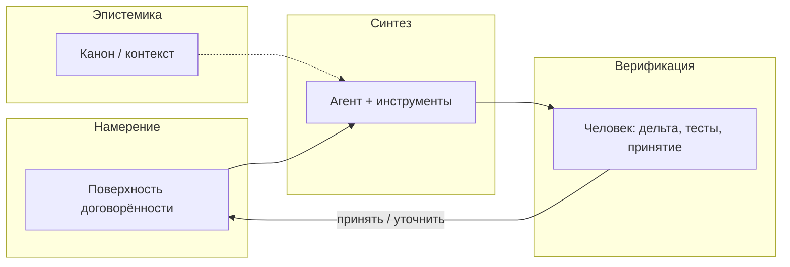

# IOP — Intent-Oriented Programming

**Интенционально-ориентированное программирование (IOP)** — прежде всего **дисциплина коммуникации** вокруг разработки: не «изобретённые заново слэш-команды», а способ договариваться о целях, процессах и изменениях так, чтобы это было **видно** всем участникам контура (люди, агент, артефакты).

**В коммуникации весь ключ.** Будет коммуникация — будут согласованные намерения, прозрачность и осмысленный код; не будет — локальный порядок в файлах и глобальный хаос, что агенты обнажили с новой силой. ИТ в глобальном смысле про **информационный поток**; ПО и его написание — лишь часть этого потока.

Этот текст — **манифест IOP**: зачем, что это, чего не является, как входить, опоры, форма работы. **Экосистема** (IDE, KB, конкретные продукты) — **пример применения**, не синоним дисциплины — см. [§ Пример: экосистема Cascade](#пример-экосистема-cascade).

**Как войти:** не обязательно с манифеста целиком — [§ Два порога входа](#два-порога-входа).

!!! info "Нормативная привязка"
    Детали, non-goals и связи с ADR — [ADR 0121](adr/0121-intent-oriented-programming-paradigm.md) (Accepted).  
    English: [IOP manifest (EN)](en/iop-manifest-v1.md).

---

## Зачем IOP

ИТ называются **информационными**, потому что предмет работы — не синтаксис, а **согласованный поток смысла**: кто с кем и о чём говорит, какие цели и процессы, что считается сделанным, что видно наблюдателю. Если коммуникации нет и ничего не прозрачно — разрабатывать ПО бессмысленно: будет локальный порядок в файлах и глобальный хаос в команде.

IOP ставит в центр **явное намерение** (цель, целевое состояние, договорённый процесс) и **наблюдаемую дельту** исполнения. Код в репозитории остаётся источником правды для программы; IOP — не «вместо кода», а **дисциплина коммуникации**, в которой код — проверяемый результат договорённости.

---

## Что IOP не есть

- **Не** «зумеры придумали `/build`» — слэш, палитра, горячие клавиши — только **поверхности** одного смысла.
- **Не** замена ООП/ФП: классы и функции остаются; меняется то, *как команда договаривается* о работе до и после правок.
- **Не** документация на конкретный продукт или KB: манифест не подменяет гайд по базе знаний, router или онбординг в IDE.

---

## Два порога входа

Снаружи IOP часто показывают **уже собранным** — как будто с первого дня нужны и философия, и вся инфраструктура. На деле у многих был другой старт, и он по-прежнему нормален.

| Путь | О чём речь |
|------|------------|
| **Любопытство** | Папка, один честный разговор с агентом, одна гипотеза — без готовой «системы вокруг» |
| **Интегрированный** | Уже сложившийся контур: продукт, канон, привычные поверхности — удобно тем, кто внутри |

Оба сходятся в одной дисциплине: **явное намерение**, **наблюдаемая дельта**, человек и агент в одном потоке смысла (артефакты, не болталка сбоку). Разница — в том, **что показывают первым**, а не в «настоящей» и «упрощённой» версии IOP.

**Заметка об истории (один референс, не норма для всех).** Сначала был разговор — «как ты вообще думаешь?» — без канона и без маркеров: их просто ещё не существовало. Контур не спускали сверху: его **складывали вместе** — человек и агент, вопросы, разногласия, уточнения. Потом появился общий файл, куда агент мог дописывать между сессиями. Позже отдельно выросли база знаний, IDE, каналы вроде Intercom — как **следствие** практики, не как входной билет. Капитан остаётся у человека; без агента в том же цикле многие вещи, которые мы теперь называем IOP, просто не успели бы оформиться.

Показывать скептику только «вершину» — значит рисовать ложную картину. Рассказывать старт так, будто всё уже было — тоже.

---

## Три опоры IOP

### 1. Поток смысла и явное намерение

В центре — **согласованный информационный поток** (люди, агент, артефакты, статусы). **Интент** — не кнопка, а **именованная договорённость** о цели или целевом состоянии в этом потоке. Один смысл может проявляться в чате, в командах, в ADR — без разрозненных «миров».

### 2. Двухконтурная верификация

| Контур | Кто | Что |
|--------|-----|-----|
| **Синтез** | Агент + инструменты | Правки, сборка, рефакторинги, автоматизация |
| **Верификация** | Человек | Diff, тесты, диагностики, осознанное принятие |

Инфраструктура не даёт намерению нарушить «физику» проекта; капитан на этапе верификации — человек.

### 3. Эпистемический слой

Помимо кода и типов — **канон и маршрутизация контекста**, чтобы намерение не держалось только в голове и в последнем сообщении чата. Как устроен канон в конкретной среде — вопрос **реализации** (use case), не манифеста.

---

## Агент до реализации

Агент в IOP полезен **до** коммита и тяжёлой автоматизации: проговорить углы, оспорить, сузить scope — без ожидания коллеги и без типичного социального трения. Это не отменяет ревью людей и не делает ADR «автоматическими»: оператор остаётся капитаном.

---

## Честно о потоке от людей

IOP **не обещает**, что «вывезем любой входящий поток» — его **не вывозят и сами люди**, если всё свалить в одну бесконечную ленту. Ставка — **структурировать** коммуникацию, а не умножать шум:

- **линии работы** вместо одного хаотичного чата;
- **батчи уточнений** и треды, а не каждое сообщение = немедленный автономный рывок;
- **один смысл** на разных поверхностях — меньше «написал в чат / сделал в палитре / забыл в агенте»;
- **верификация** — человек арбитр **дельты**, а не диспетчер каждого токена.

Если коммуникация не выстроена — не спасёт ни агент, ни IDE. IOP как раз про то, чтобы **сначала** выстроить её.

---

## Как это выглядит в сессии

---

## Пример: экосистема Cascade

**Use case**, не определение IOP. [Cascade IDE](https://github.com/AI-Guiders/cascade-ide) — открытая **рабочая реализация** дисциплины для .NET: agent-first IDE, in-proc MCP, канон KB ([kb-public](https://github.com/AI-Guiders/kb-public), agent-notes). Другие стеки (Cursor + MCP, свой продукт) могут нести те же опоры иначе.

**По духу Agile (не Scrum):** короткие циклы, проверка и адаптация, кооперация вместо обвинений — то же семейство привычек, что в [Agile Manifesto](https://agilemanifesto.org/iso/ru/manifesto.html), но команда шире (люди + агент), а дисциплина здесь названа **IOP** (манифест отдельно от фреймворка — как Agile от Scrum). Публичный нарратив «среда уже так живёт» — [статья на KDGIO](https://karataevdmitry.github.io/ru/writing/agent-workspace-agile.html).

### Как опоры легли на стек

| Опора IOP | В экосистеме Cascade |
|-----------|----------------------|
| Поток и намерение | Intercom, topic cards, ADR/KB, `command_id`, Intent Melody (`c:`), слэши ([0119](adr/0119-chat-slash-commands-intercom-surface.md)), палитра, те же команды в MCP |
| Верификация | Diff в Forward, Roslyn-диагностики, тесты, осознанный merge |
| Эпистемика | `knowledge/`, router, [SHOWCASE](https://github.com/AI-Guiders/kb-public) — **гайд по KB**, не этот манифест |

### Intercom

**Intercom** ([ADR 0080](adr/0080-intercom-naming-and-multi-party-channel-model.md)) — не «виджет чата», а **центр коммуникации вокруг цели** в этом use case: договорённости, намерения, реализация в том же контуре (редактор, MCP). [0120](adr/0120-primary-work-surface-intercom-or-editor.md): `primary_work_surface = intercom`, когда лобовой якорь — связь, а не только код. Дизайн и attach — [intercom-design-hub](design/intercom-design-hub-v1.md); агент как спарринг — [philosophy §8](design/cascadeide-philosophy-v1.md#8-агент-как-партнёр-для-проектирования-до-кода).

### Среда команды (перспектива)

Не только окно IDE: раскладка PFD / Forward / MFD ([0017](adr/0017-multi-window-workspace-and-agent-surfaces.md)), общий экран комнаты ([0122](adr/0122-collaborative-iop-environment-and-shared-situational-display.md) Proposed). На экран попадает **то, о чём уже договорились** — не стенограмма всего, что сказали вслух.

Онбординг в продукте (не в IOP): [handbook §1.1](design/cide-design-handbook-v1.md#11-два-порога-входа-cide).

---

## Что читать дальше

| Если нужно… | Документ |
|-------------|----------|
| **IOP (манифест)** | этот файл · [ADR 0121](adr/0121-intent-oriented-programming-paradigm.md) |
| **Agile по духу (human–agent)** | [KDGIO: среда «человек–агент»](https://karataevdmitry.github.io/ru/writing/agent-workspace-agile.html) |
| **Экосистема Cascade (use case)** | [§ выше](#пример-экосистема-cascade) · [handbook](design/cide-design-handbook-v1.md) · [навигатор ADR](site/adr-nav/index.md) |
| **KB (отдельно от IOP)** | [kb-public / SHOWCASE](https://github.com/AI-Guiders/kb-public) |
| Раскладка UI, Melody, политика agent-first | [UI layout](ui-ux/cascade-ide-ui-layout-v1.md) · [intent-melody](intent-melody-language-v1.md) · [architecture-policy](architecture-policy.md) |

---

*Cascade IDE — MIT · [GitHub](https://github.com/AI-Guiders/cascade-ide) · [AI-Guiders](https://ai-guiders.github.io/)*
