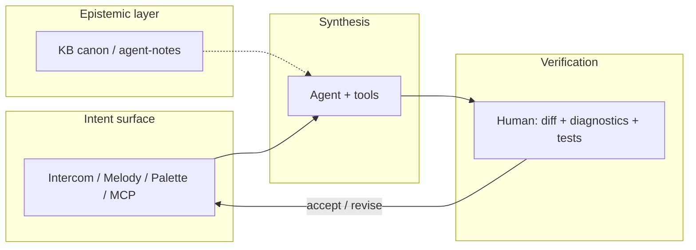

# IOP — Intent-Oriented Programming

**Интенционально-ориентированное программирование (IOP)** — прежде всего **дисциплина коммуникации** вокруг разработки: не «изобретённые заново слэш-команды», а способ договариваться о целях, процессах и изменениях так, чтобы это было **видно** всем участникам контура (люди, агент, артефакты).

**В коммуникации весь ключ.** Будет коммуникация — будут согласованные намерения, прозрачность и осмысленный код; не будет — локальный порядок в файлах и глобальный хаос, что агенты обнажили с новой силой. ИТ в глобальном смысле про **информационный поток**; ПО и его написание — лишь часть этого потока.

**Cascade IDE** — открытая **рабочая реализация** IOP: стек, где этот поток сделан явным в agent-first IDE для .NET.

!!! info "Нормативная привязка"
    Детали, non-goals и связи с ADR — [ADR 0121](adr/0121-intent-oriented-programming-paradigm.md) (Proposed).  
    English: [IOP manifest (EN)](en/iop-manifest-v1.md).

---

## Зачем IOP

ИТ называются **информационными**, потому что предмет работы — не синтаксис, а **согласованный поток смысла**: кто с кем и о чём говорит, какие цели и процессы, что считается сделанным, что видно наблюдателю. Если коммуникации нет и ничего не прозрачно — разрабатывать ПО бессмысленно: будет локальный порядок в файлах и глобальный хаос в команде.

IOP в IDE ставит в центр **явное намерение** (цель, целевое состояние, договорённый процесс) и **наблюдаемую дельту** исполнения. C# и репозиторий остаются источником правды для текста программы; IOP — не «вместо кода», а **дисциплина коммуникации**, в которой код — проверяемый результат договорённости.

---

## Что IOP не есть

- **Не** «зумеры придумали `/build`» — слэш, палитра и Melody — только **поверхности** одного смысла.
- **Не** замена ООП/ФП: классы и функции остаются; меняется то, *как команда договаривается* о работе до и после правок.

---

## Три столпа в Cascade IDE

### 1. Информационный поток и явное намерение

В центре — **согласованный информационный поток** (люди, агент, артефакты, статусы). **Интент** — не кнопка, а **именованная договорённость** о цели или целевом состоянии в этом потоке. В CIDE её несут Intercom, topic cards, ADR/KB, `command_id`, Intent Melody (`c:`), слэши ([ADR 0119](adr/0119-chat-slash-commands-intercom-surface.md)), палитра и **те же команды в MCP** — один смысл, несколько каналов, без разрозненных парсеров.

### 2. Двухконтурная верификация

| Контур | Кто | Что |
|--------|-----|-----|
| **Синтез** | Агент + MCP | Правки, сборка, рефакторинги, git |
| **Верификация** | Ты | Diff в Forward, Roslyn-диагностики, тесты, осознанный merge |

Инфраструктура (HCI, Roslyn MCP, build/test, git) не даёт интенту нарушить «физику» проекта.

### 3. Эпистемический контекст

Вместо опоры только на типы в C# — **канон и маршрутизация контекста**: [kb-public](https://github.com/AI-Guiders/kb-public), agent-notes, дерево `knowledge/` (подпапки вроде `domains/agent-operations/` — **путь в репозитории KB**, не «домен» в смысле DDD, KE или таксономии приборов). Агент подбирает playbook'и через router / **light-онтологию** команды; KB — нормативный слой правил высшего порядка.

---

## Intercom — центр коммуникации вокруг цели (перспектива)

**Intercom** ([ADR 0080](adr/0080-intercom-naming-and-multi-party-channel-model.md)) в перспективе IOP — не «виджет чата», а **центр коммуникации вокруг цели**: здесь люди и агенты **договариваются**, **выявляют намерения**, уточняют контекст и по итогу **ведут реализацию** в том же контуре (редактор, MCP, верификация). Topic cards, spine, слэши ([0119](adr/0119-chat-slash-commands-intercom-surface.md)) — не лента ради ленты, а **линии работы** с явной целью.

Положение в кокпите — [ADR 0120](adr/0120-primary-work-surface-intercom-or-editor.md) (Proposed): опция **`primary_work_surface = intercom`**, когда лобовой якорь — связь и намерение, а не только текст кода.

---

## Честно о потоке от людей

IOP **не обещает**, что «вывезем любой входящий поток» — его **не вывозят и сами люди**, если всё свалить в одну бесконечную ленту. Ставка продукта — **структурировать** коммуникацию, а не умножать шум:

- **линии работы** (topic cards, overview/detail) вместо одного хаотичного чата;
- **батчи уточнений** и треды ([0031](adr/0031-agent-chat-clarification-batches-and-threading.md)), а не каждое сообщение = немедленный автономный рывок;
- **intent-first** и паритет MCP — меньше дублирования «написал в чат / сделал в палитре / забыл в агенте»;
- **верификация** — человек не обязан «переваривать» всё подряд; он арбитр **дельты**, а не диспетчер каждого токена.

Если коммуникация не выстроена — не спасёт ни агент, ни IDE. IOP как раз про то, чтобы **сначала** выстроить её.

---

## Как это выглядит в сессии

---

## Что читать дальше

| Если нужно… | Документ |
|-------------|----------|
| Кокпит PFD / Forward / MFD | [Раскладка UI](ui-ux/cascade-ide-ui-layout-v1.md) |
| Intercom и слэши | [ADR 0119](adr/0119-chat-slash-commands-intercom-surface.md) |
| Intent Melody | [intent-melody-language-v1.md](intent-melody-language-v1.md), [ADR 0109](adr/0109-declarative-parametric-melody-catalog-toml-and-code-binders.md) |
| Все решения | [Навигатор ADR](site/adr-nav/index.md) |
| Agent-first политика | [architecture-policy.md](architecture-policy.md) |

---

*Cascade IDE — MIT · [GitHub](https://github.com/AI-Guiders/cascade-ide) · организация [AI-Guiders](https://ai-guiders.github.io/)*
