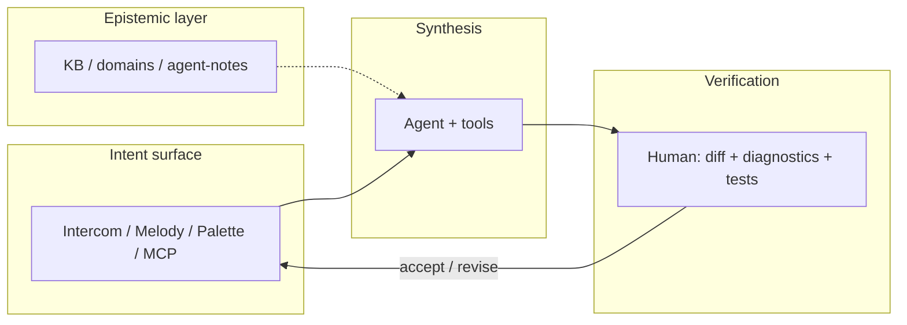

# IOP — Intent-Oriented Programming

**Интенционально-ориентированное программирование** — парадигма, в которой ты задаёшь **намерение** и **целевое состояние**, а не вручную «компилируешь» каждую строку синтаксиса. **Cascade IDE** — открытая **рабочая реализация** IOP: стек, в котором парадигма проверяется в реальной IDE для .NET и agent-first работы.

!!! info "Нормативная привязка"
    Детали, non-goals и связи с ADR — [ADR 0121](adr/0121-intent-oriented-programming-paradigm.md) (Proposed).  
    English: [IOP manifest (EN)](en/iop-manifest-v1.md).

---

## Зачем IOP

Человеческий мозг хорошо **придумывает смысл** и плохо держит в голове **100 000+ строк** монолита. IOP возвращает разработчика в роль **архитектора и стратега**: формулируешь интент → наблюдаешь синтез → **верифицируешь дельту** в редакторе. C# и репозиторий остаются источником правды; IOP — не «вместо кода», а **надстройка оркестрации** в IDE.

---

## Три столпа в Cascade IDE

### 1. Намерение вместо синтаксиса

Базовая единица — **интент**: `command_id`, Intent Melody (`c:`), слэш в **Intercom** ([ADR 0119](adr/0119-chat-slash-commands-intercom-surface.md)), палитра и **те же команды в MCP**. Один смысл — несколько поверхностей; без ad-hoc парсеров в обход intent-слоя.

### 2. Двухконтурная верификация

| Контур | Кто | Что |
|--------|-----|-----|
| **Синтез** | Агент + MCP | Правки, сборка, рефакторинги, git |
| **Верификация** | Ты | Diff в Forward, Roslyn-диагностики, тесты, осознанный merge |

Инфраструктура (HCI, Roslyn MCP, build/test, git) не даёт интенту нарушить «физику» проекта.

### 3. Эпистемический контекст

Вместо «типов только в коде» — **домены знаний**: [kb-public](https://github.com/AI-Guiders/kb-public), agent-notes, `knowledge/domains/`. Агент маршрутизирует контекст по **light-онтологии** команды; KB — справочник правил высшего порядка.

---

## Как это выглядит в сессии

---

## Что читать дальше

| Если нужно… | Документ |
|-------------|----------|
| Кокпит PFD / Forward / MFD | [Раскладка UI](ui-ux/cascade-ide-ui-layout-v1.md) |
| Intercom и слэши | [ADR 0119](adr/0119-chat-slash-commands-intercom-surface.md) |
| Intent Melody | [intent-melody-language-v1.md](intent-melody-language-v1.md), [ADR 0109](adr/0109-declarative-parametric-melody-catalog-toml-and-code-binders.md) |
| Все решения | [Навигатор ADR](site/adr-nav/index.md) |
| Agent-first политика | [architecture-policy.md](architecture-policy.md) |

---

*Cascade IDE — MIT · [GitHub](https://github.com/AI-Guiders/cascade-ide) · организация [AI-Guiders](https://ai-guiders.github.io/)*
