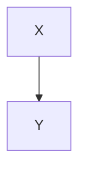

# Пример документа Markdown

Короткий файл для проверки include ([ADR 0023](../../docs/adr/0023-markdown-diagrams-language-tooling.md)) и превью ([0026](../../docs/adr/0026-markdown-preview-surfaces-and-placement.md)).

## Mermaid из файла

```mermaid
{{ INCLUDE: hello.mmd }}
```

## PlantUML из файла

```plantuml
{{ INCLUDE: hello.puml }}
```

## Встроенный fenced (без include)


